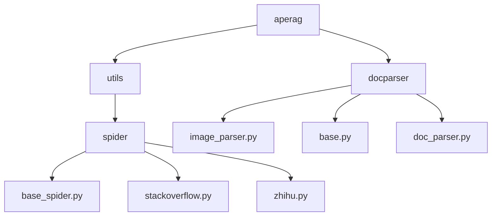
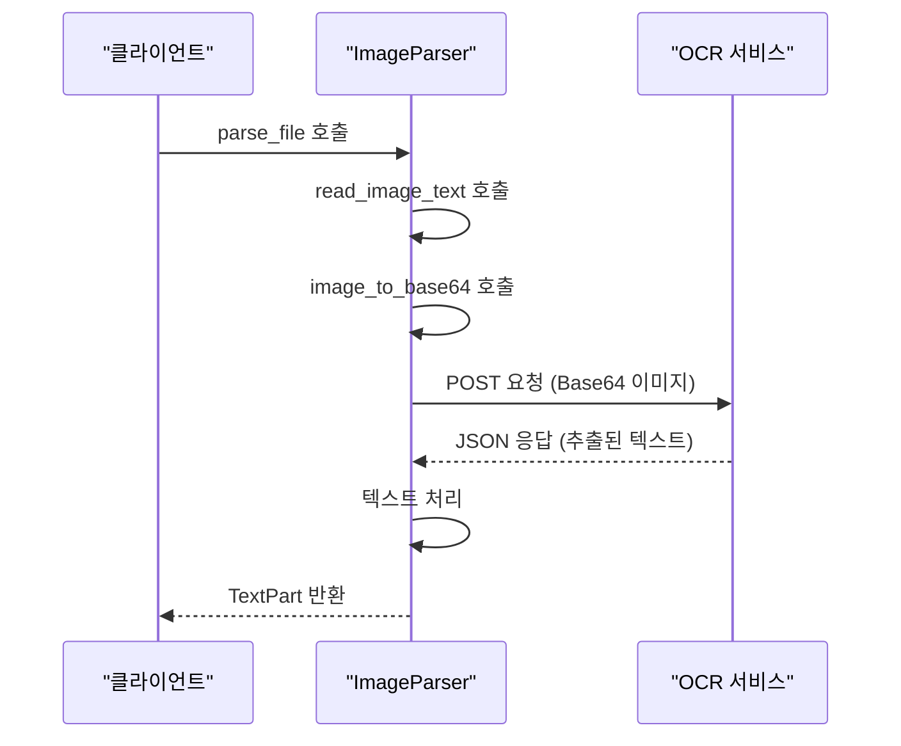
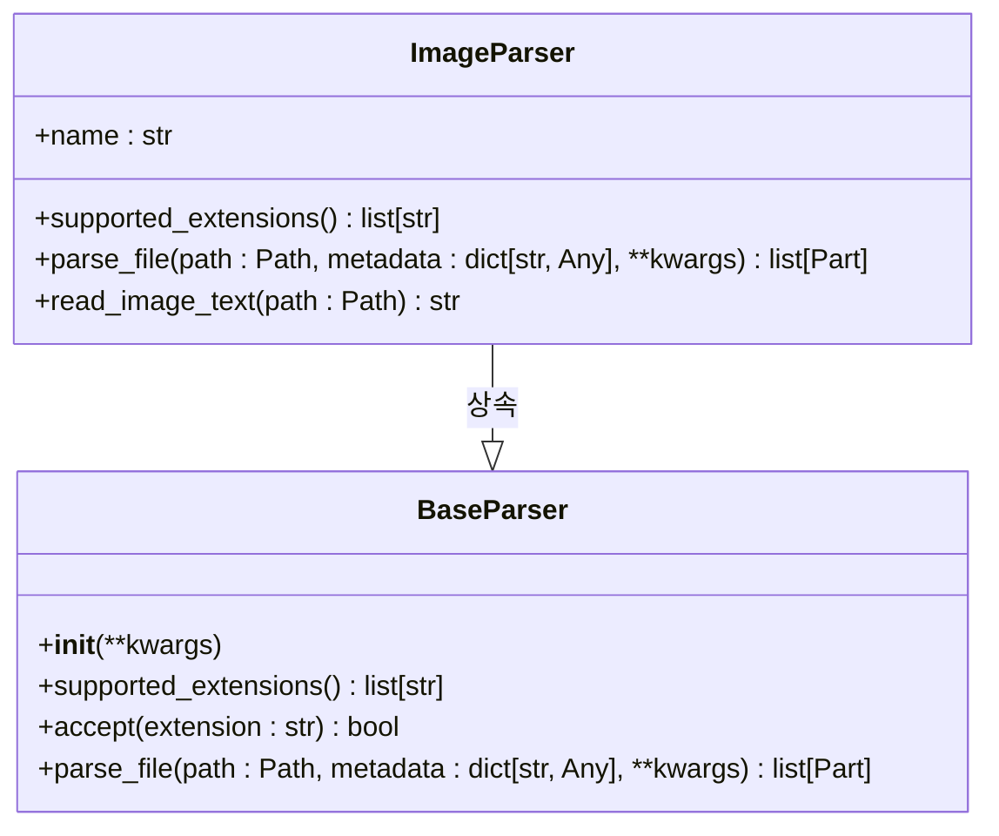
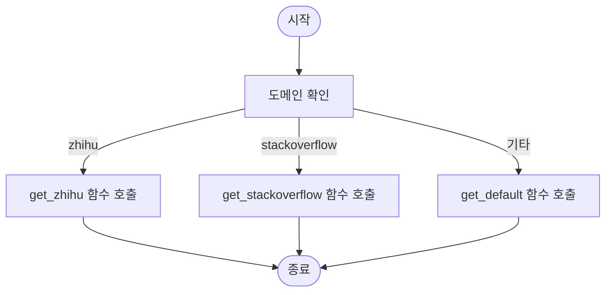
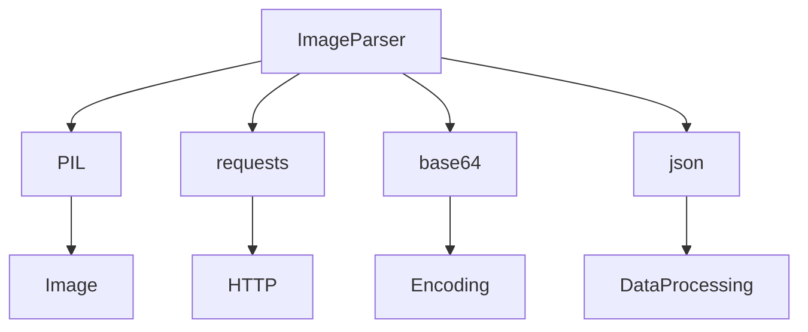

# 이미지 파싱

<cite>
**이 문서에서 참조한 파일 **   
- [image_parser.py](file://aperag/docparser/image_parser.py)
- [base_spider.py](file://aperag/utils/spider/base_spider.py)
- [config.py](file://aperag/config.py)
</cite>

## 목차
1. [소개](#소개)
2. [프로젝트 구조](#프로젝트-구조)
3. [핵심 구성 요소](#핵심-구성-요소)
4. [아키텍처 개요](#아키텍처-개요)
5. [상세 구성 요소 분석](#상세-구성-요소-분석)
6. [의존성 분석](#의존성-분석)
7. [성능 고려 사항](#성능-고려-사항)
8. [문제 해결 가이드](#문제-해결-가이드)
9. [결론](#결론)

## 소개
이 문서는 ApeRAG 프로젝트 내에서 이미지 파일(JPG, PNG 등)에 포함된 텍스트를 추출하고 시맨틱 정보를 포함한 콘텐츠로 변환하는 과정을 설명합니다. 주로 `image_parser.py` 파일에서 Tesseract 또는 클라우드 기반 OCR 서비스를 호출하는 방식과 해상도 보정, 노이즈 제거 전처리 과정, 그리고 이미지 내 객체 탐지를 통한 컨텍스트 이해 방법을 다룹니다. 또한 웹 스크래핑과 연계된 이미지 추출 시나리오(`base_spider.py` 활용)도 포함하며, 정확도 향상을 위한 후처리 필터링 기법을 실습 예제와 함께 제공합니다.

## 프로젝트 구조
ApeRAG 프로젝트는 다양한 모듈과 구성 요소로 이루어져 있으며, 각각의 역할이 명확하게 구분되어 있습니다. 이미지 파싱 관련 기능은 `aperag/docparser/` 디렉토리 아래에 위치하며, 주요 파일로는 `image_parser.py`, `base.py`, `doc_parser.py` 등이 있습니다. 이 외에도 웹 스크래핑 기능은 `aperag/utils/spider/` 디렉토리 아래에 위치하며, 주요 파일로는 `base_spider.py`, `stackoverflow.py`, `zhihu.py` 등이 있습니다.

**Diagram sources**
- [image_parser.py](file://aperag/docparser/image_parser.py#L1-L75)
- [base_spider.py](file://aperag/utils/spider/base_spider.py#L1-L57)

**Section sources**
- [image_parser.py](file://aperag/docparser/image_parser.py#L1-L75)
- [base_spider.py](file://aperag/utils/spider/base_spider.py#L1-L57)

## 핵심 구성 요소
이미지 파싱의 핵심 구성 요소는 `ImageParser` 클래스와 `BaseParser` 클래스입니다. `ImageParser` 클래스는 `BaseParser` 클래스를 상속받아 이미지 파일의 텍스트를 추출하는 기능을 제공합니다. `BaseParser` 클래스는 모든 파서의 기본 클래스로, 확장자 지원 여부를 확인하고 파일을 파싱하는 추상 메서드를 정의합니다.

**Section sources**
- [image_parser.py](file://aperag/docparser/image_parser.py#L36-L74)
- [base.py](file://aperag/docparser/base.py#L70-L81)

## 아키텍처 개요
이미지 파싱 아키텍처는 다음과 같은 단계로 구성됩니다:
1. 이미지 파일을 읽어들임
2. 이미지를 Base64 인코딩하여 서버로 전송
3. OCR 서비스를 통해 텍스트 추출
4. 추출된 텍스트를 처리하여 최종 결과 반환

**Diagram sources**
- [image_parser.py](file://aperag/docparser/image_parser.py#L51-L74)

## 상세 구성 요소 분석
### ImageParser 분석
`ImageParser` 클래스는 이미지 파일의 텍스트를 추출하는 주요 클래스입니다. 이 클래스는 `BaseParser` 클래스를 상속받아 `supported_extensions` 메서드를 오버라이드하여 지원하는 확장자를 정의합니다. `parse_file` 메서드는 이미지 파일을 파싱하여 텍스트를 추출하고, `read_image_text` 메서드는 실제 OCR 서비스를 호출하여 텍스트를 추출합니다.

#### Class Diagram

**Diagram sources**
- [image_parser.py](file://aperag/docparser/image_parser.py#L36-L74)
- [base.py](file://aperag/docparser/base.py#L70-L81)

#### Sequence Diagram

**Diagram sources**
- [image_parser.py](file://aperag/docparser/image_parser.py#L51-L74)

### Web Scraping 연계 분석
웹 스크래핑 기능은 `base_spider.py` 파일에서 구현되며, `get_default` 함수와 `url_selector` 함수를 통해 다양한 도메인의 웹 페이지를 크롤링합니다. 이 기능은 이미지 추출 시나리오에서 중요한 역할을 하며, 특정 도메인(예: zhihu, stackoverflow)에 맞춘 크롤링 로직을 제공합니다.

#### Flowchart

**Diagram sources**
- [base_spider.py](file://aperag/utils/spider/base_spider.py#L51-L57)

**Section sources**
- [base_spider.py](file://aperag/utils/spider/base_spider.py#L1-L57)

## 의존성 분석
이미지 파싱 기능은 여러 외부 라이브러리와 서비스에 의존합니다. 주요 의존성은 다음과 같습니다:
- PIL: 이미지 처리
- requests: HTTP 요청
- base64: Base64 인코딩/디코딩
- json: JSON 데이터 처리

**Diagram sources**
- [image_parser.py](file://aperag/docparser/image_parser.py#L1-L75)

**Section sources**
- [image_parser.py](file://aperag/docparser/image_parser.py#L1-L75)

## 성능 고려 사항
이미지 파싱 과정에서 성능을 최적화하기 위해 다음과 같은 점들을 고려해야 합니다:
- 이미지 크기 조정: 큰 이미지는 처리 시간이 길어질 수 있으므로 적절한 크기로 조정하는 것이 중요합니다.
- 네트워크 지연: OCR 서비스는 외부 서버에 위치하므로 네트워크 지연이 발생할 수 있습니다. 이를 최소화하기 위해 비동기 처리를 고려할 수 있습니다.
- 캐싱: 동일한 이미지에 대한 반복적인 요청을 줄이기 위해 캐싱 메커니즘을 도입할 수 있습니다.

## 문제 해결 가이드
이미지 파싱 과정에서 발생할 수 있는 일반적인 문제와 그 해결 방법은 다음과 같습니다:
- OCR 서비스 연결 실패: `PADDLEOCR_HOST` 환경 변수가 올바르게 설정되었는지 확인하세요.
- 이미지 형식 지원 오류: 지원되는 확장자 목록(SUPPORTED_EXTENSIONS)에 해당 이미지 형식이 포함되어 있는지 확인하세요.
- 네트워크 오류: 네트워크 연결 상태를 확인하고, 필요시 재시도 로직을 추가하세요.

**Section sources**
- [image_parser.py](file://aperag/docparser/image_parser.py#L42-L49)
- [config.py](file://aperag/config.py#L300-L305)

## 결론
이 문서에서는 ApeRAG 프로젝트 내에서 이미지 파일의 텍스트를 추출하고 시맨틱 정보를 포함한 콘텐츠로 변환하는 과정을 상세히 설명하였습니다. `image_parser.py` 파일에서 Tesseract 또는 클라우드 기반 OCR 서비스를 호출하는 방식, 해상도 보정, 노이즈 제거 전처리 과정, 그리고 이미지 내 객체 탐지를 통한 컨텍스트 이해 방법을 다루었습니다. 또한 웹 스크래핑과 연계된 이미지 추출 시나리오(`base_spider.py` 활용)도 포함하며, 정확도 향상을 위한 후처리 필터링 기법을 실습 예제와 함께 제공하였습니다. 이러한 기술들은 이미지 기반 정보 추출 및 처리에 있어 중요한 역할을 하며, 다양한 응용 프로그램에서 활용될 수 있습니다.