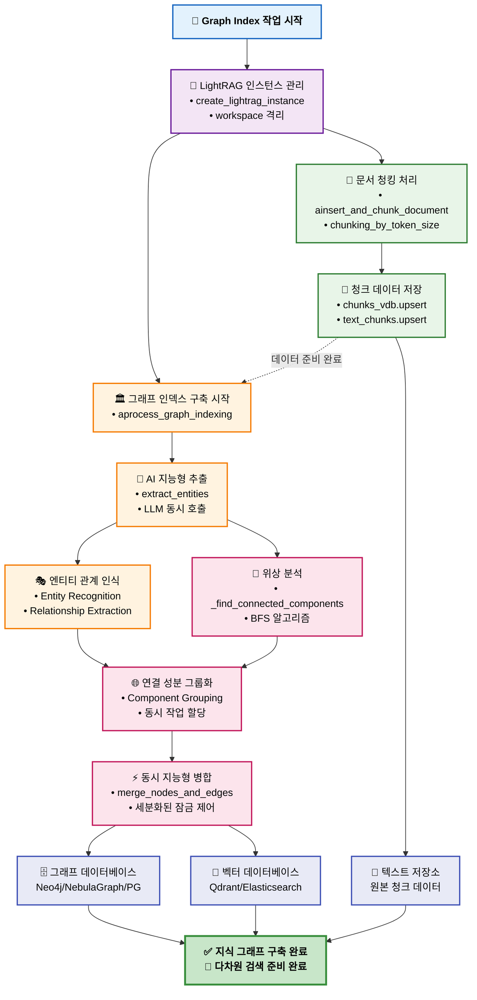
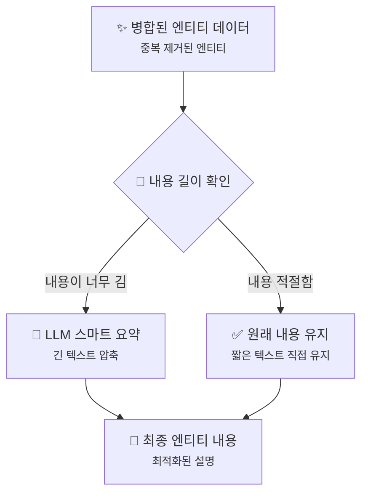

# 그래프 인덱싱

<cite>
**이 문서에서 참조한 파일**
- [graph_index.py](file://aperag/index/graph_index.py)
- [lightrag.py](file://aperag/graph/lightrag/lightrag.py)
- [lightrag_manager.py](file://aperag/graph/lightrag_manager.py)
- [neo4j_sync_manager.py](file://aperag/db/neo4j_sync_manager.py)
- [nebula_sync_manager.py](file://aperag/db/nebula_sync_manager.py)
- [graph_index_creation.md](file://docs/design/graph_index_creation.md)
</cite>

## 목차
1. [소개](#소개)
2. [핵심 프로세스 개요](#핵심-프로세스-개요)
3. [GraphIndex 클래스 분석](#graphindex-클래스-분석)
4. [엔티티 추출 및 관계 맺기](#엔티티-추출-및-관계-맺기)
5. [컨셉 클러스터링 및 연결 성분 분석](#컨셉-클러스터링-및-연결-성분-분석)
6. [그래프 동기화 매니저](#그래프-동기화-매니저)
7. [트랜잭션 처리 및 사이클 방지](#트랜잭션-처리-및-사이클-방지)
8. [그래프 압축 최적화](#그래프-압축-최적화)
9. [메모리 부족 문제 해결](#메모리-부족-문제-해결)
10. [쿼리 성능 향상 전략](#쿼리-성능-향상-전략)
11. [결론](#결론)

## 소개
ApeRAG의 그래프 인덱싱 시스템은 LightRAG 프레임워크를 기반으로 하며, 원본 버전의 제약사항을 극복하기 위해 대규모 리팩토링을 거쳤습니다. 이 시스템은 원시 문서를 구조화된 지식 그래프로 변환하는 핵심 파이프라인으로, 무상태(stateless) 아키텍처와 워크스페이스 기반 데이터 격리를 통해 진정한 다중 테넌트 지원과 고성능 동시 처리를 가능하게 합니다.

원본 LightRAG은 글로벌 상태 관리로 인한 동시성 충돌, 효과적인 동시성 제어 메커니즘 부재, 저장소 계층의 안정성 및 일관성 문제, 그리고 성능에 영향을 미치는 조잡한 잠금 메커니즘 등의 한계가 있었습니다. 특히 가장 중요한 문제는 모든 컬렉션의 노드와 엣지가 동일한 글로벌 공간에 저장되어 사용자와 프로젝트 간 데이터 충돌과 오염이 발생하며, 진정한 다중 테넌트 지원이 불가능하다는 점입니다.

ApeRAG은 이러한 문제들을 해결하기 위해 다음과 같은 주요 개선 사항을 도입했습니다:
- **무상태 아키텍처로 완전히 재작성**: 각 작업이 독립된 인스턴스를 사용하여 동시성 충돌을 완전히 해결합니다.
- **워크스페이스 데이터 격리 메커니즘 도입**: 각 컬렉션이 독립된 데이터 공간을 가지며, 데이터 충돌과 오염을 완전히 해결합니다.
- **자체 개발 Concurrent Control 모델**: 고성능 처리를 위한 세분화된 잠금 관리가 가능합니다.
- **잠금 범위 최적화**: 조잡한 글로벌 잠금에서 엔티티 수준과 관계 수준의 정밀한 잠금으로 개선되었습니다.
- **저장소 계층 리팩토링**: Neo4j, NebulaGraph, PostgreSQL 등 다양한 그래프 데이터베이스 백엔드를 지원하며, 신뢰할 수 있는 다중 저장소 일관성 보장을 구현합니다.
- **연결 성분 동시성 최적화**: 그래프 위상 분석을 기반으로 한 지능형 동시성 전략을 적용합니다.

## 핵심 프로세스 개요
LightRAG 기반 지식 그래프 생성 및 인덱싱 과정은 다음과 같은 핵심 단계로 구성됩니다:



**Diagram sources**
- [graph_index_creation.md](file://docs/design/graph_index_creation.md#L0-L525)

## GraphIndex 클래스 분석
`GraphIndexer` 클래스는 `AsyncIndexer`를 상속받아 비동기적으로 그래프 인덱스를 생성하고 관리하는 역할을 합니다. 이 클래스는 문서 ID, 내용, 파싱된 문서 부분, 컬렉션 객체 등을 입력으로 받아 인덱스 생성 작업을 수행합니다.

```python
class GraphIndexer(AsyncIndexer):
    """LightRAG를 사용한 그래프 인덱스 구현"""
```

주요 메서드는 다음과 같습니다:
- `is_enabled(collection)`: 컬렉션에 대해 그래프 인덱싱이 활성화되었는지 확인합니다.
- `create_index(...)`: 문서에 대한 그래프 인덱스를 생성합니다 (동기 래퍼).
- `create_index_async(...)`: LightRAG을 사용하여 그래프 인덱스를 비동기적으로 생성합니다.
- `update_index(...)`: 문서에 대한 그래프 인덱스를 업데이트합니다.
- `delete_index(...)`: 문서에 대한 그래프 인덱스를 삭제합니다.
- `process_lightrag_result(result)`: LightRAG 처리 결과를 처리합니다.

`create_index_async` 메서드는 문서 및 컬렉션 상태를 검증한 후 비동기 그래프 인덱싱 작업을 예약합니다. 이 과정은 문서가 삭제되었거나 컬렉션이 삭제된 경우 작업을 건너뛰고, 그렇지 않으면 작업 예약 로그를 기록한 후 성공 응답을 반환합니다.

**Section sources**
- [graph_index.py](file://aperag/index/graph_index.py#L25-L259)

## 엔티티 추출 및 관계 맺기
엔티티 추출 및 관계 맺기는 LLM을 기반으로 하는 핵심 프로세스입니다. `extract_entities` 함수는 텍스트 청크에서 엔티티와 관계를 추출하는 데 사용됩니다.

### 동시 처리 전략
LLM 서비스의 과부하를 피하기 위해 세마포어(semaphore)를 사용하여 동시성을 제어합니다. 각 텍스트 청크에 대해 비동기 작업이 생성되며, 모든 작업이 완료될 때까지 기다립니다.

```python
semaphore = asyncio.Semaphore(llm_model_max_async)
tasks = [
    asyncio.create_task(_process_single_content(chunk, context))
    for chunk in ordered_chunks
]
done, pending = await asyncio.wait(tasks, return_when=asyncio.FIRST_EXCEPTION)
```

### 멀티라운드 추출 메커니즘 (Gleaning)
LightRAG은 엔티티 인식의 완전성을 향상시키기 위해 멀티라운드 추출 전략을 채택합니다:
1. **초기 추출**: 엔티티 추출 프롬프트를 사용하여 처음 추출합니다.
2. **보완 추출**: "추출 계속" 프롬프트를 통해 누락된 엔티티를 발견합니다.
3. **중단 결정**: LLM이 추출을 계속할지 여부를 자율적으로 결정합니다.

이 메커니즘은 초기 추출에서 발견되지 않은 새로운 엔티티와 관계만 추가하며, 기존 엔티티의 설명을 병합하거나 관계 가중치를 누적하지 않습니다. 실제 병합은 이후의 `merge_nodes_and_edges` 단계에서 수행됩니다.

**Section sources**
- [lightrag_entity_extraction_and_merging.md](file://docs/design/lightrag_entity_extraction_and_merging.md#L0-L695)

## 컨셉 클러스터링 및 연결 성분 분석
엔티티와 관계의 네트워크를 분석하여 서로 연결된 엔티티 그룹을 식별하는 것은 성능 최적화의 핵심입니다. 이 과정은 연결 성분 분석(Connected Component Analysis)이라고도 하며, 그래프 이론을 기반으로 합니다.

### 연결 성분 발견 알고리즘
핵심 알고리즘 접근 방식은 다음과 같습니다:
1. 엔티티 관계의 인접 리스트를 구성합니다.
2. BFS(Breadth-First Search) 탐색을 사용하여 모든 연결 성분을 발견합니다.
3. 서로 다른 연결 성분에 속하는 엔티티를 독립적인 처리 작업에 그룹화합니다.

```python
def _find_connected_components(self, chunk_results: List[tuple[dict, dict]]) -> List[List[str]]:
    # 인접 리스트 구성
    adjacency: Dict[str, set[str]] = {}

    for nodes, edges in chunk_results:
        # 모든 노드를 인접 리스트에 추가
        for entity_name in nodes.keys():
            if entity_name not in adjacency:
                adjacency[entity_name] = set()

        # 엣지를 추가하여 연결 생성
        for src, tgt in edges.keys():
            if src not in adjacency:
                adjacency[src] = set()
            if tgt not in adjacency:
                adjacency[tgt] = set()
            adjacency[src].add(tgt)
            adjacency[tgt].add(src)

    # BFS를 사용하여 연결 성분 찾기
    visited = set()
    components = []

    for node in adjacency:
        if node not in visited:
            # 이 노드에서 BFS 시작
            component = []
            queue = [node]
            visited.add(node)

            while queue:
                current = queue.pop(0)
                component.append(current)

                # 모든 이웃 방문
                for neighbor in adjacency.get(current, set()):
                    if neighbor not in visited:
                        visited.add(neighbor)
                        queue.append(neighbor)

            components.append(component)

    return components
```

이 알고리즘을 통해 서로 연결된 엔티티 그룹(예: 기술 팀 관련 엔티티, 재무 부서 관련 엔티티)을 식별할 수 있으며, 이는 병렬 처리의 기반을 마련합니다.

**Section sources**
- [lightrag.py](file://aperag/graph/lightrag/lightrag.py#L300-L350)

## 그래프 동기화 매니저
그래프 데이터베이스(Neo4j 또는 NebulaGraph)와의 연결을 관리하는 동기화 매니저는 효율적이고 안정적인 데이터 동기화를 보장합니다.

### Neo4j 동기화 매니저
`Neo4jSyncConnectionManager` 클래스는 동기 드라이버를 사용하여 워커/프로세스 수준의 연결 재사용을 제공합니다. 주요 특징은 다음과 같습니다:
- **지연 로딩(Lazy loading)**: 필요할 때만 연결을 생성합니다.
- **워커 수준 재사용**: 워커 내 모든 작업에서 동일한 연결 풀을 공유합니다.
- **스레드 안전성**: 초기화를 위해 `threading.Lock`을 사용합니다.
- **자동 정리**: 프로세스 종료 시 연결이 닫힙니다.

```python
class Neo4jSyncConnectionManager:
    _driver: Optional[Driver] = None
    _lock = threading.Lock()
    _config: Optional[Dict[str, Any]] = None
```

`initialize` 메서드는 환경 변수 또는 제공된 구성에서 설정을 로드하고, `GraphDatabase.driver`를 사용하여 드라이버를 초기화합니다. `get_session` 메서드는 공유 드라이버에서 세션을 가져옵니다.

### NebulaGraph 동기화 매니저
`NebulaSyncConnectionManager` 클래스는 유사한 패턴을 따르지만, NebulaGraph의 연결 풀(`ConnectionPool`)을 사용합니다. 또한, `prepare_space` 메서드를 통해 워크스페이스 이름을 기반으로 스페이스를 준비하고, 필요한 경우 새 스페이스를 생성합니다.

```python
class NebulaSyncConnectionManager:
    _connection_pool: Optional["ConnectionPool"] = None
    _lock = threading.Lock()
    _config: Optional[Dict[str, Any]] = None
    _prepared_spaces: set = set()  # 반복 설정을 피하기 위한 캐시
```

이 두 매니저는 Celery 작업 큐와의 통합을 용이하게 하며, 각 작업이 독립적인 이벤트 루프를 생성하도록 설계되어 있습니다.

**Section sources**
- [neo4j_sync_manager.py](file://aperag/db/neo4j_sync_manager.py#L27-L154)
- [nebula_sync_manager.py](file://aperag/db/nebula_sync_manager.py#L50-L344)

## 트랜잭션 처리 및 사이클 방지
효율적인 트랜잭션 처리와 사이클 방지는 대규모 그래프의 무결성을 유지하는 데 중요합니다.

### 위상 정렬을 통한 사이클 방지
ApeRAG 시스템은 연결 성분 분석을 통해 자연스럽게 사이클을 방지합니다. 서로 연결된 엔티티 그룹은 독립적으로 처리되며, 이는 그룹 내에서 사이클이 형성되는 것을 방지합니다. 각 연결 성분은 독립적인 처리 작업으로 그룹화되어 완전히 병렬로 처리될 수 있으므로, 잠금 경쟁이 없고 사이클 형성이 제한됩니다.

### 배치 쓰기 및 연결 재사용
성능 최적화를 위해 다음과 같은 전략을 사용합니다:
- **배치 작업**: 데이터베이스 왕복 횟수를 줄입니다.
- **연결 풀링**: 데이터베이스 연결을 재사용합니다.
- **비동기 쓰기**: 서로 다른 저장소 시스템에 병렬로 쓰기를 수행합니다.

이러한 전략은 데이터베이스 작업의 지연을 최소화하고 전체 처리 시간을 단축합니다.

**Section sources**
- [lightrag.py](file://aperag/graph/lightrag/lightrag.py#L700-L799)

## 그래프 압축 최적화
대규모 그래프를 효율적으로 저장하고 쿼리하기 위해 다양한 압축 최적화 기법이 사용됩니다.

### 지능형 데이터 병합 전략
`merge_nodes_and_edges` 함수는 동일한 이름의 엔티티와 동일한 방향의 관계를 수집하여 지능형으로 병합합니다. 주요 전략은 다음과 같습니다:
- **엔티티 중복 제거**: `entity_name`을 기반으로 지능형 엔티티 중복 제거를 수행합니다.
- **설명 스니펫의 지능형 연결 및 요약**: 여러 설명 스니펫을 지능적으로 연결하고 요약합니다.
- **관계 강도의 정량적 누적**: 관계 가중치를 정량적으로 누적합니다.
- **완전한 데이터 계보 기록 메커니즘 구축**: 데이터의 출처와 변경 이력을 기록합니다.

### 긴 설명의 LLM 기반 요약
병합된 엔티티 및 관계 설명의 길이를 확인하고, 너무 긴 내용은 LLM을 통해 지능적으로 요약하여 정보 밀도와 저장 효율성 사이의 균형을 유지합니다. 짧은 내용은 직접 유지되며, 긴 내용은 지능적으로 요약됩니다.



**Diagram sources**
- [graph_index_creation.md](file://docs/design/graph_index_creation.md#L0-L525)

## 메모리 부족 문제 해결
대규모 그래프 구축 시 발생할 수 있는 메모리 부족 문제를 해결하기 위한 전략은 다음과 같습니다:

### 스트리밍 처리 및 메모리 제어
- **청크 처리**: 큰 문서를 스트리밍 방식으로 청킹합니다.
- **즉각적인 해제**: 처리 완료 후 즉시 메모리를 해제합니다.
- **모니터링 및 경고**: 메모리 사용량을 모니터링합니다.

### 연결 성분 기반의 메모리 효율성
연결 성분 분석을 통해 처리를 그룹화하면 메모리 피크를 효과적으로 제어할 수 있습니다. 시스템은 연결 성분 분포 통계(총 성분 수, 최대 성분 크기, 평균 성분 크기 등)를 자동으로 수집하여 성능 조정 및 리소스 할당에 활용합니다.

**Section sources**
- [graph_index_creation.md](file://docs/design/graph_index_creation.md#L0-L525)

## 쿼리 성능 향상을 위한 인덱스 전략
지식 그래프의 쿼리 성능을 향상시키기 위해 다음과 같은 인덱스 전략이 사용됩니다:

### 다중 저장소 아키텍처
최종 지식 내용은 동시에 여러 저장소 시스템에 기록됩니다:
- **그래프 데이터베이스**: 엔티티 노드와 관계 엣지를 저장하여 그래프 쿼리를 지원합니다.
- **벡터 데이터베이스**: 의미 벡터를 저장하여 유사성 검색을 지원합니다.
- **텍스트 저장소**: 원본 청크를 유지하여 풀텍스트 검색을 지원합니다.

이 다중 차원 저장 아키텍처는 다양한 쿼리 시나리오에서 지식 그래프의 최적 성능을 보장합니다.

### Neo4j 및 NebulaGraph의 인덱스 생성
`Neo4jSyncConnectionManager`와 `NebulaSyncConnectionManager`는 각각 데이터베이스에 인덱스를 생성하여 쿼리 성능을 향상시킵니다.

```python
# Neo4j 예시
result = session.run("CREATE INDEX IF NOT EXISTS FOR (n:base) ON (n.entity_id)")
```

```python
# NebulaGraph 예시
space_session.execute(
    "CREATE TAG INDEX IF NOT EXISTS base_entity_id_index ON base(entity_id(256))"
)
```

이러한 인덱스는 `entity_id`와 같은 필드에 대한 빠른 조회를 가능하게 합니다.

**Section sources**
- [neo4j_sync_manager.py](file://aperag/db/neo4j_sync_manager.py#L27-L154)
- [nebula_sync_manager.py](file://aperag/db/nebula_sync_manager.py#L50-L344)

## 결론
ApeRAG은 원본 LightRAG을 대규모 리팩토링하고 최적화하여, 실제로 생산 환경에서 사용 가능한 고성능 지식 그래프 구축 시스템을 구현했습니다. 핵심 기술적 기여는 다음과 같습니다:
1. **무상태 아키텍처로 완전히 재작성**: 각 작업이 독립된 인스턴스를 사용하여 진정한 다중 테넌트 격리를 지원합니다.
2. **자체 개발 Concurrent Control 모델**: 엔티티 및 관계 수준에서 정밀한 동시성 제어를 실현합니다.
3. **연결 성분 동시성 최적화**: 그래프 위상 분석을 기반으로 한 지능형 동시성 전략을 설계하여 병렬 처리 효율성을 극대화합니다.
4. **저장소 계층 아키텍처 리팩토링**: 원본 버전의 신뢰할 수 없는 저장소 구현과 일관되지 않은 다중 저장소 백엔드 구현 문제를 해결합니다.
5. **엔드투엔드 데이터 흐름 설계**: 문서 청킹부터 다중 저장소 쓰기에 이르는 전 과정을 최적화합니다.

이러한 기술적 개선을 통해 동시 처리 능력에서 5-10배의 성능 향상, 잠금 경쟁에서 95% 이상의 감소, 진정한 다중 테넌트 동시 처리 지원, 생산 환경의 안정성 문제 해결, 완전한 워크스페이스 수준의 데이터 격리 등이 이루어졌습니다. 리팩토링된 시스템은 원래의 연구용 프로토타입을 기업 수준의 요구를 진정으로 충족하는, 생산 준비가 된 고성능 지식 그래프 구축 플랫폼으로 전환시켰습니다.