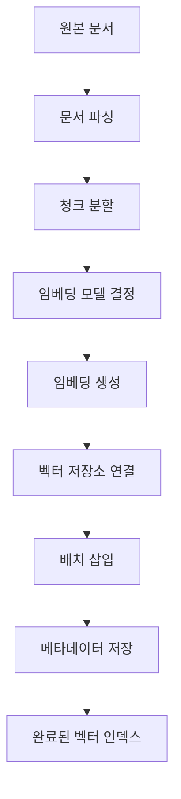
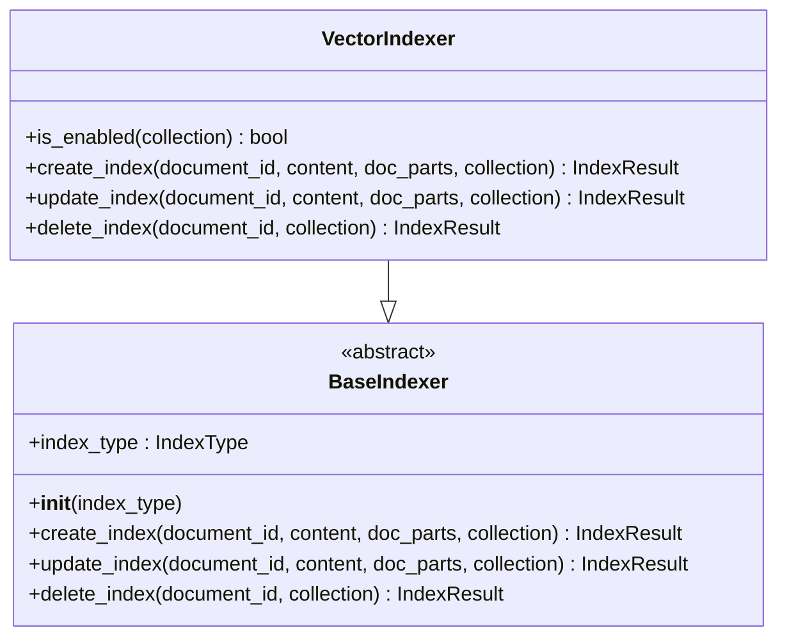
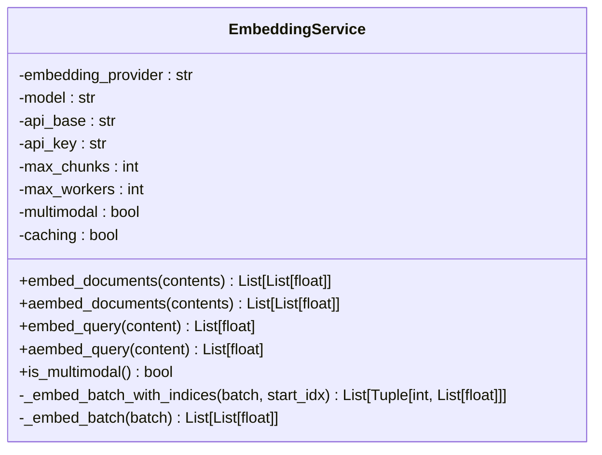
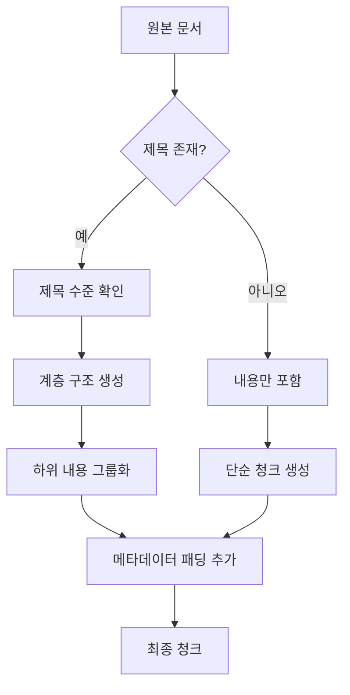
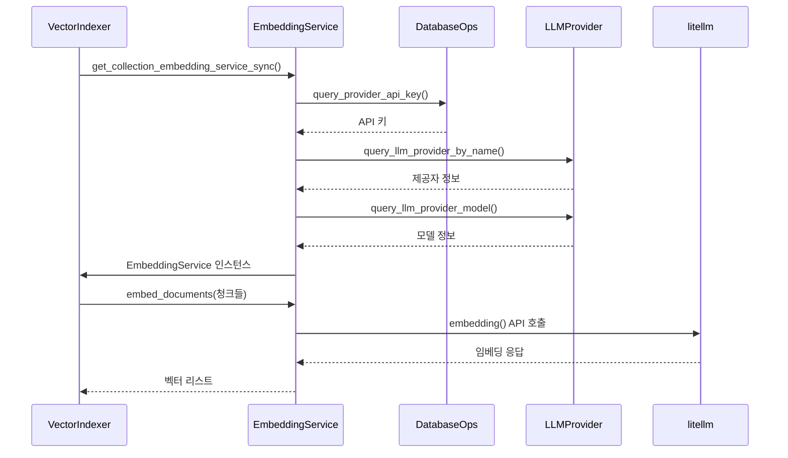
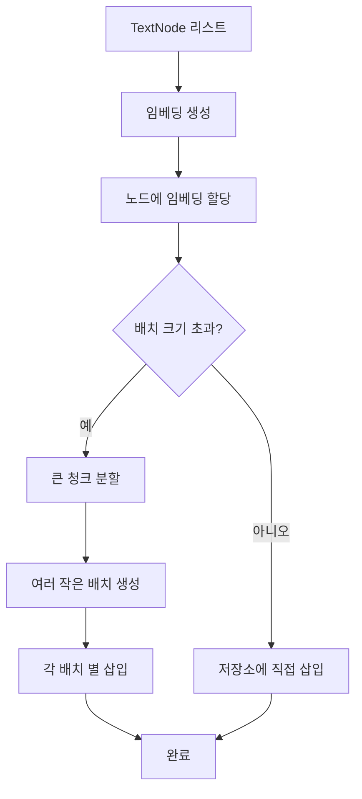
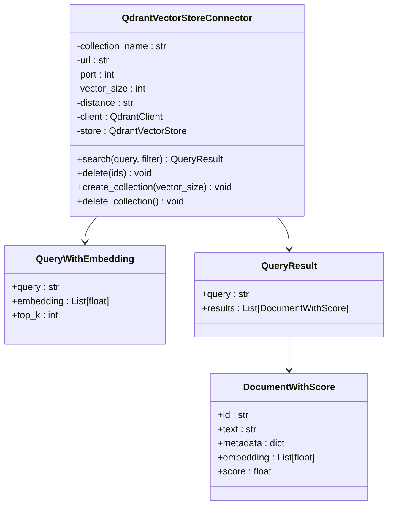
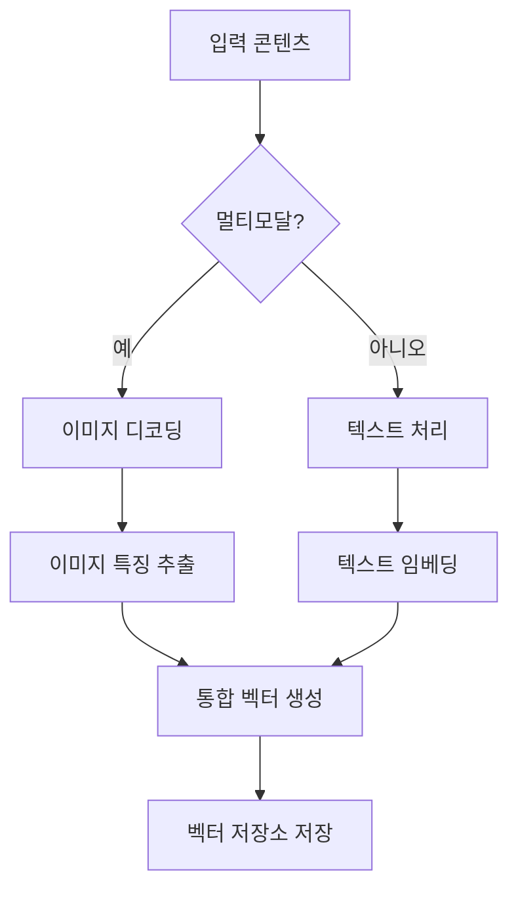
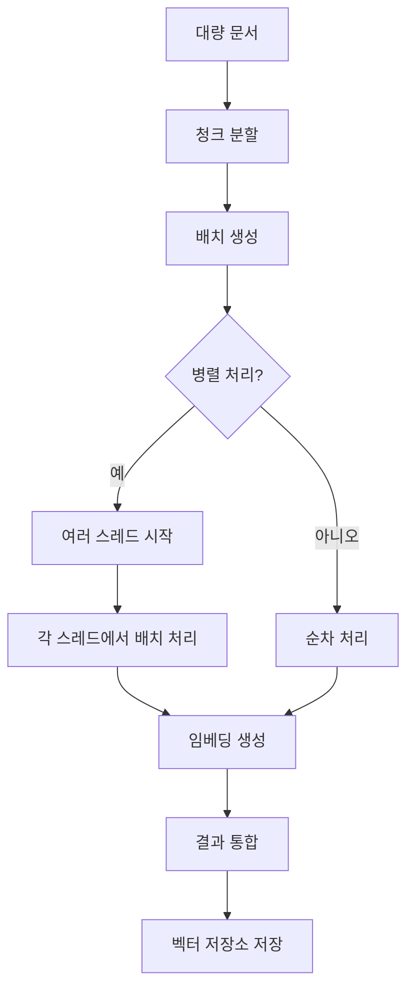
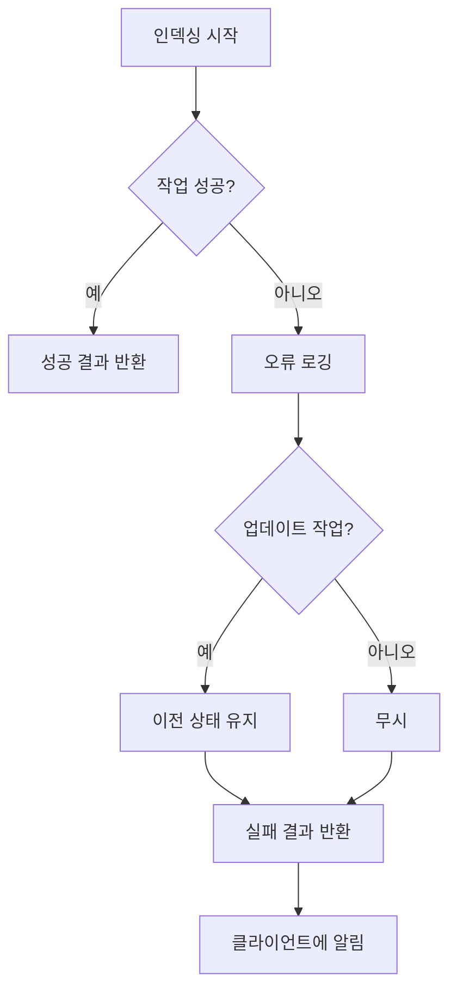

# 벡터 인덱싱

<cite>
**이 문서에서 참조된 파일**   
- [vector_index.py](file://aperag/index/vector_index.py)
- [embedding_service.py](file://aperag/llm/embed/embedding_service.py)
- [qdrant_connector.py](file://aperag/vectorstore/qdrant_connector.py)
- [config.py](file://aperag/config.py)
- [embedding_utils.py](file://aperag/llm/embed/embedding_utils.py)
- [chunking.py](file://aperag/docparser/chunking.py)
- [llm_provider.py](file://aperag/db/repositories/llm_provider.py)
</cite>

## 목차
1. [소개](#소개)
2. [벡터 인덱싱 프로세스 개요](#벡터-인덱싱-프로세스-개요)
3. [핵심 구성 요소 분석](#핵심-구성-요소-분석)
4. [문서 청크 변환 및 전처리](#문서-청크-변환-및-전처리)
5. [임베딩 생성 및 서비스 호출](#임베딩-생성-및-서비스-호출)
6. [벡터 저장소 연결 및 배치 삽입](#벡터-저장소-연결-및-배치-삽입)
7. [HNSW 인덱스 및 메타데이터 필터링](#hnsw-인덱스-및-메타데이터-필터링)
8. [멀티모달 지원 분석](#멀티모달-지원-분석)
9. [대규모 벡터 삽입 성능 최적화](#대규모-벡터-삽입-성능-최적화)
10. [인덱싱 실패 시 롤백 및 재시도 정책](#인덱싱-실패-시-롤백-및-재시도-정책)

## 소개
ApeRAG 시스템의 벡터 인덱싱 프로세스는 문서 청크를 고차원 벡터 공간에 매핑하여 의미 기반 검색을 가능하게 하는 핵심 기능입니다. 이 문서는 `VectorIndex` 클래스의 `add_documents` 메서드를 중심으로, 문서 청크가 Qdrant 또는 pgvector 기반 벡터 스토어에 임베딩과 함께 저장되는 전체 과정을 상세히 설명합니다. 프로세스는 문서 파싱, 청크 분할, 임베딩 생성, 벡터 저장소 저장까지의 일련의 단계로 구성되며, 각 단계는 효율성과 정확성을 보장하기 위해 다양한 최적화 기법을 적용하고 있습니다.

## 벡터 인덱싱 프로세스 개요
벡터 인덱싱 프로세스는 다음과 같은 주요 단계로 구성됩니다:
1. **문서 파싱 및 청크 분할**: 원본 문서를 의미 있는 단위로 분할
2. **임베딩 모델 결정**: 컬렉션 설정에 따라 적절한 임베딩 서비스 선택
3. **임베딩 생성**: litellm을 통해 문서 청크들의 벡터 표현 생성
4. **벡터 저장소 연결**: Qdrant 또는 pgvector와 같은 벡터 데이터베이스에 연결
5. **배치 삽입**: 생성된 벡터들을 효율적으로 저장소에 저장
6. **메타데이터 매핑**: 검색 시 필터링을 위한 메타데이터 저장

이러한 단계들은 `VectorIndexer.create_index` 메서드를 중심으로 조율되며, 각 단계는 독립적이면서도 서로 긴밀하게 연동되어 전체적인 인덱싱 흐름을 형성합니다.

**다이어그램 출처**
- [vector_index.py](file://aperag/index/vector_index.py#L50-L100)
- [embedding_utils.py](file://aperag/llm/embed/embedding_utils.py#L34-L117)

## 핵심 구성 요소 분석

### VectorIndexer 클래스
`VectorIndexer` 클래스는 벡터 인덱싱의 핵심 엔진으로, 문서의 벡터 인덱스 생성, 업데이트, 삭제 기능을 제공합니다. 이 클래스는 `BaseIndexer`를 상속받아 표준 인덱싱 인터페이스를 따르며, `create_index`, `update_index`, `delete_index` 메서드를 구현합니다.

**다이어그램 출처**
- [vector_index.py](file://aperag/index/vector_index.py#L25-L45)

**섹션 출처**
- [vector_index.py](file://aperag/index/vector_index.py#L25-L150)

### EmbeddingService 클래스
`EmbeddingService` 클래스는 임베딩 생성의 핵심 컴포넌트로, litellm 라이브러리를 활용하여 다양한 LLM 제공업체의 임베딩 API를 추상화합니다. 이 클래스는 동기 및 비동기 방식으로 문서 임베딩을 생성할 수 있으며, 멀티모달 지원 여부와 캐싱 옵션을 포함한 다양한 설정을 관리합니다.

**다이어그램 출처**
- [embedding_service.py](file://aperag/llm/embed/embedding_service.py#L25-L50)

**섹션 출처**
- [embedding_service.py](file://aperag/llm/embed/embedding_service.py#L25-L207)

## 문서 청크 변환 및 전처리
문서 청크 변환은 벡터 인덱싱의 첫 번째 단계로, 원본 문서를 의미 있는 단위로 분할하고 전처리하는 과정입니다. 이 과정은 `rechunk` 함수를 통해 수행되며, 계층적 제목 구조와 사용자 정의 레이블을 고려하여 청크를 생성합니다.

### 계층적 제목 처리
`Rechunker` 클래스는 문서의 계층적 구조를 유지하면서 청크를 생성합니다. 제목 수준(title level)을 기반으로 그룹을 형성하고, 관련된 하위 내용을 동일한 청크에 포함시켜 의미적 일관성을 보장합니다. 이는 특히 긴 문서에서 중요한 개념들이 분리되지 않고 함께 유지되도록 합니다.

### 메타데이터 패딩
각 청크는 원본 문서에서의 위치 정보를 유지하기 위해 메타데이터 패딩을 추가합니다. 이 패딩에는 계층 구조와 사용자 정의 레이블이 포함되며, 임베딩 생성 전에 청크의 텍스트 앞에 접두사 형태로 추가됩니다. 이를 통해 모델이 청크의 컨텍스트를 더 잘 이해할 수 있도록 도와줍니다.

**다이어그램 출처**
- [chunking.py](file://aperag/docparser/chunking.py#L20-L24)
- [embedding_utils.py](file://aperag/llm/embed/embedding_utils.py#L34-L117)

**섹션 출처**
- [chunking.py](file://aperag/docparser/chunking.py#L20-L387)
- [embedding_utils.py](file://aperag/llm/embed/embedding_utils.py#L34-L117)

## 임베딩 생성 및 서비스 호출
임베딩 생성은 문서 청크를 고차원 벡터 공간에 매핑하는 핵심 단계로, `get_collection_embedding_service_sync` 함수를 통해 컬렉션별로 적절한 임베딩 서비스가 결정됩니다. 이 과정은 여러 하위 단계로 구성됩니다.

### 임베딩 서비스 결정
임베딩 서비스는 컬렉션 설정(config)을 기반으로 결정됩니다. 설정에서 지정된 모델 서비스 제공자(embedding_msp), 임베딩 모델 이름(embedding_model_name), 그리고 사용자 정의 LLM 제공자(custom_llm_provider) 정보를 추출하여 적절한 서비스를 구성합니다.

### API 키 및 기본 URL 조회
시스템은 `db_ops.query_provider_api_key`를 통해 제공자의 API 키를 조회하며, `db_ops.query_llm_provider_by_name`을 통해 제공자의 기본 URL(base_url)을 가져옵니다. 이 정보는 안전하게 저장된 상태에서 임베딩 요청 시 사용됩니다.

### 멀티모달 지원 확인
임베딩 모델이 멀티모달인지 여부는 모델 태그(tag)를 확인하여 판단합니다. `db_ops.query_llm_provider_model`을 통해 모델 정보를 조회하고, "multimodal" 태그가 있는지 확인함으로써 이미지 등 비텍스트 콘텐츠 처리 가능성을 판단합니다.

**다이어그램 출처**
- [base_embedding.py](file://aperag/llm/embed/base_embedding.py#L133-L226)
- [embedding_service.py](file://aperag/llm/embed/embedding_service.py#L25-L207)
- [llm_provider.py](file://aperag/db/repositories/llm_provider.py#L32-L115)

**섹션 출처**
- [base_embedding.py](file://aperag/llm/embed/base_embedding.py#L133-L226)
- [embedding_service.py](file://aperag/llm/embed/embedding_service.py#L25-L207)

## 벡터 저장소 연결 및 배치 삽입
벡터 저장소 연결 및 삽입은 생성된 임베딩을 영구 저장소에 저장하는 마지막 단계로, `QdrantVectorStoreConnector`를 중심으로 이루어집니다. 이 과정은 효율적인 대량 데이터 처리를 위해 배치 삽입(batch insertion) 방식을 사용합니다.

### 벡터 저장소 어댑터
`get_vector_db_connector` 함수는 설정 파일(vector_db_type, vector_db_context)을 기반으로 적절한 벡터 저장소 어댑터를 생성합니다. 현재 시스템은 Qdrant를 기본 저장소로 사용하며, 설정을 통해 다른 저장소로 변경할 수 있습니다.

### 배치 삽입 로직
`create_embeddings_and_store` 함수는 청크로부터 생성된 노드들을 벡터 저장소에 배치로 삽입합니다. 이 함수는 먼저 청크들을 재분할하고, 메타데이터를 준비한 후, 임베딩을 생성하고, 마지막으로 저장소에 일괄 삽입합니다. 이 방식은 개별 삽입보다 훨씬 높은 성능을 제공합니다.

**다이어그램 출처**
- [config.py](file://aperag/config.py#L325-L330)
- [embedding_utils.py](file://aperag/llm/embed/embedding_utils.py#L34-L117)
- [qdrant_connector.py](file://aperag/vectorstore/qdrant_connector.py#L25-L50)

**섹션 출처**
- [config.py](file://aperag/config.py#L325-L330)
- [embedding_utils.py](file://aperag/llm/embed/embedding_utils.py#L34-L117)
- [qdrant_connector.py](file://aperag/vectorstore/qdrant_connector.py#L25-L115)

## HNSW 인덱스 및 메타데이터 필터링
고성능 벡터 검색을 위해 시스템은 HNSW(Hierarchical Navigable Small World) 알고리즘을 사용하며, 이는 근접 근사(Nearest Neighbor Search)를 매우 효율적으로 수행합니다.

### HNSW 인덱스 구성
Qdrant 벡터 저장소는 기본적으로 HNSW 인덱스를 사용하여 고차원 벡터 공간에서의 검색을 가속화합니다. `QdrantVectorStoreConnector`는 초기화 시 `vectors_config`에 벡터 크기(size)와 거리 측정 방법(distance)을 설정하며, 이 정보는 HNSW 그래프의 구조를 결정합니다.

### 메타데이터 필터링
검색 시 메타데이터 기반 필터링을 지원하기 위해, 각 벡터는 원본 문서의 메타데이터와 함께 저장됩니다. `search` 메서드는 `filter_conditions` 파라미터를 통해 특정 메타데이터 조건을 만족하는 결과만 반환할 수 있도록 합니다. 이는 예를 들어 특정 소스나 날짜 범위의 문서만 검색하는 데 유용합니다.

**다이어그램 출처**
- [qdrant_connector.py](file://aperag/vectorstore/qdrant_connector.py#L25-L115)

**섹션 출처**
- [qdrant_connector.py](file://aperag/vectorstore/qdrant_connector.py#L25-L115)

## 멀티모달 지원 분석
시스템은 멀티모달 입력을 처리할 수 있는 능력을 갖추고 있으며, 이는 `EmbeddingService` 클래스의 `multimodal` 속성을 통해 관리됩니다.

### 멀티모달 감지
임베딩 서비스 생성 시, 시스템은 `db_ops.query_llm_provider_model`을 통해 모델 정보를 조회하고, "multimodal" 태그가 있는지 확인합니다. 이 태그가 존재하면 `EmbeddingService` 인스턴스의 `multimodal` 속성이 `True`로 설정됩니다.

### 이미지 처리
멀티모달 모델이 활성화된 경우, `embed_documents` 메서드는 base64 인코딩된 이미지 데이터를 포함한 콘텐츠를 처리할 수 있습니다. 이는 문서 내 이미지를 텍스트와 함께 통합하여 의미 기반 검색을 가능하게 합니다.

**다이어그램 출처**
- [embedding_service.py](file://aperag/llm/embed/embedding_service.py#L25-L207)
- [base_embedding.py](file://aperag/llm/embed/base_embedding.py#L133-L226)

**섹션 출처**
- [embedding_service.py](file://aperag/llm/embed/embedding_service.py#L25-L207)
- [base_embedding.py](file://aperag/llm/embed/base_embedding.py#L133-L226)

## 대규모 벡터 삽입 성능 최적화
대규모 벡터 삽입 시 성능을 최적화하기 위해 시스템은 여러 전략을 적용합니다.

### 배치 크기 조정
`embedding_max_chunks_in_batch` 설정 값은 한 번의 요청으로 처리할 수 있는 청크의 최대 수를 결정합니다. 너무 큰 배치는 메모리 부족을 일으킬 수 있고, 너무 작은 배치는 네트워크 오버헤드를 증가시키므로, 이 값을 적절히 조정하는 것이 중요합니다.

### 병렬 처리
`EmbeddingService`는 `ThreadPoolExecutor`를 사용하여 여러 배치를 병렬로 처리합니다. `max_workers` 설정을 통해 동시에 실행할 수 있는 스레드 수를 제어하며, 이는 CPU 리소스를 효과적으로 활용하여 처리 속도를 향상시킵니다.

### 캐싱
임베딩 서비스는 반복적인 요청에 대한 응답을 캐싱할 수 있으며, 이는 동일한 콘텐츠에 대한 임베딩을 다시 생성하지 않도록 함으로써 성능을 크게 향상시킵니다.

**다이어그램 출처**
- [embedding_service.py](file://aperag/llm/embed/embedding_service.py#L25-L207)
- [config.py](file://aperag/config.py#L325-L330)

**섹션 출처**
- [embedding_service.py](file://aperag/llm/embed/embedding_service.py#L25-L207)
- [config.py](file://aperag/config.py#L325-L330)

## 인덱싱 실패 시 롤백 및 재시도 정책
벡터 인덱싱 과정에서 발생할 수 있는 오류에 대비하여 시스템은 견고한 에러 처리 메커니즘을 갖추고 있습니다.

### 예외 처리
모든 주요 작업은 try-catch 블록으로 감싸져 있으며, 예외 발생 시 상세한 오류 로그를 기록합니다. `IndexResult` 객체는 성공 여부와 함께 오류 메시지를 반환하여 클라이언트가 문제를 진단할 수 있도록 합니다.

### 롤백 메커니즘
`update_index` 작업 중 오류가 발생하면, 시스템은 이전 버전의 벡터를 삭제한 후 새로운 벡터를 삽입하는 원자적 작업을 수행하므로, 일관성 없는 상태가 되는 것을 방지합니다. 만약 삽입 과정에서 실패하면, 삭제된 이전 벡터는 복구할 수 없지만, 이는 부분적으로 업데이트된 인덱스보다 나은 상태입니다.

### 재시도 정책
현재 시스템은 즉각적인 재시도 정책을 명시적으로 구현하지는 않았지만, 외부 시스템(예: Celery 작업 큐)을 통해 작업 재시도를 관리할 수 있습니다. 이는 일시적인 네트워크 문제나 리소스 부족과 같은 일시적 오류에 대응하기 위한 일반적인 접근 방식입니다.

**다이어그램 출처**
- [vector_index.py](file://aperag/index/vector_index.py#L50-L150)
- [embedding_service.py](file://aperag/llm/embed/embedding_service.py#L25-L207)

**섹션 출처**
- [vector_index.py](file://aperag/index/vector_index.py#L50-L150)
- [embedding_service.py](file://aperag/llm/embed/embedding_service.py#L25-L207)