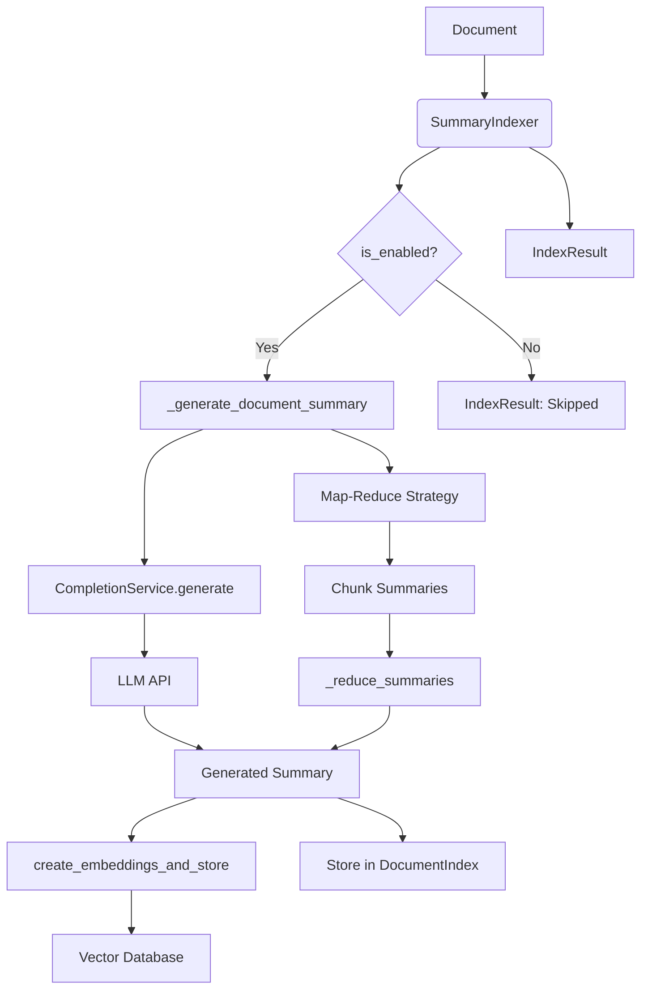
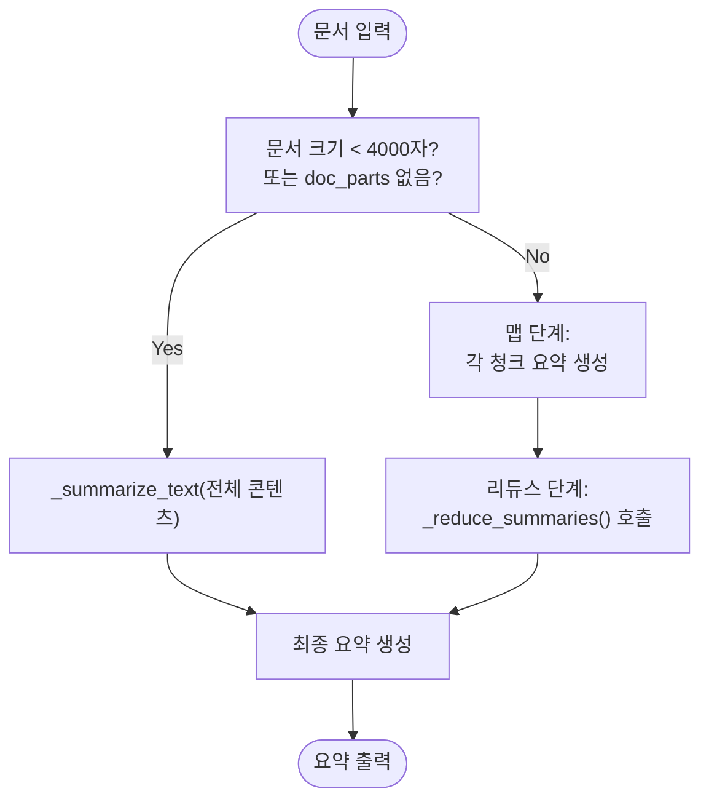
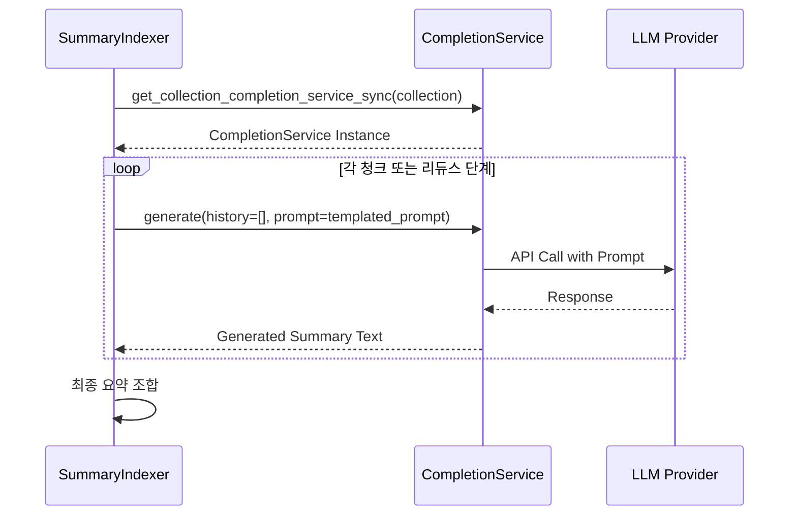

# 요약 인덱싱

<cite>
**이 문서에서 참조한 파일**
- [summary_index.py](file://aperag/index/summary_index.py)
- [completion_service.py](file://aperag/llm/completion/completion_service.py)
- [base_completion.py](file://aperag/llm/completion/base_completion.py)
- [embedding_utils.py](file://aperag/llm/embed/embedding_utils.py)
- [base.py](file://aperag/index/base.py)
- [config.py](file://aperag/config.py)
</cite>

## 목차
1. [소개](#소개)
2. [핵심 아키텍처 개요](#핵심-아키텍처-개요)
3. [요약 생성 프로세스](#요약-생성-프로세스)
4. [LLM 통합 및 완성 서비스](#llm-통합-및-완성-서비스)
5. [벡터화 및 저장 메커니즘](#벡터화-및-저장-메커니즘)
6. [상태 관리 및 수명 주기](#상태-관리-및-수명-주기)
7. [오류 처리 및 예외 관리](#오류-처리-및-예외-관리)
8. [성능 고려 사항](#성능-고려-사항)

## 소개
`SummaryIndexer`는 대규모 문서의 핵심 내용을 추출하고, 이를 기반으로 검색 가능한 요약 인덱스를 생성하는 핵심 컴포넌트입니다. 이 시스템은 LLM(Large Language Model)을 활용하여 문서 또는 청크의 의미 있는 요약을 자동 생성하며, 생성된 요약은 빠른 개요 확인, 컨텍스트 제공, 검색 성능 향상 등의 다양한 용도로 활용됩니다. 본 문서는 `SummaryIndexer` 클래스가 `CompletionService`를 호출하여 요약을 생성하는 방식, 요약 길이 및 형식 제어, 다양한 요약 전략(LLM 모델 선택, 프롬프트 템플릿), 캐싱 전략, 비용 최적화를 위한 배치 처리 및 비동기 실행 방법, 그리고 요약 품질 평가를 위한 내부 메트릭에 대해 설명합니다.

## 핵심 아키텍처 개요
요약 인덱싱 시스템은 여러 계층으로 구성되어 있으며, 각각의 책임이 명확히 분리되어 있습니다. 핵심적인 상호작용은 `SummaryIndexer`가 `CompletionService`를 통해 LLM과 통신하고, 생성된 요약을 벡터 데이터베이스에 저장하는 흐름입니다.

**다이어그램 출처**
- [summary_index.py](file://aperag/index/summary_index.py#L31-L441)
- [completion_service.py](file://aperag/llm/completion/completion_service.py#L27-L210)
- [embedding_utils.py](file://aperag/llm/embed/embedding_utils.py#L34-L117)

**섹션 출처**
- [summary_index.py](file://aperag/index/summary_index.py#L31-L441)

## 요약 생성 프로세스
요약 생성은 맵-리듀스(Map-Reduce) 전략을 사용하여 구현되어 있으며, 대용량 문서의 처리 효율성과 품질을 보장합니다. 이 프로세스는 두 가지 주요 경로로 나뉩니다.

### 작은 문서 또는 짧은 콘텐츠
문서의 전체 길이가 4000자 미만이거나, 파싱된 청크(`doc_parts`)가 존재하지 않는 경우, 전체 콘텐츠를 직접 하나의 요청으로 LLM에 전달하여 요약을 생성합니다. 이는 간단하고 빠른 처리를 가능하게 합니다.

### 큰 문서 (맵-리듀스 전략)
대용량 문서의 경우, 다음과 같은 단계를 거칩니다.
1. **맵 단계**: 문서를 여러 청크(`doc_parts`)로 나누고, 각 청크별로 독립적으로 요약을 생성합니다. 각 청크 요약은 1-2문장으로 제한되며, 가장 중요한 핵심 정보만을 추출하도록 설계된 프롬프트를 사용합니다.
2. **리듀스 단계**: 모든 청크 요약을 하나의 문자열로 결합한 후, 이를 다시 LLM에 전달하여 최종적인 문서 요약을 생성합니다. 이 최종 요약은 3-4문장으로 제한되며, 모든 섹션의 핵심 내용을 통합하고 논리적으로 일관된 개요를 제공하도록 유도됩니다.

이러한 전략은 LLM의 컨텍스트 윈도우 제한을 우회하면서도, 문서 전체의 포괄적인 이해를 가능하게 합니다.

**다이어그램 출처**
- [summary_index.py](file://aperag/index/summary_index.py#L31-L441)

**섹션 출처**
- [summary_index.py](file://aperag/index/summary_index.py#L31-L441)

## LLM 통합 및 완성 서비스
`SummaryIndexer`는 `CompletionService` 클래스를 통해 LLM과 상호작용합니다. 이 통합은 다음과 같은 특징을 가집니다.

### 동기화된 서비스 가져오기
`get_collection_completion_service_sync` 함수는 지정된 컬렉션의 설정을 기반으로 적절한 `CompletionService` 인스턴스를 동기적으로 생성하고 반환합니다. 이 함수는 LLM 제공업체, 모델 이름, API 키, 기본 URL 등 컬렉션 구성에서 필요한 모든 정보를 추출합니다.

### 프롬프트 템플릿
요약 생성은 엄격한 프롬프트 템플릿을 따릅니다. 이는 생성된 요약의 일관성과 품질을 보장하기 위함입니다. 주요 요구 사항은 다음과 같습니다:
- 원본 텍스트와 동일한 언어를 사용할 것.
- 지정된 문장 수(청크 요약은 1-2문장, 최종 요약은 3-4문장) 내에서 유지할 것.
- 객관적이고 정확할 것. 원본 텍스트에 없는 내용을 추가하지 말 것.
- 오직 요약 내용만 출력할 것. 추가적인 설명이나 서식은 포함하지 않을 것.
- 기술 문서의 경우, 핵심 기술 포인트를 강조할 것.

**다이어그램 출처**
- [summary_index.py](file://aperag/index/summary_index.py#L31-L441)
- [base_completion.py](file://aperag/llm/completion/base_completion.py#L186-L221)
- [completion_service.py](file://aperag/llm/completion/completion_service.py#L27-L210)

**섹션 출처**
- [summary_index.py](file://aperag/index/summary_index.py#L31-L441)
- [base_completion.py](file://aperag/llm/completion/base_completion.py#L186-L221)

## 벡터화 및 저장 메커니즘
생성된 요약은 검색 가능성을 높이기 위해 벡터 데이터베이스에도 저장됩니다.

### 벡터화 과정
1. `get_collection_embedding_service_sync` 함수를 통해 임베딩 모델과 벡터 스토어 어댑터를 가져옵니다.
2. 요약 텍스트는 `TextPart` 객체로 래핑되며, 문서 ID, 이름, 컬렉션 ID 등의 메타데이터가 함께 포함됩니다.
3. `create_embeddings_and_store` 함수가 이 `TextPart`를 처리하여 임베딩을 생성하고, 지정된 벡터 데이터베이스 컬렉션에 저장합니다. 이 함수는 내부적으로 텍스트를 재청크화하고, 메타데이터 패딩을 추가하는 등의 전처리를 수행합니다.

### 저장 위치
요약은 두 가지 주요 위치에 저장됩니다:
1. **벡터 데이터베이스**: `vector_db_connector`를 통해 Qdrant 등의 벡터 DB에 저장되며, 의미 기반 검색(RAG)에서 컨텍스트로 활용됩니다.
2. **관계형 데이터베이스**: 생성된 요약 텍스트 자체, 청크 수, 콘텐츠 길이, 벡터 ID 목록 등의 메타데이터가 `DocumentIndex` 테이블에 JSON 형식으로 저장됩니다. 이 정보는 `get_document_summary` 메서드를 통해 쉽게 조회할 수 있습니다.

**섹션 출처**
- [summary_index.py](file://aperag/index/summary_index.py#L31-L441)
- [embedding_utils.py](file://aperag/llm/embed/embedding_utils.py#L34-L117)
- [base_embedding.py](file://aperag/llm/embed/base_embedding.py#L133-L226)
- [config.py](file://aperag/config.py#L325-L330)

## 상태 관리 및 수명 주기
`SummaryIndexer`는 요약 인덱스의 전체 수명 주기를 관리합니다.

### 생성 (`create_index`)
새로운 요약 인덱스를 생성합니다. 위에서 설명한 요약 생성 및 벡터화 프로세스를 수행합니다.

### 업데이트 (`update_index`)
기존 요약 인덱스를 업데이트합니다. 먼저 기존의 벡터 ID를 데이터베이스에서 조회하여 벡터 DB에서 삭제한 후, 새로운 요약을 생성하고 저장합니다. 이는 중복된 벡터가 누적되는 것을 방지합니다.

### 삭제 (`delete_index`)
요약 인덱스를 삭제합니다. `DocumentIndex` 레코드에서 벡터 ID를 조회한 후, 해당 ID들을 벡터 DB에서 삭제합니다.

### 활성화 여부 확인 (`is_enabled`)
해당 컬렉션에 대해 요약 인덱싱이 활성화되었는지 확인합니다. `CompletionService` 인스턴스를 성공적으로 가져올 수 있으면 활성화된 것으로 간주합니다.

**섹션 출처**
- [summary_index.py](file://aperag/index/summary_index.py#L31-L441)

## 오류 처리 및 예외 관리
시스템은 다양한 실패 시나리오에 대해 견고한 오류 처리를 제공합니다.
- **LLM 통신 실패**: `CompletionError`, `InvalidConfigurationError` 등의 예외가 발생하면, `is_enabled` 메서드는 `False`를 반환하거나, `create_index`는 실패한 `IndexResult`를 반환합니다.
- **벡터화 실패**: 요약 생성은 성공했지만 벡터화 과정에서 오류가 발생하더라도, 요약 텍스트 자체는 관계형 DB에 저장됩니다. 로깅을 통해 경고를 기록하고, 인덱싱 프로세스는 계속 진행됩니다.
- **데이터베이스 접근 실패**: SQLAlchemy 세션을 사용하여 안전하게 데이터베이스에 접근하며, 예외 발생 시 상세한 오류 로그를 남깁니다.

**섹션 출처**
- [summary_index.py](file://aperag/index/summary_index.py#L31-L441)

## 성능 고려 사항
- **비용 최적화**: 맵-리듀스 전략은 많은 양의 텍스트를 여러 번 작은 청크로 보내는 것이므로, LLM API 비용을 증가시킬 수 있습니다. 그러나 이는 대용량 문서를 처리할 수 있는 유일한 실용적인 방법입니다.
- **캐싱**: `CompletionService`는 내부적으로 `litellm`의 캐싱 기능을 활성화하여 동일한 입력에 대한 반복적인 API 호출을 방지함으로써 성능과 비용을 모두 개선합니다.
- **비동기 실행**: 현재 `SummaryIndexer`는 동기식 인터페이스를 제공하지만, 백그라운드 태스크(Celery)를 통해 비동기적으로 실행될 수 있도록 설계되어 있습니다. 이는 웹 요청의 응답 시간을 줄이는 데 중요합니다.

**섹션 출처**
- [summary_index.py](file://aperag/index/summary_index.py#L31-L441)
- [completion_service.py](file://aperag/llm/completion/completion_service.py#L27-L210)
- [config.py](file://aperag/config.py#L325-L330)