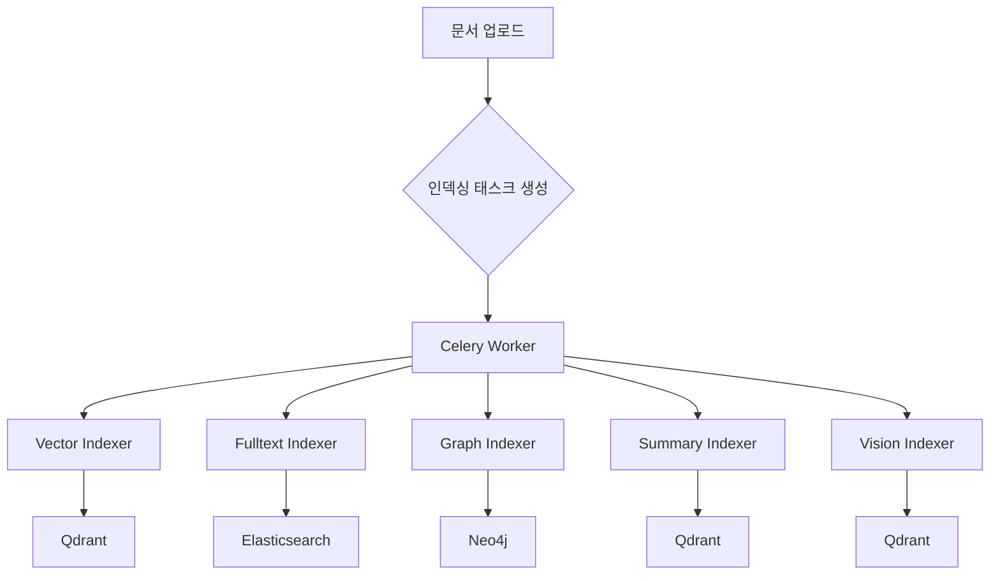
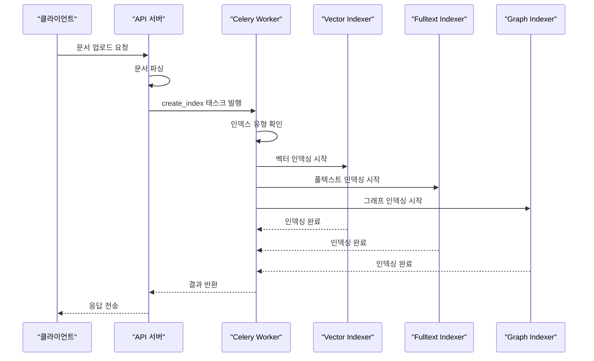

# 인덱싱 프로세스

<cite>
**이 문서에서 참조한 파일**
- [tasks/document.py](file://aperag\tasks\document.py)
- [index/vector_index.py](file://aperag\index\vector_index.py)
- [index/fulltext_index.py](file://aperag\index\fulltext_index.py)
- [index/graph_index.py](file://aperag\index\graph_index.py)
- [index/summary_index.py](file://aperag\index\summary_index.py)
- [db/models.py](file://aperag\db\models.py)
</cite>

## 목차
1. [소개](#소개)
2. [인덱싱 아키텍처 개요](#인덱싱-아키텍처-개요)
3. [Celery를 통한 비동기 인덱싱 흐름](#celery를-통한-비동기-인덱싱-흐름)
4. [각 인덱스 유형별 저장 형식 및 필드 매핑](#각-인덱스-유형별-저장-형식-및-필드-매핑)
5. [인덱스 갱신 및 삭제 로직](#인덱스-갱신-및-삭제-로직)
6. [오류 처리 및 재시도 메커니즘](#오류-처리-및-재시도-메커니즘)
7. [상태 추적 및 오류 로깅](#상태-추적-및-오류-로그링)
8. [대규모 배치 인덱싱 성능 튜닝 가이드](#대규모-배치-인덱싱-성능-튜닝-가이드)

## 소개
이 문서는 ApeRAG 시스템의 인덱싱 프로세스에 대해 설명합니다. 문서 청크들이 Qdrant(벡터 DB), Elasticsearch(풀텍스트 인덱스), Neo4j(지식 그래프), 요약 인덱스 등 다양한 저장소에 저장되는 전체 과정을 다룹니다. `tasks/document.py`에 정의된 Celery 태스크를 통해 비동기적으로 실행되는 인덱싱 흐름, 각 인덱스 유형별 저장 형식과 필드 매핑, 인덱스 갱신 및 삭제 로직을 상세히 설명합니다. 또한 인덱싱 실패 시 재시도 메커니즘, 상태 추적, 오류 로깅 방법을 포함하며, 대규모 문서 배치 인덱싱 시 고려해야 할 성능 튜닝 가이드를 제공합니다.

## 인덱싱 아키텍처 개요
ApeRAG 시스템은 문서를 여러 유형의 인덱스로 변환하여 검색 효율성을 극대화합니다. 주요 인덱스 유형은 벡터(Vector), 풀텍스트(Fulltext), 그래프(Graph), 요약(Summary), 비전(Vision)으로 구분됩니다. 각 인덱스는 독립적인 저장소와 전략을 사용하며, `DocumentIndexTask` 클래스를 중심으로 조정됩니다. 이 아키텍처는 확장성과 유지보수성을 고려하여 설계되었으며, 각 인덱서는 `BaseIndexer` 또는 `AsyncIndexer`를 상속받아 일관된 인터페이스를 제공합니다.

**다이어그램 출처**
- [tasks/document.py](file://aperag\tasks\document.py#L0-L369)
- [index/vector_index.py](file://aperag\index\vector_index.py#L0-L241)
- [index/fulltext_index.py](file://aperag\index\fulltext_index.py#L0-L576)
- [index/graph_index.py](file://aperag\index\graph_index.py#L0-L264)
- [index/summary_index.py](file://aperag\index\summary_index.py#L0-L446)

**섹션 출처**
- [tasks/document.py](file://aperag\tasks\document.py#L0-L369)
- [index/base.py](file://aperag\index\base.py#L41-L57)

## Celery를 통한 비동기 인덱싱 흐름
인덱싱 프로세스는 `tasks/document.py`에 정의된 `DocumentIndexTask` 클래스를 통해 관리됩니다. 이 클래스는 `create_index`, `update_index`, `delete_index` 메서드를 제공하며, 각각 인덱스 생성, 갱신, 삭제 작업을 수행합니다. 이러한 작업은 Celery 큐를 통해 비동기적으로 실행되어, 웹 요청의 응답 시간을 단축하고 시스템의 전반적인 안정성을 높입니다. 작업 시작 시, 문서와 컬렉션 정보를 조회한 후, 지정된 인덱스 유형에 따라 적절한 인덱서를 동적으로 임포트하여 처리합니다.

**다이어그램 출처**
- [tasks/document.py](file://aperag\tasks\document.py#L0-L369)

**섹션 출처**
- [tasks/document.py](file://aperag\tasks\document.py#L0-L369)

## 각 인덱스 유형별 저장 형식 및 필드 매핑
### 벡터 인덱스 (Qdrant)
벡터 인덱스는 `vector_index.py`의 `VectorIndexer` 클래스에 의해 관리되며, Qdrant 벡터 데이터베이스에 저장됩니다. 문서 청크는 임베딩 모델을 통해 벡터로 변환되고, 각 벡터는 문서 ID, 청크 ID, 메타데이터와 함께 저장됩니다. 메타데이터에는 인덱서 종류, 컬렉션 ID, 콘텐츠 유형 등이 포함됩니다.

**섹션 출처**
- [index/vector_index.py](file://aperag\index\vector_index.py#L0-L241)

### 풀텍스트 인덱스 (Elasticsearch)
풀텍스트 인덱스는 `fulltext_index.py`의 `FulltextIndexer` 클래스에 의해 관리되며, Elasticsearch에 저장됩니다. 문서 청크는 `content`, `title`, `name`, `document_id`, `chunk_id`, `metadata` 등의 필드로 매핑됩니다. `content`와 `title` 필드는 IK 분석기를 사용하여 한국어 형태소 분석을 지원합니다.

**섹션 출처**
- [index/fulltext_index.py](file://aperag\index\fulltext_index.py#L0-L576)

### 그래프 인덱스 (Neo4j)
그래프 인덱스는 `graph_index.py`의 `GraphIndexer` 클래스에 의해 관리되며, LightRAG 프레임워크를 통해 Neo4j에 저장됩니다. 문서 내용에서 엔티티와 관계를 추출하여 지식 그래프를 구성합니다. 이 인덱스는 `enable_knowledge_graph` 설정에 따라 활성화 여부가 결정됩니다.

**섹션 출처**
- [index/graph_index.py](file://aperag\index\graph_index.py#L0-L264)

### 요약 인덱스 (Qdrant)
요약 인덱스는 `summary_index.py`의 `SummaryIndexer` 클래스에 의해 관리되며, Qdrant에 저장됩니다. 문서의 핵심 내용을 LLM을 사용해 요약한 후, 이 요약본을 벡터화하여 저장합니다. 요약 생성은 맵-리듀스 전략을 사용하며, 긴 문서의 경우 청크별 요약을 생성한 후 이를 통합합니다.

**섹션 출처**
- [index/summary_index.py](file://aperag\index\summary_index.py#L0-L446)

## 인덱스 갱신 및 삭제 로직
### 갱신 로직
인덱스 갱신은 기존 인덱스 데이터를 먼저 삭제한 후 새로운 데이터를 생성하는 방식으로 이루어집니다. 예를 들어, 벡터 인덱스의 경우, 기존 벡터 ID 목록을 `DocumentIndex` 테이블에서 조회한 후, Qdrant에서 해당 벡터를 삭제합니다. 그 후 새로운 문서 청크를 임베딩하여 다시 저장합니다. 이 과정은 원자성이 보장되지 않으므로, 일부 실패 시 복구 절차가 필요할 수 있습니다.

**섹션 출처**
- [index/vector_index.py](file://aperag\index\vector_index.py#L102-L158)
- [index/fulltext_index.py](file://aperag\index\fulltext_index.py#L230-L268)
- [index/summary_index.py](file://aperag\index\summary_index.py#L154-L186)

### 삭제 로직
인덱스 삭제는 저장소에서 관련 데이터를 제거하고, `DocumentIndex` 테이블의 상태를 업데이트하는 두 단계로 진행됩니다. 벡터 및 요약 인덱스는 Qdrant에서 벡터 ID를 사용해 직접 삭제합니다. 풀텍스트 인덱스는 Elasticsearch의 `delete_by_query` API를 사용하여 문서 ID에 해당하는 모든 청크를 삭제합니다. 그래프 인덱스는 reconciliation 시스템을 통해 삭제 작업이 예약됩니다.

**섹션 출처**
- [index/vector_index.py](file://aperag\index\vector_index.py#L180-L220)
- [index/fulltext_index.py](file://aperag\index\fulltext_index.py#L270-L308)
- [index/summary_index.py](file://aperag\index\summary_index.py#L241-L270)

## 오류 처리 및 재시도 메커니즘
인덱싱 작업 중 발생하는 예외는 `try-except` 블록을 통해 포착되며, `IndexTaskResult.failed_result()`를 사용해 실패 결과를 반환합니다. Celery는 기본적으로 재시도 메커니즘을 제공하며, 설정에 따라 최대 재시도 횟수와 재시도 간격을 조정할 수 있습니다. 특히 네트워크 문제나 일시적인 서비스 장애에 대비해, 재시도 정책을 적용하는 것이 중요합니다.

**섹션 출처**
- [tasks/document.py](file://aperag\tasks\document.py#L0-L369)

## 상태 추적 및 오류 로깅
시스템은 `DocumentIndexStatus` 열거형을 사용하여 각 인덱스의 상태(PENDING, CREATING, ACTIVE, DELETING, FAILED 등)를 추적합니다. 모든 상태 변경과 오류 메시지는 `error_message` 필드에 기록되며, `logger.error()`를 통해 로그에 남습니다. 이 정보는 디버깅과 모니터링에 활용됩니다. `Document` 엔티티는 `get_overall_index_status()` 메서드를 통해 모든 인덱스의 종합 상태를 계산합니다.

**섹션 출처**
- [db/models.py](file://aperag\db\models.py#L113-L121)
- [db/models.py](file://aperag\db\models.py#L488-L514)

## 대규모 배치 인덱싱 성능 튜닝 가이드
대규모 배치 인덱싱 시 다음과 같은 튜닝 가이드를 따르는 것이 권장됩니다:
1. **병렬 처리**: Celery 워커 수를 늘려 동시 처리량을 증가시킵니다.
2. **청크 크기 조정**: `settings.chunk_size`와 `chunk_overlap_size`를 조정하여 임베딩 성능과 정확도 사이의 균형을 찾습니다.
3. **리소스 모니터링**: Qdrant, Elasticsearch, Neo4j의 리소스 사용량(CPU, 메모리, 디스크 I/O)을 모니터링하고, 필요시 클러스터를 확장합니다.
4. **임베딩 배치 크기**: `embedding_utils.create_embeddings_and_store()`의 `batch_size`를 조정하여 GPU 메모리 사용량을 최적화합니다.
5. **재시도 정책**: 일시적인 오류에 대비해 적절한 재시도 정책을 설정합니다.

**섹션 출처**
- [index/vector_index.py](file://aperag\index\vector_index.py#L130-L135)
- [config/settings.py](file://aperag\config\settings.py) *(참고)*
- [index/fulltext_index.py](file://aperag\index\fulltext_index.py#L20-L25)