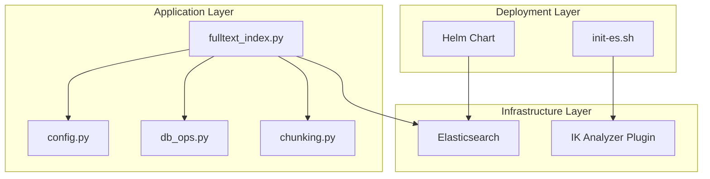
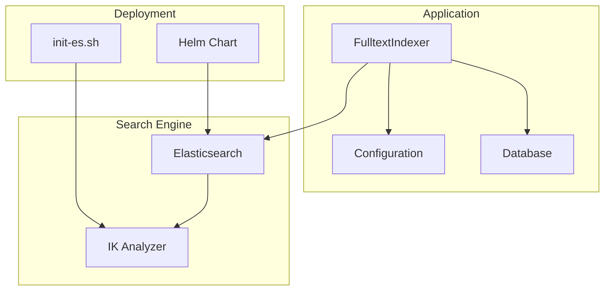
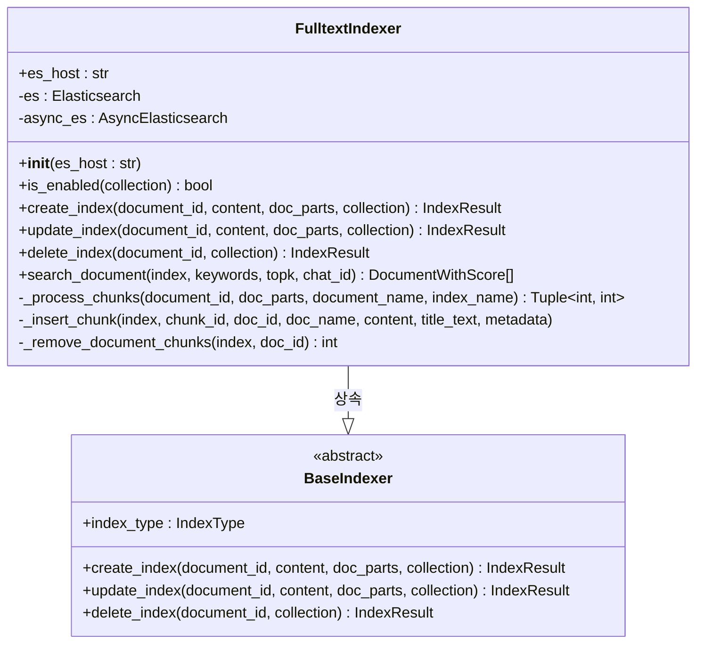
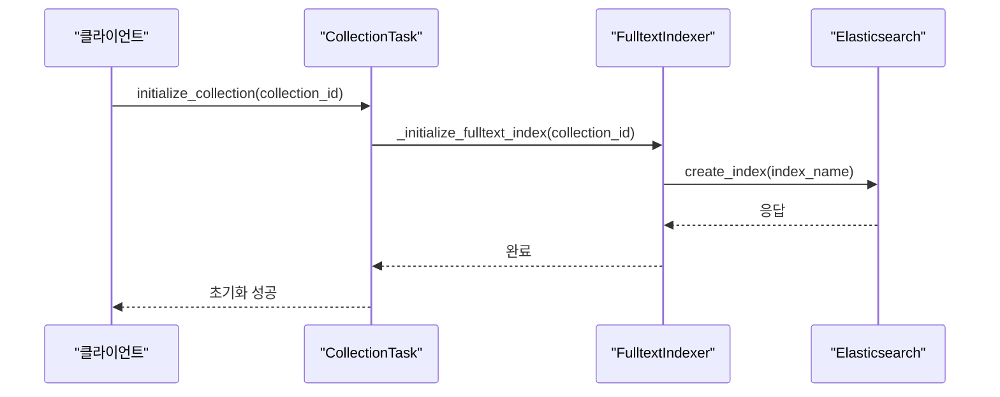
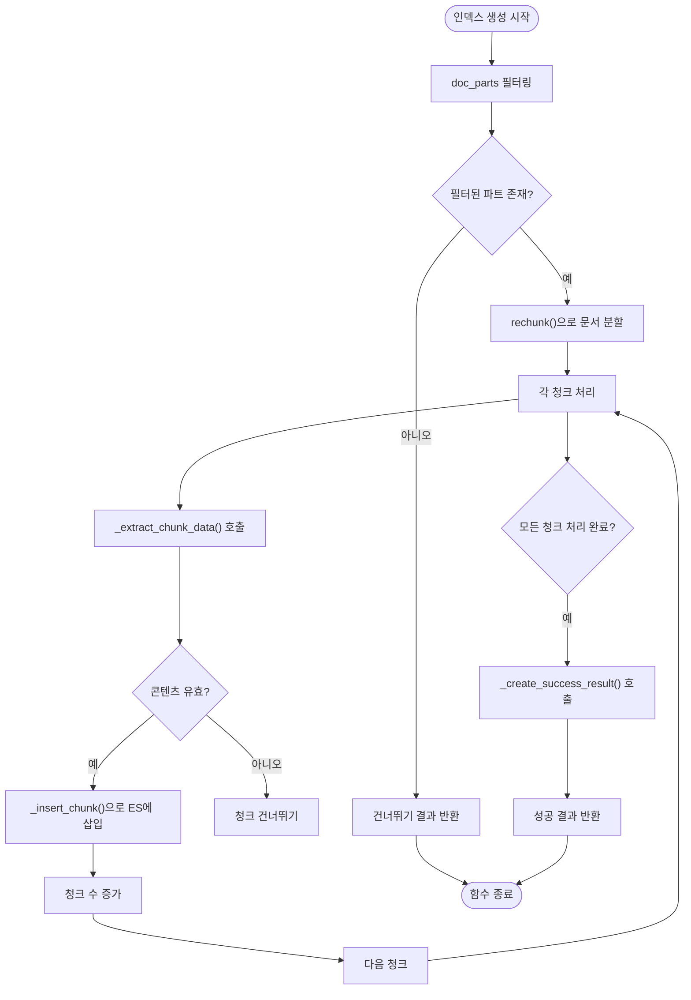
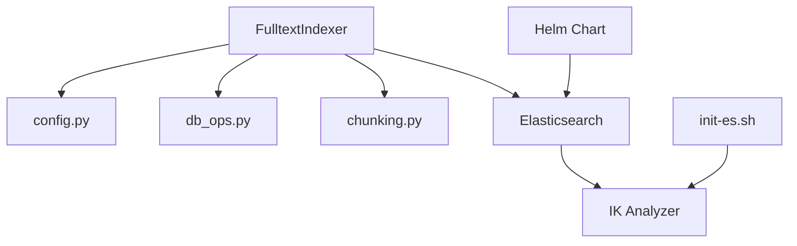

# 풀텍스트 인덱싱

<cite>
**이 문서에서 참조한 파일**
- [fulltext_index.py](file://aperag/index/fulltext_index.py)
- [config.py](file://aperag/config.py)
- [collection.py](file://aperag/tasks/collection.py)
- [init-es.sh](file://scripts/init-es.sh)
- [values.yaml](file://deploy/databases/elasticsearch/values.yaml)
</cite>

## 목차
1. [소개](#소개)
2. [프로젝트 구조](#프로젝트-구조)
3. [코어 구성 요소](#코어-구성-요소)
4. [아키텍처 개요](#아키텍처-개요)
5. [상세 구성 요소 분석](#상세-구성-요소-분석)
6. [의존성 분석](#의존성-분석)
7. [성능 고려사항](#성능-고려사항)
8. [문제 해결 가이드](#문제-해결-가이드)
9. [결론](#결론)

## 소개
이 문서는 ApeRAG 시스템 내에서 Elasticsearch 기반 풀텍스트 인덱스 생성 프로세스를 설명합니다. `FullTextIndex` 클래스를 중심으로 문서 제목, 내용, 메타데이터의 색인 방식, 한국어 형태소 분석기(IK Analyzer) 설정, 검색 가중치 부여 전략, 검색어 확장 기능 등을 다룹니다. 또한 전체 텍스트 검색을 위한 필드 매핑 전략, 대용량 문서 처리 시 메모리 사용 최적화, 실시간 인덱싱과 배치 인덱싱 간 전환 방법을 설명하고, 검색 정확도를 높이기 위한 튜닝 팁을 제공합니다. 인덱스 갱신 및 삭제 시 이벤트 처리 로직도 포함되어 있습니다.

## 프로젝트 구조
ApeRAG 프로젝트는 다양한 모듈로 구성되어 있으며, 풀텍스트 인덱싱 기능은 주로 `index` 디렉터리에 위치합니다. 핵심적인 풀텍스트 인덱싱 로직은 `aperag/index/fulltext_index.py` 파일에 구현되어 있으며, Elasticsearch 클라이언트 설정은 `aperag/config.py`에서 관리됩니다. 인덱스의 초기화 및 삭제 작업은 백그라운드 태스크로 `aperag/tasks/collection.py`에서 처리됩니다. Elasticsearch 서버 자체는 Helm 차트를 통해 `deploy/databases/elasticsearch/` 디렉터리에서 관리되며, IK Analyzer 플러그인 설치 스크립트는 `scripts/init-es.sh`에 정의되어 있습니다.

**Diagram sources**
- [fulltext_index.py](file://aperag/index/fulltext_index.py)
- [config.py](file://aperag/config.py)
- [init-es.sh](file://scripts/init-es.sh)
- [values.yaml](file://deploy/databases/elasticsearch/values.yaml)

**Section sources**
- [fulltext_index.py](file://aperag/index/fulltext_index.py)
- [config.py](file://aperag/config.py)
- [collection.py](file://aperag/tasks/collection.py)

## 코어 구성 요소
풀텍스트 인덱싱의 핵심은 `FulltextIndexer` 클래스입니다. 이 클래스는 `BaseIndexer`를 상속받아 `create_index`, `update_index`, `delete_index` 등의 표준 인터페이스를 구현합니다. 인덱스 생성 과정에서는 문서 파트를 `rechunk` 함수를 사용하여 지정된 크기와 오버랩으로 재분할한 후, 각 청크를 Elasticsearch에 삽입합니다. 검색은 비동기 클라이언트(`AsyncElasticsearch`)를 통해 수행되며, 제목과 내용 필드 모두에서 키워드를 검색합니다. 인덱스 이름은 컬렉션 ID를 기반으로 `generate_fulltext_index_name` 함수를 통해 생성됩니다.

**Section sources**
- [fulltext_index.py](file://aperag/index/fulltext_index.py#L43-L307)
- [utils.py](file://aperag/utils/utils.py#L39-L40)

## 아키텍처 개요
시스템 아키텍처는 애플리케이션 계층, 인프라 계층, 배포 계층으로 나뉩니다. 애플리케이션 계층의 `FulltextIndexer`는 설정 정보를 `config.py`로부터 가져오고, 데이터베이스 연산은 `db_ops`를 통해 수행합니다. 인덱싱된 문서 청크는 Elasticsearch 저장소에 저장되며, 이 과정에서 IK Analyzer가 한국어 형태소 분석을 담당합니다. 배포 계층에서는 Helm을 사용하여 Elasticsearch 클러스터를 프로비저닝하며, 초기화 스크립트를 통해 IK Analyzer 플러그인이 자동으로 설치됩니다. 모든 구성 요소는 환경 변수와 설정 파일을 통해 유연하게 구성될 수 있습니다.

**Diagram sources**
- [fulltext_index.py](file://aperag/index/fulltext_index.py)
- [config.py](file://aperag/config.py)
- [init-es.sh](file://scripts/init-es.sh)

## 상세 구성 요소 분석

### FulltextIndexer 분석
`FulltextIndexer` 클래스는 풀텍스트 검색 기능의 핵심입니다. 문서 인덱싱을 위해 먼저 `doc_parts`를 필터링하여 텍스트 콘텐츠가 있는 부분만 추출합니다. 이후 `rechunk` 함수를 호출하여 설정된 청크 크기와 오버랩에 따라 문서를 분할합니다. 각 청크는 `_insert_chunk` 메서드를 통해 Elasticsearch에 삽입되며, 이때 문서 ID, 청크 ID, 제목, 콘텐츠, 메타데이터 등이 함께 저장됩니다. 인덱스 생성 완료 후에는 성공 결과와 함께 청크 수, 총 콘텐츠 길이 등의 통계 정보를 반환합니다.

#### 객체 지향 구성 요소:

**Diagram sources**
- [fulltext_index.py](file://aperag/index/fulltext_index.py#L43-L307)

#### API/서비스 구성 요소:

**Diagram sources**
- [collection.py](file://aperag/tasks/collection.py#L133-L137)
- [fulltext_index.py](file://aperag/index/fulltext_index.py#L548-L566)

### 복잡한 논리 구성 요소:

**Diagram sources**
- [fulltext_index.py](file://aperag/index/fulltext_index.py#L119-L147)

**Section sources**
- [fulltext_index.py](file://aperag/index/fulltext_index.py#L43-L307)
- [document.py](file://aperag/tasks/document.py#L56-L175)

## 의존성 분석
`FulltextIndexer`는 여러 내부 및 외부 구성 요소에 의존합니다. 내부적으로는 `config.py`의 설정, `db_ops.py`의 데이터베이스 연산, `chunking.py`의 문서 분할 기능을 사용합니다. 외부적으로는 Elasticsearch 서버와 그 위에 설치된 IK Analyzer 플러그인에 의존합니다. 배포 단계에서는 Helm 차트와 초기화 스크립트가 IK Analyzer의 올바른 설치를 보장합니다. 이러한 의존성은 시스템의 결합도를 낮추고, 각 구성 요소의 독립적인 개발과 유지보수를 가능하게 합니다.

**Diagram sources**
- [fulltext_index.py](file://aperag/index/fulltext_index.py)
- [config.py](file://aperag/config.py)
- [init-es.sh](file://scripts/init-es.sh)

**Section sources**
- [fulltext_index.py](file://aperag/index/fulltext_index.py)
- [config.py](file://aperag/config.py)

## 성능 고려사항
대용량 문서 처리 시 메모리 사용을 최적화하기 위해, 문서는 작은 청크 단위로 분할되어 순차적으로 인덱싱됩니다. 이는 전체 문서를 메모리에 적재하는 것을 방지합니다. Elasticsearch 클라이언트는 요청 타임아웃과 최대 재시도 횟수를 설정하여 네트워크 불안정성에 강건하게 만듭니다. 검색 성능을 위해 `content`와 `title` 필드에 `ik_max_word` 분석기를 사용하여 포괄적인 매칭을 수행하며, 검색 시에는 `ik_smart` 분석기를 사용하여 더 정확한 결과를 제공합니다. 인덱스 생성 및 삭제 작업은 Celery를 통해 비동기적으로 실행되어, 주 애플리케이션의 성능에 영향을 미치지 않습니다.

## 문제 해결 가이드
Elasticsearch 연결 문제가 발생하면, 먼저 `ES_HOST_NAME`, `ES_PORT`, `ES_USER`, `ES_PASSWORD` 환경 변수가 올바르게 설정되었는지 확인해야 합니다. IK Analyzer가 설치되지 않았다는 오류가 발생하면, `init-es.sh` 스크립트가 실행되었는지 점검하고, 필요한 경우 수동으로 플러그인을 설치해야 합니다. 인덱스 생성이 실패하는 경우, `fulltext_index.py`의 로그를 확인하여 구체적인 예외 메시지를 찾아야 합니다. 일반적으로 문서 파트가 없거나, Elasticsearch 클러스터 상태가 'green' 또는 'yellow'가 아닌 경우에 실패합니다. 인덱스가 존재하지 않는다고 보고되는 경우, `generate_fulltext_index_name` 함수가 올바른 인덱스 이름을 생성하고 있는지 확인하세요.

**Section sources**
- [fulltext_index.py](file://aperag/index/fulltext_index.py)
- [config.py](file://aperag/config.py)
- [init-es.sh](file://scripts/init-es.sh)

## 결론
ApeRAG의 풀텍스트 인덱싱 시스템은 Elasticsearch와 IK Analyzer를 효과적으로 통합하여 강력한 한국어 검색 기능을 제공합니다. `FulltextIndexer` 클래스는 문서의 청크화, 인덱싱, 검색이라는 일련의 과정을 명확하고 효율적으로 구현하고 있습니다. 시스템은 배포 자동화 스크립트를 통해 IK Analyzer의 설치를 보장하며, 설정 파일을 통해 유연하게 구성할 수 있습니다. 이 설계는 확장성과 유지보수성을 갖추고 있으며, 대규모 문서 집합에 대한 고성능 검색을 가능하게 합니다.