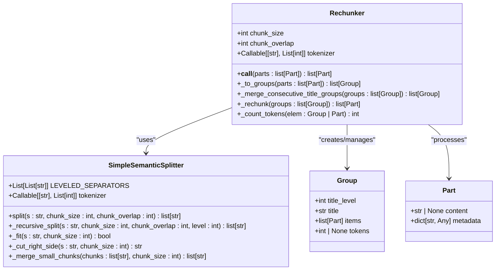
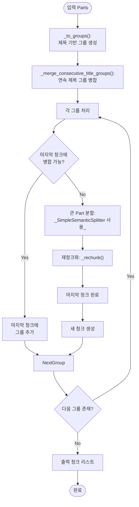

# 청크화 전략

<cite>
**이 문서에서 참조한 파일**
- [chunking.py](file://aperag/docparser/chunking.py)
- [tokenizer.py](file://aperag/utils/tokenizer.py)
- [base.py](file://aperag/docparser/base.py)
</cite>

## 목차
1. [소개](#소개)
2. [청크화 알고리즘](#청크화-알고리즘)
3. [핵심 구성 요소](#핵심-구성-요소)
4. [청크화 전략의 성능 최적화](#청크화-전략의-성능-최적화)
5. [사용자 정의 확장 방법](#사용자-정의-확장-방법)

## 소개

ApeRAG 시스템은 다양한 소스에서 파싱된 문서 콘텐츠를 의미 있는 청크로 분할하는 포괄적인 전략을 제공합니다. 이 문서는 `aperag/docparser/chunking.py` 모듈에 구현된 핵심 청크화 메커니즘을 설명하며, 문장 기반, 페이지 기반, 세마틱 경계 기반의 청크화 알고리즘을 다룹니다. 또한 청크 크기, 중첩 여부, 언어별 토크나이저 설정과 같은 중요한 구성 옵션을 안내하고, 과도한 청크 분할이 검색 정확도에 미치는 영향과 이를 최적화하는 가이드를 제공합니다.

**Section sources**
- [chunking.py](file://aperag/docparser/chunking.py#L1-L50)

## 청크화 알고리즘

### 주요 청크화 클래스

시스템은 문서를 효과적으로 분할하기 위해 여러 청크화 전략을 제공합니다. 각 전략은 특정 유형의 콘텐츠와 사용 사례에 최적화되어 있습니다.



**Diagram sources**
- [chunking.py](file://aperag/docparser/chunking.py#L45-L387)

**Section sources**
- [chunking.py](file://aperag/docparser/chunking.py#L45-L387)

### 알고리즘 작동 방식

#### 1. 그룹 생성 (_to_groups)

`Rechunker` 클래스는 먼저 입력된 `Part` 객체 리스트를 논리적 그룹으로 변환합니다. 이 과정에서 제목(Part.level 속성이 있음)은 새로운 그룹의 시작점으로 간주되며, 해당 제목 아래의 모든 콘텐츠가 동일한 그룹에 포함됩니다. 중첩(nesting) 메타데이터가 있는 경우, 하위 수준의 제목은 상위 그룹 내에서 처리됩니다.

#### 2. 제목 그룹 병합 (_merge_consecutive_title_groups)

연속된 제목만 포함하는 작은 그룹들을 인접한 본문 그룹과 병합하여 의미 있는 컨텍스트를 유지합니다. 예를 들어, 연속된 H2 및 H3 제목들은 다음 섹션의 본문과 함께 하나의 큰 청크로 결합될 수 있습니다. 이는 관련 없는 정보 조각으로 나누는 것을 방지합니다.

#### 3. 재청크화 (_rechunk)

이 단계는 실제 청크 생성을 담당합니다. 알고리즘은 두 가지 주요 접근 방식을 사용합니다:

1.  **그룹 통합**: 현재 그룹이 마지막 청크에 추가될 수 있는지 확인합니다. 이는 청크 크기 제한을 초과하지 않고, 계층 구조(예: 하위 제목이 상위 제목보다 높은 수준의 제목으로 병합되지 않도록 함)를 위반하지 않는 경우에만 가능합니다.
2.  **대규모 항목 분할**: 단일 `Part`의 토큰 수가 `chunk_size`를 초과하는 경우, `SimpleSemanticSplitter`가 호출되어 더 작은 의미 있는 청크로 분할합니다.



**Diagram sources**
- [chunking.py](file://aperag/docparser/chunking.py#L100-L387)

**Section sources**
- [chunking.py](file://aperag/docparser/chunking.py#L100-L387)

### 의미 기반 분할 (SimpleSemanticSplitter)

`SimpleSemanticSplitter`는 텍스트를 무작위로 자르는 대신 의미적 일관성을 보존하면서 텍스트를 분할하는 핵심 도구입니다. 이는 계층화된 구분자 목록을 사용하여 점진적으로 분할을 수행합니다.

```mermaid
flowchart TD
A[입력 문자열 s] --> B{_fit(s)?<br>토큰 수 ≤ chunk_size?}
B --> |Yes| C[반환 [s]]
B --> |No| D{level ≥ max_separators?<br>(모든 구분자 소진)}
D --> |Yes| E[중간 지점 p로 분할]
E --> F[왼쪽 재귀 분할]
F --> G[오버랩 생성]
G --> H[오른쪽 재귀 분할<br>(오버랩 포함)]
H --> I[결과 병합 반환]
D --> |No| J[현재 레벨 구분자 적용<br>(예: \n\n, ., !, ?)]
J --> K[각 부분에 대해<br>_recursive_split<br>레벨 증가]
K --> L[작은 청크 병합:<br>_merge_small_chunks]
L --> M[결과 반환]
```

**Diagram sources**
- [chunking.py](file://aperag/docparser/chunking.py#L287-L387)

**Section sources**
- [chunking.py](file://aperag/docparser/chunking.py#L287-L387)

## 핵심 구성 요소

### 청크화 함수 (rechunk)

외부에서 청크화 프로세스를 시작하는 주요 진입점은 `rechunk` 함수입니다. 이 함수는 파싱된 `Part` 객체 리스트, 원하는 청크 크기, 오버랩 크기, 그리고 토크나이저 함수를 매개변수로 받습니다.

```python
def rechunk(
    parts: list[Part], 
    chunk_size: int, 
    chunk_overlap: int, 
    tokenizer: Callable[[str], List[int]]
) -> list[Part]:
    rechunker = Rechunker(chunk_size, chunk_overlap, tokenizer)
    return rechunker(parts)
```

이 함수는 `Rechunker` 인스턴스를 생성하고, 이를 호출하여 최종 청크 리스트를 반환합니다.

**Section sources**
- [chunking.py](file://aperag/docparser/chunking.py#L30-L40)

### 토크나이저 구성

청크화는 토큰 수를 기준으로 작동하므로, 정확한 토크나이저가 필수적입니다. 시스템은 `aperag/utils/tokenizer.py` 모듈을 통해 기본 토크나이저를 제공합니다.

```python
def get_default_tokenizer() -> Callable[[str], List[int]]:
    encoding = tiktoken.get_encoding(os.environ.get("DEFAULT_ENCODING_MODEL", "cl100k_base"))
    return encoding.encode
```

이 함수는 환경 변수 `DEFAULT_ENCODING_MODEL`에 지정된 인코딩(기본값: `cl100k_base`)을 사용하여 `tiktoken` 라이브러리를 기반으로 한 토크나이저를 반환합니다. 이는 OpenAI 모델과 호환되는 방식으로 텍스트를 토큰화합니다.

**Section sources**
- [tokenizer.py](file://aperag/utils/tokenizer.py#L15-L23)

### 데이터 모델 (Part 및 Group)

청크화 프로세스는 `Part`와 `Group`이라는 두 가지 핵심 데이터 구조를 중심으로 이루어집니다.

-   **Part**: 파서가 추출한 문서의 기본 단위입니다. `content` 필드에는 텍스트가, `metadata` 딕셔너리에는 출처 맵(md_source_map, pdf_source_map), 제목 레벨(level), 토큰 수(tokens) 등의 부가 정보가 포함됩니다.
-   **Group**: 논리적으로 연결된 `Part` 객체들의 집합입니다. 일반적으로 하나의 제목과 그 아래의 모든 콘텐츠로 구성됩니다. `title`, `title_level`, `items`(Part 리스트) 속성을 가집니다.

이러한 구조는 청크화 중에도 원본 문서의 계층적 구조와 메타데이터를 유지하는 데 도움이 됩니다.

**Section sources**
- [base.py](file://aperag/docparser/base.py#L20-L82)
- [chunking.py](file://aperag/docparser/chunking.py#L45-L60)

## 청크화 전략의 성능 최적화

### 청크 크기 및 오버랩 설정

-   **청크 크기 (chunk_size)**: 이 값은 임베딩 모델의 최대 컨텍스트 길이를 초과해서는 안 됩니다. 너무 작은 청크는 충분한 컨텍스트를 제공하지 못해 검색 정확도를 낮추고, 너무 큰 청크는 관련성이 낮은 정보를 포함시켜 노이즈를 증가시킬 수 있습니다. 일반적으로 256~512 토큰 사이가 균형 잡힌 선택입니다.
-   **오버랩 (chunk_overlap)**: 인접한 청크 간에 일부 텍스트를 중복시키는 것으로, 청크 경계에서 의미가 잘리는 것을 방지합니다. 일반적으로 청크 크기의 10-20% 정도를 설정합니다.

### 과도한 청크 분할의 영향

청크화 전략이 너무 공격적이거나 (예: 매우 작은 청크 크기), 의미 기반 분할이 실패하면 문서가 필요 이상으로 많은 작은 청크로 분할될 수 있습니다. 이는 다음과 같은 문제를 일으킵니다:
1.  **검색 정확도 저하**: 관련 정보가 여러 청크에 흩어져 있어, 하나의 청크만 검색 결과로 반환되면 전체적인 이해가 어렵습니다.
2.  **성능 저하**: 검색 및 임베딩 프로세스에서 처리해야 할 청크 수가 기하급수적으로 증가합니다.
3.  **비용 증가**: LLM API 호출 비용은 처리하는 토큰 수에 비례하므로, 불필요한 청크는 비용을 증가시킵니다.

### 최적화 가이드

1.  **의미 중심 전략 우선**: 가능한 한 `SimpleSemanticSplitter`의 계층화된 구분자(`LEVELED_SEPARATORS`)를 활용하여 의미 단위(문단, 문장)로 분할하세요.
2.  **제목 구조 활용**: `Rechunker`는 제목 레벨을 기반으로 그룹을 형성하므로, 원본 문서의 제목 구조가 명확할수록 더 의미 있는 청크가 생성됩니다.
3.  **메타데이터 보존**: `_merge_md_source_map` 및 `_merge_pdf_source_map` 메서드는 청크화 후에도 원본 문서의 위치 정보를 유지하여, 검색 결과 표시 시 출처 추적을 가능하게 합니다.
4.  **균형 잡힌 크기 설정**: 문서 유형에 따라 적절한 `chunk_size`와 `chunk_overlap` 값을 실험을 통해 결정하세요.

**Section sources**
- [chunking.py](file://aperag/docparser/chunking.py#L100-L387)

## 사용자 정의 확장 방법

시스템은 `rechunk` 함수와 `Rechunker` 클래스를 직접 사용하거나 확장함으로써 사용자 정의 청크화 로직을 통합할 수 있도록 설계되었습니다.

1.  **사용자 정의 토크나이저**: `get_default_tokenizer` 함수를 재정의하거나, `rechunk` 함수에 다른 토크나이저를 전달하여 특정 언어(예: 한국어)에 최적화된 토크나이저를 사용할 수 있습니다.
2.  **사용자 정의 분할 전략**: `SimpleSemanticSplitter` 클래스를 상속하거나, 완전히 새로운 분할기를 작성하여 `LEVELED_SEPARATORS` 목록을 수정하거나, 다른 알고리즘(예: NLP 기반 문장 분할기)을 통합할 수 있습니다.
3.  **사용자 정의 그룹화 로직**: `Rechunker` 클래스의 `_to_groups` 또는 `_merge_consecutive_title_groups` 메서드를 오버라이드하여, 제목 외의 다른 기준(예: 테이블, 이미지, 특정 키워드)에 따라 그룹을 형성할 수 있습니다.

이러한 확장 가능성 덕분에 ApeRAG의 청크화 전략은 다양한 문서 유형과 도메인 요구사항에 맞게 유연하게 조정될 수 있습니다.