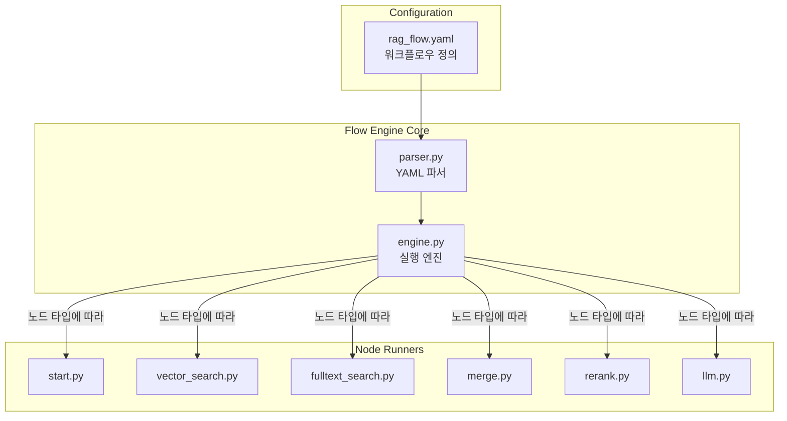
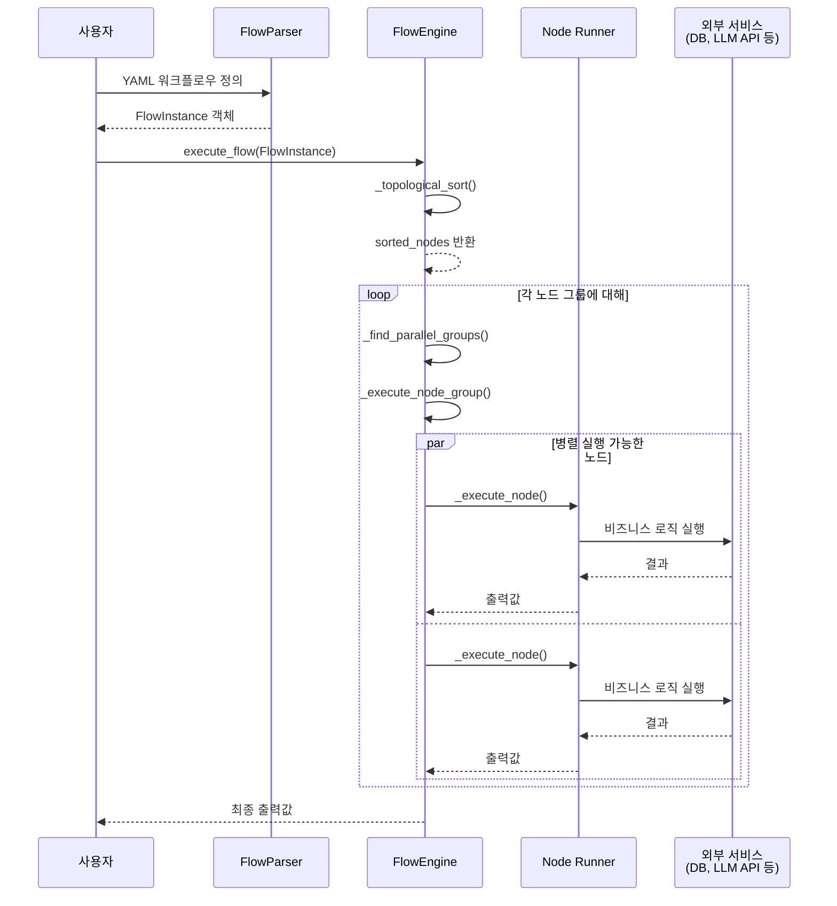
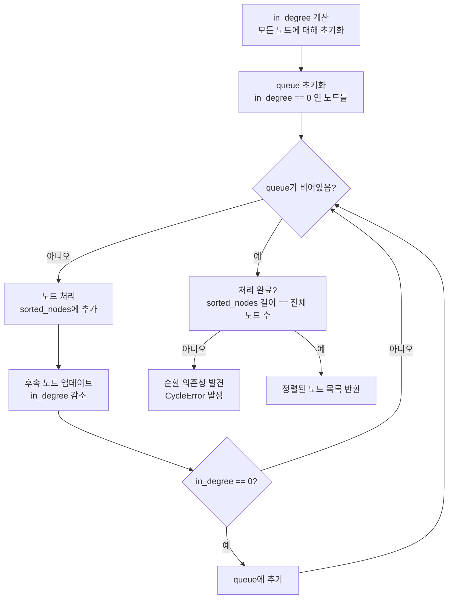
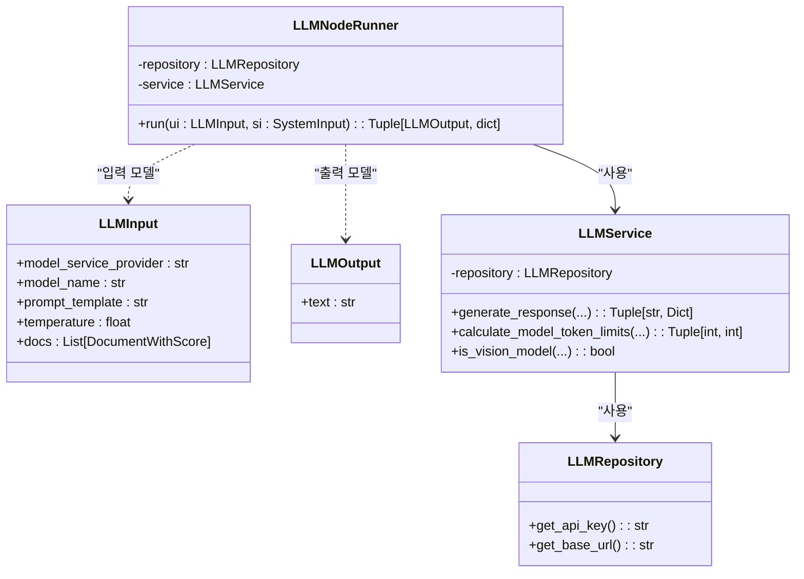
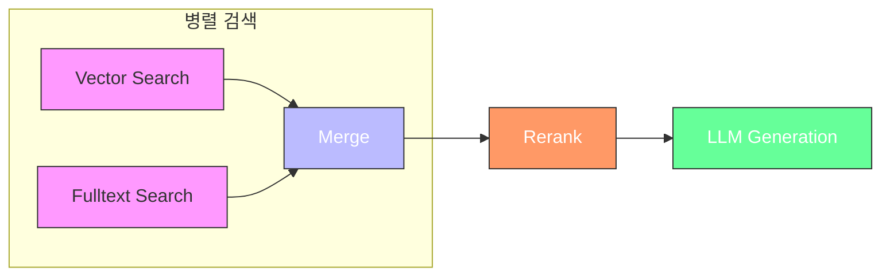
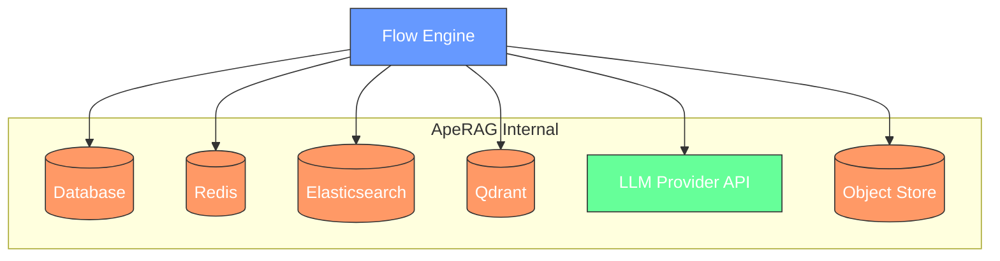

# 워크플로우 엔진 (Flow Engine)

<cite>
**이 문서에서 참조한 파일**
- [engine.py](file://aperag/flow/engine.py)
- [parser.py](file://aperag/flow/parser.py)
- [llm.py](file://aperag/flow/runners/llm.py)
- [vector_search.py](file://aperag/flow/runners/vector_search.py)
- [fulltext_search.py](file://aperag/flow/runners/fulltext_search.py)
- [merge.py](file://aperag/flow/runners/merge.py)
- [rerank.py](file://aperag/flow/runners/rerank.py)
- [start.py](file://aperag/flow/runners/start.py)
- [rag_flow.yaml](file://aperag/flow/examples/rag_flow.yaml)
</cite>

## 목차
1. [소개](#소개)
2. [프로젝트 구조](#프로젝트-구조)
3. [핵심 구성 요소](#핵심-구성-요소)
4. [아키텍처 개요](#아키텍처-개요)
5. [상세 구성 요소 분석](#상세-구성-요소-분석)
6. [의존성 분석](#의존성-분석)
7. [성능 고려사항](#성능-고려사항)
8. [문제 해결 가이드](#문제-해결-가이드)
9. [결론](#결론)

## 소개
이 문서는 ApeRAG 프로젝트 내 `flow` 모듈의 핵심인 Flow Engine의 작동 원리를 설명합니다. YAML 기반으로 정의된 워크플로우를 실행하는 이 엔진은 DAG(Directed Acyclic Graph) 기반 노드 실행 순서 결정, 위상 정렬을 통한 순환 의존성 방지, 그리고 `@register_node_runner` 데코레이레이터를 이용한 커스텀 노드 확장 메커니즘을 제공합니다. 다양한 노드 실행기(`runners/*.py`)가 LLM, 검색, 병합, 요약 등의 역할을 수행하며, 데이터 흐름을 관리합니다. 실제 `rag-flow.yaml` 예제를 기반으로 플로우 실행 흐름을 추적하고, 디버깅 및 모니터링을 위한 로그 출력 방법을 안내합니다.

## 프로젝트 구조

워크플로우 엔진은 `aperag/flow` 디렉토리에 위치하며, 다음과 같은 주요 구성 요소로 이루어져 있습니다:

```
aperag/flow/
├── base/                  # 기본 모델과 예외 정의
│   ├── models.py          # NodeInstance, FlowInstance 등 핵심 데이터 모델
│   └── exceptions.py      # CycleError, ValidationError 등 사용자 정의 예외
├── examples/              # 샘플 워크플로우 정의
│   └── rag_flow.yaml      # RAG 지식베이스 워크플로우 예제
├── runners/               # 다양한 작업을 수행하는 노드 실행기들
│   ├── llm.py             # LLM 생성 노드
│   ├── vector_search.py   # 벡터 검색 노드
│   ├── fulltext_search.py # 풀텍스트 검색 노드
│   ├── merge.py           # 결과 병합 노드
│   ├── rerank.py          # 재정렬 노드
│   └── start.py           # 시작 노드
├── engine.py              # 워크플로우 실행 엔진의 핵심 로직
└── parser.py              # YAML 형식의 워크플로우 정의 파싱
```



**Diagram sources**
- [engine.py](file://aperag/flow/engine.py#L72-L454)
- [parser.py](file://aperag/flow/parser.py#L10-L97)
- [rag_flow.yaml](file://aperag/flow/examples/rag_flow.yaml#L1-L268)

**Section sources**
- [engine.py](file://aperag/flow/engine.py#L1-L455)
- [parser.py](file://aperag/flow/parser.py#L1-L97)

## 핵심 구성 요소

Flow Engine의 핵심은 세 가지 주요 컴포넌트로 구성됩니다: **FlowEngine**, **FlowParser**, 그리고 **Node Runner Registry**.

1.  **FlowEngine**: 워크플로우 인스턴스를 실행하는 핵심 클래스입니다. 위상 정렬을 통해 실행 순서를 결정하고, 노드 그룹을 병렬로 실행하며, 실행 중 발생하는 이벤트를 로깅합니다.
2.  **FlowParser**: YAML 형식의 워크플로우 정의를 파싱하여 `FlowInstance` 객체로 변환합니다. `$ref` 키워드를 지원하여 스키마 재사용이 가능합니다.
3.  **Node Runner Registry**: `NODE_RUNNER_REGISTRY` 전역 딕셔너리에 등록된 각 노드 타입의 실행기를 저장합니다. `@register_node_runner` 데코레이터를 통해 새로운 노드 유형을 쉽게 확장할 수 있습니다.

**Section sources**
- [engine.py](file://aperag/flow/engine.py#L72-L454)
- [parser.py](file://aperag/flow/parser.py#L10-L97)
- [base/models.py](file://aperag/flow/base/models.py#L120-L120)

## 아키텍처 개요

Flow Engine은 선언형 워크플로우 정의(YAML)를 받아 이를 실행하는 명령형 엔진입니다. 전체 아키텍처는 다음과 같습니다.



**Diagram sources**
- [engine.py](file://aperag/flow/engine.py#L72-L454)
- [parser.py](file://aperag/flow/parser.py#L10-L97)

## 상세 구성 요소 분석

### DAG 기반 실행 순서 결정 및 위상 정렬

Flow Engine은 워크플로우를 방향 비순환 그래프(DAG)로 간주합니다. `_topological_sort` 메서드는 Kahn's 알고리즘을 사용하여 노드의 실행 순서를 결정하고, 순환 의존성을 감지합니다.



**Diagram sources**
- [engine.py](file://aperag/flow/engine.py#L248-L297)

**Section sources**
- [engine.py](file://aperag/flow/engine.py#L248-L297)

### `@register_node_runner` 데코레이터를 통한 커스텀 노드 확장

`@register_node_runner` 데코레이터는 플러그인 형태의 노드 확장을 가능하게 합니다. 이 메커니즘은 `NODE_RUNNER_REGISTRY`라는 전역 레지스트리에 노드 타입, 입력/출력 모델, 실행 함수를 등록합니다.

```python
@register_node_runner(
    "llm",
    input_model=LLMInput,
    output_model=LLMOutput,
)
class LLMNodeRunner(BaseNodeRunner):
    async def run(self, ui: LLMInput, si: SystemInput) -> Tuple[LLMOutput, dict]:
        # ... 실행 로직 ...
        return LLMOutput(text=text), system_output
```

`FlowEngine._execute_node` 메서드는 노드의 `type`을 기준으로 레지스트리에서 해당 실행기를 찾아 동적으로 호출합니다. 이로 인해 새로운 노드 유형을 추가하더라도 엔진 코어 코드를 수정할 필요 없이 `runners/` 디렉토리에 새 파일을 추가하고 데코레이터만 붙이면 됩니다.

**Section sources**
- [engine.py](file://aperag/flow/engine.py#L408-L438)
- [base/models.py](file://aperag/flow/base/models.py#L120-L120)
- [llm.py](file://aperag/flow/runners/llm.py#L334-L353)

### 노드 실행기(`runners/*.py`)의 역할과 데이터 흐름

각 `runner`는 특정 작업을 담당하는 독립적인 비즈니스 로직을 포함합니다. 일반적으로 `Repository`, `Service`, `NodeRunner`의 세 계층으로 구성됩니다.

#### LLM 노드 실행기 분석


**Diagram sources**
- [llm.py](file://aperag/flow/runners/llm.py#L58-L353)

#### 검색 및 병합 노드 실행기 분석


**Diagram sources**
- [vector_search.py](file://aperag/flow/runners/vector_search.py#L30-L77)
- [fulltext_search.py](file://aperag/flow/runners/fulltext_search.py#L30-L77)
- [merge.py](file://aperag/flow/runners/merge.py#L30-L77)
- [rerank.py](file://aperag/flow/runners/rerank.py#L30-L77)
- [rag_flow.yaml](file://aperag/flow/examples/rag_flow.yaml#L1-L268)

### `rag-flow.yaml` 기반 플로우 실행 흐름 추적

`rag_flow.yaml` 파일은 RAG(Retrieval-Augmented Generation) 워크플로우를 정의합니다. 실행 흐름은 다음과 같습니다:

1.  **시작 노드 (`start`)**: 사용자의 질의(query)를 입력으로 받습니다.
2.  **병렬 검색**:
    *   **벡터 검색 노드 (`vector_search_3f8e2c1a`)**: `{{ .nodes.start.output.query }}`를 사용하여 벡터 DB에서 관련 문서를 검색합니다.
    *   **풀텍스트 검색 노드 (`fulltext_search_7b2d4e9f`)**: 동일한 질의를 사용하여 풀텍스트 인덱스에서 문서를 검색합니다.
3.  **병합 노드 (`merge_1a9c5d8e`)**: 두 검색 결과를 `union` 전략으로 병합하고 중복 제거(deduplicate)를 수행합니다.
4.  **재정렬 노드 (`rerank_5c7e1b2a`)**: 병합된 결과를 더 정확한 순서로 재정렬합니다.
5.  **LLM 생성 노드 (`llm_8e4f2a7b`)**: 재정렬된 문서들을 컨텍스트로 사용하여 `gpt-4o` 모델이 최종 답변을 생성합니다.

데이터 흐름은 `{{ .nodes.<node_id>.output.<field> }}` 형식의 Jinja2 템플릿 표현식을 통해 연결됩니다.

**Section sources**
- [rag_flow.yaml](file://aperag/flow/examples/rag_flow.yaml#L1-L268)
- [engine.py](file://aperag/flow/engine.py#L330-L338)

## 의존성 분석

Flow Engine은 여러 하위 시스템과 밀접하게 연동됩니다.



*   **db.ops**: 비동기 데이터베이스 조회를 위해 사용됩니다 (예: `query_llm_provider_model`, `query_collection`).
*   **index/\***: 검색 인덱스(벡터, 풀텍스트)에 접근하기 위해 사용됩니다.
*   **llm/\***: LLM 및 임베딩 서비스를 호출하기 위해 사용됩니다.
*   **objectstore/\***: 이미지 등 멀티미디어 자산을 가져오기 위해 사용됩니다.
*   **config.settings**: Elasticsearch, Qdrant 등의 외부 서비스 설정 정보를 제공합니다.

**Diagram sources**
- [engine.py](file://aperag/flow/engine.py#L72-L454)
- [llm.py](file://aperag/flow/runners/llm.py#L58-L353)
- [vector_search.py](file://aperag/flow/runners/vector_search.py#L30-L77)
- [fulltext_search.py](file://aperag/flow/runners/fulltext_search.py#L30-L77)

## 성능 고려사항

*   **병렬 실행**: `_find_parallel_groups` 메서드는 동시에 실행될 수 있는 노드 그룹을 식별하여 벡터 검색과 풀텍스트 검색을 병렬로 수행함으로써 전체 지연 시간을 줄입니다.
*   **토큰 제한 계산**: `llm.py` 내 `calculate_model_token_limits` 함수는 모델의 `context_window`, `max_input_tokens`, `max_output_tokens`을 고려하여 안전한 입력 크기를 계산합니다.
*   **예외 처리 및 폴백**: `rerank.py`와 `vector_search.py`는 주요 서비스 실패 시 폴백 전략(예: 점수 기반 정렬 유지)을 적용하여 서비스의 가용성을 보장합니다.

## 문제 해결 가이드

Flow Engine은 실행 중 발생하는 모든 이벤트를 로깅하여 디버깅과 모니터링을 지원합니다.

*   **로그 레벨**: `logging.getLogger(__name__)`을 사용하여 모듈별 로그를 출력합니다. `INFO` 레벨에서는 주요 이벤트(`FLOW_START`, `NODE_START`, `NODE_END`)가 기록되며, `ERROR` 레벨에서는 예외가 기록됩니다.
*   **실행 ID**: 각 실행마다 고유한 `execution_id`가 부여되어, 로그를 통해 특정 요청의 전체 실행 흐름을 추적할 수 있습니다.
*   **주요 오류 유형**:
    *   `CycleError`: 워크플로우 정의에 순환 의존성이 있을 때 발생합니다.
    *   `ValidationError`: YAML 파싱 오류 또는 노드 입력 값 검증 실패 시 발생합니다.
    *   `ProviderNotFoundError`: 필요한 LLM 공급자 설정이 누락되었을 때 발생합니다.

**Section sources**
- [engine.py](file://aperag/flow/engine.py#L15-L25)
- [engine.py](file://aperag/flow/engine.py#L180-L188)
- [base/exceptions.py](file://aperag/flow/base/exceptions.py#L1-L20)

## 결론

ApeRAG의 Flow Engine은 유연하고 확장 가능한 워크플로우 실행 시스템입니다. YAML 기반의 선언적 정의, DAG와 위상 정렬을 활용한 안정적인 실행, 그리고 데코레이터 기반의 플러그인 아키텍처는 복잡한 RAG 파이프라인을 효과적으로 구성하고 관리할 수 있게 해줍니다. `rag_flow.yaml`과 같은 예제를 통해 다양한 검색 전략을 조합하고, LLM을 활용한 최종 응답 생성까지의 전체 과정을 명확히 정의할 수 있으며, 체계적인 로깅을 통해 운영과 디버깅이 용이합니다.