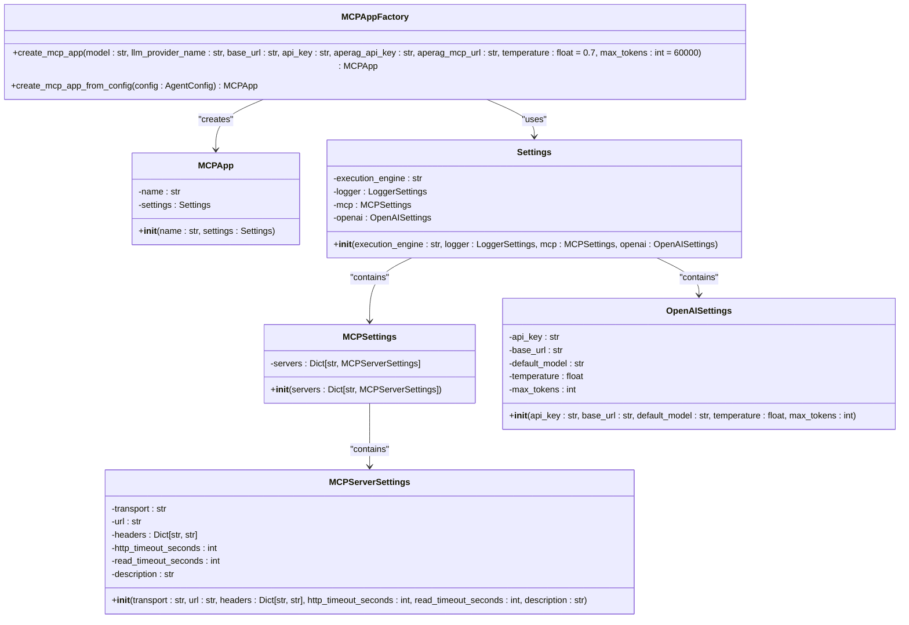
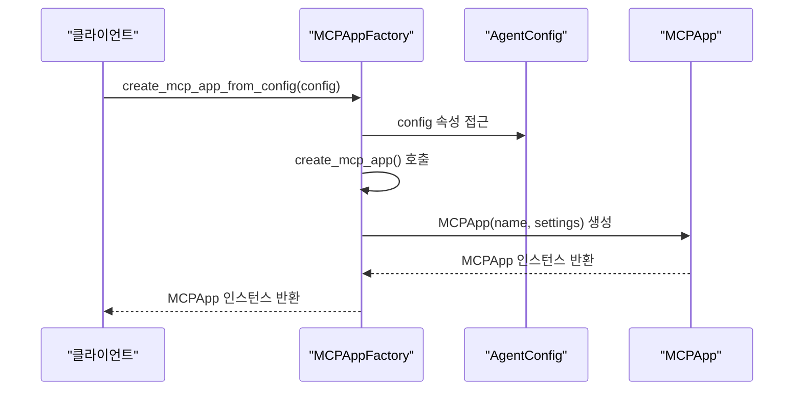
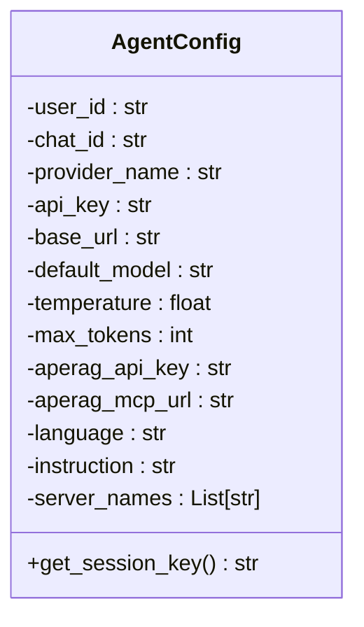
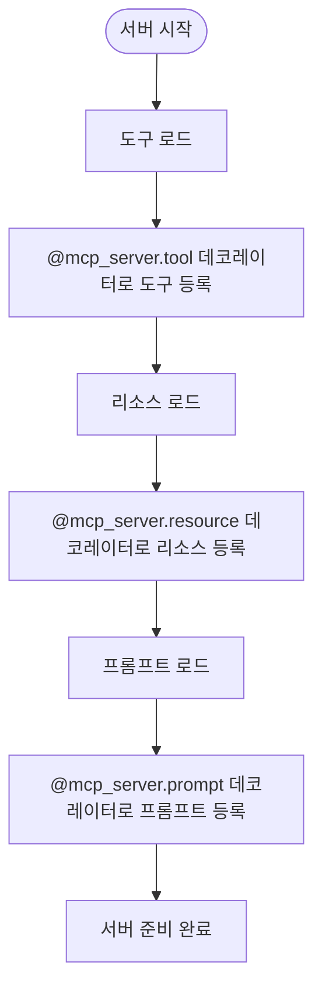

# MCP 도구 등록 및 초기화

<cite>
**이 문서에서 참조된 파일**
- [mcp_app_factory.py](file://aperag/agent/mcp_app_factory.py)
- [server.py](file://aperag/mcp/server.py)
- [agent_config.py](file://aperag/agent/agent_config.py)
</cite>

## 목차
1. [소개](#소개)
2. [핵심 구성 요소 분석](#핵심-구성-요소-분석)
3. [MCP 서버 초기화 아키텍처](#mcp-서버-초기화-아키텍처)
4. [도구 서버 등록 절차](#도구-서버-등록-절차)
5. [도구 메타데이터 로드 및 생명 주기 이벤트](#도구-메타데이터-로드-및-생명-주기-이벤트)
6. [설정 구성 방법](#설정-구성-방법)
7. [다중 도구 서버 관리 패턴](#다중-도구-서버-관리-패턴)
8. [개발자 안내서: 새로운 MCP 도구 등록](#개발자-안내서-새로운-mcp-도구-등록)
9. [흔히 발생하는 오류 및 해결 방안](#흔히-발생하는-오류-및-해결-방안)
10. [결론](#결론)

## 소개
이 문서는 ApeRAG 시스템 내에서 MCP(Multi-Client Protocol) 도구 서버의 등록 및 초기화 과정을 심층적으로 설명합니다. `mcp_app_factory.py` 모듈의 `create_mcp_server_app` 함수가 어떻게 외부 도구 서버를 FastAPI 애플리케이션에 마운트하고, 각 도구의 메타데이터를 로드하며, 생명 주기 이벤트를 설정하는지에 대한 기술적 세부 사항을 다룹니다. 또한 도구 서버의 URL, 인증 정보, 타임아웃 설정 등의 구성 방법과 여러 도구 서버를 동시에 관리하는 아키텍처 패턴을 문서화합니다.

## 핵심 구성 요소 분석

### MCPAppFactory 클래스
`MCPAppFactory` 클래스는 MCP 애플리케이션 인스턴스를 생성하는 공장 역할을 합니다. 이 클래스는 두 가지 정적 메서드를 제공하여 다양한 입력 방식으로 MCP 앱을 생성할 수 있도록 합니다.

#### create_mcp_app 메서드
`create_mcp_app` 메서드는 개별 매개변수를 직접 받아 MCP 앱을 생성합니다. 이 메서드는 필수 매개변수의 유효성을 검사한 후, `Settings` 객체를 구성하여 `MCPApp` 인스턴스를 생성합니다. 설정에는 실행 엔진, 로거, MCP 서버 설정, OpenAI 설정 등이 포함됩니다.



**Diagram sources**
- [mcp_app_factory.py](file://aperag/agent/mcp_app_factory.py#L29-L89)

**Section sources**
- [mcp_app_factory.py](file://aperag/agent/mcp_app_factory.py#L29-L89)

#### create_mcp_app_from_config 메서드
`create_mcp_app_from_config` 메서드는 `AgentConfig` 객체를 매개변수로 받아 `create_mcp_app` 메서드를 호출하여 MCP 앱을 생성합니다. 이 접근 방식은 구성 정보를 중앙 집중화하여 관리할 수 있게 해줍니다.



**Diagram sources**
- [mcp_app_factory.py](file://aperag/agent/mcp_app_factory.py#L92-L103)

**Section sources**
- [mcp_app_factory.py](file://aperag/agent/mcp_app_factory.py#L92-L103)

### AgentConfig 클래스
`AgentConfig` 클래스는 에이전트 세션 생성을 위한 구성 정보를 담고 있습니다. 데이터클래스(dataclass)로 구현되어 있으며, LLM 설정, MCP 구성, 에이전트 행동 구성 등을 포함합니다.



**Diagram sources**
- [agent_config.py](file://aperag/agent/agent_config.py#L21-L52)

**Section sources**
- [agent_config.py](file://aperag/agent/agent_config.py#L21-L52)

## MCP 서버 초기화 아키텍처

### FastMCP 서버 초기화
MCP 서버는 `fastmcp` 라이브러리를 사용하여 초기화됩니다. `mcp_server` 변수는 `FastMCP` 클래스의 인스턴스로, "ApeRAG"라는 이름으로 생성됩니다. 이 서버 인스턴스는 이후 도구(tool), 리소스(resource), 프롬프트(prompt)를 등록하는 데 사용됩니다.

```mermaid
graph TD
A[FastMCP("ApeRAG")] --> B[mcp_server]
B --> C[list_collections 도구 등록]
B --> D[search_collection 도구 등록]
B --> E[search_chat_files 도구 등록]
B --> F[web_search 도구 등록]
B --> G[web_read 도구 등록]
B --> H[aperag_usage_guide 리소스 등록]
B --> I[search_assistant 프롬프트 등록]
```

**Diagram sources**
- [server.py](file://aperag/mcp/server.py#L28-L28)

**Section sources**
- [server.py](file://aperag/mcp/server.py#L28-L28)

## 도구 서버 등록 절차

### 도구 등록 메커니즘
MCP 서버는 데코레이터 기반의 도구 등록 메커니즘을 사용합니다. `@mcp_server.tool` 데코레이터를 사용하여 비동기 함수를 도구로 등록합니다. 등록된 도구는 클라이언트에서 호출할 수 있는 API 엔드포인트로 변환됩니다.

```python
@mcp_server.tool
async def list_collections() -> Dict[str, Any]:
    # 도구 구현
    pass
```

### 등록된 도구 목록
현재 등록된 주요 도구들은 다음과 같습니다:

| 도구 이름 | 설명 | 주요 매개변수 |
|---------|------|-------------|
| **list_collections** | 사용 가능한 모든 컬렉션 목록을 반환 | 없음 |
| **search_collection** | 특정 컬렉션 내에서 지식 검색 수행 | collection_id, query, 검색 유형 플래그 |
| **search_chat_files** | 채팅 파일 내에서 지식 검색 수행 | chat_id, query, 검색 유형 플래그 |
| **web_search** | 다양한 검색 엔진을 사용한 웹 검색 수행 | query, max_results, locale, source |
| **web_read** | 웹 페이지에서 콘텐츠 읽기 및 추출 | url_list, timeout, max_concurrent |

**Section sources**
- [server.py](file://aperag/mcp/server.py#L35-L421)

## 도구 메타데이터 로드 및 생명 주기 이벤트

### 메타데이터 로드
각 도구는 함수 문서 문자열(docstring)을 통해 풍부한 메타데이터를 제공합니다. 이 메타데이터는 도구의 목적, 매개변수 설명, 반환 형식, 사용 예제 등을 포함합니다. 특히 `search_collection` 도구는 복잡한 검색 결과 모델(`SearchResult`)을 설명하는 상세한 메타데이터를 포함하고 있습니다.

### 생명 주기 이벤트
MCP 서버는 리소스와 프롬프트를 통해 생명 주기 이벤트를 처리합니다. `aperag_usage_guide` 리소스는 ApeRAG 검색 가이드를 제공하며, `search_assistant` 프롬프트는 효과적인 검색을 위한 도움말을 제공합니다. 이러한 리소스와 프롬프트는 서버 시작 시 자동으로 로드되며, 클라이언트가 필요할 때 언제든지 접근할 수 있습니다.



**Diagram sources**
- [server.py](file://aperag/mcp/server.py#L426-L660)

**Section sources**
- [server.py](file://aperag/mcp/server.py#L426-L660)

## 설정 구성 방법

### 도구 서버 URL 구성
도구 서버의 URL은 `MCPServerSettings` 객체의 `url` 속성을 통해 구성됩니다. 이 값은 `aperag_mcp_url` 매개변수를 통해 전달되며, 일반적으로 `http://localhost:8000`과 같은 내부 API 기본 URL을 가리킵니다.

### 인증 정보 구성
인증 정보는 두 가지 방식으로 구성됩니다:
1. **HTTP Authorization 헤더**: `Authorization: Bearer <token>` 형식으로 요청 헤더에 포함
2. **환경 변수**: `APERAG_API_KEY` 환경 변수에 API 키 저장

인증 정보는 우선순위에 따라 확인되며, HTTP 헤더가 먼저 시도되고, 실패하면 환경 변수를 확인합니다.

### 타임아웃 설정
다양한 작업에 대해 적절한 타임아웃이 설정되어 있습니다:
- **HTTP 타임아웃**: 30초 (일반적인 요청)
- **읽기 타임아웃**: 120초 (시간이 오래 걸리는 그래프 검색 등)
- **웹 검색 타임아웃**: 90초
- **웹 콘텐츠 읽기 타임아웃**: 60초

이러한 타임아웃 설정은 `MCPServerSettings` 객체의 `http_timeout_seconds` 및 `read_timeout_seconds` 속성과 각 도구 내부의 `httpx.AsyncClient` 생성 시에 명시됩니다.

**Section sources**
- [mcp_app_factory.py](file://aperag/agent/mcp_app_factory.py#L29-L89)
- [server.py](file://aperag/mcp/server.py#L663-L704)

## 다중 도구 서버 관리 패턴

### 서버 등록 아키텍처
`MCPSettings` 객체는 `servers` 딕셔너리를 통해 다중 도구 서버를 관리할 수 있는 구조를 제공합니다. 현재 코드에서는 "aperag"라는 단일 서버만 등록되어 있지만, 이 구조는 쉽게 확장하여 여러 도구 서버를 동시에 관리할 수 있습니다.

```python
mcp=MCPSettings(
    servers={
        "aperag": MCPServerSettings(...),
        "external_tool_1": MCPServerSettings(...),
        "external_tool_2": MCPServerSettings(...)
    }
)
```

### 확장 가능성
이 아키텍처 패턴은 다음과 같은 장점을 제공합니다:
- **모듈성**: 각 도구 서버는 독립적으로 구성되고 관리될 수 있음
- **유연성**: 새로운 도구 서버를 추가하거나 기존 서버를 수정하기 쉬움
- **확장성**: 시스템 요구사항에 따라 도구 서버를 쉽게 확장 가능
- **격리성**: 각 도구 서버의 설정과 동작이 서로 영향을 미치지 않음

**Section sources**
- [mcp_app_factory.py](file://aperag/agent/mcp_app_factory.py#L29-L89)

## 개발자 안내서: 새로운 MCP 도구 등록

### 단계별 등록 절차
새로운 MCP 도구를 등록하려면 다음 단계를 따르세요:

1. **도구 함수 작성**: 비동기 함수로 도구의 핵심 로직을 구현합니다.
2. **데코레이터 적용**: `@mcp_server.tool` 데코레이터를 함수 위에 추가합니다.
3. **매개변수 정의**: 필요한 매개변수를 명확하게 정의하고 타입 힌트를 제공합니다.
4. **문서 문자열 작성**: 도구의 목적, 매개변수 설명, 반환 형식, 사용 예제 등을 포함한 상세한 문서 문자열을 작성합니다.
5. **에러 처리 구현**: 예외 상황에 대한 적절한 에러 처리 로직을 구현합니다.
6. **테스트**: 도구가 올바르게 작동하는지 테스트합니다.

### 예제: 새로운 도구 등록
```python
@mcp_server.tool
async def new_tool_example(
    parameter1: str,
    parameter2: int = 10
) -> Dict[str, Any]:
    """
    새로운 도구의 예제 구현.

    Args:
        parameter1: 첫 번째 매개변수의 설명
        parameter2: 두 번째 매개변수의 설명 (기본값: 10)

    Returns:
        처리 결과를 포함한 딕셔너리

    Example:
        result = new_tool_example("example", 5)
    """
    try:
        # 도구 로직 구현
        api_key = get_api_key()
        # ... 추가 로직
        return {"result": "success"}
    except ValueError as e:
        return {"error": str(e)}
```

**Section sources**
- [server.py](file://aperag/mcp/server.py#L35-L421)

## 흔히 발생하는 오류 및 해결 방안

### API 키 누락 오류
**현상**: `ValueError: API key not found` 오류 발생
**원인**: HTTP Authorization 헤더나 APERAG_API_KEY 환경 변수에 API 키가 설정되지 않음
**해결 방안**:
1. HTTP 요청에 `Authorization: Bearer <your-api-key>` 헤더를 포함
2. 또는 `APERAG_API_KEY` 환경 변수에 API 키를 설정

### 도구 파라미터 유효성 검사 오류
**현상**: `agent_config_invalid` 예외 발생
**원인**: `create_mcp_app` 함수에 필수 매개변수가 누락되었거나 빈 값이 전달됨
**해결 방안**:
1. `model`, `llm_provider_name`, `base_url`, `api_key`, `aperag_api_key`, `aperag_mcp_url` 매개변수가 모두 제공되었는지 확인
2. 각 매개변수에 유효한 값을 할당했는지 확인

### HTTP 연결 오류
**현상**: HTTP 상태 코드 4xx 또는 5xx 반환
**원인**: 내부 API 서버에 연결할 수 없거나, 요청 형식이 잘못됨
**해결 방안**:
1. 내부 API 서버(`http://localhost:8000`)가 실행 중인지 확인
2. 요청 URL과 경로가 올바른지 확인
3. 요청 본문의 JSON 형식이 올바른지 확인

**Section sources**
- [mcp_app_factory.py](file://aperag/agent/mcp_app_factory.py#L29-L89)
- [server.py](file://aperag/mcp/server.py#L663-L704)

## 결론
ApeRAG 시스템의 MCP 도구 등록 및 초기화 과정은 `MCPAppFactory` 클래스와 `FastMCP` 서버 인스턴스를 중심으로 잘 설계된 아키텍처를 따릅니다. 이 시스템은 도구 서버의 유연한 구성, 다중 도구 서버 관리, 풍부한 메타데이터 제공, 그리고 견고한 오류 처리 메커니즘을 통해 강력하고 확장 가능한 도구 통합 플랫폼을 제공합니다. 개발자는 이 문서에 설명된 절차를 따르면 새로운 MCP 도구를 쉽게 등록하고 관리할 수 있습니다.