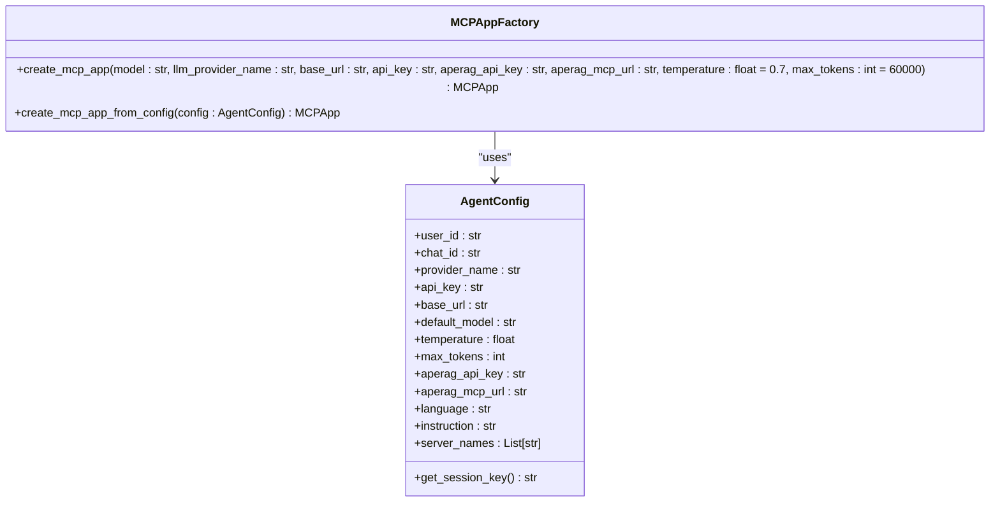
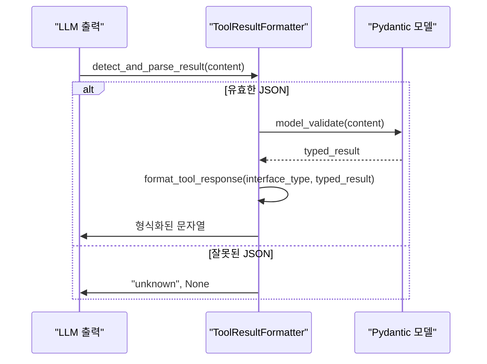
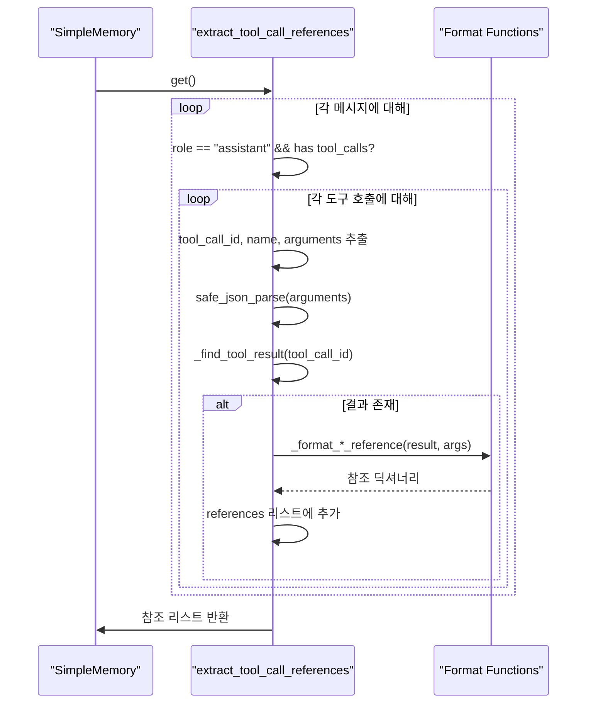

# MCP 도구 통합 및 실행

<cite>
**이 문서에서 참조한 파일**
- [mcp_app_factory.py](file://aperag/agent/mcp_app_factory.py)
- [tool_use_message_formatters.py](file://aperag/agent/tool_use_message_formatters.py)
- [server.py](file://aperag/mcp/server.py)
- [tool_reference_extractor.py](file://aperag/agent/tool_reference_extractor.py)
- [agent_config.py](file://aperag/agent/agent_config.py)
- [view_models.py](file://aperag/schema/view_models.py)
</cite>

## 목차
1. [소개](#소개)
2. [MCP 애플리케이션 생성 및 초기화](#mcp-애플리케이션-생성-및-초기화)
3. [도구 사용 메시지 형식화](#도구-사용-메시지-형식화)
4. [HTTP 엔드포인트 및 요청 처리](#http-엔드포인트-및-요청-처리)
5. [도구 참조 추출 메커니즘](#도구-참조-추출-메커니즘)
6. [오류 처리 및 보안 검사](#오류-처리-및-보안-검사)
7. [새 MCP 도구 추가 절차](#새-mcp-도구-추가-절차)
8. [결론](#결론)

## 소개
Model Context Protocol(MCP)는 ApeRAG 시스템 내에서 외부 도구와의 통합을 가능하게 하는 핵심 메커니즘입니다. 이 문서는 `mcp_app_factory.py`, `tool_use_message_formatters.py`, `server.py`, `tool_reference_extractor.py` 등의 주요 구성 요소를 분석하여 MCP 기반 도구 통합 및 실행 프로세스를 설명합니다. LLM 출력 파싱, 도구 호출 형식 생성, HTTP 엔드포인트를 통한 요청 수신 및 응답 반환, 도구 참조 추출 로직, 오류 처리 전략, 보안 검사, 타임아웃 처리 등에 대해 다룹니다.

## MCP 애플리케이션 생성 및 초기화
`mcp_app_factory.py` 파일은 MCP 애플리케이션 인스턴스를 생성하고 초기화하는 책임을 가진 `MCPAppFactory` 클래스를 포함하고 있습니다. 이 팩토리 클래스는 지정된 매개변수를 사용하여 `MCPApp` 인스턴스를 생성하며, 필요한 경우 예외를 발생시킵니다. `create_mcp_app` 메서드는 모델, LLM 공급자 이름, 기본 URL, API 키, ApeRAG API 키, ApeRAG MCP URL과 같은 필수 매개변수를 검증한 후 `Settings` 객체를 구성합니다. 설정에는 실행 엔진, 로거, MCP 서버 정보(전송 방식, URL, 헤더, 타임아웃), OpenAI 설정(API 키, 기본 모델, 온도, 최대 토큰 수)이 포함됩니다. 이후 `MCPApp` 인스턴스가 생성되어 반환되며, 실패할 경우 적절한 예외가 발생합니다. 또한 `create_mcp_app_from_config` 메서드는 `AgentConfig` 객체를 사용하여 동일한 작업을 수행할 수 있도록 합니다.



**다이어그램 출처**
- [mcp_app_factory.py](file://aperag/agent/mcp_app_factory.py#L25-L103)
- [agent_config.py](file://aperag/agent/agent_config.py#L1-L53)

**섹션 출처**
- [mcp_app_factory.py](file://aperag/agent/mcp_app_factory.py#L25-L103)
- [agent_config.py](file://aperag/agent/agent_config.py#L1-L53)

## 도구 사용 메시지 형식화
`tool_use_message_formatters.py` 파일은 에이전트 이벤트를 위한 도구 호출 포맷터를 제공합니다. 핵심 클래스는 `ToolResultFormatter`이며, 언어 및 컨텍스트 정보를 기반으로 도구 결과를 일관된 방식으로 형식화합니다. `detect_and_parse_result` 메서드는 콘텐츠의 구조를 분석하여 인터페이스 유형(search_collection, web_search 등)을 감지하고, 해당하는 Pydantic 모델(`SearchResult`, `WebSearchResponse` 등)로 검증합니다. `format_tool_response` 메서드는 감지된 인터페이스 유형에 따라 `_format_search_collection`, `_format_web_search` 등의 전용 포맷팅 함수로 라우팅합니다. 이러한 함수들은 각각의 결과 유형에 맞게 실행 내용과 결과를 명확하게 표시합니다. 예를 들어, `_format_search_collection`은 사용된 검색 방법(벡터, 그래프, 전체 텍스트)과 찾은 결과 수를 표시합니다. 또한 `set_context` 메서드를 통해 컬렉션 이름과 같은 컨텍스트 정보를 설정할 수 있습니다.



**다이어그램 출처**
- [tool_use_message_formatters.py](file://aperag/agent/tool_use_message_formatters.py#L29-L416)

**섹션 출처**
- [tool_use_message_formatters.py](file://aperag/agent/tool_use_message_formatters.py#L29-L416)
- [view_models.py](file://aperag/schema/view_models.py#L1-L2559)

## HTTP 엔드포인트 및 요청 처리
`server.py` 파일은 FastMCP를 사용하여 MCP 서버 인스턴스를 초기화하고 다양한 도구를 정의합니다. `@mcp_server.tool` 데코레이터를 사용하여 `list_collections`, `search_collection`, `web_search`, `web_read` 등의 비동기 함수를 도구로 등록합니다. 각 도구 함수는 내부 API 엔드포인트(`/api/v1/collections`, `/api/v1/web/search` 등)에 대한 HTTP POST 또는 GET 요청을 수행합니다. `get_api_key` 함수는 우선 HTTP 요청 헤더에서 `Authorization: Bearer <token>`을 추출하고, 없을 경우 환경 변수 `APERAG_API_KEY`를 확인하여 인증을 처리합니다. 요청은 `httpx.AsyncClient`를 사용하여 보내며, 타임아웃 값은 도구의 특성에 따라 다르게 설정됩니다(예: 검색 작업은 120초). 응답 상태 코드가 성공(200, 201)이면, `model_validate`를 사용하여 `CollectionViewList`, `SearchResult`, `WebSearchResponse` 등의 Pydantic 모델로 응답 본문을 파싱한 후 `model_dump()`를 통해 사전 형태로 변환하여 반환합니다. 오류 발생 시에는 오류 메시지를 담은 사전을 반환합니다.

```mermaid
flowchart TD
A[도구 요청] --> B{get_api_key()}
B --> C["Authorization 헤더 확인"]
C --> |존재| D["Bearer 토큰 추출"]
C --> |미존재| E["환경 변수 APERAG_API_KEY 확인"]
D --> F["API 요청 전송"]
E --> F
F --> G{응답 상태 코드}
G --> |200/201| H["model_validate()로 응답 파싱"]
G --> |오류| I["오류 메시지 반환"]
H --> J["model_dump()로 사전 변환"]
J --> K[도구 응답 반환]
```

**다이어그램 출처**
- [server.py](file://aperag/mcp/server.py#L28-L709)

**섹션 출처**
- [server.py](file://aperag/mcp/server.py#L28-L709)

## 도구 참조 추출 메커니즘
`tool_reference_extractor.py` 파일은 MCP 에이전트의 대화 기록에서 도구 호출 결과를 추출하여 참조 형식으로 변환하는 `extract_tool_call_references` 함수를 제공합니다. 이 함수는 `SimpleMemory` 인스턴스로부터 메시지 기록을 가져옵니다. 각 메시지가 역할(role)이 'assistant'이고 `tool_calls`를 포함하는지 확인한 후, 개별 도구 호출을 반복 처리합니다. 도구 호출 ID, 이름, 인수(arguments)를 추출하고, `safe_json_parse`를 사용하여 인수를 파싱합니다. 그런 다음 `_find_tool_result` 함수를 호출하여 동일한 `tool_call_id`를 가진 'tool' 역할의 결과 메시지를 찾습니다. 발견된 결과는 도구 이름에 따라 `_format_search_reference`, `_format_web_search_reference` 등의 전용 포맷팅 함수로 전달되어 참조 딕셔너리로 변환됩니다. 이 과정에서 JSON 파싱 오류나 기타 예외는 로깅되고 무시되며, 최종적으로 모든 참조가 리스트에 수집되어 반환됩니다.



**다이어그램 출처**
- [tool_reference_extractor.py](file://aperag/agent/tool_reference_extractor.py#L31-L133)

**섹션 출처**
- [tool_reference_extractor.py](file://aperag/agent/tool_reference_extractor.py#L31-L133)

## 오류 처리 및 보안 검사
시스템은 여러 계층에서 오류 처리 및 보안 검사를 구현하고 있습니다. 첫째, `mcp_app_factory.py`에서는 `create_mcp_app` 메서드 내에서 필수 매개변수가 누락되었는지 검증하며, 누락된 경우 `agent_config_invalid` 예외를 발생시킵니다. 둘째, `server.py`의 `get_api_key` 함수는 API 키를 HTTP 헤더 또는 환경 변수에서 안전하게 가져오며, 두 방법 모두 실패하면 `ValueError`를 발생시켜 인증되지 않은 접근을 방지합니다. 셋째, `tool_use_message_formatters.py`의 `detect_and_parse_result`와 `tool_reference_extractor.py`의 `safe_json_parse`는 예외를 포착하여 파싱 오류가 시스템 전체에 영향을 미치지 않도록 합니다. 넷째, `server.py`의 각 도구 함수는 HTTP 응답 상태 코드를 확인하고, 실패한 요청에 대해서는 오류 세부 정보를 포함한 오류 응답을 반환합니다. 마지막으로, 타임아웃은 `httpx.AsyncClient` 생성자에 직접 설정되어 있으며, 긴 작업(예: 그래프 검색)을 위해 더 긴 타임아웃(120초)이 할당됩니다.

**섹션 출처**
- [mcp_app_factory.py](file://aperag/agent/mcp_app_factory.py#L25-L103)
- [server.py](file://aperag/mcp/server.py#L28-L709)
- [tool_use_message_formatters.py](file://aperag/agent/tool_use_message_formatters.py#L29-L416)
- [tool_reference_extractor.py](file://aperag/agent/tool_reference_extractor.py#L31-L133)

## 새 MCP 도구 추가 절차
새로운 MCP 도구를 추가하려면 다음과 같은 절차를 따릅니다. 첫째, `server.py` 파일에서 `@mcp_server.tool` 데코레이터를 사용하여 새로운 비동기 함수를 정의합니다. 이 함수는 도구의 이름과 인수를 명확히 문서화해야 하며, `Args:` 섹션을 통해 각 인수의 의미와 기본값을 설명합니다. 둘째, 함수 내부에서는 `get_api_key()`를 호출하여 인증 토큰을 가져온 후, `httpx.AsyncClient`를 사용하여 내부 API 엔드포인트에 요청을 보냅니다. 요청 본문은 일반적으로 JSON 형식이며, `json=` 매개변수를 통해 전달됩니다. 셋째, 응답을 받은 후에는 상태 코드를 확인하고, 성공적인 응답의 경우 `model_validate`를 사용하여 사전 정의된 Pydantic 모델(예: `view_models.py`에 정의된 모델)로 응답을 파싱한 후 `model_dump()`를 통해 반환합니다. 넷째, 오류 발생 시에는 오류 메시지를 담은 사전을 반환합니다. 다섯째, 필요에 따라 `tool_use_message_formatters.py`에 새로운 포맷팅 함수를 추가하여 LLM에게 친숙한 형식으로 결과를 표시할 수 있습니다. 여섯째, `tool_reference_extractor.py`에 새로운 포맷팅 함수를 추가하여 도구 결과를 참조 형식으로 추출할 수 있도록 합니다.

```python
# server.py에 새 도구 추가 예제
@mcp_server.tool
async def new_custom_tool(
    param1: str,
    param2: int = 10,
) -> Dict[str, Any]:
    """새로운 사용자 정의 도구를 설명합니다.

    Args:
        param1: 첫 번째 매개변수의 설명
        param2: 두 번째 매개변수의 설명 (기본값: 10)

    Returns:
        처리 결과를 담은 사전
    """
    try:
        api_key = get_api_key()
        async with httpx.AsyncClient(timeout=30.0) as client:
            response = await client.post(
                f"{API_BASE_URL}/api/v1/new_endpoint",
                headers={"Authorization": f"Bearer {api_key}"},
                json={"param1": param1, "param2": param2},
            )
            if response.status_code == 200:
                # 응답을 적절한 모델로 파싱
                result = SomeResponseModel.model_validate(response.json())
                return result.model_dump()
            else:
                return {"error": f"Request failed: {response.status_code}", "details": response.text}
    except Exception as e:
        return {"error": str(e)}
```

**섹션 출처**
- [server.py](file://aperag/mcp/server.py#L28-L709)
- [tool_use_message_formatters.py](file://aperag/agent/tool_use_message_formatters.py#L29-L416)
- [tool_reference_extractor.py](file://aperag/agent/tool_reference_extractor.py#L31-L133)

## 결론
ApeRAG의 MCP 도구 통합 메커니즘은 `mcp_app_factory.py`를 통한 애플리케이션 초기화, `server.py`를 통한 HTTP 기반 도구 요청 처리, `tool_use_message_formatters.py`를 통한 결과 형식화, `tool_reference_extractor.py`를 통한 참조 추출이라는 명확한 컴포넌트 간 협업을 통해 작동합니다. 이 아키텍처는 확장성이 뛰어나며, 새로운 도구를 비교적 쉽게 추가할 수 있도록 설계되어 있습니다. 강력한 오류 처리 및 보안 검사 메커니즘은 시스템의 안정성과 신뢰성을 보장합니다. 개발자는 제공된 절차와 예제를 따라 새로운 기능을 MCP 도구로 통합함으로써 시스템의 능력을 확장할 수 있습니다.