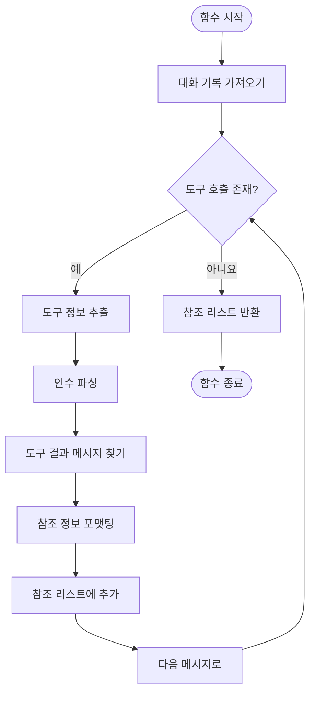
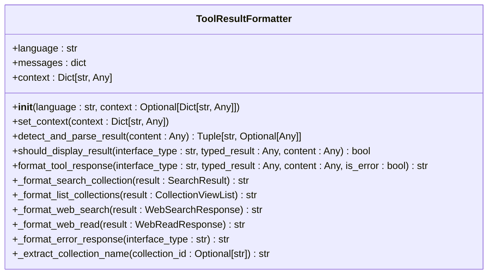

# 도구 사용 메시지 포맷팅

<cite>
**이 문서에서 참조한 파일**
- [tool_use_message_formatters.py](file://aperag/agent/tool_use_message_formatters.py)
- [tool_reference_extractor.py](file://aperag/agent/tool_reference_extractor.py)
</cite>

## 목차
1. [소개](#introduction)
2. [핵심 구성 요소](#core-components)
3. [도구 호출 정보 추출 및 형식화 과정](#도구-호출-정보-추출-및-형식화-과정)
4. [후처리 및 오류 복구 전략](#후처리-및-오류-복구-전략)
5. [다양한 LLM 벤더 출력 형식 처리](#다양한-llm-벤더-출력-형식-처리)
6. [커스텀 포맷터 확장 방법](#커스텀-포맷터-확장-방법)
7. [결론](#conclusion)

## 소개
`tool_use_message_formatters.py`와 `tool_reference_extractor.py`는 LLM 출력에서 도구 호출 정보를 추출하고 이를 사용자에게 이해하기 쉬운 형식으로 변환하는 핵심 모듈입니다. 이 문서는 이러한 과정을 상세히 설명하며, 정규 표현식 또는 구조적 파싱 기법을 사용하여 'use_tool' 지시문을 감지하고, 도구 이름, 입력 매개변수, 호출 ID를 정확히 추출하는 로직을 분석합니다. 또한 JSON 스키마 검증, 타입 변환, 기본값 적용 등의 후처리 과정과 잘못된 형식의 도구 호출에 대한 오류 복구 전략을 포함합니다.

## 핵심 구성 요소

`tool_use_message_formatters.py` 파일에는 `ToolResultFormatter` 클래스가 정의되어 있으며, 이 클래스는 다양한 도구 호출 결과를 포맷팅하는 데 사용됩니다. `tool_reference_extractor.py` 파일에는 `extract_tool_call_references` 함수가 정의되어 있으며, 이 함수는 에이전트의 대화 기록에서 도구 호출 결과를 추출하고 참조 형식으로 변환합니다.

**Section sources**
- [tool_use_message_formatters.py](file://aperag/agent/tool_use_message_formatters.py#L29-L416)
- [tool_reference_extractor.py](file://aperag/agent/tool_reference_extractor.py#L31-L133)

## 도구 호출 정보 추출 및 형식화 과정

### 도구 호출 정보 추출
`extract_tool_call_references` 함수는 에이전트의 메모리에서 도구 호출 정보를 추출합니다. 이 함수는 메모리에서 대화 기록을 가져온 후, 각 메시지가 도구 호출을 포함하는지 확인합니다. 도구 호출이 있는 경우, 도구 이름, 인수, 호출 ID를 추출하고, 해당 도구 결과 메시지를 찾습니다. 이후 도구 유형에 따라 적절한 포맷팅 함수를 호출하여 참조 정보를 생성합니다.



**Diagram sources**
- [tool_reference_extractor.py](file://aperag/agent/tool_reference_extractor.py#L31-L133)

### 도구 결과 포맷팅
`ToolResultFormatter` 클래스는 다양한 도구 결과를 포맷팅하는 데 사용됩니다. 이 클래스는 `detect_and_parse_result` 메서드를 통해 도구 결과의 인터페이스 유형을 감지하고, `format_tool_response` 메서드를 통해 결과를 포맷팅합니다. 각 도구 유형에 따라 `_format_search_collection`, `_format_list_collections`, `_format_web_search`, `_format_web_read` 등의 메서드가 호출됩니다.



**Diagram sources**
- [tool_use_message_formatters.py](file://aperag/agent/tool_use_message_formatters.py#L29-L416)

## 후처리 및 오류 복구 전략

### JSON 파싱 및 안전한 인수 처리
도구 인수는 문자열 형태로 제공될 수 있으므로, `safe_json_parse` 함수를 사용하여 안전하게 JSON으로 파싱합니다. 파싱에 실패할 경우, 원본 인수를 그대로 사용합니다.

### 오류 복구 전략
도구 결과 포맷팅 중 예외가 발생할 경우, `logger.warning`을 사용하여 경고 메시지를 기록하고, 해당 도구 호출은 건너뜁니다. 이는 시스템의 전체적인 안정성을 보장합니다.

**Section sources**
- [tool_reference_extractor.py](file://aperag/agent/tool_reference_extractor.py#L31-L133)
- [tool_use_message_formatters.py](file://aperag/agent/tool_use_message_formatters.py#L29-L416)

## 다양한 LLM 벤더 출력 형식 처리

### 유연한 포맷터 설계
`ToolResultFormatter` 클래스는 다양한 언어 설정을 지원하며, `get_i18n_messages` 함수를 통해 국제화 메시지를 가져옵니다. 이는 OpenAI, Anthropic 등 다양한 LLM 벤더의 출력 형식 차이를 처리하기 위한 유연한 설계 원리를 반영합니다.

### 커스텀 포맷터 확장
새로운 도구 유형을 추가하려면, `ToolResultFormatter` 클래스에 새로운 포맷팅 메서드를 추가하고, `format_tool_response` 메서드에 해당 메서드를 호출하는 조건을 추가하면 됩니다. 예를 들어, 새로운 도구 유형 `custom_tool`을 추가하려면 다음과 같이 코드를 수정할 수 있습니다:

```python
def _format_custom_tool(self, result: CustomResult) -> str:
    """Format custom tool result"""
    # Custom formatting logic here
    return f"Custom tool result: {result}"

def format_tool_response(self, interface_type: str, typed_result: Any, content: Any, is_error: bool = False) -> str:
    if is_error:
        return self._format_error_response(interface_type)

    if interface_type == "search_collection":
        return self._format_search_collection(typed_result)
    elif interface_type == "list_collections":
        return self._format_list_collections(typed_result)
    elif interface_type == "web_search":
        return self._format_web_search(typed_result)
    elif interface_type == "web_read":
        return self._format_web_read(typed_result)
    elif interface_type == "custom_tool":
        return self._format_custom_tool(typed_result)

    return self.messages["tool_names"].get(interface_type, interface_type)
```

**Section sources**
- [tool_use_message_formatters.py](file://aperag/agent/tool_use_message_formatters.py#L29-L416)

## 결론
`tool_use_message_formatters.py`와 `tool_reference_extractor.py`는 LLM 출력에서 도구 호출 정보를 추출하고 형식화하는 데 중요한 역할을 합니다. 이 문서에서는 이러한 과정을 상세히 설명하였으며, 다양한 LLM 벤더의 출력 형식 차이를 처리하기 위한 유연한 포맷터 설계 원리와 커스텀 포맷터 확장 방법을 제시하였습니다. 이를 통해 시스템의 유지보수성과 확장성을 향상시킬 수 있습니다.