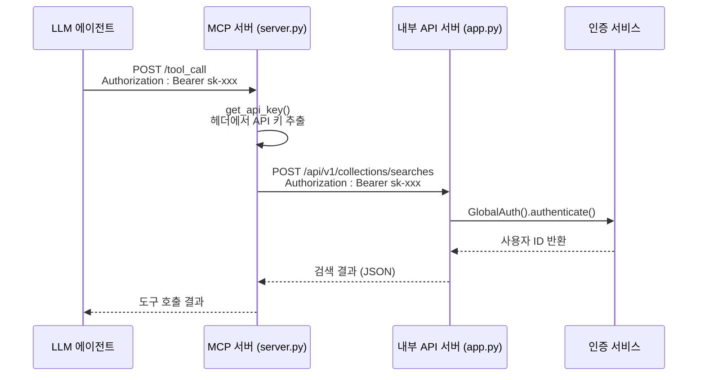
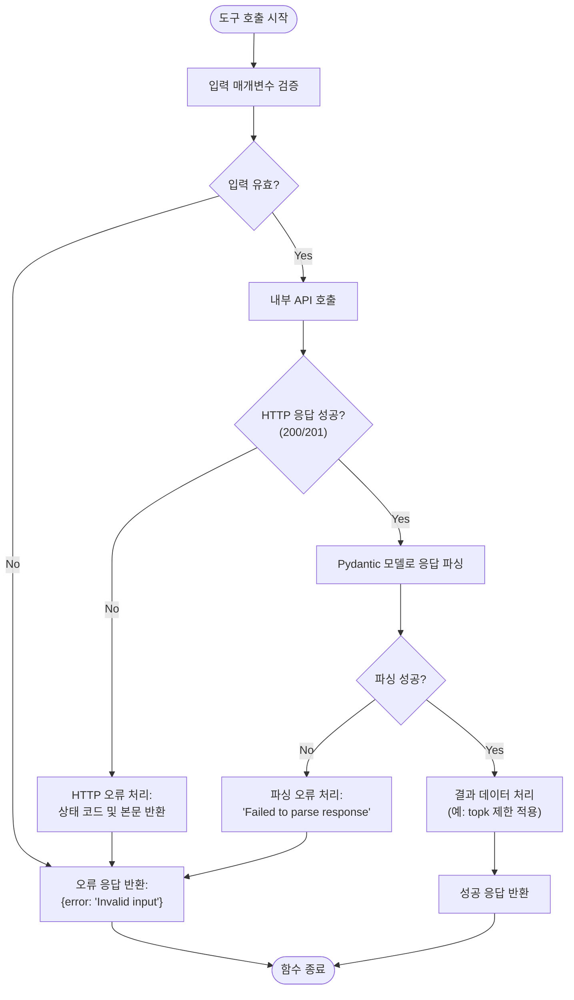

# 도구 실행 엔진 및 HTTP 통신

<cite>
**이 문서에서 참조된 파일**
- [server.py](file://aperag/mcp/server.py)
- [view_models.py](file://aperag/schema/view_models.py)
- [authentication.py](file://aperag/auth/authentication.py)
- [mcp_app_factory.py](file://aperag/agent/mcp_app_factory.py)
</cite>

## 목차
1. [소개](#소개)
2. [핵심 구성 요소](#핵심-구성-요소)
3. [인증 및 보안](#인증-및-보안)
4. [도구 호출 라우팅 메커니즘](#도구-호출-라우팅-메커니즘)
5. [입력 유효성 검사 및 오류 처리](#입력-유효성-검사-및-오류-처리)
6. [외부 도구 서버와의 비동기 통신](#외부-도구-서버와의-비동기-통신)
7. [고급 기능: 타임아웃, 재시도, 스트리밍](#고급-기능-타임아웃-재시도-스트리밍)
8. [성능 모니터링 및 로깅 전략](#성능-모니터링-및-로그링-전략)

## 소개

`server.py`에 구현된 MCP(Machine-to-Machine Communication Protocol) HTTP 서버는 ApeRAG 시스템의 핵심 도구 실행 엔진으로, 내부 서비스와 외부 LLM 에이전트 간의 안정적인 통신을 담당합니다. 이 문서는 해당 서버의 내부 작동 원리를 심층적으로 분석하며, 들어오는 도구 호출 요청의 라우팅 방식, 인증 헤더 검증, 입력 유효성 검사, 그리고 비동기 HTTP 클라이언트를 통한 외부 도구 서버 호출 절차를 설명합니다. 또한 타임아웃 처리, 재시도 정책, 오류 응답 매핑, 스트리밍 응답 지원과 같은 고급 기능을 다루며, 네트워크 지연, 서비스 다운, 인증 실패 등의 장애 상황에서도 견고한(Robust) 동작을 보장하는 설계 선택 사항과 성능 모니터링 및 로깅 전략을 포함합니다.

**Section sources**
- [server.py](file://aperag/mcp/server.py#L1-L709)

## 핵심 구성 요소

MCP 서버의 핵심은 `FastMCP` 프레임워크 위에 구축된 여러 도구 함수들입니다. `mcp_server = FastMCP("ApeRAG")`로 초기화된 서버 인스턴스는 `@mcp_server.tool` 데코레이터를 통해 다양한 도구를 등록합니다. 주요 도구들은 다음과 같습니다:
- **`list_collections`**: 사용자가 접근 가능한 모든 컬렉션 목록을 조회합니다.
- **`search_collection`**: 특정 컬렉션 내에서 벡터, 풀텍스트, 그래프, 요약 검색 등을 활용해 지식을 탐색합니다.
- **`search_chat_files`**: 채팅에 업로드된 파일 내에서 검색을 수행합니다.
- **`web_search`**: 웹 검색 엔진을 통해 정보를 찾습니다.
- **`web_read`**: 웹 페이지의 내용을 추출하여 읽어옵니다.

이러한 각 도구 함수는 비동기(`async`)로 구현되어 있으며, 내부 API 서버(`http://localhost:8000`)에 대한 비동기 HTTP 요청을 수행합니다. 응답 데이터의 형식 일관성을 보장하기 위해 `aperag.schema.view_models` 모듈의 Pydantic 모델(예: `CollectionViewList`, `SearchResult`, `WebSearchResponse`, `WebReadResponse`)을 사용하여 응답을 파싱하고 검증합니다. 이는 타입 안정성(type safety)을 제공하며, 잘못된 형식의 응답이 시스템에 영향을 미치는 것을 방지합니다.

```mermaid
classDiagram
class MCPServer {
+string server_name
+register_tool(tool_func)
+start()
}
class ToolFunction {
<<Abstract>>
+execute(request) Response
}
class list_collections : ToolFunction {
+execute() Dict[str, Any]
}
class search_collection : ToolFunction {
+collection_id : str
+query : str
+use_vector_index : bool
+use_fulltext_index : bool
+use_graph_index : bool
+use_summary_index : bool
+rerank : bool
+topk : int
+execute() Dict[str, Any]
}
class web_search : ToolFunction {
+query : str
+max_results : int
+timeout : int
+source : str
+search_llms_txt : str
+execute() Dict[str, Any]
}
class web_read : ToolFunction {
+url_list : list[str]
+timeout : int
+max_concurrent : int
+execute() Dict[str, Any]
}
class ViewModels {
<<Utility>>
+CollectionViewList
+SearchResult
+WebSearchResponse
+WebReadResponse
}
MCPServer --> ToolFunction : "has"
ToolFunction <|-- list_collections
ToolFunction <|-- search_collection
ToolFunction <|-- web_search
ToolFunction <|-- web_read
list_collections --> ViewModels : "uses"
search_collection --> ViewModels : "uses"
web_search --> ViewModels : "uses"
web_read --> ViewModels : "uses"
```

**Diagram sources**
- [server.py](file://aperag/mcp/server.py#L28-L709)
- [view_models.py](file://aperag/schema/view_models.py#L710-L2317)

**Section sources**
- [server.py](file://aperag/mcp/server.py#L28-L709)
- [view_models.py](file://aperag/schema/view_models.py#L710-L2317)

## 인증 및 보안

MCP 서버는 두 가지 방법으로 API 키를 획득하여 인증을 수행합니다. 첫 번째로 우선순위가 높은 방법은 HTTP 요청 헤더에서 `Authorization: Bearer <api_key>` 형식의 토큰을 추출하는 것입니다. 두 번째 방법은 환경 변수 `APERAG_API_KEY`에서 API 키를 가져오는 것으로, 헤더 인증이 실패했을 때 대체 수단으로 사용됩니다. 이 인증 로직은 `get_api_key()` 함수에 캡슐화되어 있으며, 모든 도구 함수에서 공통으로 호출됩니다.

내부 API 호출 시에는 획득한 API 키를 다시 `Authorization` 헤더에 포함시켜 전달함으로써, 내부 서비스(`app.py` 기반)의 `GlobalAuth` 클래스에 의해 인증을 받습니다. `GlobalAuth`는 API 키, JWT, 세션 등 다양한 인증 방법을 우선순위에 따라 처리하며, 최종적으로 유효한 사용자 ID를 요청 객체에 설정합니다. 이 계층적 인증 구조는 외부 LLM 에이전트와 내부 서비스 간의 보안 연결을 유지하면서도 유연한 인증 옵션을 제공합니다.



**Diagram sources**
- [server.py](file://aperag/mcp/server.py#L680-L709)
- [authentication.py](file://aperag/auth/authentication.py#L1-L272)

**Section sources**
- [server.py](file://aperag/mcp/server.py#L680-L709)
- [authentication.py](file://aperag/auth/authentication.py#L1-L272)

## 도구 호출 라우팅 메커니즘

도구 호출 라우팅은 `FastMCP` 프레임워크의 내장 메커니즘에 의해 자동으로 처리됩니다. `@mcp_server.tool` 데코레이터가 적용된 함수들은 모두 `mcp_server` 인스턴스의 도구 레지스트리에 등록됩니다. LLM 에이전트가 도구 호출을 요청하면, MCP 서버는 요청 본문에서 지정된 도구 이름(예: `search_collection`)을 기반으로 레지스트리에서 해당 함수를 찾아냅니다. 이후, 요청에 포함된 인수들을 파싱하여 해당 도구 함수에 전달합니다. 이 과정에서 `FastMCP`는 인수의 타입과 기본값을 자동으로 처리하며, 개발자는 순수한 비즈니스 로직에 집중할 수 있습니다. 라우팅 후, 선택된 도구 함수가 비동기적으로 실행되며, 그 결과가 JSON 형식으로 클라이언트에 반환됩니다.

**Section sources**
- [server.py](file://aperag/mcp/server.py#L28-L709)

## 입력 유효성 검사 및 오류 처리

MCP 서버는 강력한 입력 유효성 검사와 오류 처리 메커니즘을 갖추고 있습니다. 먼저, 도구 함수의 매개변수는 Python의 타입 힌트(Type Hints)를 통해 명시되며, `FastMCP` 프레임워크가 이를 기반으로 기본적인 유효성 검사를 수행합니다. 예를 들어, `web_read` 함수의 `url_list` 매개변수는 반드시 리스트 형태여야 하며, 빈 리스트나 URL이 없는 경우는 허용되지 않습니다. 코드 내에서는 `if not url_list or len(url_list) == 0:` 조건문을 통해 이러한 무효한 입력을 명시적으로 검사하고, 적절한 오류 응답을 반환합니다.

또한, 내부 API로부터의 응답도 검증됩니다. `try-except` 블록을 사용하여 HTTP 응답 상태 코드가 200 또는 201이 아닌 경우(예: 4xx, 5xx), 실패한 이유를 포함한 오류 응답을 생성합니다. 또한, 응답 본문을 `model_validate()` 메서드를 사용해 Pydantic 모델로 파싱하려고 시도하며, 파싱에 실패하면 예외를 포착하여 `"Failed to parse ... response"`라는 구조화된 오류 메시지를 반환합니다. 이는 상위 계층(LMM 에이전트)이 오류의 근본 원인을 이해하고 적절히 대응할 수 있도록 합니다.



**Diagram sources**
- [server.py](file://aperag/mcp/server.py#L100-L709)

**Section sources**
- [server.py](file://aperag/mcp/server.py#L100-L709)

## 외부 도구 서버와의 비동기 통신

모든 내부 API 호출은 `httpx.AsyncClient`를 사용하여 비동기적으로 수행됩니다. 이는 단일 스레드에서 많은 I/O 작업을 효율적으로 처리할 수 있게 하여, 동시성(concurrency)을 극대화하고 리소스 사용을 최적화합니다. 각 도구 함수는 자체적인 타임아웃 값을 설정합니다. 예를 들어, 일반적인 `list_collections` 호출은 30초의 타임아웃을 가지지만, 그래프 검색과 같이 시간이 오래 걸릴 수 있는 `search_collection`이나 `web_search` 작업은 각각 120초와 90초의 더 긴 타임아웃을 부여받습니다. 이는 장시간 실행되는 작업이 불필요하게 중단되는 것을 방지합니다.

통신은 `API_BASE_URL = "http://localhost:8000"`을 통해 로컬 호스트의 내부 API 게이트웨이로 이루어지며, 이는 마이크로서비스 아키텍처에서의 안정적인 내부 통신을 가능하게 합니다. `aperag_agent.mcp_app_factory` 모듈에서 볼 수 있듯이, 외부 LLM 에이전트 역시 `streamable_http` 트랜스포트를 사용하여 이 MCP 서버에 연결하며, 이때도 `read_timeout_seconds=120`과 같은 긴 읽기 타임아웃이 설정되어 있어, 긴 응답이나 스트리밍 응답을 안정적으로 처리할 수 있습니다.

**Section sources**
- [server.py](file://aperag/mcp/server.py#L100-L709)
- [mcp_app_factory.py](file://aperag/agent/mcp_app_factory.py#L1-L104)

## 고급 기능: 타임아웃, 재시도, 스트리밍

### 타임아웃 및 재시도
현재 코드베이스에서는 `httpx.AsyncClient`의 `timeout` 매개변수를 통해 타임아웃이 직접적으로 관리되고 있지만, 명시적인 재시도 정책(retry policy)은 구현되어 있지 않습니다. `httpx` 클라이언트는 기본적으로 재시도를 수행하지 않으며, 이는 개발자가 직접 `tenacity` 또는 `backoff`와 같은 외부 라이브러리를 사용하거나, `httpx`의 `RetryTransport`를 구성해야 함을 의미합니다. 그러나 현재 구현에서는 이러한 재시도 로직이 포함되어 있지 않으므로, 일시적인 네트워크 문제로 인해 요청이 실패하면 즉시 오류가 반환됩니다. 이는 시스템의 견고성을 저하시킬 수 있는 잠재적인 단점입니다.

### 오류 응답 매핑
서버는 다양한 오류 상황을 명확하게 구분하여 매핑합니다. HTTP 4xx 오류는 일반적으로 클라이언트 측 오류(잘못된 요청, 권한 없음)를 나타내며, 5xx 오류는 서버 측 오류(내부 서버 오류, 서비스 이용 불가)를 나타냅니다. 코드에서는 5xx 오류를 `"Search failed: {response.status_code}"`와 같은 메시지로 캡처하여, 상위 계층이 이를 transient error(일시적 오류)로 간주하고 재시도를 결정할 수 있도록 정보를 제공합니다.

### 스트리밍 응답 지원
제공된 코드에서는 직접적인 스트리밍 응답 구현이 확인되지 않습니다. `FastMCP` 프레임워크가 스트리밍을 지원할 가능성은 있지만, 현재 `server.py`의 도구 함수들은 전체 결과를 수집한 후 한 번에 반환하는 동기식 패턴을 따르고 있습니다. 예를 들어, `web_read` 함수는 여러 URL을 동시에 처리할 수 있지만, 모든 읽기 작업이 완료된 후에야 `WebReadResponse` 객체를 반환합니다. 진정한 실시간 스트리밍을 위해서는 `yield` 키워드를 사용하거나, SSE(Server-Sent Events)와 같은 프로토콜을 도입하여 부분 결과를 점진적으로 전송하는 것이 필요합니다.

**Section sources**
- [server.py](file://aperag/mcp/server.py#L100-L709)

## 성능 모니터링 및 로깅 전략

시스템의 가시성과 디버깅을 위해 광범위한 로깅이 구현되어 있습니다. `logging.getLogger(__name__)`을 사용하여 모듈별 로거가 생성되며, 중요한 이벤트들이 기록됩니다. 예를 들어, `get_api_key()` 함수는 API 키가 헤더 또는 환경 변수에서 성공적으로 발견되었을 때 `logger.info()`를 통해 그 사실을 기록합니다. 반면, 인증 실패나 응답 파싱 실패와 같은 예외적인 상황은 `logger.error()`를 사용하여 오류 수준으로 기록됩니다. 이는 운영 환경에서 문제를 진단하고 감사(audit) 요구사항을 충족시키는 데 필수적입니다.

성능 모니터링 측면에서, 일부 응답 모델(예: `WebReadResponse`)은 `processing_time`과 같은 처리 시간 메트릭을 포함하고 있어, 백엔드에서 성능을 측정할 수 있는 가능성을 제공합니다. 그러나 현재 코드에서는 이러한 메트릭을 외부 모니터링 시스템(Prometheus, Grafana 등)으로 노출시키는 명시적인 메커니즘이 없습니다. 향후 개선을 통해 이러한 지표를 수집하고 시각화함으로써, 시스템의 건강 상태와 병목 지점을 실시간으로 모니터링할 수 있을 것입니다.

**Section sources**
- [server.py](file://aperag/mcp/server.py#L1-L709)
- [authentication.py](file://aperag/auth/authentication.py#L1-L272)