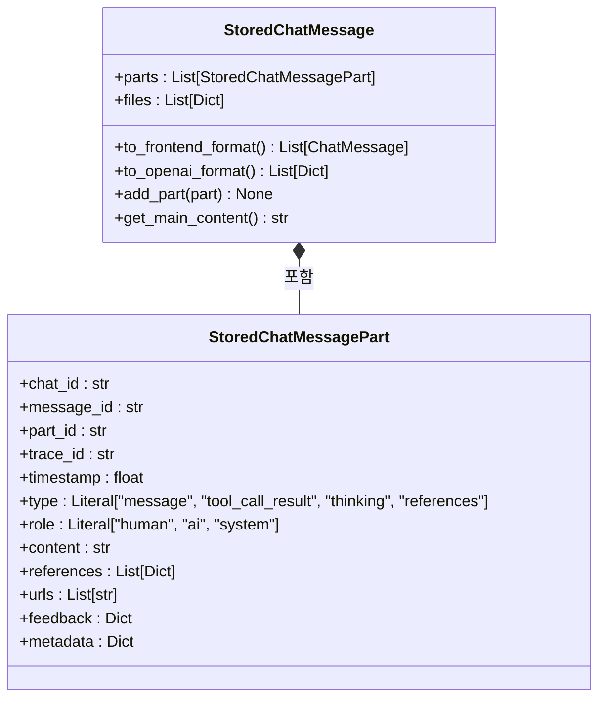
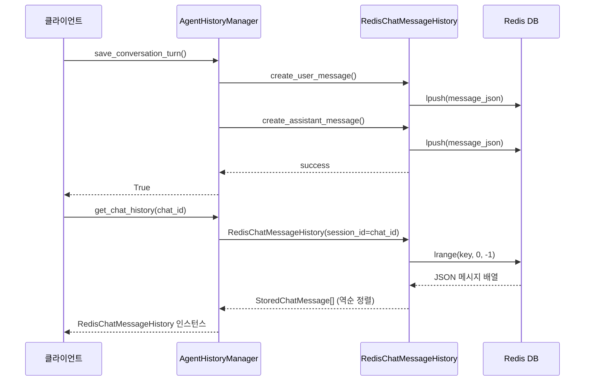

# 대화 이력 관리

<cite>
**이 문서에서 참조한 파일**  
- [agent_history_manager.py](file://aperag/agent/agent_history_manager.py)
- [message.py](file://aperag/chat/history/message.py)
- [history.py](file://aperag/utils/history.py)
- [agent_memory_manager.py](file://aperag/agent/agent_memory_manager.py)
</cite>

## 목차
1. [소개](#소개)  
2. [메시지 직렬화 및 메타데이터 구조](#메시지-직렬화-및-메타데이터-구조)  
3. [대화 이력 저장 및 검색 아키텍처](#대화-이력-저장-및-검색-아키텍처)  
4. [메모리 시스템과의 통합](#메모리-시스템과의-통합)  
5. [쿼리 패턴 및 필터링 기능](#쿼리-패턴-및-필터링-기능)  
6. [생성, 삭제, 내보내기 작업](#생성-삭제-내보내기-작업)  
7. [데이터 프라이버시 및 보존 정책](#데이터-프라이버시-및-보존-정책)  
8. [감사 로깅 및 문제 해결](#감사-로깅-및-문제-해결)  

## 소개
ApeRAG의 **대화 이력 관리** 서브시스템은 사용자와 에이전트 간의 지속적인 상호작용을 안정적으로 저장하고 검색하는 핵심 기능을 제공합니다. 이 시스템은 `agent_history_manager.py`와 `message.py` 모듈을 중심으로 구성되며, Redis를 기반으로 한 고성능 비휘발성 저장소를 활용하여 실시간 채팅 세션의 지속성을 보장합니다. 본 문서는 메시지 직렬화 형식, 메타데이터 추적, 인덱싱 전략, 메모리 통합, 데이터 프라이버시 등 주요 구현 요소를 심층적으로 설명합니다.

## 메시지 직렬화 및 메타데이터 구조
대화 메시지는 계층적 구조로 설계되어 다양한 유형의 정보를 포괄적으로 저장합니다.

### 메시지 구성 요소


**Diagram sources**  
- [message.py](file://aperag/chat/history/message.py#L1-L255)

**Section sources**  
- [message.py](file://aperag/chat/history/message.py#L1-L255)

#### 핵심 메타데이터 필드
- **`chat_id`**: 채팅 세션 식별자
- **`message_id`**: 메시지 단위 식별자 (사용자 질의 → AI 응답 쌍)
- **`part_id`**: 각 메시지 조각의 고유 ID (UUID 기반)
- **`trace_id`**: 분산 추적을 위한 ID
- **`timestamp`**: 생성 시간 (Unix 타임스탬프)
- **`role`**: 발신자 역할 ("human", "ai", "system")
- **`type`**: 내용 유형 ("message", "thinking", "tool_call_result", "references")

#### 확장 속성
- **`references`**: 도구 호출 결과 또는 문서 참조
- **`urls`**: 외부 링크 목록
- **`feedback`**: 사용자 피드백 데이터
- **`metadata`**: 커스텀 메타데이터 저장소
- **`files`**: 첨부된 문서 파일 목록

## 대화 이력 저장 및 검색 아키텍처
이력 관리는 Redis 기반의 키-값 저장소를 사용하며, 높은 성능과 낮은 지연 시간을 제공합니다.



**Diagram sources**  
- [agent_history_manager.py](file://aperag/agent/agent_history_manager.py#L39-L117)
- [history.py](file://aperag/utils/history.py#L120-L212)

**Section sources**  
- [agent_history_manager.py](file://aperag/agent/agent_history_manager.py#L39-L117)
- [history.py](file://aperag/utils/history.py#L120-L212)

### 저장소 스키마
- **키 형식**: `message_store:{chat_id}`
- **값 형식**: JSON 직렬화된 `StoredChatMessage`
- **구조**: 리스트 (List) — 최신 메시지가 앞에 위치 (`lpush`)
- **TTL**: 설정 가능 (옵션)
- **인코딩**: UTF-8

### 직렬화/역직렬화 흐름
1. `StoredChatMessage` → `model_dump()` → Python dict
2. `json.dumps()` → JSON 문자열
3. Redis `lpush`로 저장
4. 조회 시 `json.loads()` → `storage_dict_to_message()` → `StoredChatMessage`

## 메모리 시스템과의 통합
대화 이력은 LLM 처리를 위한 컨텍스트 메모리로 변환되어 사용됩니다.

```mermaid
flowchart TD
A[RedisChatMessageHistory] --> B{messages 속성}
B --> C[StoredChatMessage[]]
C --> D[create_memory_from_history()]
D --> E[SimpleMemory]
E --> F[LLM Context Window]
G[build_context_summary()] --> H[String Summary]
H --> I[Prompt Injection]
```

**Diagram sources**  
- [agent_memory_manager.py](file://aperag/agent/agent_memory_manager.py#L40-L139)
- [history.py](file://aperag/utils/history.py#L152-L164)

**Section sources**  
- [agent_memory_manager.py](file://aperag/agent/agent_memory_manager.py#L40-L139)

### 메모리 생성 과정
1. `AgentMemoryManager.create_memory_from_history()` 호출
2. `history.messages`로 최근 메시지 가져오기
3. `context_limit` 기준으로 최신 N턴만 선택 (기본값: 4턴 = 8개 메시지)
4. `convert_to_openai_messages()`로 OpenAI 형식 변환
5. `SimpleMemory` 객체에 추가

### 컨텍스트 요약 생성
- `build_context_summary()` 메서드 사용
- 최근 `limit` 개 메시지만 요약
- 역할과 내용을 결합한 문자열 생성
- 프롬프트 삽입용으로 사용

## 쿼리 패턴 및 필터링 기능
이력 데이터는 다양한 방식으로 조회 및 필터링할 수 있습니다.

### 기본 쿼리 흐름
```python
async def query_chat_messages(user: str, chat_id: str):
    # Redis에서 전체 이력 조회
    stored_messages = await chat_history.messages
    
    # DB에서 피드백 조회
    feedbacks = await async_db_ops.query_chat_feedbacks(user, chat_id)
    
    # 프론트엔드 형식으로 변환
    for message in stored_messages:
        frontend_parts = message.to_frontend_format()
        
    return conversation_turns
```

**Section sources**  
- [history.py](file://aperag/utils/history.py#L215-L259)

### 지원 필터링 옵션
| 필터 유형 | 구현 방식 | 예시 |
|---------|--------|------|
| **날짜 기반** | timestamp 범위 쿼리 | 최근 7일 이력 |
| **참여자 기반** | role 필터링 | 사용자 메시지만 추출 |
| **콘텐츠 유형** | type 필터링 | thinking 단계만 조회 |
| **도구 호출** | references 존재 여부 | 도구 사용 포함 메시지 |

### 페이지네이션
- Redis `lrange` 명령어로 오프셋/카운트 기반 페이징 가능
- 기본적으로 전체 이력 반환 후 클라이언트에서 분할 처리

## 생성, 삭제, 내보내기 작업
### 이력 생성
- `save_conversation_turn()`을 통해 사용자 질의와 AI 응답 한 쌍 저장
- 각각 `create_user_message()`와 `create_assistant_message()`로 생성
- `add_stored_message()`로 Redis에 동시 저장

### 이력 삭제
- **완전 삭제**: `RedisChatMessageHistory.clear()` → Redis 키 삭제
- **소프트 삭제**: 현재 미지원 (향후 확장 가능성 있음)

### 이력 내보내기
- `query_chat_messages()`로 전체 이력 조회
- JSON 형식으로 클라이언트 전달
- 프론트엔드에서 CSV/PDF 등으로 변환 가능

**Section sources**  
- [agent_history_manager.py](file://aperag/agent/agent_history_manager.py#L61-L117)
- [history.py](file://aperag/utils/history.py#L207-L209)

## 데이터 프라이버시 및 보존 정책
### 데이터 보안
- 모든 메시지는 암호화되지 않은 상태로 저장됨 (Redis 자체 암호화 필요)
- 민감 정보는 `metadata` 필드에 별도 저장 권장
- `trace_id`는 감사 로그와 연동되어 추적 가능

### 보존 정책
- TTL(Time-To-Live) 설정 가능
- 기본값 없음 (영구 저장)
- 수동 삭제 또는 배치 정책으로 관리

### 소프트 삭제
- 현재 구현되지 않음
- 향후 `deleted_at` 타임스탬프 필드 추가 가능
- 감사 로그에 삭제 이벤트 기록

## 감사 로깅 및 문제 해결
### 감사 로깅 통합
- `trace_id`를 통해 분산 추적 시스템과 연동
- `logger.debug()`를 통해 주요 작업 로깅
- 오류 발생 시 `logger.error()`로 기록

### 일반적인 문제 및 해결 방법
| 문제 | 원인 | 해결책 |
|-----|-----|-------|
| **이력 누락** | Redis 연결 실패 | `redis_client` 초기화 확인 |
| **상태 불일치** | 동시성 문제 | Redis 락 또는 트랜잭션 사용 |
| **성능 저하** | 대량 저장/조회 | 배치 처리 및 인덱스 최적화 |
| **파싱 오류** | 잘못된 JSON 형식 | `storage_dict_to_message()` 예외 처리 강화 |

### 성능 최적화 가이드
- **대량 저장**: `pipeline` 사용 권장
- **대량 조회**: `lrange`에 적절한 범위 지정
- **메모리 사용**: 큰 파일 첨부 시 S3 연동 고려
- **연결 풀**: `RedisConnectionManager` 사용으로 효율성 향상

**Section sources**  
- [redis_manager.py](file://aperag/db/redis_manager.py#L30-L215)
- [history.py](file://aperag/utils/history.py#L319-L327)