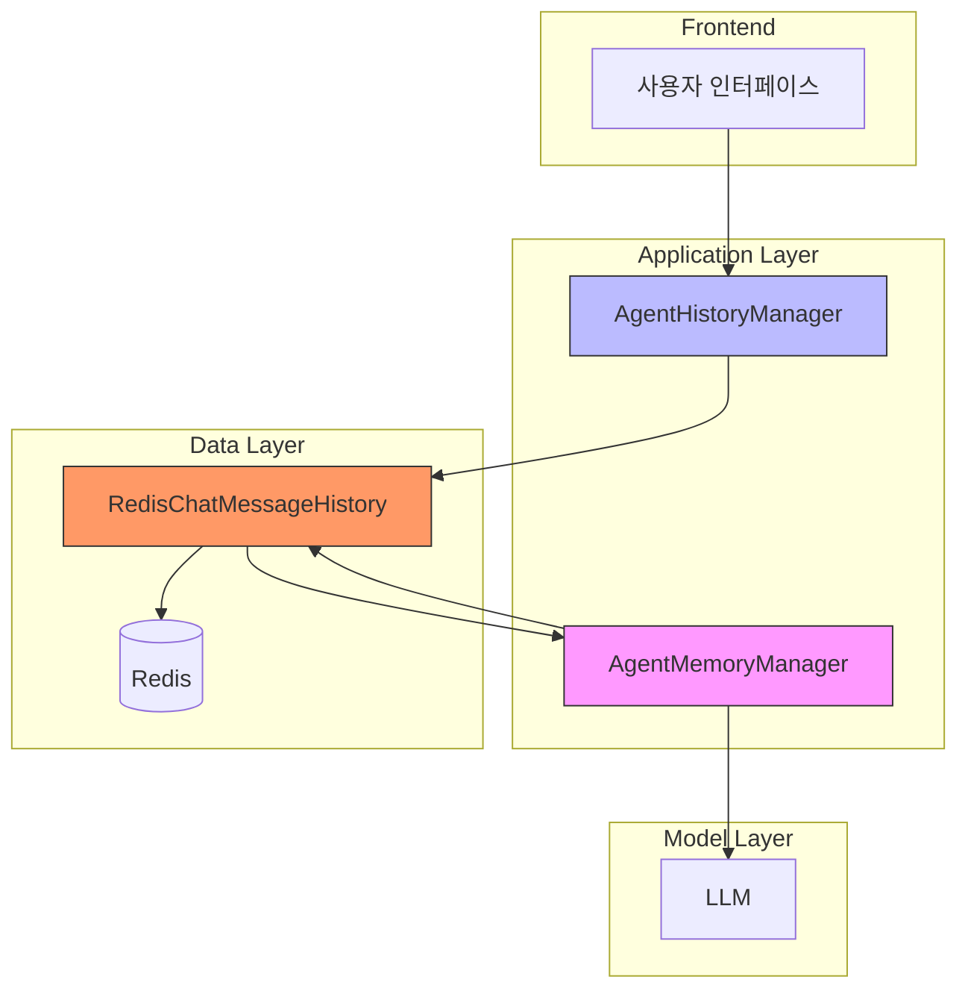
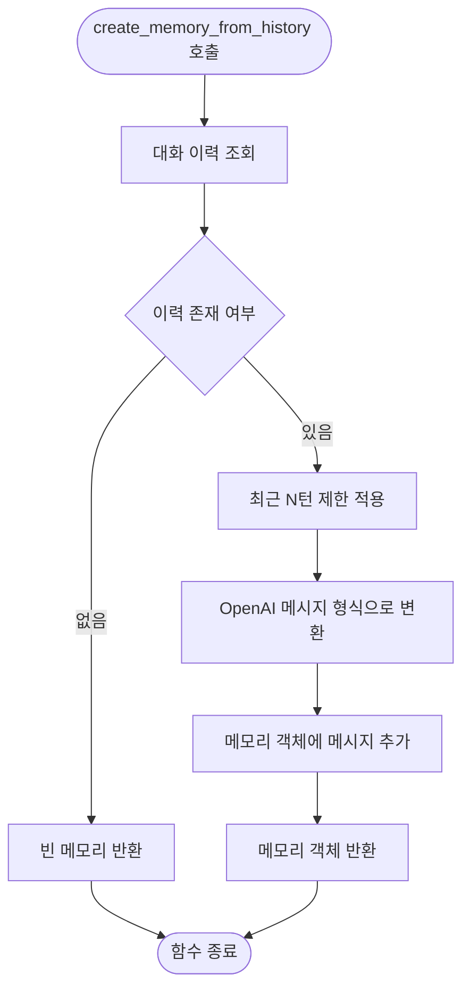
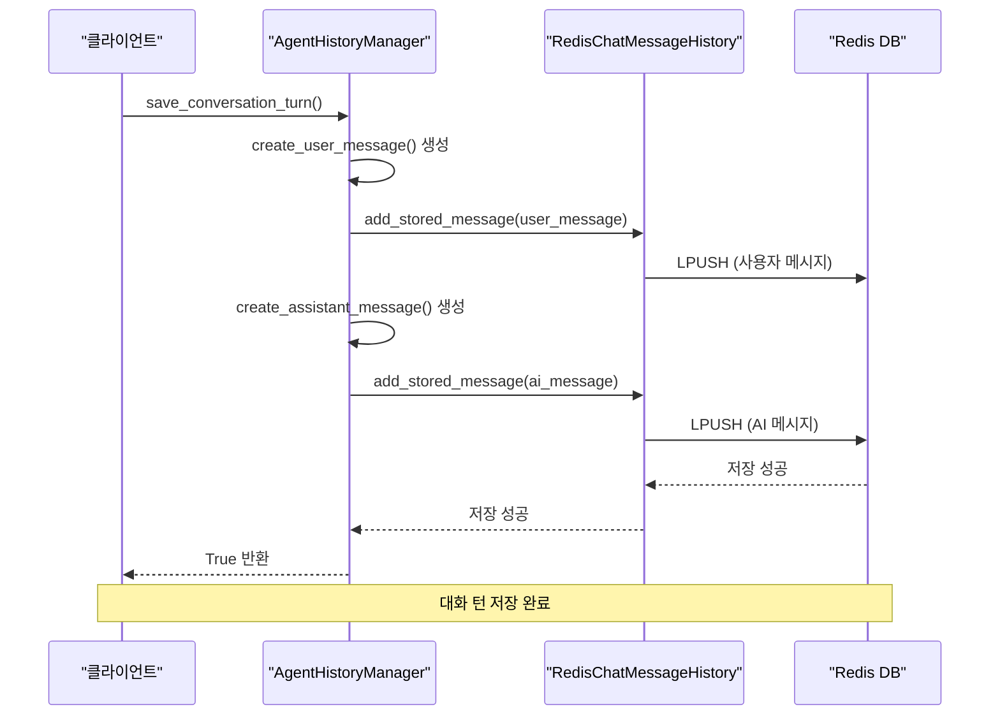
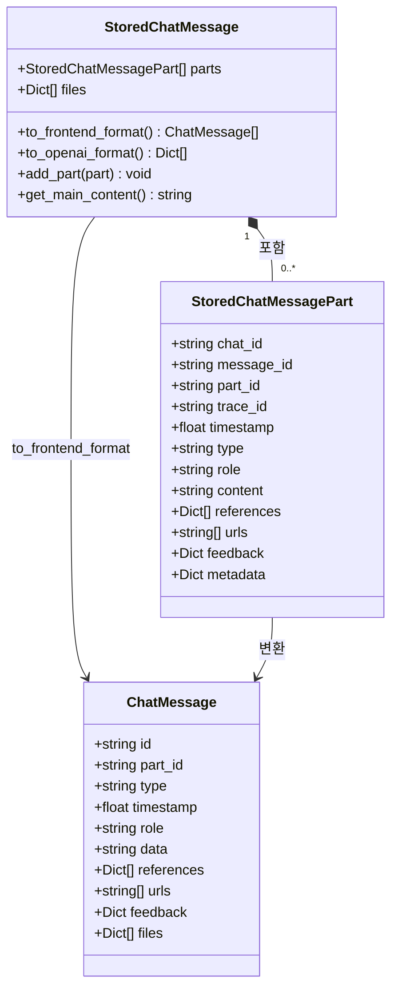
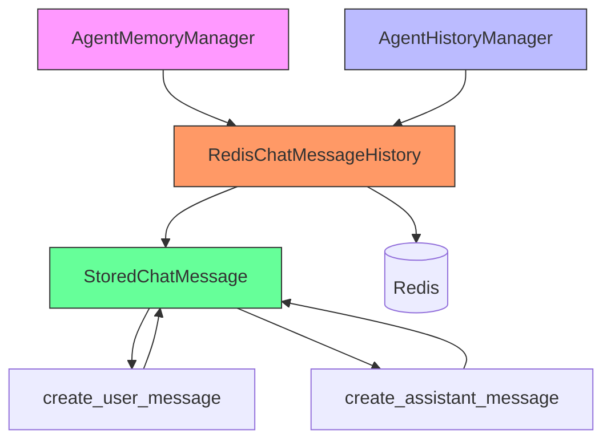

# 메모리 및 대화 이력 관리

<cite>
**이 문서에서 참조된 파일**
- [agent_memory_manager.py](file://aperag/agent/agent_memory_manager.py)
- [agent_history_manager.py](file://aperag/agent/agent_history_manager.py)
- [message.py](file://aperag/chat/history/message.py)
- [history.py](file://aperag/utils/history.py)
</cite>

## 목차
1. [소개](#소개)
2. [핵심 구성 요소](#핵심-구성-요소)
3. [메모리 아키텍처 개요](#메모리-아키텍처-개요)
4. [상세 구성 요소 분석](#상세-구성-요소-분석)
5. [의존성 분석](#의존성-분석)
6. [성능 고려사항](#성능-고려사항)
7. [문제 해결 가이드](#문제-해결-가이드)
8. [결론](#결론)

## 소개

ApeRAG 시스템은 에이전트 기반 대화 인터페이스를 위한 정교한 메모리 및 대화 이력 관리 체계를 구현하고 있습니다. 본 문서는 `agent_memory_manager.py`와 `agent_history_manager.py`를 중심으로 에이전트의 상태 유지 메커니즘을 심층적으로 분석합니다. 시스템은 짧은 대화 맥락(단기 메모리)과 장기 기억의 명확한 구분을 통해 효율적인 컨텍스트 관리를 수행하며, Redis 기반의 지속성 확보와 함께 다양한 최적화 전략을 적용하고 있습니다.

## 핵심 구성 요소

본 시스템의 핵심은 세 가지 주요 구성 요소로 이루어져 있습니다: `AgentMemoryManager`는 LLM에 제공할 메모리 생성을 담당하고, `AgentHistoryManager`는 대화 이력의 지속성 저장을 관리하며, `StoredChatMessage` 구조는 대화 데이터의 저장 형식을 정의합니다. 이러한 구성 요소들은 순수 함수 기반의 설계 원칙을 따르며, 외부 의존성을 명시적으로 주입받음으로써 높은 테스트 가능성과 유지보수성을 보장합니다.

**Section sources**
- [agent_memory_manager.py](file://aperag/agent/agent_memory_manager.py#L27-L139)
- [agent_history_manager.py](file://aperag/agent/agent_history_manager.py#L27-L117)
- [message.py](file://aperag/chat/history/message.py#L1-L255)

## 메모리 아키텍처 개요

**Diagram sources**
- [agent_memory_manager.py](file://aperag/agent/agent_memory_manager.py)
- [agent_history_manager.py](file://aperag/agent/agent_history_manager.py)
- [history.py](file://aperag/utils/history.py)

## 상세 구성 요소 분석

### AgentMemoryManager 분석

`AgentMemoryManager` 클래스는 대화 이력에서 LLM에 적합한 메모리 객체를 생성하는 책임을 가집니다. 이 클래스는 순수 함수 기반 설계를 채택하여 내부 상태를 유지하지 않으며, 모든 의존성은 외부에서 주입됩니다. 주요 기능으로는 최근 대화 이력을 기반으로 한 메모리 생성과 컨텍스트 요약 문자열 생성이 있습니다.

#### 메모리 생성 메커니즘

**Diagram sources**
- [agent_memory_manager.py](file://aperag/agent/agent_memory_manager.py#L40-L99)

**Section sources**
- [agent_memory_manager.py](file://aperag/agent/agent_memory_manager.py#L40-L99)

### AgentHistoryManager 분석

`AgentHistoryManager`는 대화 이력의 지속성 저장과 검색을 담당하는 핵심 컴포넌트입니다. 이 클래스는 RedisChatMessageHistory 인스턴스를 생성하고, 대화 턴 단위로 사용자 질의와 AI 응답을 저장하는 기능을 제공합니다. 순수 함수 설계 원칙을 따르며, 대부분의 메서드가 외부의 RedisChatMessageHistory 인스턴스를 매개변수로 받아 처리합니다.

#### 대화 저장 프로세스

**Diagram sources**
- [agent_history_manager.py](file://aperag/agent/agent_history_manager.py#L61-L117)

**Section sources**
- [agent_history_manager.py](file://aperag/agent/agent_history_manager.py#L61-L117)

### Message 구조 분석

`message.py` 파일에 정의된 `StoredChatMessage`와 `StoredChatMessagePart` 클래스는 대화 메시지의 저장 구조를 정의합니다. 이 구조는 단일 메시지가 여러 부분(parts)으로 구성될 수 있도록 하여, 사고 과정(thinking steps), 도구 호출 결과(tool call results), 참조 정보(references) 등을 하나의 논리적 메시지 턴 안에 통합할 수 있게 합니다.

#### 메시지 구조 다이어그램

**Diagram sources**
- [message.py](file://aperag/chat/history/message.py#L1-L255)

**Section sources**
- [message.py](file://aperag/chat/history/message.py#L1-L255)

## 의존성 분석

**Diagram sources**
- [agent_memory_manager.py](file://aperag/agent/agent_memory_manager.py)
- [agent_history_manager.py](file://aperag/agent/agent_history_manager.py)
- [history.py](file://aperag/utils/history.py)
- [message.py](file://aperag/chat/history/message.py)

**Section sources**
- [agent_memory_manager.py](file://aperag/agent/agent_memory_manager.py)
- [agent_history_manager.py](file://aperag/agent/agent_history_manager.py)
- [history.py](file://aperag/utils/history.py)
- [message.py](file://aperag/chat/history/message.py)

## 성능 고려사항

시스템은 메모리 용량 제한과 오래된 이력의 자동 만료를 통해 성능과 리소스 사용을 최적화합니다. `RedisChatMessageHistory` 클래스는 TTL(Time-To-Live) 기능을 지원하여 설정된 시간이 지난 후 자동으로 대화 이력이 만료되도록 할 수 있습니다. 또한, `create_memory_from_history` 메서드는 기본적으로 최근 4턴(8개 메시지)까지만 포함하도록 컨텍스트 윈도우를 제한함으로써 LLM에 전달되는 입력 크기를 효과적으로 관리합니다.

메모리 압축 전략으로는 두 가지 접근 방식을 제공합니다: 첫째, `build_context_summary` 메서드를 통해 최근 대화 내용을 요약 문자열로 변환하여 전체 메시지 대신 컨텍스트로 사용할 수 있습니다. 둘째, 각 메시지의 내용이 200자를 초과할 경우 말줄임표(...)로 자동 축약하여 저장 공간을 절약합니다.

## 문제 해결 가이드

대화 이력 저장 실패 시 다음과 같은 점검 항목을 확인해야 합니다:

1. **Redis 연결 상태**: `get_async_redis_client()` 함수를 통해 비동기 Redis 클라이언트가 올바르게 초기화되었는지 확인
2. **세션 ID 유효성**: `chat_id`가 올바르게 전달되고 있는지 확인
3. **메시지 형식 오류**: `storage_dict_to_message()` 변환 과정에서 파싱 오류가 발생하지 않는지 로그 확인
4. **저장소 용량**: Redis 인스턴스의 메모리 용량이 부족하지 않은지 확인

특히, `messages` 속성의 구현에서는 역순으로 저장된 Redis 리스트를 다시 정순으로 재배열하여 시간 순서대로 메시지를 반환하므로, 이 과정에서 성능 병목이 발생할 수 있습니다. 대규모 대화 이력의 경우, 전체 이력을 로드하기보다는 페이지네이션 기반의 부분 로딩 전략을 고려해야 합니다.

**Section sources**
- [history.py](file://aperag/utils/history.py#L152-L164)
- [history.py](file://aperag/utils/history.py#L166-L171)

## 결론

ApeRAG의 메모리 및 대화 이력 관리 시스템은 단기 메모리와 장기 기억의 명확한 구분을 기반으로 하며, Redis와의 연동을 통해 지속성과 성능을 동시에 확보하고 있습니다. `AgentMemoryManager`와 `AgentHistoryManager`의 순수 함수 기반 설계는 높은 테스트 가능성과 유지보수성을 제공하며, `StoredChatMessage`의 유연한 구조는 복잡한 대화 시나리오를 효과적으로 지원합니다. 향후 개선 방향으로는 대화 이력의 벡터 DB 연동을 통한 의미 기반 검색 기능 확장과, 더 정교한 메모리 압축 알고리즘 적용이 고려될 수 있습니다.