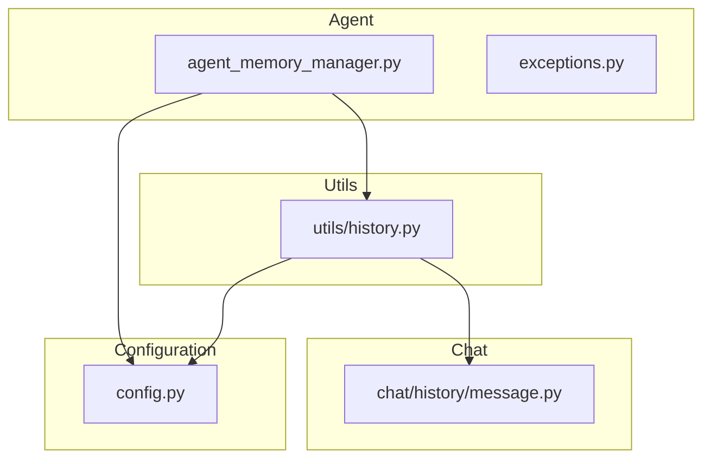
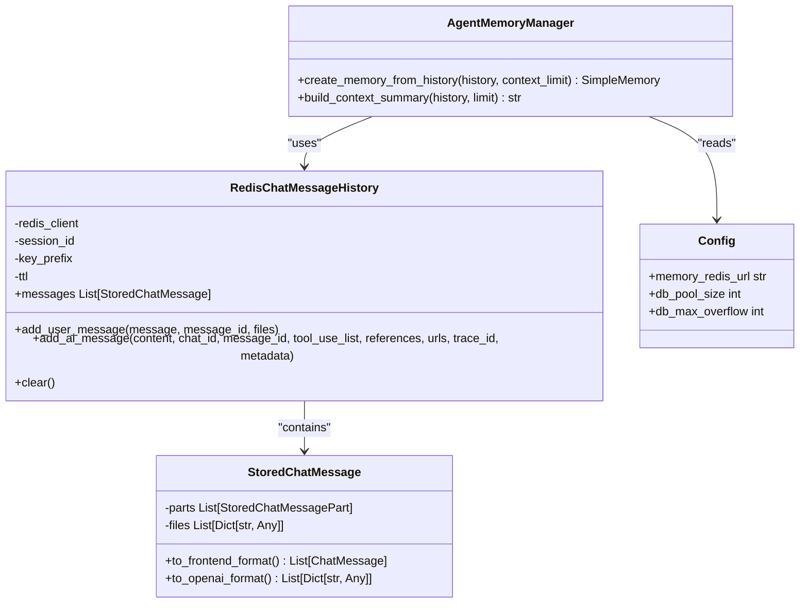
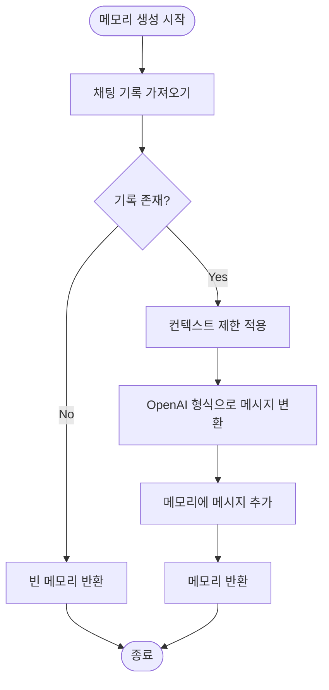
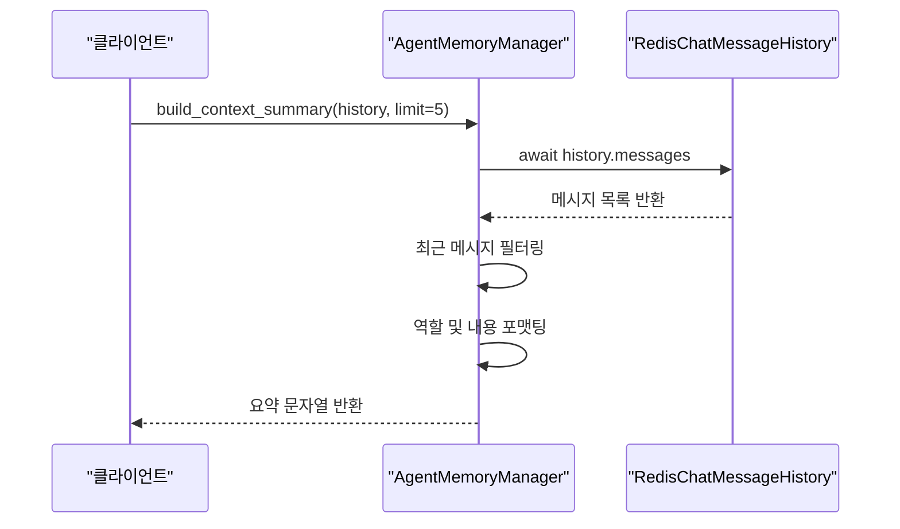
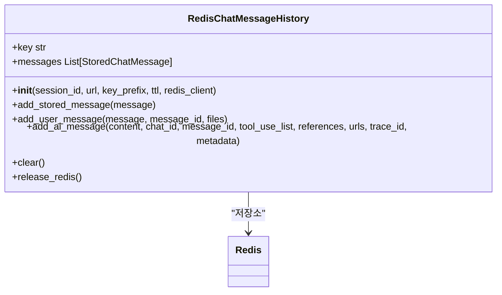
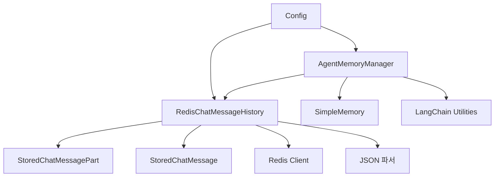

# 에이전트 메모리 관리

<cite>
**이 문서에서 참조된 파일**
- [agent_memory_manager.py](file://aperag/agent/agent_memory_manager.py)
- [history.py](file://aperag/utils/history.py)
- [message.py](file://aperag/chat/history/message.py)
- [config.py](file://aperag/config.py)
</cite>

## 목차
1. [소개](#소개)
2. [프로젝트 구조](#프로젝트-구조)
3. [핵심 구성 요소](#핵심-구성-요소)
4. [아키텍처 개요](#아키텍처-개요)
5. [상세 구성 요소 분석](#상세-구성-요소-분석)
6. [의존성 분석](#의존성-분석)
7. [성능 고려사항](#성능-고려사항)
8. [문제 해결 가이드](#문제-해결-가이드)
9. [결론](#결론)

## 소개
ApeRAG의 에이전트 메모리 관리 시스템은 대화 세션 중에 상태를 유지하고 관리하는 핵심 기능을 제공합니다. 이 문서는 `agent_memory_manager.py`를 중심으로 단기 및 장기 메모리 분리를 위한 아키텍처와 구현을 설명합니다. 메모리 상태는 세션 간에 유지되며, 컨텍스트 창 관리, 토큰 기반 용량 제한, 동적 메모리 정리 전략이 포함됩니다. 또한 역사적 상호작용을 압축하면서 의미적 관련성을 보존하기 위한 메모리 요약 기법과 Redis를 통한 지속성, 벡터 데이터베이스를 통한 의미 검색과 같은 외부 저장 백엔드와의 통합도 다룹니다.

## 프로젝트 구조
ApeRAG의 에이전트 메모리 관리는 주로 `aperag/agent` 디렉토리 내에 위치하며, 메모리 관리 로직은 `agent_memory_manager.py` 파일에 캡슐화되어 있습니다. 메모리 상태는 `RedisChatMessageHistory` 클래스를 통해 Redis에 저장되며, 설정은 `config.py`에서 관리됩니다. 전체 구조는 다음과 같습니다:

**Diagram sources**
- [agent_memory_manager.py](file://aperag/agent/agent_memory_manager.py)
- [history.py](file://aperag/utils/history.py)
- [message.py](file://aperag/chat/history/message.py)
- [config.py](file://aperag/config.py)

**Section sources**
- [agent_memory_manager.py](file://aperag/agent/agent_memory_manager.py)
- [history.py](file://aperag/utils/history.py)
- [message.py](file://aperag/chat/history/message.py)
- [config.py](file://aperag/config.py)

## 핵심 구성 요소
에이전트 메모리 관리 시스템의 핵심 구성 요소는 다음과 같습니다:
- **AgentMemoryManager**: 메모리 생성 및 요약 책임
- **RedisChatMessageHistory**: Redis를 사용한 메모리 저장 및 검색
- **StoredChatMessage**: 메시지 부분의 저장 및 변환 처리
- **Config**: 메모리 관련 설정 관리

**Section sources**
- [agent_memory_manager.py](file://aperag/agent/agent_memory_manager.py#L27-L139)
- [history.py](file://aperag/utils/history.py#L120-L212)
- [message.py](file://aperag/chat/history/message.py#L33-L116)
- [config.py](file://aperag/config.py#L276-L276)

## 아키텍처 개요
ApeRAG의 메모리 관리 아키텍처는 순수 함수 기반 설계를 따르며, LLM 대화를 위한 메모리 관리를 담당합니다. 주요 책임은 채팅 기록에서 메모리 생성, 컨텍스트 창 제한 적용, 요약 생성 등입니다. 메모리 상태는 Redis를 통해 지속되며, 설정은 환경 변수와 구성 파일을 통해 관리됩니다.

**Diagram sources**
- [agent_memory_manager.py](file://aperag/agent/agent_memory_manager.py#L27-L139)
- [history.py](file://aperag/utils/history.py#L120-L212)
- [message.py](file://aperag/chat/history/message.py#L33-L116)
- [config.py](file://aperag/config.py#L276-L276)

## 상세 구성 요소 분석

### AgentMemoryManager 분석
`AgentMemoryManager` 클래스는 순수 함수 기반 메모리 관리자로서, LLM 대화를 위해 메모리를 생성하고 요약을 빌드하는 책임을 집니다.

#### 메모리 생성 흐름

**Diagram sources**
- [agent_memory_manager.py](file://aperag/agent/agent_memory_manager.py#L40-L99)

#### 컨텍스트 요약 생성

**Diagram sources**
- [agent_memory_manager.py](file://aperag/agent/agent_memory_manager.py#L102-L139)

**Section sources**
- [agent_memory_manager.py](file://aperag/agent/agent_memory_manager.py#L27-L139)

### RedisChatMessageHistory 분석
`RedisChatMessageHistory`는 Redis 데이터베이스에 채팅 메시지 기록을 저장합니다. 각 세션은 고유한 키를 사용하여 메시지를 저장하고, TTL(Time-To-Live)을 통해 자동 만료를 지원합니다.

**Diagram sources**
- [history.py](file://aperag/utils/history.py#L120-L212)

**Section sources**
- [history.py](file://aperag/utils/history.py#L120-L212)

## 의존성 분석
에이전트 메모리 관리 시스템의 주요 의존성은 다음과 같습니다:

**Diagram sources**
- [agent_memory_manager.py](file://aperag/agent/agent_memory_manager.py)
- [history.py](file://aperag/utils/history.py)
- [message.py](file://aperag/chat/history/message.py)
- [config.py](file://aperag/config.py)

**Section sources**
- [agent_memory_manager.py](file://aperag/agent/agent_memory_manager.py)
- [history.py](file://aperag/utils/history.py)
- [message.py](file://aperag/chat/history/message.py)
- [config.py](file://aperag/config.py)

## 성능 고려사항
- **Redis 연결 풀**: 비동기 Redis 클라이언트는 연결 풀을 사용하여 성능을 최적화합니다.
- **메모리 크기 제한**: `context_limit` 매개변수는 컨텍스트 윈도우 크기를 제어하여 토큰 사용량을 관리합니다.
- **비동기 I/O**: 모든 메모리 작업은 비동기적으로 수행되어 블로킹을 방지합니다.
- **메시지 요약**: 긴 대화에서는 요약 기능을 사용하여 컨텍스트 크기를 줄일 수 있습니다.

## 문제 해결 가이드
- **컨텍스트 오버플로우**: `context_limit` 값을 조정하거나 메모리 정리 전략을 구현하세요.
- **스태일 메모리 유지**: 오래된 세션은 TTL 설정을 통해 자동으로 만료되도록 하세요.
- **Redis 연결 실패**: `memory_redis_url` 설정을 확인하고 Redis 서버 상태를 점검하세요.
- **메시지 파싱 오류**: 저장된 메시지 형식이 올바른지 확인하고, 예외 처리 로그를 검토하세요.

**Section sources**
- [agent_memory_manager.py](file://aperag/agent/agent_memory_manager.py)
- [history.py](file://aperag/utils/history.py)

## 결론
ApeRAG의 에이전트 메모리 관리 시스템은 Redis 기반의 효율적인 메모리 저장소와 함께 단기 및 장기 메모리 분리를 위한 견고한 아키텍처를 제공합니다. 순수 함수 기반 설계는 테스트 가능성을 높이고, 비동기 I/O는 성능을 극대화합니다. 구성 가능한 설정과 확장 가능한 아키텍처는 다양한 배포 요구 사항을 충족시킬 수 있도록 합니다.