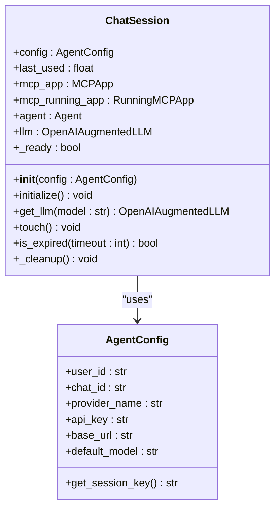
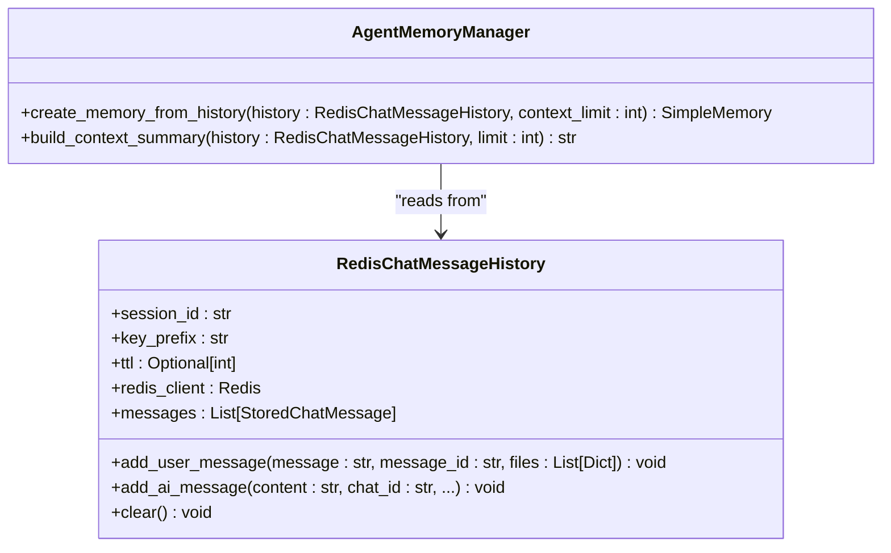
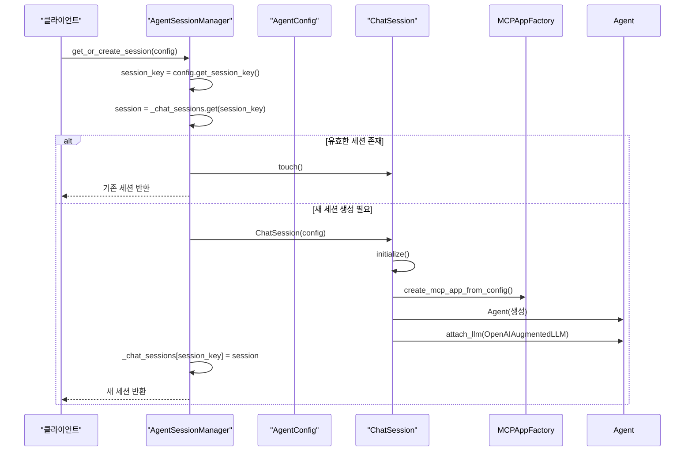
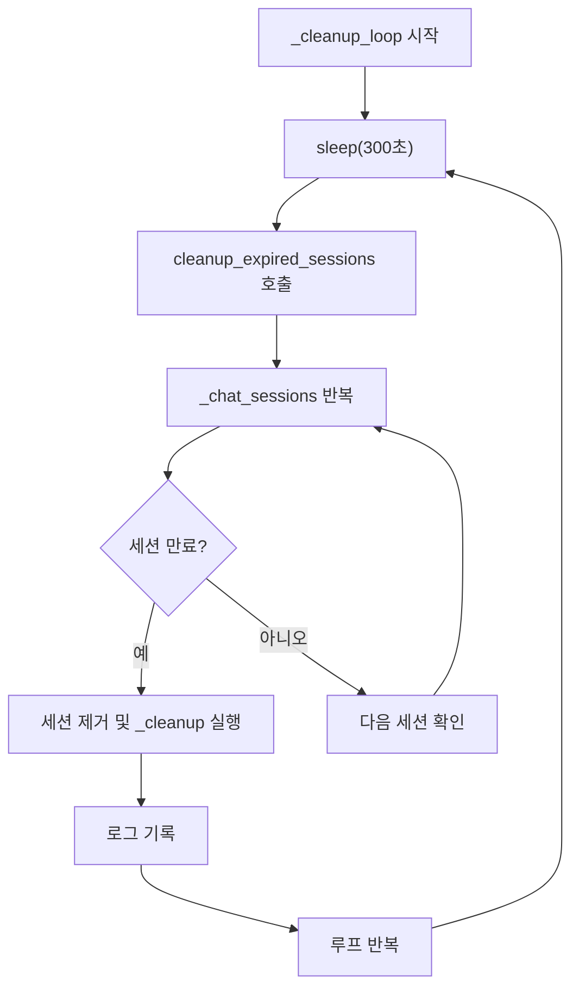
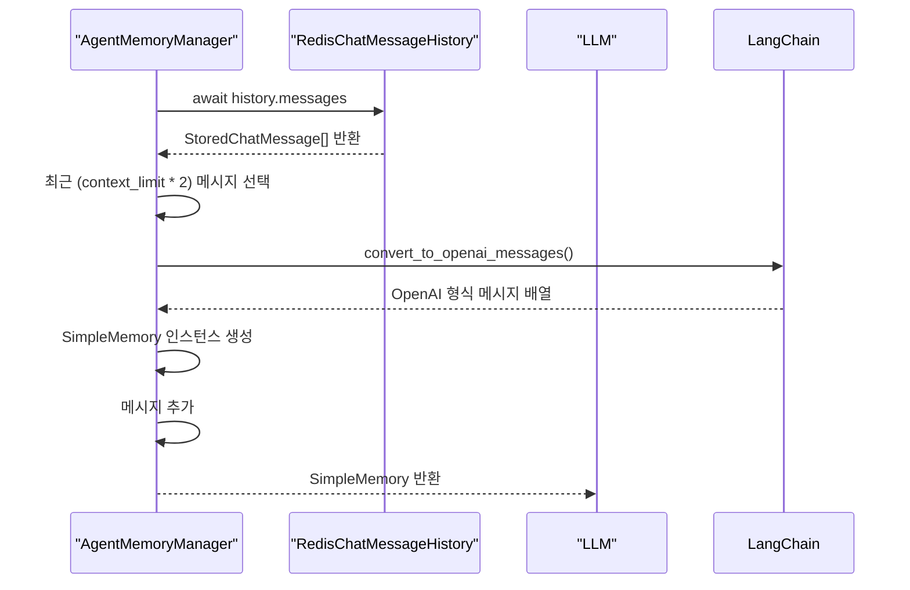
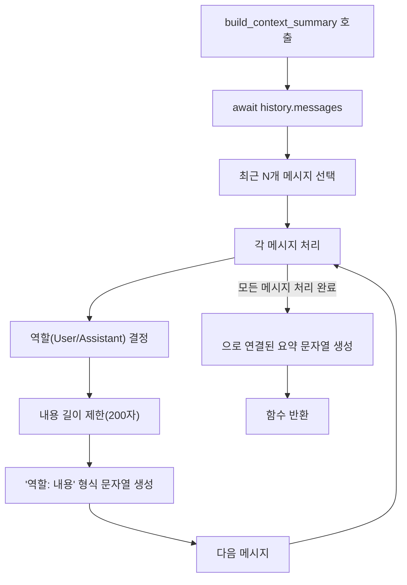
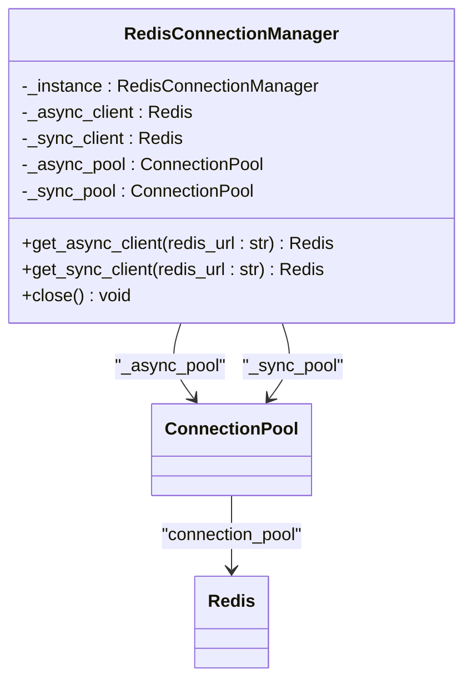

# 세션 상태 관리

<cite>
**이 문서에서 참조한 파일**
- [agent_session_manager.py](file://aperag/agent/agent_session_manager.py)
- [agent_memory_manager.py](file://aperag/agent/agent_memory_manager.py)
- [redis_manager.py](file://aperag/db/redis_manager.py)
- [history.py](file://aperag/utils/history.py)
- [agent_config.py](file://aperag/agent/agent_config.py)
</cite>

## 목차
1. [소개](#소개)
2. [핵심 구성 요소 분석](#핵심-구성-요소-분석)
3. [상태 저장 및 접근 메커니즘](#상태-저장-및-접근-메커니즘)
4. [에이전트 메모리 관리와의 연동](#에이전트-메모리-관리와의-연동)
5. [직렬화 및 역직렬화 전략](#직렬화-및-역직렬화-전략)
6. [동시성 제어 및 캐시 무효화](#동시성-제어-및-캐시-무효화)
7. [영속성과 성능 트레이드오프](#영속성과-성능-트레이드오프)
8. [WebSocket 재연결 시 상태 복구](#websocket-재연결-시-상태-복구)
9. [커스텀 상태 저장 백엔드 통합 가이드](#커스텀-상태-저장-백엔드-통합-가이드)

## 소개
ApeRAG의 에이전트 세션 상태 관리 메커니즘은 사용자 대화를 지속하고 컨텍스트를 유지하기 위해 설계된 핵심 아키텍처입니다. 이 문서는 `agent_session_manager.py`와 `agent_memory_manager.py` 모듈을 중심으로, 세션 상태(session_state)가 어떻게 저장되고 접근되는지, 대화 히스토리, 컨텍스트 정보, 사용자 프로필 데이터를 실시간으로 유지하는 방식을 심층적으로 분석합니다. 또한 Redis를 상태 저장소로 사용할 때의 직렬화/역직렬화 전략, 동시성 제어(locking), 캐시 무효화 정책을 설명하며, 상태의 영속성(persistence) 여부에 따른 성능과 확장성의 트레이드오프를 논의합니다.

## 핵심 구성 요소 분석

### AgentSessionManager 구조
ApeRAG의 세션 관리는 `ChatSession` 클래스를 중심으로 이루어집니다. 각 `ChatSession` 인스턴스는 고유한 사용자+채팅+프로바이더 조합에 대해 생성되며, MCP 애플리케이션(MCPApp), 에이전트(Agent), LLM 인스턴스를 포함하여 대화 상태를 격리합니다. 세션은 글로벌 딕셔너리 `_chat_sessions`에 저장되며, 세션 키는 `user_id:chat_id:provider_name` 형식으로 생성됩니다.



**Diagram sources**
- [agent_session_manager.py](file://aperag/agent/agent_session_manager.py#L27-L250)
- [agent_config.py](file://aperag/agent/agent_config.py#L1-L53)

**Section sources**
- [agent_session_manager.py](file://aperag/agent/agent_session_manager.py#L27-L250)
- [agent_config.py](file://aperag/agent/agent_config.py#L1-L53)

### AgentMemoryManager 구조
`AgentMemoryManager`는 순수 함수 기반의 메모리 관리자로, 대화 기록을 기반으로 LLM용 메모리를 생성합니다. 이 클래스는 `RedisChatMessageHistory` 인스턴스를 받아 최근 대화 턴(turns)을 추출하고, 이를 LLM이 이해할 수 있는 형식(SimpleMemory)으로 변환합니다. 컨텍스트 창 크기 제한과 요약 기능을 제공하여 메모리 효율성을 높입니다.



**Diagram sources**
- [agent_memory_manager.py](file://aperag/agent/agent_memory_manager.py#L27-L139)
- [utils/history.py](file://aperag/utils/history.py#L120-L212)

**Section sources**
- [agent_memory_manager.py](file://aperag/agent/agent_memory_manager.py#L27-L139)

## 상태 저장 및 접근 메커니즘

### 세션 생성 및 초기화
세션은 `get_or_create_session()` 함수를 통해 가져오거나 생성됩니다. 이 함수는 먼저 글로벌 `_chat_sessions` 딕셔너리에서 기존 세션을 검색하고, 유효한 세션이 없으면 새로운 `ChatSession` 인스턴스를 생성하여 초기화합니다. 초기화 과정에서는 MCP 애플리케이션, 에이전트, LLM 인스턴스가 생성되어 세션에 연결됩니다.



**Diagram sources**
- [agent_session_manager.py](file://aperag/agent/agent_session_manager.py#L200-L250)
- [agent_config.py](file://aperag/agent/agent_config.py#L50-L52)

**Section sources**
- [agent_session_manager.py](file://aperag/agent/agent_session_manager.py#L200-L250)

### 세션 만료 및 정리
세션은 30분(기본값) 동안 사용되지 않으면 만료됩니다. 백그라운드 정리 태스크(`_cleanup_loop`)가 5분마다 실행되어 만료된 세션을 찾아 정리합니다. 정리 과정에서는 에이전트와 MCP 애플리케이션의 리소스가 적절히 해제되며, 세션은 글로벌 딕셔너리에서 제거됩니다.



**Diagram sources**
- [agent_session_manager.py](file://aperag/agent/agent_session_manager.py#L220-L250)

**Section sources**
- [agent_session_manager.py](file://aperag/agent/agent_session_manager.py#L220-L250)

## 에이전트 메모리 관리와의 연동

### 대화 기록 기반 메모리 생성
`AgentMemoryManager`는 `create_memory_from_history()` 메서드를 통해 `RedisChatMessageHistory`로부터 대화 기록을 읽어 LLM용 메모리를 생성합니다. 이 과정에서 최근 N개의 대화 턴만 포함되도록 컨텍스트 창 크기가 제한되며, LangChain의 유틸리티 함수를 사용해 메시지를 OpenAI 형식으로 변환합니다.



**Diagram sources**
- [agent_memory_manager.py](file://aperag/agent/agent_memory_manager.py#L40-L85)

**Section sources**
- [agent_memory_manager.py](file://aperag/agent/agent_memory_manager.py#L40-L85)

### 컨텍스트 요약 생성
특수한 시나리오를 위해 `build_context_summary()` 메서드는 최근 대화 내용을 간단한 문자열 요약으로 생성합니다. 이 요약은 프롬프트에 포함되어 LLM이 최근 컨텍스트를 더 잘 이해하도록 돕습니다.



**Diagram sources**
- [agent_memory_manager.py](file://aperag/agent/agent_memory_manager.py#L90-L139)

**Section sources**
- [agent_memory_manager.py](file://aperag/agent/agent_memory_manager.py#L90-L139)

## 직렬화 및 역직렬화 전략

### Redis 기반 직렬화
대화 메시지는 `RedisChatMessageHistory` 클래스를 통해 Redis에 저장됩니다. `StoredChatMessage` 객체는 `message_to_storage_dict()` 함수를 통해 JSON으로 직렬화되어 `lpush` 명령으로 리스트의 맨 앞에 삽입됩니다. 조회 시에는 `lrange` 명령으로 모든 항목을 가져온 후, `json.loads()`와 `storage_dict_to_message()`를 통해 다시 파이썬 객체로 역직렬화됩니다.

```mermaid
flowchart LR
A["StoredChatMessage 객체"] --> B["message_to_storage_dict()"]
B --> C["Python dict"]
C --> D["json.dumps()"]
D --> E["JSON 문자열"]
E --> F["Redis lpush"]
F --> G["Redis 저장소"]
G --> H["Redis lrange"]
H --> I["JSON 문자열 배열"]
I --> J["json.loads()"]
J --> K["dict 배열"]
K --> L["storage_dict_to_message()"]
L --> M["StoredChatMessage 객체 배열"]
```



**Diagram sources**
- [utils/history.py](file://aperag/utils/history.py#L120-L212)

**Section sources**
- [utils/history.py](file://aperag/utils/history.py#L120-L212)

### TTL 기반 캐시 무효화
Redis 키는 옵션으로 TTL(Time-To-Live)을 설정할 수 있습니다. `add_stored_message()` 메서드 내에서 `expire` 명령을 호출하여 키의 수명을 설정하면, 지정된 시간이 지나면 자동으로 삭제되어 캐시 무효화가 이루어집니다. 이는 장기간 활성하지 않은 세션의 메모리를 자동으로 정리하는 데 유용합니다.

```python
async def add_stored_message(self, message: StoredChatMessage) -> None:
    message_json = json.dumps(message_to_storage_dict(message))
    await self.redis_client.lpush(self.key, message_json)
    if self.ttl:
        await self.redis_client.expire(self.key, self.ttl) # TTL 설정
```

**Section sources**
- [utils/history.py](file://aperag/utils/history.py#L180-L185)

## 동시성 제어 및 캐시 무효화

### 글로벌 세션 딕셔너리의 동시성
현재 구현에서는 `_chat_sessions` 글로벌 딕셔너리에 대한 직접적인 잠금 메커니즘이 없습니다. 저자는 경쟁 조건(race condition)을 일부 수용하여 단순함을 유지하고 있으며, 최악의 경우 불필요한 세션이 생성되었다가 나중에 정리되는 정도의 영향만 있다고 판단하고 있습니다. 이는 시스템의 유지보수성을 높이는 설계 선택입니다.

### Redis 연결 풀링
`RedisConnectionManager`는 비동기 및 동기 클라이언트 모두에 대해 연결 풀링을 제공합니다. `_async_pool`과 `_sync_pool`이라는 별도의 연결 풀을 관리하여, 애플리케이션 전체에서 Redis 연결을 효율적으로 공유하고, 연결 생성 오버헤드를 줄입니다. 풀은 최대 20개의 연결을 지원하며, 건강 체크 및 재시도 기능이 포함되어 있습니다.



**Diagram sources**
- [db/redis_manager.py](file://aperag/db/redis_manager.py#L40-L238)

**Section sources**
- [db/redis_manager.py](file://aperag/db/redis_manager.py#L40-L238)

## 영속성과 성능 트레이드오프

### 메모리 기반 세션 vs 영속성 저장소
ApeRAG의 현재 설계는 세션 상태를 주로 메모리에 보관합니다. `ChatSession` 객체는 Python 프로세스의 메모리에 저장되며, 이는 매우 빠른 접근 속도를 제공합니다. 반면, 대화 기록은 Redis에 저장되어 일정 수준의 영속성을 갖습니다. 이 두 계층 구조는 성능과 안정성 사이의 균형을 이루고 있습니다.

| 특성 | 메모리 기반 세션 | Redis 기반 기록 |
|------|------------------|-----------------|
| **접근 속도** | 매우 빠름 (ns~μs) | 빠름 (ms) |
| **영속성** | 낮음 (프로세스 종료 시 소멸) | 중간 (Redis 서버 다운 시 가능) |
| **확장성** | 수평 확장 어려움 | 수평 확장 용이 |
| **비용** | RAM 사용 | 네트워크 및 Redis 리소스 |

### 성능 최적화 전략
- **LLM 인스턴스 캐싱**: 각 채팅 세션은 LLM 인스턴스를 캐시하여 초기화 오버헤드를 피합니다.
- **연결 풀링**: Redis 연결 풀을 사용하여 네트워크 연결 생성 비용을 절감합니다.
- **비동기 I/O**: 모든 Redis 작업은 비동기로 수행되어 요청 처리 능력을 극대화합니다.

## WebSocket 재연결 시 상태 복구

### 세션 복구 로직
WebSocket 연결이 끊어졌다가 재설정될 경우, 클라이언트는 동일한 `chat_id`를 사용하여 새 요청을 보냅니다. `get_or_create_session()` 함수는 이 `chat_id`를 기반으로 기존 세션 키를 생성하고, `_chat_sessions` 딕셔너리에서 기존 세션을 찾습니다. 만약 세션이 아직 만료되지 않았다면, 기존의 `ChatSession` 객체가 반환되어 대화 상태가 그대로 유지됩니다.

### 실패 시 대체 전략
세션이 이미 만료되었거나 서버가 재시작된 경우에는 메모리 기반 세션이 소실됩니다. 이 경우, `RedisChatMessageHistory`를 통해 저장된 대화 기록을 읽어와 `AgentMemoryManager`를 사용해 새로운 메모리 상태를 재구성할 수 있습니다. 그러나 MCP 애플리케이션과 에이전트의 내부 상태는 복구할 수 없으므로, 본질적으로 새로운 세션이 시작됩니다.

```python
# 의사코드: 재연결 시 상태 복구
async def handle_websocket_reconnect(chat_id, user_id, provider):
    config = AgentConfig(user_id=user_id, chat_id=chat_id, provider_name=provider)
    session = await get_or_create_session(config)
    # session.llm은 기존 상태 유지 또는 새로 생성됨
    return session.get_llm("default_model")
```

**Section sources**
- [agent_session_manager.py](file://aperag/agent/agent_session_manager.py#L200-L250)
- [utils/history.py](file://aperag/utils/history.py#L120-L212)

## 커스텀 상태 저장 백엔드 통합 가이드

### RedisChatMessageHistory 확장
새로운 상태 저장 백엔드를 통합하려면, `BaseChatMessageHistory` 추상 클래스를 상속받는 새로운 클래스를 작성해야 합니다. 예를 들어, 데이터베이스를 백엔드로 사용하려면 다음과 같은 구조를 따릅니다.

```python
from aperag.utils.history import BaseChatMessageHistory
from typing import List
from langchain.schema import BaseMessage

class DatabaseChatMessageHistory(BaseChatMessageHistory):
    def __init__(self, session_id: str, db_connection_string: str):
        self.session_id = session_id
        self.db_connection_string = db_connection_string
        # 데이터베이스 연결 초기화
    
    @property
    async def messages(self) -> List[BaseMessage]:
        # 데이터베이스에서 메시지 조회 및 파이썬 객체로 변환
        pass
    
    async def add_message(self, message: BaseMessage) -> None:
        # 메시지를 데이터베이스에 저장
        pass
    
    async def clear(self) -> None:
        # 세션의 모든 메시지 삭제
        pass
```

### AgentMemoryManager와의 통합
`AgentMemoryManager`는 `RedisChatMessageHistory`에 직접 의존하지 않고, `BaseChatMessageHistory` 인터페이스를 통해 작동합니다. 따라서 위와 같이 구현된 `DatabaseChatMessageHistory` 인스턴스를 `create_memory_from_history()` 메서드에 전달하면, 기존 코드 변경 없이 새로운 백엔드를 사용할 수 있습니다.

```python
# 기존 코드 변경 없이 새로운 백엔드 사용
memory_manager = AgentMemoryManager()
db_history = DatabaseChatMessageHistory(chat_id, "postgresql://...")
memory = await memory_manager.create_memory_from_history(db_history)
```

**Section sources**
- [utils/history.py](file://aperag/utils/history.py#L20-L118)
- [agent_memory_manager.py](file://aperag/agent/agent_memory_manager.py#L40-L85)