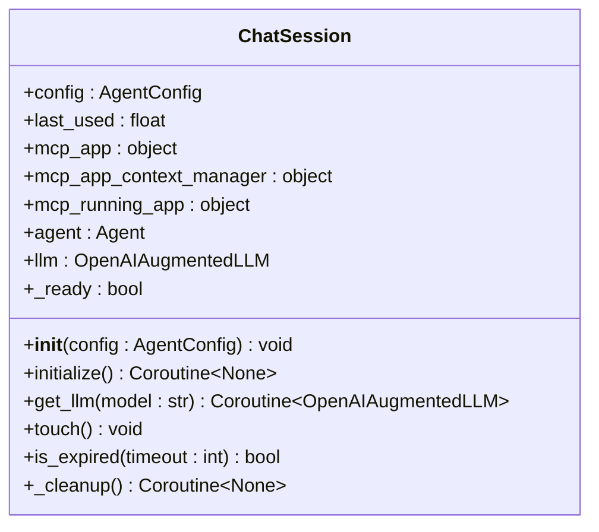
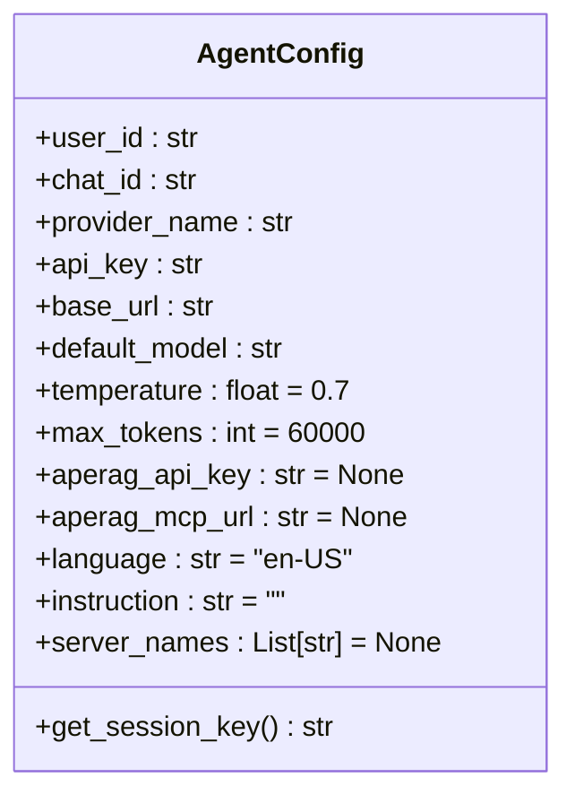
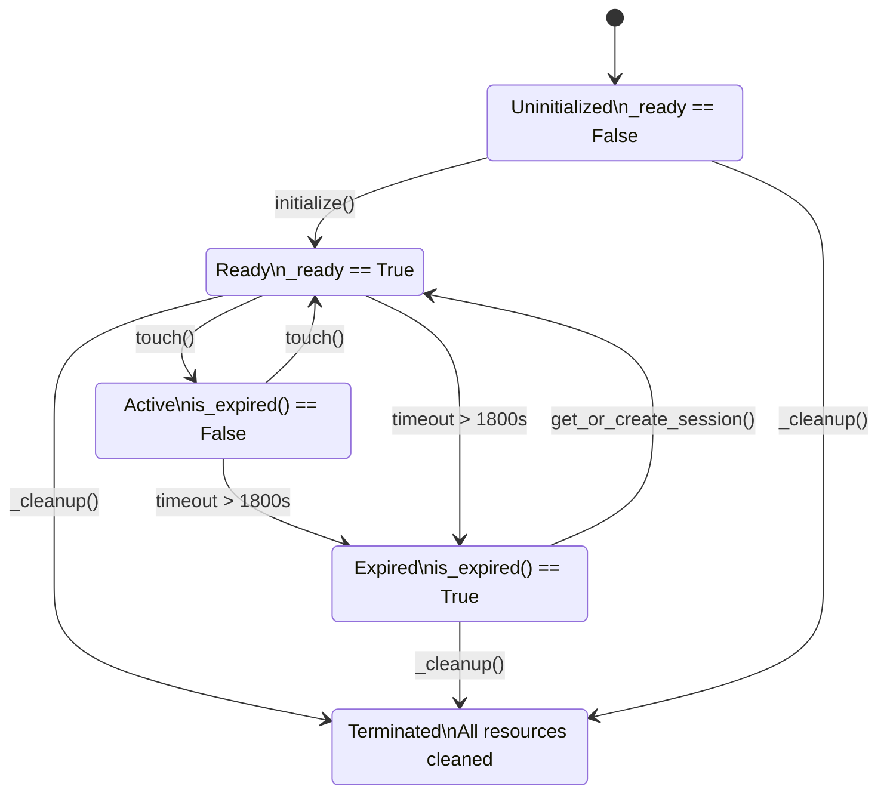
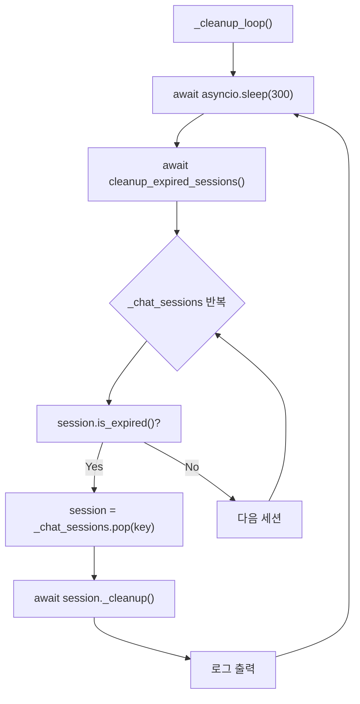
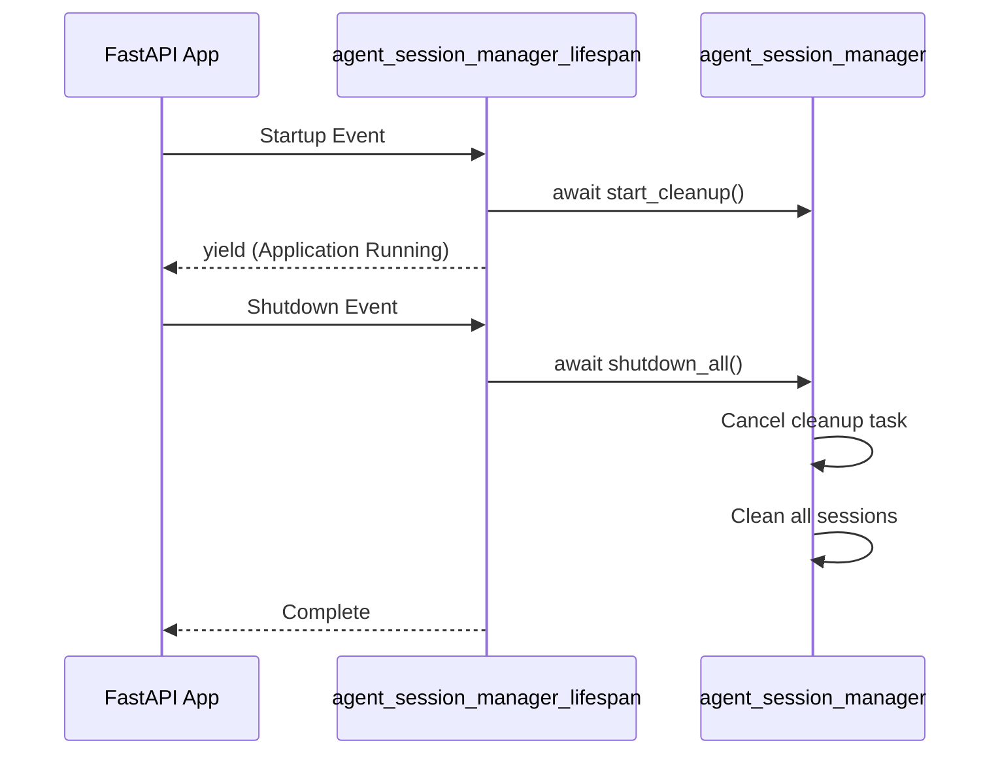

# 세션 생명 주기 관리

<cite>
**이 문서에서 참조된 파일**
- [agent_session_manager.py](file://aperag/agent/agent_session_manager.py)
- [agent_session_manager_lifecycle.py](file://aperag/agent/agent_session_manager_lifecycle.py)
- [agent_config.py](file://aperag/agent/agent_config.py)
</cite>

## 목차
1. [소개](#소개)
2. [핵심 구성 요소 분석](#핵심-구성-요소-분석)
3. [세션 상태 전이 및 콜백 메커니즘](#세션-상태-전이-및-콜백-메커니즘)
4. [타임아웃, 유휴 상태 감지 및 자동 정리](#타임아웃-유휴-상태-감지-및-자동-정리)
5. [비정상 종료 시 리소스 해제 및 상태 일관성 유지](#비정상-종료-시-리소스-해제-및-상태-일관성-유지)
6. [사용자 정의 생명 주기 정책 확장 가이드](#사용자-정의-생명-주기-정책-확장-가이드)

## 소개
ApeRAG의 에이전트 세션 생명 주기 관리는 `agent_session_manager.py`와 `agent_session_manager_lifecycle.py` 두 개의 핵심 모듈을 통해 구현됩니다. 이 시스템은 사용자 대화 세션의 생성, 활성화, 일시중지, 종료를 효율적으로 관리하며, 메모리 누수 방지를 위한 자동 정리 기능과 비정상 종료 시에도 안정적인 리소스 해제를 보장합니다. 본 문서는 이러한 세션 관리 메커니즘의 내부 작동 원리를 심층적으로 분석하고, 개발자가 커스텀 생명 주기 정책을 추가하거나 기존 훅을 오버라이드하는 방법을 안내합니다.

## 핵심 구성 요소 분석

### ChatSession 클래스 분석
`ChatSession` 클래스는 사용자-채팅-프로바이더 조합별로 고유한 세션을 관리하는 핵심 엔티티입니다. 각 세션은 독립적인 MCPApp, Agent, LLM 인스턴스를 유지하여 대화 상태와 메모리를 격리합니다.

**Diagram sources**
- [agent_session_manager.py](file://aperag/agent/agent_session_manager.py#L31-L133)

**Section sources**
- [agent_session_manager.py](file://aperag/agent/agent_session_manager.py#L31-L133)

#### 세션 생성 (create_session)
세션 생성은 `get_or_create_session()` 함수를 통해 이루어집니다. 이 함수는 세션 키를 기반으로 기존 세션을 조회하거나, 없을 경우 새로운 `ChatSession` 인스턴스를 생성하고 초기화합니다. 세션 키는 `user_id`, `chat_id`, `provider_name`을 결합하여 생성되며, 이는 동일한 사용자의 동일한 채팅에서 서로 다른 LLM 프로바이더를 사용할 수 있도록 합니다.

[get_or_create_session](file://aperag/agent/agent_session_manager.py#L146-L176) 함수는 먼저 기존 세션이 존재하고 준비 상태이며 만료되지 않았는지 확인합니다. 만료되었거나 준비되지 않은 경우, 기존 세션을 정리한 후 새 세션을 생성합니다. 이 과정에서 경쟁 조건(race condition)을 완전히 제거하기 위해 복잡한 잠금 메커니즘을 사용하지 않고, 간단한 접근 방식을 취함으로써 코드 유지보수성을 높였습니다.

#### 세션 활성화 (activate_session)
세션 활성화는 `ChatSession.initialize()` 메서드에 의해 수행됩니다. 이 메서드는 세션의 `_ready` 플래그를 확인하여 중복 초기화를 방지합니다. 초기화 과정에서는 다음과 같은 순서로 리소스를 생성합니다:
1.  `MCPAppFactory.create_mcp_app_from_config()`을 사용하여 MCP 애플리케이션 생성
2.  `mcp_app.run()`을 호출하여 MCP 앱 실행 컨텍스트 매니저 획득
3.  `__aenter__()`를 통해 MCP 앱 비동기적으로 시작
4.  `Agent` 인스턴스 생성 및 `__aenter__()`를 통한 초기화
5.  `agent.attach_llm(OpenAIAugmentedLLM)`을 통해 LLM 인스턴스 연결 및 캐싱

이러한 단계적 초기화는 모든 필수 리소스가 올바르게 설정되었음을 보장하며, 초기화 실패 시 예외가 발생하면 즉시 `_cleanup()` 메서드를 호출하여 생성된 리소스를 해제합니다.

[initialize](file://aperag/agent/agent_session_manager.py#L54-L92) 메서드는 `AgentConfigurationError`를 발생시키므로, 상위 계층에서 적절한 오류 처리가 필요합니다.

#### 세션 일시중지 (pause_session)
ApeRAG은 명시적인 "일시중지" 상태를 정의하지 않습니다. 대신, 세션의 활성 상태는 마지막 사용 시간(`last_used`)과 타임아웃 값을 기반으로 동적으로 판단됩니다. `touch()` 메서드는 세션에 대한 접근이 있을 때마다 `last_used` 타임스탬프를 현재 시간으로 갱신하여, 세션이 활성 상태임을 표시합니다. 이 메서드는 `get_or_create_session()`이나 `get_llm()`과 같은 핵심 메서드 내에서 호출되어, 세션이 사용되는 순간마다 자동으로 활성화됩니다.

[touch](file://aperag/agent/agent_session_manager.py#L103-L105) 메서드는 매우 간단한 구현을 가지지만, 전체 세션 관리 로직에서 중요한 역할을 합니다.

#### 세션 종료 (terminate_session)
세션 종료는 `ChatSession._cleanup()` 메서드를 통해 이루어집니다. 이 메서드는 비동기적으로 실행되며, 다음과 같은 순서로 리소스를 정리합니다:
1.  `agent.__aexit__()`를 호출하여 에이전트 정리
2.  `mcp_app_context_manager.__aexit__()`를 호출하여 MCP 앱 정리
3.  모든 인스턴스 변수를 `None`으로 설정하여 참조를 해제

각 정리 단계는 예외 처리가 포함되어 있어, 하나의 리소스 정리에 실패하더라도 나머지 리소스 정리는 계속 진행됩니다. 이는 부분적인 리소스 누수를 방지하는 데 중요합니다.

[_cleanup](file://aperag/agent/agent_session_manager.py#L111-L133) 메서드는 `shutdown_all()` 함수에서도 반복적으로 호출되어, 서버 종료 시 모든 세션을 철저히 정리합니다.

### AgentConfig 클래스 분석
`AgentConfig` 데이터클래스는 세션 생성에 필요한 모든 설정 정보를 캡슐화합니다. 이 클래스는 `get_session_key()` 메서드를 제공하여, `agent_session_manager` 모듈이 일관된 방식으로 세션 키를 생성할 수 있도록 합니다.

**Diagram sources**
- [agent_config.py](file://aperag/agent/agent_config.py#L18-L53)

**Section sources**
- [agent_config.py](file://aperag/agent/agent_config.py#L18-L53)

## 세션 상태 전이 및 콜백 메커니즘

### 상태 전이(State Transition) 로직
ApeRAG의 세션 상태는 명시적인 상태 머신(state machine)보다는 간단한 부울 플래그와 타임스탬프를 기반으로 관리됩니다. 주요 상태는 다음과 같습니다:

*   **미준비(Uninitialized)**: `ChatSession` 객체가 생성되었으나 `initialize()`가 호출되지 않은 상태 (`_ready == False`)
*   **준비됨(Ready)**: `initialize()`가 성공적으로 완료된 상태 (`_ready == True`)
*   **활성(Active)**: `is_expired()`가 `False`를 반환하는 상태 (즉, `time.time() - last_used <= timeout`)
*   **만료됨(Expired)**: `is_expired()`가 `True`를 반환하는 상태

상태 전이는 다음과 같은 트리거에 의해 발생합니다:
*   **생성 → 미준비**: `ChatSession(config)` 호출 시
*   **미준비 → 준비됨**: `initialize()` 성공 시 `_ready = True`
*   **준비됨 → 활성**: `touch()` 호출 시 `last_used` 갱신
*   **활성 → 만료됨**: 지정된 타임아웃(기본 30분)이 초과될 경우
*   **준비됨/활성/만료됨 → 종료됨**: `_cleanup()` 호출 시 모든 리소스 해제

**Diagram sources**
- [agent_session_manager.py](file://aperag/agent/agent_session_manager.py#L52-L52)
- [agent_session_manager.py](file://aperag/agent/agent_session_manager.py#L107-L109)
- [agent_session_manager.py](file://aperag/agent/agent_session_manager.py#L103-L105)

### 콜백 함수(on_create, on_activate, on_terminate 등)
ApeRAG은 전통적인 생명 주기 콜백 함수(on_create, on_activate 등)를 명시적으로 정의하지 않습니다. 대신, 관련 로직이 핵심 메서드 내에 직접 구현되어 있습니다.

*   **on_create 유사 동작**: `get_or_create_session()` 함수 내에서 `ChatSession` 생성 후 `initialize()`를 호출하는 시점이 `on_create` 콜백의 역할을 합니다. 이때 `logger.info("Created new chat session...")`와 같은 로깅이 수행됩니다.
*   **on_activate 유사 동작**: `get_or_create_session()` 또는 `get_llm()` 호출 시 `touch()` 메서드가 호출되는 것이 `on_activate`의 역할을 합니다. 이는 세션의 `last_used` 타임스탬프를 갱신하여 활성 상태로 만듭니다.
*   **on_terminate 유사 동작**: `_cleanup()` 메서드 자체가 `on_terminate` 콜백의 역할을 합니다. 이 메서드는 리소스 정리 로직과 함께 `logger.info("Cleaning up chat session...")`과 같은 종료 로깅을 포함합니다.

이러한 설계는 콜백 메커니즘의 복잡성을 피하면서도, 필요한 모든 생명 주기 이벤트에 대한 응답을 가능하게 합니다.

## 타임아웃, 유휴 상태 감지 및 자동 정리

### 유휴 상태 감지 및 타임아웃
유휴 상태 감지는 `is_expired(timeout: int = 1800)` 메서드를 통해 이루어집니다. 이 메서드는 현재 시간과 `last_used` 타임스탬프의 차이가 지정된 타임아웃 값(초 단위, 기본값 1800초 = 30분)을 초과하는지 확인합니다. `touch()` 메서드는 세션에 접근할 때마다 `last_used`를 갱신하므로, 일정 시간 동안 접근이 없는 세션만이 만료된 것으로 간주됩니다.

[is_expired](file://aperag/agent/agent_session_manager.py#L107-L109) 메서드는 전역 딕셔너리 `_chat_sessions`를 순회하며 만료된 세션을 찾는 데 사용됩니다.

### 자동 정리(Garbage Collection) 기능
자동 정리는 백그라운드 태스크인 `_cleanup_loop()`에 의해 주기적으로 수행됩니다. `start_cleanup()` 함수는 이 루프를 시작하며, 5분(`asyncio.sleep(300)`) 간격으로 `cleanup_expired_sessions()` 함수를 호출합니다.

`cleanup_expired_sessions()` 함수는 `_chat_sessions` 딕셔너리를 검사하여 `is_expired()`가 `True`를 반환하는 모든 세션을 찾아 `_chat_sessions`에서 제거하고, 해당 세션의 `_cleanup()` 메서드를 비동기적으로 호출합니다. 이 메커니즘은 메모리 누수를 방지하고, 오랜 시간 동안 사용되지 않는 세션 리소스를 효율적으로 회수합니다.

**Diagram sources**
- [agent_session_manager.py](file://aperag/agent/agent_session_manager.py#L178-L198)
- [agent_session_manager.py](file://aperag/agent/agent_session_manager.py#L135-L144)

**Section sources**
- [agent_session_manager.py](file://aperag/agent/agent_session_manager.py#L135-L198)

## 비정상 종료 시 리소스 해제 및 상태 일관성 유지

### shutdown_all() 함수
서버의 비정상 종료 또는 정상 종료 시, 모든 세션을 안전하게 정리하는 책임은 `shutdown_all()` 함수에 있습니다. 이 함수는 전역 정리 태스크 `_cleanup_task`를 취소한 후, `_chat_sessions` 딕셔너리에 있는 모든 `ChatSession` 인스턴스를 가져와 `_cleanup()` 메서드를 호출합니다. 이 과정에서 딕셔너리는 먼저 `list(_chat_sessions.values())`로 복사되고, `_chat_sessions.clear()`로 즉시 비워지므로, 정리 도중 발생할 수 있는 예외로부터 안전합니다.

[shutdown_all](file://aperag/agent/agent_session_manager.py#L200-L223) 함수는 `asyncio.CancelledError`를 적절히 처리하여 정리 태스크가 이미 취소된 경우에도 문제없이 동작합니다.

### agent_session_manager_lifespan 콘텍스트 매니저
`agent_session_manager_lifecycle.py` 모듈의 `agent_session_manager_lifespan` 콘텍스트 매니저는 FastAPI 애플리케이션의 수명 주기를 관리합니다. `yield` 이전에는 `start_cleanup()`을 호출하여 백그라운드 정리 태스크를 시작하고, `finally` 블록에서는 `shutdown_all()`을 호출하여 애플리케이션이 종료될 때 모든 세션을 철저히 정리합니다. 이는 FastAPI의 표준 lifespan 콘텍스트 매니저 패턴을 따르며, 웹 서버의 시작과 종료 이벤트에 신뢰성 있게 연결됩니다.

**Diagram sources**
- [agent_session_manager_lifecycle.py](file://aperag/agent/agent_session_manager_lifecycle.py#L28-L41)
- [agent_session_manager.py](file://aperag/agent/agent_session_manager.py#L225-L249)

**Section sources**
- [agent_session_manager_lifecycle.py](file://aperag/agent/agent_session_manager_lifecycle.py#L28-L41)

## 사용자 정의 생명 주기 정책 확장 가이드

현재의 ApeRAG 세션 관리 시스템은 확장을 위한 공식적인 훅(hook) 인터페이스를 제공하지 않습니다. 그러나 개발자는 다음과 같은 방법으로 기능을 확장할 수 있습니다.

1.  **상속을 통한 ChatSession 확장**: `ChatSession` 클래스를 상속받아 새로운 클래스를 만들고, `initialize()`, `_cleanup()` 등의 메서드를 오버라이드하여 사용자 정의 초기화 및 정리 로직을 추가할 수 있습니다. 이후 `get_or_create_session()` 함수를 수정하여 이 새로운 클래스를 사용하도록 해야 합니다.
2.  **데코레이터 사용**: 기존 함수에 데코레이터를 적용하여 생명 주기 이벤트를 가로챌 수 있습니다. 예를 들어, `get_or_create_session()` 함수 위에 데코레이터를 두어 `on_create` 이벤트를 모니터링할 수 있습니다.
3.  **agent_session_manager_lifecycle 수정**: `agent_session_manager_lifespan` 콘텍스트 매니저를 수정하여, `start_cleanup()` 호출 전후 또는 `shutdown_all()` 호출 전후에 사용자 정의 코드를 삽입할 수 있습니다. 이는 애플리케이션 수준의 전역 이벤트에 반응하는 데 유용합니다.

이러한 확장은 기존 코드의 구조를 이해하고, 변경 사항이 시스템 전반에 미치는 영향을 신중히 고려해야 합니다.