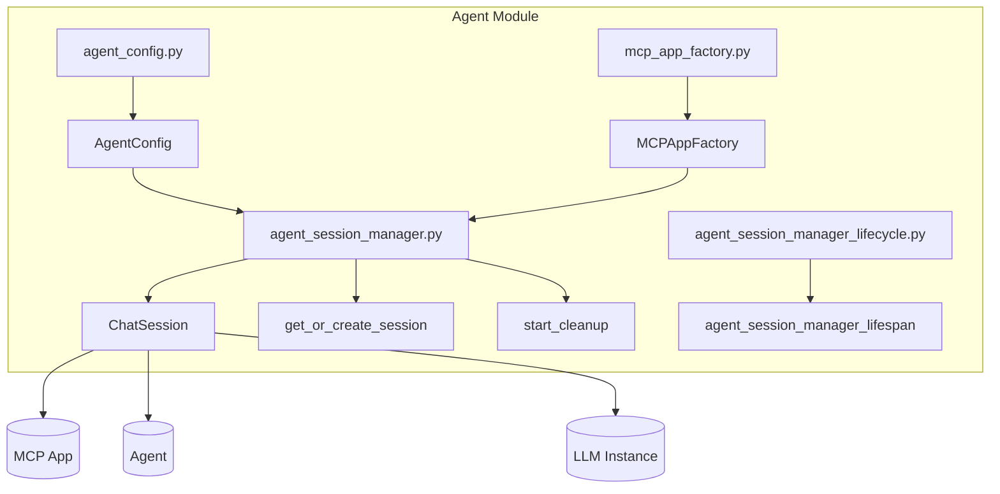
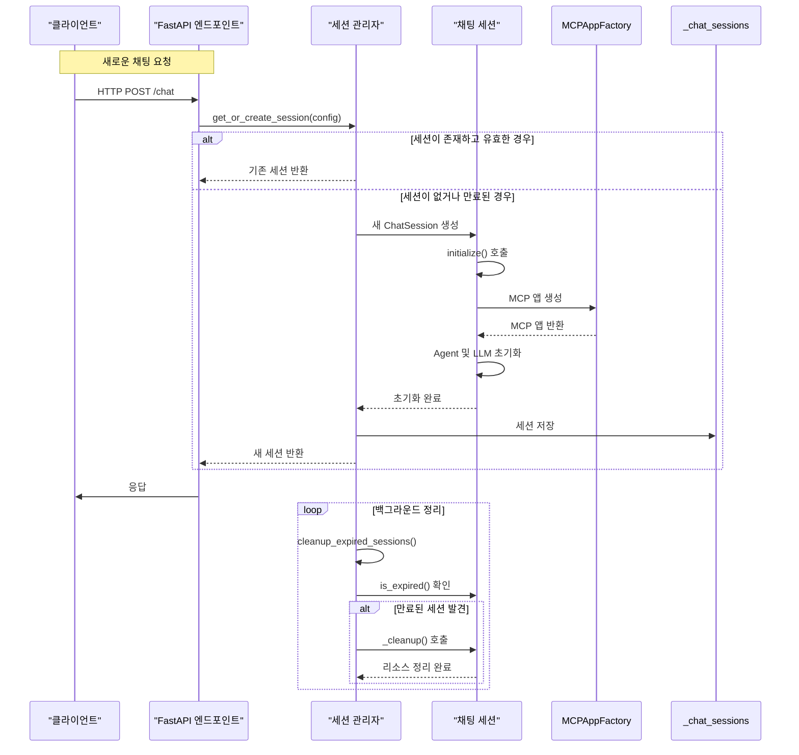
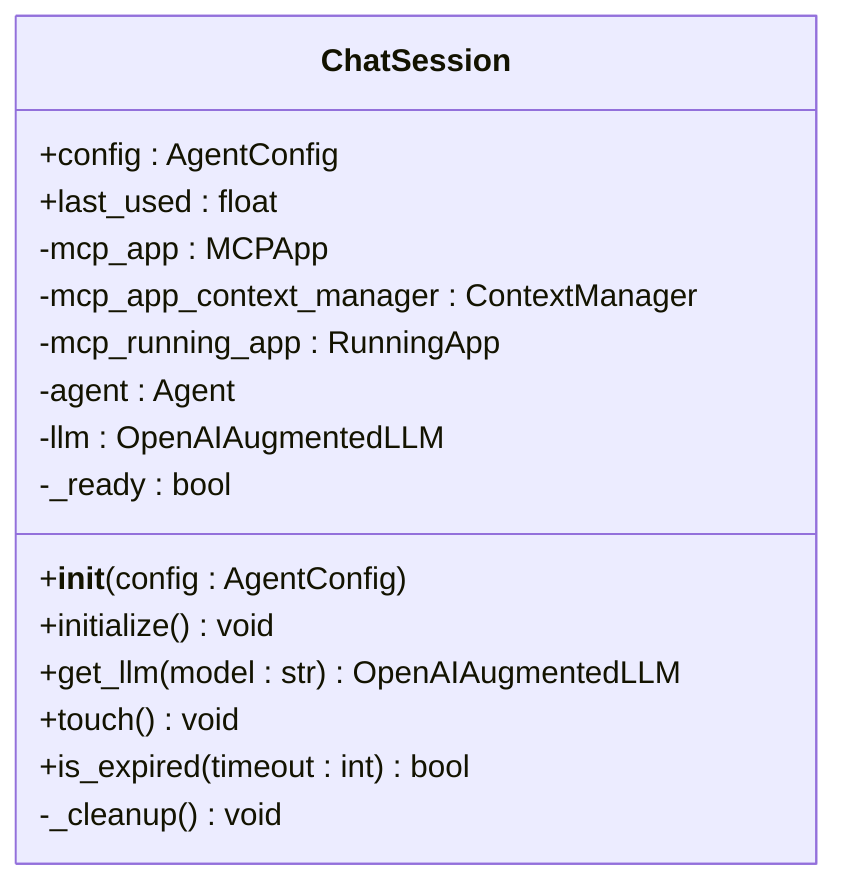
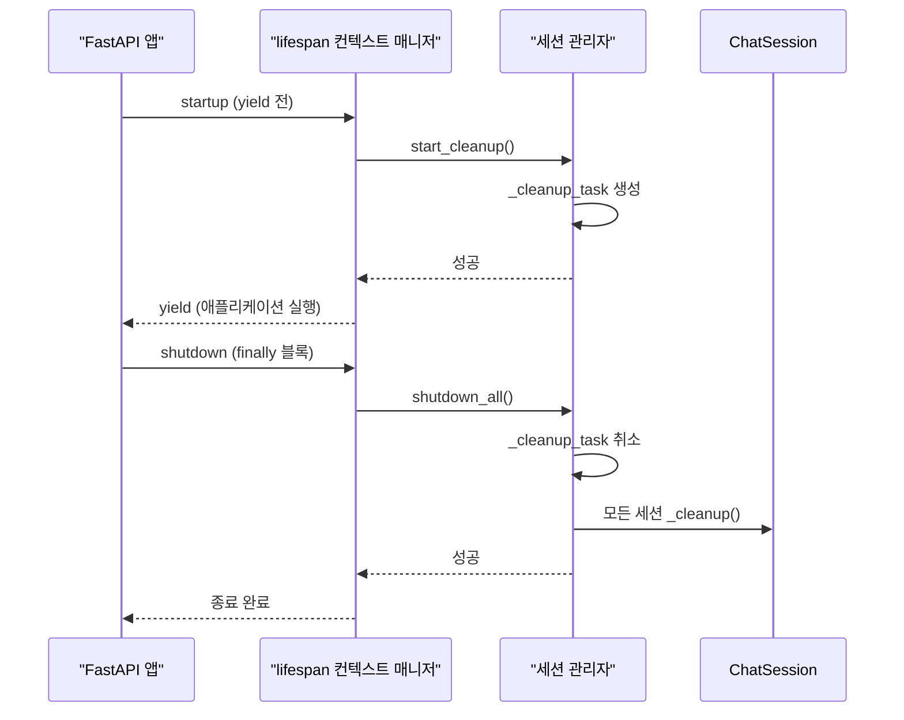
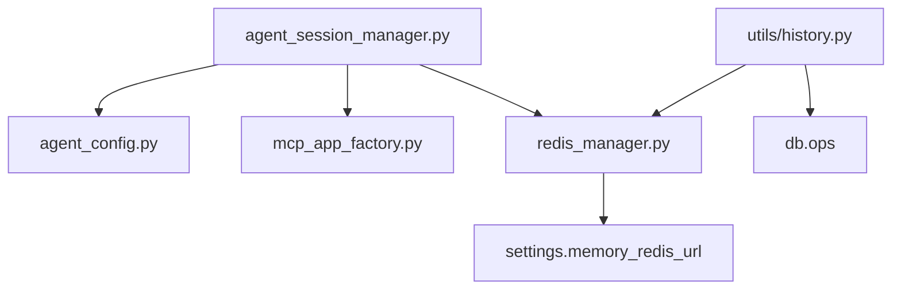

# 에이전트 세션 관리

<cite>
**이 문서에서 참조한 파일**
- [agent_session_manager.py](file://aperag/agent/agent_session_manager.py)
- [agent_session_manager_lifecycle.py](file://aperag/agent/agent_session_manager_lifecycle.py)
- [agent_config.py](file://aperag/agent/agent_config.py)
- [redis_manager.py](file://aperag/db/redis_manager.py)
- [utils/history.py](file://aperag/utils/history.py)
</cite>

## 목차
1. [소개](#소개)
2. [프로젝트 구조](#프로젝트-구조)
3. [핵심 구성 요소](#핵심-구성-요소)
4. [아키텍처 개요](#아키텍처-개요)
5. [상세 구성 요소 분석](#상세-구성-요소-분석)
6. [의존성 분석](#의존성-분석)
7. [성능 고려사항](#성능-고려사항)
8. [문제 해결 가이드](#문제-해결-가이드)
9. [결론](#결론)

## 소개
ApeRAG의 에이전트 세션 관리 시스템은 사용자와 채팅 간의 상태를 유지하고, 대화 기록과 메모리를 보존하며, LLM 및 MCP(Multi-Agent Collaboration Platform) 리소스를 효율적으로 관리하는 핵심 역할을 수행합니다. 본 문서는 `agent_session_manager.py`와 `agent_session_manager_lifecycle.py` 모듈을 중심으로 세션의 생성, 활성화, 소멸 주기, 상태 전이, 생명 주기 콜백 처리 방식을 상세히 설명합니다. 또한, HTTP 요청과 WebSocket 연결에서의 세션 유지, 동시 접속 제어, 타임아웃 설정, Redis를 활용한 세션 저장소 통합, 장애 복구 및 확장성에 대해 다룹니다.

## 프로젝트 구조
ApeRAG의 에이전트 관련 코드는 `aperag/agent` 디렉터리에 집중되어 있으며, 세션 관리는 이 중에서도 핵심적인 부분입니다. 주요 파일들은 다음과 같습니다:

- **`agent_session_manager.py`**: 세션의 생성, 조회, 초기화, 정리 등의 핵심 로직을 담당합니다.
- **`agent_session_manager_lifecycle.py`**: FastAPI 애플리케이션의 시작과 종료 시점에 세션 관리자의 생명 주기를 관리합니다.
- **`agent_config.py`**: 세션 생성에 필요한 모든 설정 정보를 포함하는 데이터 클래스입니다.
- **`mcp_app_factory.py`**: MCP 애플리케이션 인스턴스를 생성하는 팩토리입니다.

**Diagram sources**
- [agent_session_manager.py](file://aperag/agent/agent_session_manager.py)
- [agent_session_manager_lifecycle.py](file://aperag/agent/agent_session_manager_lifecycle.py)
- [agent_config.py](file://aperag/agent/agent_config.py)

**Section sources**
- [agent_session_manager.py](file://aperag/agent/agent_session_manager.py)
- [agent_session_manager_lifecycle.py](file://aperag/agent/agent_session_manager_lifecycle.py)
- [agent_config.py](file://aperag/agent/agent_config.py)

## 핵심 구성 요소

`agent_session_manager.py` 모듈은 `ChatSession` 클래스와 여러 전역 함수로 구성되어 있습니다. `ChatSession`은 각 사용자-채팅-프로바이더 조합에 대한 독립적인 상태를 유지하며, 내부적으로 MCP 앱, 에이전트, LLM 인스턴스를 캐싱합니다. 전역 `_chat_sessions` 딕셔너리는 세션 키를 통해 이들 세션을 관리합니다. `get_or_create_session` 함수는 세션이 존재하면 재사용하고, 만료되었거나 없으면 새로 생성하여 반환합니다. 백그라운드에서 실행되는 `_cleanup_loop`는 일정 시간(기본 5분)마다 만료된 세션을 찾아 정리합니다.

**Section sources**
- [agent_session_manager.py](file://aperag/agent/agent_session_manager.py#L1-L250)

## 아키텍처 개요
ApeRAG의 세션 관리 아키텍처는 단순함과 유지보수성을 우선시합니다. 각 채팅 세션은 고유한 `AgentConfig` 객체를 기반으로 생성되며, 이 설정은 사용자 ID, 채팅 ID, 프로바이더 이름 등을 포함합니다. 세션은 메모리 내 전역 딕셔너리(`_chat_sessions`)에 저장되며, 세션 키는 `user_id:chat_id:provider_name` 형식의 문자열로 생성됩니다. FastAPI의 lifespan 이벤트를 통해 애플리케이션 시작 시 정리 작업이 자동으로 시작되고, 종료 시 모든 리소스가 안전하게 해제됩니다.

**Diagram sources**
- [agent_session_manager.py](file://aperag/agent/agent_session_manager.py#L1-L250)
- [agent_session_manager_lifecycle.py](file://aperag/agent/agent_session_manager_lifecycle.py#L1-L43)

## 상세 구성 요소 분석

### ChatSession 클래스 분석
`ChatSession` 클래스는 세션의 핵심 상태와 리소스를 캡슐화합니다. 이 클래스는 `__init__` 메서드에서 기본 설정과 마지막 사용 시간을 초기화합니다. `initialize()` 메서드는 비동기적으로 MCP 앱, 에이전트, LLM 인스턴스를 생성하고 설정합니다. `get_llm()` 메서드는 초기화된 LLM 인스턴스를 반환하여 대화 상태를 유지합니다. `touch()`와 `is_expired()` 메서드는 세션의 활성 상태를 추적하고, 기본 30분의 타임아웃을 적용합니다. `_cleanup()` 메서드는 모든 리소스를 안전하게 정리합니다.

#### 객체 지향 구성 요소:

**Diagram sources**
- [agent_session_manager.py](file://aperag/agent/agent_session_manager.py#L31-L133)

**Section sources**
- [agent_session_manager.py](file://aperag/agent/agent_session_manager.py#L31-L133)

### 생명 주기 관리 분석
`agent_session_manager_lifecycle.py` 모듈은 FastAPI의 lifespan 컨텍스트 매니저를 제공합니다. `agent_session_manager_lifespan` 함수는 애플리케이션 시작 시 `start_cleanup()`을 호출하여 백그라운드 정리 작업을 시작하고, 종료 시 `shutdown_all()`을 호출하여 모든 세션과 리소스를 정리합니다. 이는 애플리케이션의 전체 수명 주기에 걸쳐 세션 관리자가 올바르게 동작하도록 보장합니다.

#### API/서비스 구성 요소:

**Diagram sources**
- [agent_session_manager_lifecycle.py](file://aperag/agent/agent_session_manager_lifecycle.py#L28-L41)
- [agent_session_manager.py](file://aperag/agent/agent_session_manager.py#L180-L250)

**Section sources**
- [agent_session_manager_lifecycle.py](file://aperag/agent/agent_session_manager_lifecycle.py#L28-L41)

## 의존성 분석
세션 관리 시스템은 여러 핵심 컴포넌트에 의존합니다. 가장 중요한 것은 `AgentConfig` 클래스로, 세션 생성에 필요한 모든 설정을 제공합니다. `MCPAppFactory`는 MCP 애플리케이션 인스턴스를 생성하는 데 사용됩니다. `RedisConnectionManager`는 세션 데이터뿐만 아니라 다른 애플리케이션 상태를 저장하기 위해 사용되며, 이는 세션의 확장성과 장애 복구 능력을 높이는 데 기여합니다. `RedisChatMessageHistory` 클래스는 대화 기록을 Redis에 저장하고 검색하는 데 사용됩니다.

**Diagram sources**
- [agent_session_manager.py](file://aperag/agent/agent_session_manager.py)
- [agent_config.py](file://aperag/agent/agent_config.py)
- [redis_manager.py](file://aperag/db/redis_manager.py)
- [utils/history.py](file://aperag/utils/history.py)

**Section sources**
- [agent_session_manager.py](file://aperag/agent/agent_session_manager.py)
- [agent_config.py](file://aperag/agent/agent_config.py)
- [redis_manager.py](file://aperag/db/redis_manager.py)
- [utils/history.py](file://aperag/utils/history.py)

## 성능 고려사항
현재 구현은 메모리 기반 세션 저장소를 사용하므로 매우 빠른 접근 속도를 제공하지만, 싱글 노드 배포에 국한됩니다. 멀티 노드 환경에서는 세션 상태가 공유되지 않아 문제가 발생할 수 있습니다. 이를 해결하기 위해 Redis와 같은 외부 저장소를 사용하여 세션 상태를 직렬화하고 저장하는 것이 권장됩니다. 현재 백그라운드 정리 작업은 5분마다 실행되며, 이는 성능과 메모리 사용 사이의 균형을 맞추기 위한 적절한 값입니다. `ThreadingLock`과 `RedisLock`의 사용은 동시성 제어에 있어 선택의 폭을 넓혀주며, 각각의 성능 특성에 따라 적절한 것을 선택해야 합니다.

## 문제 해결 가이드
세션 관리와 관련된 일반적인 문제는 다음과 같습니다:

1.  **세션이 예기치 않게 사라짐**: 이는 세션이 만료되었거나, 애플리케이션이 재시작되어 메모리 내 세션이 모두 삭제되었기 때문일 수 있습니다. Redis를 사용하여 세션 상태를 영속화하는 것을 고려하세요.
2.  **메모리 누수**: 백그라운드 정리 작업이 제대로 작동하지 않거나, `shutdown_all()`이 호출되지 않아 세션 리소스가 누출될 수 있습니다. 로그에서 정리 작업의 시작과 종료를 확인하세요.
3.  **Redis 연결 오류**: `redis_manager.py`에서 설정된 URL이 올바른지, Redis 서버가 실행 중인지 확인하세요. 연결 테스트를 위해 `ping()` 명령을 사용할 수 있습니다.
4.  **초기화 실패**: `initialize()` 메서드에서 예외가 발생하면 세션이 생성되지 않습니다. 로그에서 실패 원인을 확인하고, `AgentConfig`의 설정 값들이 올바른지 점검하세요.

**Section sources**
- [agent_session_manager.py](file://aperag/agent/agent_session_manager.py#L111-L133)
- [agent_session_manager.py](file://aperag/agent/agent_session_manager.py#L180-L250)
- [redis_manager.py](file://aperag/db/redis_manager.py#L140-L178)

## 결론
ApeRAG의 에이전트 세션 관리 시스템은 단순하면서도 효과적인 설계를 통해 대화 상태를 안정적으로 유지합니다. `ChatSession` 클래스는 필요한 모든 리소스를 캡슐화하고, `get_or_create_session` 함수는 세션의 생명 주기를 투명하게 관리합니다. FastAPI의 lifespan 이벤트를 활용한 초기화 및 종료 처리는 시스템의 신뢰성을 높입니다. 현재 메모리 기반 저장소는 단순한 배포에는 적합하지만, 확장성과 내결함성을 위해서는 Redis와 같은 외부 저장소로의 마이그레이션이 필요합니다. 이 문서는 개발자가 세션 관리 시스템을 이해하고, 필요에 따라 커스텀 정책을 구현하거나 문제를 진단하는 데 도움이 될 것입니다.