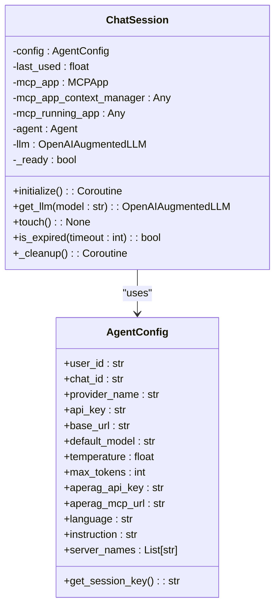
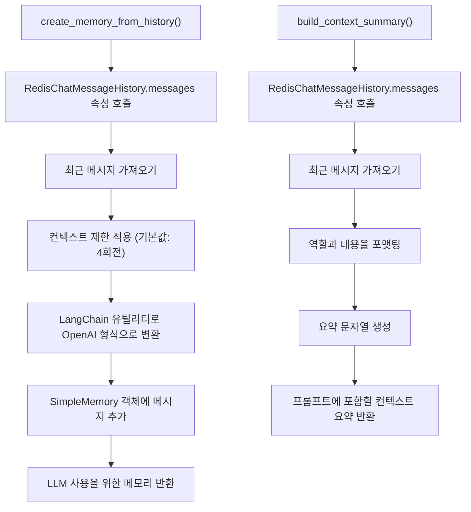
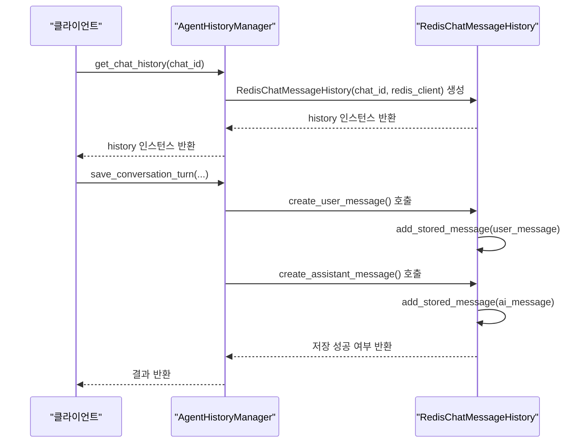
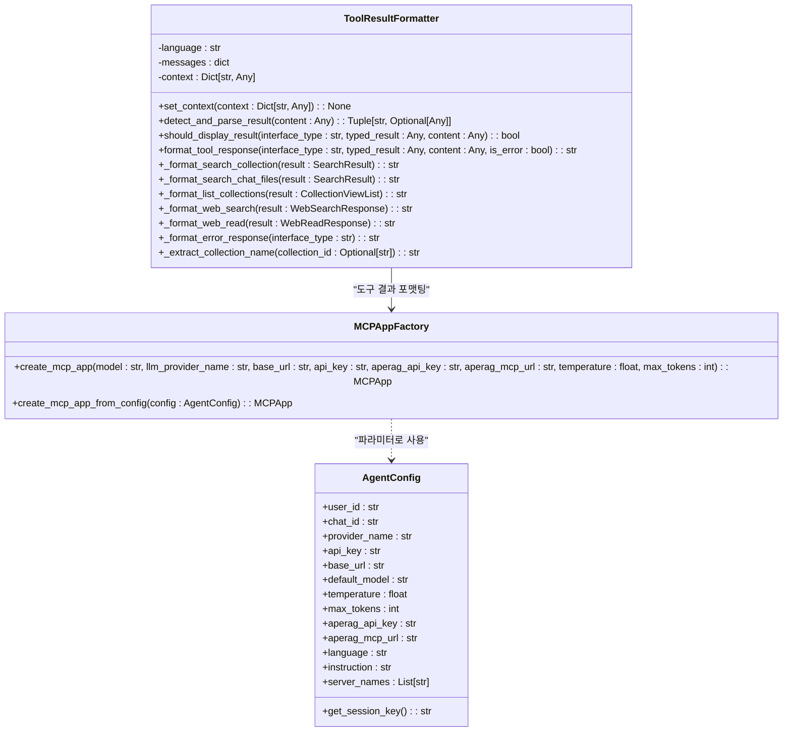
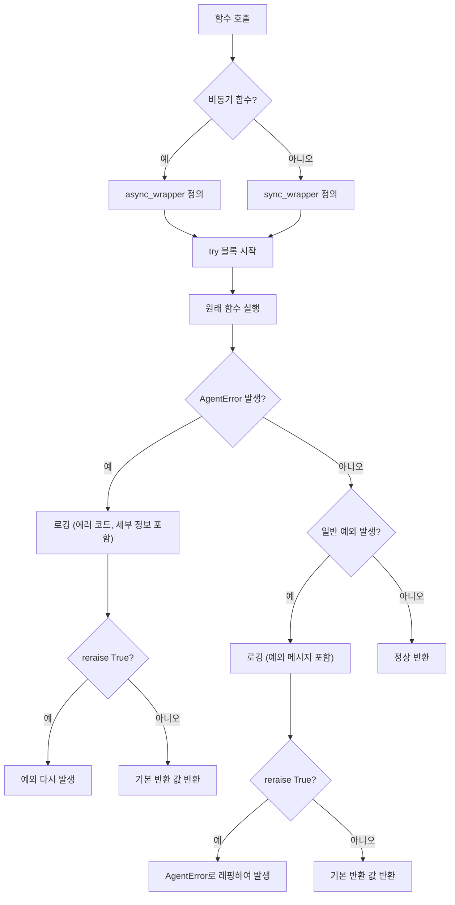
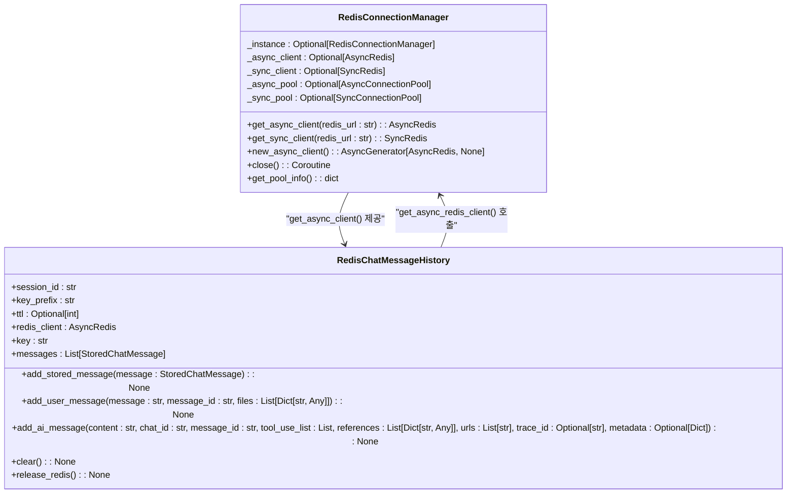

# 지능형 AI 에이전트 시스템

<cite>
**이 문서에서 참조한 파일**
- [agent_session_manager.py](file://aperag/agent/agent_session_manager.py)
- [agent_memory_manager.py](file://aperag/agent/agent_memory_manager.py)
- [agent_history_manager.py](file://aperag/agent/agent_history_manager.py)
- [mcp_app_factory.py](file://aperag/agent/mcp_app_factory.py)
- [tool_use_message_formatters.py](file://aperag/agent/tool_use_message_formatters.py)
- [agent_config.py](file://aperag/agent/agent_config.py)
- [history.py](file://aperag/utils/history.py)
- [message.py](file://aperag/chat/history/message.py)
</cite>

## 목차
1. [소개](#소개)
2. [세션 관리 아키텍처](#세션-관리-아키텍처)
3. [메모리 상태 유지 메커니즘](#메모리-상태-유지-메커니즘)
4. [대화 이력 처리 구조](#대화-이력-처리-구조)
5. [MCP를 통한 도구 사용 메커니즘](#mcp를-통한-도구-사용-메커니즘)
6. [에이전트 대화 흐름 분석](#에이전트-대화-흐름-분석)
7. [오류 처리 전략](#오류-처리-전략)
8. [상태 저장소 통합](#상태-저장소-통합)
9. [커스텀 도구 추가 방법](#커스텀-도구-추가-방법)
10. [결론](#결론)

## 소개
ApeRAG의 지능형 AI 에이전트 시스템은 사용자와의 대화 상태를 유지하고, 외부 도구를 효과적으로 활용하며, 대화 이력을 안정적으로 저장하는 복합적인 아키텍처로 구성되어 있습니다. 본 문서는 세션 관리(`agent_session_manager.py`), 메모리 상태 유지(`agent_memory_manager.py`), 대화 이력 처리(`agent_history_manager.py`)의 내부 동작을 심층적으로 설명하며, MCP(Model Context Protocol)를 통한 도구 사용 메커니즘(`mcp_app_factory.py`, `tool_use_message_formatters.py`)을 상세히 다룹니다. 또한, 에이전트가 외부 도구를 호출하고 응답을 처리하는 전체 흐름과 오류 처리 전략, Redis 또는 DB와의 통합 방식을 포함하여 실제 챗봇 대화에서 에이전트가 어떻게 반응하는지를 단계별로 설명합니다.

## 세션 관리 아키텍처

ApeRAG의 세션 관리는 사용자, 채팅 ID, 제공자 이름을 기반으로 고유한 세션을 생성하고 관리합니다. 각 채팅 세션은 독립된 MCPApp, Agent, LLM 인스턴스를 유지하여 대화 상태와 메모리를 보존합니다. 이는 동일한 제공자가 여러 모델을 서비스할 수 있지만, 각 채팅마다 격리된 세션을 유지해야 한다는 핵심 인사이트를 반영합니다.

**다이어그램 출처**
- [agent_session_manager.py](file://aperag/agent/agent_session_manager.py#L40-L52)
- [agent_config.py](file://aperag/agent/agent_config.py#L21-L52)

**섹션 출처**
- [agent_session_manager.py](file://aperag/agent/agent_session_manager.py#L1-L250)
- [agent_config.py](file://aperag/agent/agent_config.py#L1-L53)

## 메모리 상태 유지 메커니즘

에이전트의 메모리 상태는 `AgentMemoryManager` 클래스를 통해 관리되며, 순수 함수 기반의 구현으로 높은 테스트 가능성을 제공합니다. 이 메커니즘은 Redis에 저장된 채팅 이력을 기반으로 LLM이 사용할 수 있는 메모리 객체를 생성하며, 컨텍스트 창 제한 및 요약 기능을 적용합니다.

**다이어그램 출처**
- [agent_memory_manager.py](file://aperag/agent/agent_memory_manager.py#L40-L99)
- [utils/history.py](file://aperag/utils/history.py#L152-L164)

**섹션 출처**
- [agent_memory_manager.py](file://aperag/agent/agent_memory_manager.py#L1-L140)
- [utils/history.py](file://aperag/utils/history.py#L120-L212)

## 대화 이력 처리 구조

대화 이력은 `AgentHistoryManager` 클래스를 통해 영속적 저장소에 저장되고 검색됩니다. 이 클래스는 순수 함수를 제공하여 외부 종속성이 없고 테스트하기 쉬운 구조를 갖추고 있으며, 대부분의 메서드는 외부 `RedisChatMessageHistory` 인스턴스를 매개변수로 받아야 합니다.

**다이어그램 출처**
- [agent_history_manager.py](file://aperag/agent/agent_history_manager.py#L39-L58)
- [agent_history_manager.py](file://aperag/agent/agent_history_manager.py#L61-L117)
- [utils/history.py](file://aperag/utils/history.py#L120-L212)

**섹션 출처**
- [agent_history_manager.py](file://aperag/agent/agent_history_manager.py#L1-L118)
- [utils/history.py](file://aperag/utils/history.py#L120-L212)

## MCP를 통한 도구 사용 메커니즘

MCP(Model Context Protocol)를 통한 도구 사용은 `MCPAppFactory`와 `ToolResultFormatter` 클래스를 중심으로 이루어집니다. `MCPAppFactory`는 설정 정보를 바탕으로 MCP 애플리케이션 인스턴스를 생성하며, `ToolResultFormatter`는 도구 호출 결과를 사용자에게 친숙한 형식으로 포맷팅합니다.

**다이어그램 출처**
- [mcp_app_factory.py](file://aperag/agent/mcp_app_factory.py#L1-L104)
- [tool_use_message_formatters.py](file://aperag/agent/tool_use_message_formatters.py#L1-L485)

**섹션 출처**
- [mcp_app_factory.py](file://aperag/agent/mcp_app_factory.py#L1-L104)
- [tool_use_message_formatters.py](file://aperag/agent/tool_use_message_formatters.py#L1-L485)

## 에이전트 대화 흐름 분석

실제 챗봇 대화에서 에이전트는 다음과 같은 단계별 흐름을 따릅니다:

1. **세션 생성**: 사용자의 요청이 들어오면 `get_or_create_session()` 함수를 호출하여 `AgentConfig`를 기반으로 세션 키를 생성합니다.
2. **세션 확인**: `_chat_sessions` 전역 딕셔너리에서 해당 세션 키가 존재하고 준비 상태이며 만료되지 않았는지 확인합니다.
3. **세션 초기화**: 새로운 세션이 필요한 경우, `ChatSession` 인스턴스를 생성하고 `initialize()` 메서드를 비동기적으로 호출합니다.
4. **MCP 앱 생성**: `MCPAppFactory.create_mcp_app_from_config()`을 사용하여 MCP 앱을 생성하고 실행합니다.
5. **에이전트 생성**: 재사용 가능한 `Agent` 인스턴스를 생성하고, `attach_llm()`을 통해 LLM 인스턴스를 연결합니다.
6. **메모리 생성**: `AgentMemoryManager.create_memory_from_history()`를 호출하여 Redis에서 대화 이력을 가져와 LLM 메모리를 생성합니다.
7. **도구 호출**: LLM이 도구 사용 결정을 내리면, `ToolResultFormatter`가 도구 호출 결과를 감지하고 파싱한 후 사용자에게 친숙한 형식으로 포맷팅합니다.
8. **이력 저장**: `AgentHistoryManager.save_conversation_turn()`을 사용하여 사용자 질의와 AI 응답을 Redis에 저장합니다.
9. **응답 전송**: 포맷팅된 도구 사용 메시지와 최종 응답을 클라이언트에 전송합니다.

이러한 흐름은 사용자와의 대화를 자연스럽고 일관되게 유지하면서도 외부 도구를 효과적으로 활용할 수 있도록 설계되었습니다.

**섹션 출처**
- [agent_session_manager.py](file://aperag/agent/agent_session_manager.py#L146-L176)
- [agent_memory_manager.py](file://aperag/agent/agent_memory_manager.py#L40-L99)
- [agent_history_manager.py](file://aperag/agent/agent_history_manager.py#L61-L117)
- [tool_use_message_formatters.py](file://aperag/agent/tool_use_message_formatters.py#L1-L485)

## 오류 처리 전략

ApeRAG은 다양한 수준에서 체계적인 오류 처리 전략을 적용하고 있습니다. 가장 중요한 것은 `handle_agent_error` 데코레이터로, 이는 에이전트 관련 오류를 일관된 로깅과 함께 처리합니다.

또한, 각 컴포넌트는 자체적인 오류 처리를 수행합니다:
- `ChatSession.initialize()`: 세션 초기화 실패 시 자동 정리 후 `AgentConfigurationError` 발생
- `AgentHistoryManager.save_conversation_turn()`: 저장 실패 시 False 반환 및 로깅
- `AgentMemoryManager.create_memory_from_history()`: 이력 로드 실패 시 빈 메모리 반환 및 경고 로깅

이러한 계층적 오류 처리 전략은 시스템의 안정성과 신뢰성을 크게 향상시킵니다.

**다이어그램 출처**
- [exceptions.py](file://aperag/agent/exceptions.py#L398-L454)

**섹션 출처**
- [exceptions.py](file://aperag/agent/exceptions.py#L29-L40)
- [agent_session_manager.py](file://aperag/agent/agent_session_manager.py#L100-L130)
- [agent_history_manager.py](file://aperag/agent/agent_history_manager.py#L61-L117)
- [agent_memory_manager.py](file://aperag/agent/agent_memory_manager.py#L40-L99)

## 상태 저장소 통합

ApeRAG은 주로 Redis를 상태 저장소로 사용하며, 이를 효율적으로 관리하기 위해 `RedisConnectionManager` 클래스를 제공합니다. 이 클래스는 동기 및 비동기 작업 모두를 지원하는 Redis 연결 관리자를 구현하며, redis-py의 내장 연결 풀링 기능을 활용합니다.

`RedisChatMessageHistory` 클래스는 Redis에 채팅 메시지를 저장하고 검색하는 데 사용되며, `RedisConnectionManager`로부터 비동기 클라이언트를 얻습니다. 이 구조는 연결 풀을 공유하여 여러 Redis 작업에 대한 연결 오버헤드를 피하고, 전역적으로 효율적인 인스턴스를 제공합니다.

**다이어그램 출처**
- [db/redis_manager.py](file://aperag/db/redis_manager.py#L30-L215)
- [utils/history.py](file://aperag/utils/history.py#L120-L212)

**섹션 출처**
- [db/redis_manager.py](file://aperag/db/redis_manager.py#L1-L238)
- [utils/history.py](file://aperag/utils/history.py#L120-L212)

## 커스텀 도구 추가 방법

개발자는 ApeRAG 시스템에 커스텀 도구를 추가할 수 있습니다. 이를 위해서는 다음 단계를 따르면 됩니다:

1. **도구 스키마 정의**: 먼저, 도구의 입력과 출력을 정의하는 Pydantic 모델을 생성합니다.
2. **도구 서버 구현**: `mcp` 패키지 내에서 도구 서버를 구현하고, `@tool` 데코레이터를 사용하여 도구를 등록합니다.
3. **MCP 설정 업데이트**: `mcp_app_factory.py`에서 생성되는 `Settings` 객체에 새 도구 서버를 추가합니다.
4. **결과 포맷터 확장**: `tool_use_message_formatters.py`의 `ToolResultFormatter` 클래스에 새 도구 유형에 대한 포맷팅 메서드를 추가합니다.
5. **국제화 메시지 추가**: `i18n.py` 파일에 새 도구의 표시 이름과 요청/응답 메시지를 다국어로 추가합니다.

예를 들어, 날씨 조회 도구를 추가하려면 `format_tool_response()` 메서드에 `_format_weather_query()` 메서드를 추가하고, `detect_and_parse_result()`에서 날씨 결과를 감지하도록 조건을 확장해야 합니다. 이렇게 하면 시스템은 새 도구의 결과를 자동으로 감지하고 사용자에게 친숙한 형식으로 표시할 수 있습니다.

**섹션 출처**
- [tool_use_message_formatters.py](file://aperag/agent/tool_use_message_formatters.py#L1-L485)
- [mcp_app_factory.py](file://aperag/agent/mcp_app_factory.py#L1-L104)
- [i18n.py](file://aperag/agent/i18n.py)

## 결론

ApeRAG의 지능형 AI 에이전트 시스템은 세션 관리, 메모리 상태 유지, 대화 이력 처리, 도구 사용 메커니즘을 철저하게 분리하고 각각의 책임을 명확히 함으로써 높은 유지보수성과 확장성을 달성했습니다. MCP 프로토콜을 통해 외부 도구를 유연하게 통합할 수 있으며, Redis를 활용한 효율적인 상태 저장소 통합을 통해 대규모 대화를 안정적으로 처리할 수 있습니다. 개발자는 제공된 구조를 따라 커스텀 도구를 쉽게 추가할 수 있어, 다양한 비즈니스 요구사항에 맞춰 시스템을 확장할 수 있습니다. 이러한 아키텍처는 복잡한 AI 에이전트 시스템을 설계하고 구현하는 데 있어 우수한 사례를 제공합니다.