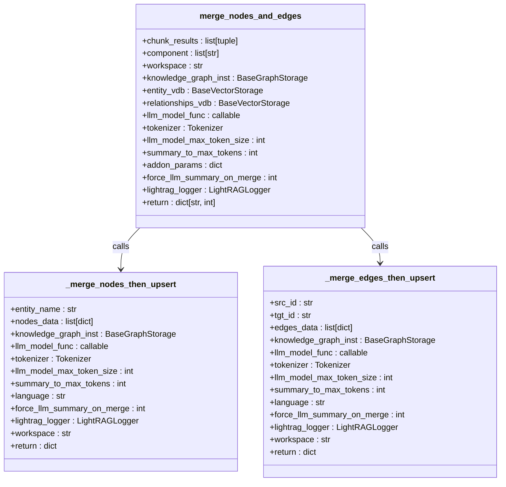
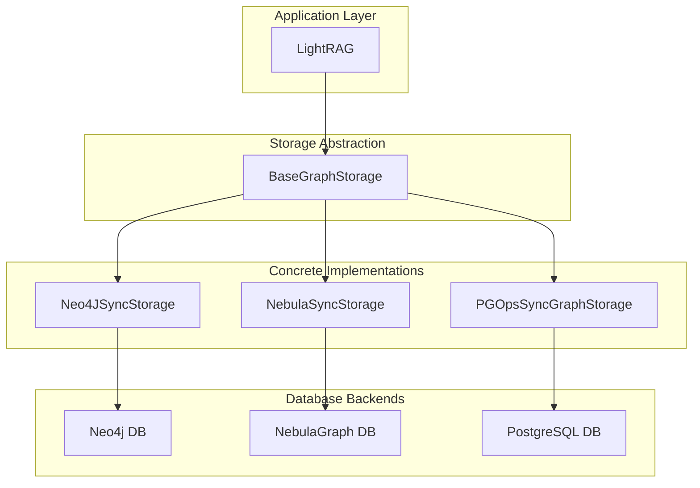
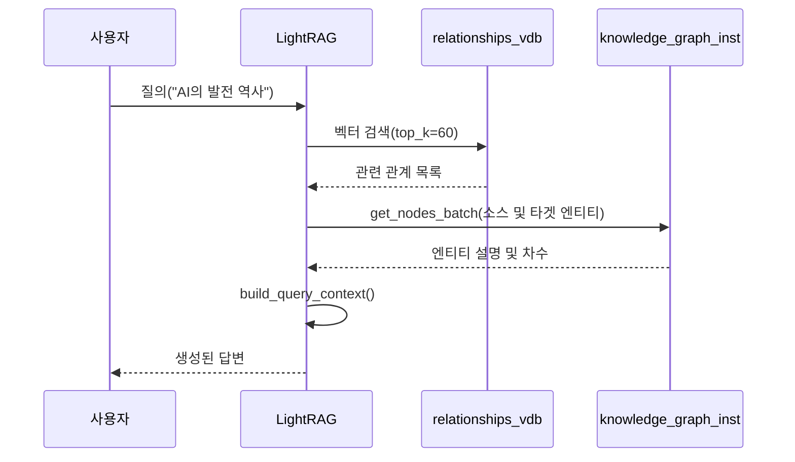

# 지식 그래프 기반 RAG (LightRAG)

<cite>
**이 문서에서 참조한 파일**
- [lightrag.py](file://aperag/graph/lightrag/lightrag.py)
- [operate.py](file://aperag/graph/lightrag/operate.py)
- [prompt.py](file://aperag/graph/lightrag/prompt.py)
- [base.py](file://aperag/graph/lightrag/base.py)
- [neo4j_sync_impl.py](file://aperag/graph/lightrag/kg/neo4j_sync_impl.py)
- [nebula_sync_impl.py](file://aperag/graph/lightrag/kg/nebula_sync_impl.py)
- [pg_ops_sync_graph_storage.py](file://aperag/graph/lightrag/kg/pg_ops_sync_graph_storage.py)
- [graph.py](file://aperag/db/repositories/graph.py)
</cite>

## 목차
1. [소개](#소개)
2. [핵심 구성 요소](#핵심-구성-요소)
3. [엔티티 및 관계 추출](#엔티티-및-관계-추출)
4. [지식 그래프 생성 및 저장](#지식-그래프-생성-및-저장)
5. [그래프 기반 질의 확장 및 경로 탐색](#그래프-기반-질의-확장-및-경로-탐색)
6. [동시성 문제 해결 및 성능 최적화](#동시성-문제-해결-및-성능-최적화)
7. `lightrag.py` 주요 메서드 분석
8. [그래프 검색 대 벡터 검색](#그래프-검색-대-벡터-검색)
9. [결론](#결론)

## 소개

LightRAG은 원본 LightRAG 프로젝트를 기반으로 ApeCloud 팀이 광범위하게 수정한 지식 그래프 기반 검색 증강 생성(Retrieval-Augmented Generation, RAG) 시스템입니다. 이 시스템은 문서에서 엔티티와 관계를 추출하고 이를 Neo4j 또는 NebulaGraph와 같은 그래프 데이터베이스에 저장함으로써 복잡한 정보 간의 연결을 효과적으로 모델링합니다. 본 문서는 LightRAG의 핵심 아키텍처, 엔티티 추출 프로세스, 지식 그래프 생성 및 저장 메커니즘, 그래프 기반 질의 처리 알고리즘, 그리고 동시성 문제 해결과 성능 최적화를 위한 개선 사항을 설명합니다.

## 핵심 구성 요소

LightRAG 시스템은 다음과 같은 핵심 구성 요소들로 이루어져 있습니다:

*   **`LightRAG` 클래스**: 시스템의 중심적인 인터페이스로서, 문서 삽입, 그래프 인덱싱, 질의 수행 등의 주요 작업을 조정합니다.
*   **`extract_entities` 함수**: LLM을 활용하여 텍스트 청크에서 엔티티와 관계를 추출하는 핵심 함수입니다.
*   **`merge_nodes_and_edges` 함수**: 중복된 엔티티와 관계를 병합하고 지식 그래프에 업데이트하는 함수입니다.
*   **`BaseGraphStorage` 인터페이스**: 다양한 그래프 백엔드(Neo4j, NebulaGraph, PostgreSQL)를 추상화하는 기본 인터페이스입니다.
*   **`Neo4JSyncStorage`, `NebulaSyncStorage`, `PGOpsSyncGraphStorage`**: 각각 Neo4j, NebulaGraph, PostgreSQL에 대한 `BaseGraphStorage` 구현체입니다.
*   **`PROMPTS`**: 엔티티 추출, 요약 생성 등에 사용되는 LLM 프롬프트 템플릿 집합입니다.

이러한 구성 요소들은 상태 없는(stateless) 인터페이스를 통해 설계되어 있으며, Celery/Prefect와 같은 작업 큐와의 통합을 용이하게 합니다.

**Section sources**
- [lightrag.py](file://aperag/graph/lightrag/lightrag.py#L1-L100)
- [operate.py](file://aperag/graph/lightrag/operate.py#L1-L100)
- [base.py](file://aperag/graph/lightrag/base.py#L1-L100)

## 엔티티 및 관계 추출

LightRAG의 엔티티 및 관계 추출 프로세스는 `extract_entities` 함수를 중심으로 진행됩니다. 이 과정은 다음과 같은 단계로 이루어집니다.

### 1. 프롬프트 기반 추출
LLM에게 엔티티와 관계를 추출하도록 지시하기 위해 정교한 프롬프트가 사용됩니다. 이 프롬프트는 `prompt.py` 파일의 `PROMPTS["entity_extraction"]`에 정의되어 있습니다. 프롬프트는 다음을 명시합니다:
*   **목표**: 텍스트에서 지정된 유형(예: 조직, 사람, 위치)의 모든 엔티티와 그들 사이의 명확한 관계를 식별하라.
*   **출력 형식**: 엔티티는 `("entity"<|>이름<|>유형<|>설명)` 형식으로, 관계는 `("relationship"<|>소스<|>타겟<|>설명<|>키워드<|>강도)` 형식으로 출력해야 한다.
*   **구분자**: `<|>`는 튜플 내부의 필드를, `##`은 레코드를, `<|COMPLETE|>`는 추출 완료를 나타낸다.

```mermaid
flowchart TD
A[입력 텍스트] --> B{LLM 호출}
B --> C["("entity"<|>Alex<|>person<|>...)"<br>"("relationship"<|>Alex<|>Taylor<|>...)"<br><|COMPLETE|>]
C --> D[레코드 파싱]
D --> E[엔티티 및 관계 리스트]
```

**Diagram sources**
- [prompt.py](file://aperag/graph/lightrag/prompt.py#L100-L200)
- [operate.py](file://aperag/graph/lightrag/operate.py#L642-L814)

### 2. 결과 파싱 및 유효성 검사
LLM의 응답은 `split_string_by_multi_markers` 함수를 사용하여 `##` 및 `<|COMPLETE|>` 구분자를 기준으로 여러 레코드로 분할됩니다. 각 레코드는 정규 표현식을 통해 `(...)` 안의 내용을 추출한 후, `<|>` 구분자로 다시 나누어 속성을 얻습니다. `_handle_single_entity_extraction` 및 `_handle_single_relationship_extraction` 함수는 추출된 속성이 유효한지 확인하고, 필요시 이름을 정규화하며, 소스 ID와 파일 경로를 추가합니다.

### 3. 반복적 추출(Gleaning)
단일 추출만으로 모든 엔티티를 포착하기 어려울 수 있으므로, LightRAG은 "gleaning"이라는 반복적 추출 메커니즘을 사용합니다. 초기 추출 후, `entity_continue_extraction` 프롬프트를 사용하여 LLM에게 누락된 엔티티나 관계가 있는지 물어봅니다. 이 과정은 `entity_if_loop_extraction` 프롬프트가 "yes"라고 답할 때까지 반복되며, 최대 횟수는 `entity_extract_max_gleaning` 매개변수로 제어됩니다.

**Section sources**
- [prompt.py](file://aperag/graph/lightrag/prompt.py#L100-L200)
- [operate.py](file://aperag/graph/lightrag/operate.py#L152-L230)
- [operate.py](file://aperag/graph/lightrag/operate.py#L642-L814)

## 지식 그래프 생성 및 저장

추출된 엔티티와 관계는 지식 그래프에 저장되기 전에 중복 제거 및 병합 과정을 거칩니다. 이 과정은 `merge_nodes_and_edges` 함수에 의해 수행됩니다.

### 1. 연결된 구성 요소 찾기
먼저, `_find_connected_components` 함수는 추출된 엣지를 기반으로 엔티티들을 연결된 구성 요소(connected components)로 그룹화합니다. 예를 들어, "A-B", "B-C"라는 관계가 있다면 A, B, C는 하나의 구성 요소로 묶입니다. 이는 병렬 처리를 가능하게 하여 성능을 향상시킵니다.

### 2. 노드 및 엣지 병합
각 구성 요소에 대해 `_merge_nodes_then_upsert` 및 `_merge_edges_then_upsert` 함수가 호출됩니다. 이 함수들은 동일한 이름의 엔티티 또는 동일한 소스-타겟 쌍의 관계를 병합합니다.

*   **노드 병합**: 동일한 엔티티 이름에 대해, 가장 빈도가 높은 엔티티 유형을 선택하고, 설명(description)은 `GRAPH_FIELD_SEP`(`<SEP>`)로 연결된 문자열로 결합합니다. 만약 설명 조각의 수가 `force_llm_summary_on_merge` 임계값을 초과하면, `summarize_entity_descriptions` 프롬프트를 사용하여 LLM이 요약을 생성합니다.
*   **엣지 병합**: 관계 강도(weight)는 단순히 더해지고, 설명과 키워드는 위와 동일한 방식으로 결합됩니다.



**Diagram sources**
- [operate.py](file://aperag/graph/lightrag/operate.py#L492-L521)
- [operate.py](file://aperag/graph/lightrag/operate.py#L232-L490)

### 3. 그래프 백엔드 저장
병합된 노드와 엣지는 `upsert_node` 및 `upsert_edge` 메서드를 통해 지식 그래프 스토리지에 저장됩니다. LightRAG은 세 가지 주요 백엔드를 지원합니다.

#### Neo4j 저장
`Neo4JSyncStorage`는 동기 드라이버를 비동기 인터페이스로 감싸는 방식으로 구현됩니다. `MERGE` 문을 사용하여 노드를 삽입하거나 업데이트하며, `DIRECTED` 라벨을 가진 엣지를 생성합니다. `tenacity` 라이브러리를 사용하여 서비스 불가능(ServiceUnavailable) 오류에 대한 재시도 로직을 포함합니다.

#### NebulaGraph 저장
`NebulaSyncStorage` 역시 동기 드라이버를 사용합니다. `UPSERT VERTEX` 및 `UPSERT EDGE` 문을 사용하여 진정한 upsert 동작을 구현합니다. VID(정점 ID)에 특수 문자가 포함될 수 있으므로, `_quote_vid` 함수를 사용하여 안전하게 따옴표로 묶습니다.

#### PostgreSQL 저장
`PGOpsSyncGraphStorage`는 SQLAlchemy ORM을 사용하여 `LightRAGGraphNode` 및 `LightRAGGraphEdge` 모델과 상호 작용합니다. `INSERT ... ON CONFLICT DO UPDATE` (Upsert) SQL 문을 사용하여 노드와 엣지를 효율적으로 저장합니다. 이 접근법은 OLTP 데이터베이스 기술 스택과 일관성을 유지합니다.



**Diagram sources**
- [neo4j_sync_impl.py](file://aperag/graph/lightrag/kg/neo4j_sync_impl.py#L1-L100)
- [nebula_sync_impl.py](file://aperag/graph/lightrag/kg/nebula_sync_impl.py#L1-L100)
- [pg_ops_sync_graph_storage.py](file://aperag/graph/lightrag/kg/pg_ops_sync_graph_storage.py#L1-L100)
- [graph.py](file://aperag/db/repositories/graph.py#L1-L100)

## 그래프 기반 질의 확장 및 경로 탐색

LightRAG은 `aquery_context` 메서드를 통해 다양한 모드(global, local, hybrid 등)로 질의를 처리합니다. 그래프 기반 질의 확장과 경로 탐색은 주로 `global` 모드에서 발생합니다.

### 1. 글로벌 모드(Global Mode)
글로벌 모드는 전체 지식 그래프를 탐색하여 질의와 관련된 관계를 찾습니다. `kg_query` 함수는 이 과정을 담당합니다.

1.  **벡터 검색**: 먼저, 질의(query)의 임베딩을 사용하여 `relationships_vdb`(관계 벡터 저장소)에서 관련된 관계를 `top_k` 개 만큼 검색합니다.
2.  **노드 확장**: 검색된 관계의 소스(source) 및 타겟(target) 엔티티 이름을 수집합니다.
3.  **노드 정보 가져오기**: `_find_most_related_entities_from_relationships` 함수는 `get_nodes_batch`를 사용하여 이 엔티티들의 설명(description)과 차수(degree)를 한 번에 가져옵니다. 차수는 노드의 중요도를 나타내는 순위(rank)로 사용됩니다.
4.  **컨텍스트 구성**: 엔티티 설명, 관계 설명, 원본 텍스트 청크 등을 `build_query_context` 함수를 사용하여 최종 컨텍스트로 구성합니다.



**Diagram sources**
- [lightrag.py](file://aperag/graph/lightrag/lightrag.py#L1734-L1761)
- [operate.py](file://aperag/graph/lightrag/operate.py#L1655-L1693)

### 2. 경로 탐색
`get_knowledge_graph` 메서드는 특정 노드 레이블을 시작점으로 하여 최대 깊이(max_depth)까지 BFS(Breadth-First Search)를 수행하여 연결된 하위 그래프를 반환합니다. 이는 특정 개념 주변의 정보 네트워크를 시각화하거나 탐색하는 데 유용합니다.

## 동시성 문제 해결 및 성능 최적화

원본 LightRAG은 전역 상태를 사용하여 동시성 문제를 겪었으나, ApeRAG 버전은 이를 해결하기 위해 다음과 같은 중요한 개선 사항을 도입했습니다.

### 1. 상태 없는(Stateless) 인터페이스
`ainset_and_chunk_document`, `aprocess_graph_indexing`, `aquery_context`와 같은 주요 메서드는 이제 상태를 유지하지 않습니다. 이는 여러 작업이 동시에 실행될 수 있도록 하며, Celery와 같은 분산 작업 큐와의 통합을 가능하게 합니다.

### 2. 세분화된 잠금(Fine-grained Locking)
`_merge_nodes_and_edges_impl` 함수는 엔티티 및 관계 별로 고유한 잠금을 생성합니다. 예를 들어, 엔티티 "Apple Inc"를 병합할 때는 `entity:Apple Inc:workspace1`이라는 이름의 잠금을 사용합니다. 이렇게 하면 서로 다른 엔티티에 대한 병합 작업이 서로를 차단하지 않고 병렬로 실행될 수 있어 성능이 크게 향상됩니다.

```python
# 코드 스니펫 대신 섹션 소스 참조
```

**Section sources**
- [lightrag.py](file://aperag/graph/lightrag/lightrag.py#L1000-L1200)
- [operate.py](file://aperag/graph/lightrag/operate.py#L492-L521)
- [concurrent_control](file://aperag/concurrent_control)

### 3. 배치 연산 최적화
`get_nodes_batch`, `node_degrees_batch`, `get_edges_batch` 등의 메서드는 여러 항목을 한 번의 데이터베이스 쿼리로 가져오는 배치 연산을 제공합니다. 이는 네트워크 왕복 시간을 줄이고 성능을 극대화합니다. 특히 `PGOpsSyncGraphStorage`의 배치 연산은 `UNNEST` 및 CTE(Common Table Expression)를 사용하여 매우 효율적인 SQL 쿼리를 생성합니다.

### 4. 비동기 처리
전체 시스템은 `asyncio`를 기반으로 설계되어 있으며, I/O 바운드 작업(데이터베이스 호출, LLM API 호출)은 비동기적으로 처리됩니다. `asyncio.Semaphore`는 LLM 호출과 같은 리소스 집약적인 작업의 동시성을 제어합니다.

## `lightrag.py` 주요 메서드 분석

### `build_kg` 메서드
`build_kg`에 해당하는 핵심 메서드는 `aprocess_graph_indexing`입니다. 이 메서드는 이미 청크화된 문서를 받아 지식 그래프를 생성하는 과정을 캡슐화합니다.

1.  **엔티티 추출**: `extract_entities` 함수를 호출하여 모든 청크에서 엔티티와 관계를 병렬로 추출합니다.
2.  **그룹화 및 병합**: `_grouping_process_chunk_results` 함수를 호출하여 연결된 구성 요소를 찾고