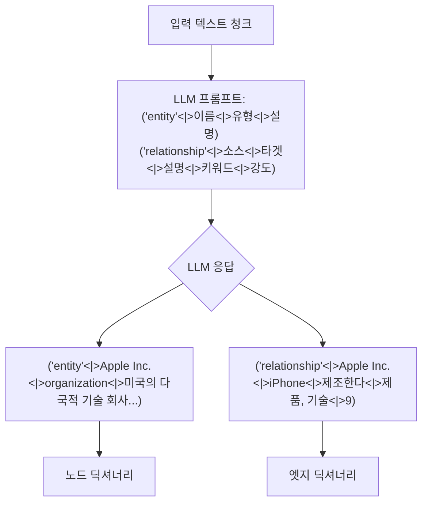
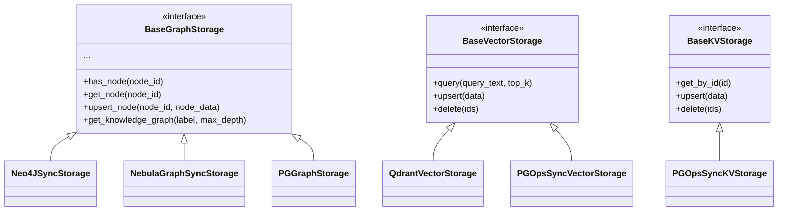
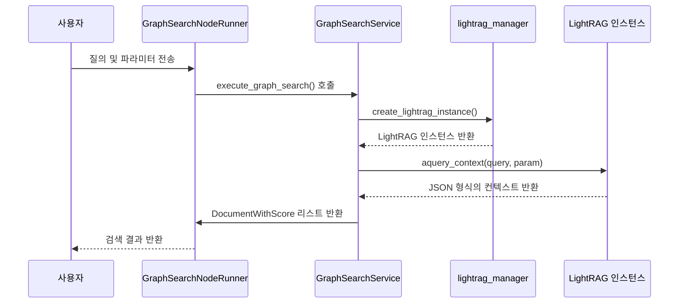

# 그래프 기반 검색

<cite>
**이 문서에서 참조한 파일**
- [lightrag.py](file://aperag/graph/lightrag/lightrag.py)
- [graph_search.py](file://aperag/flow/runners/graph_search.py)
- [operate.py](file://aperag/graph/lightrag/operate.py)
- [prompt.py](file://aperag/graph/lightrag/prompt.py)
- [types.py](file://aperag/graph/lightrag/types.py)
- [base.py](file://aperag/graph/lightrag/base.py)
- [lightrag_manager.py](file://aperag/graph/lightrag_manager.py)
</cite>

## 목차
1. [소개](#소개)
2. [엔티티 및 관계 추출과 지식 그래프 생성](#엔티티-및-관계-추출과-지식-그래프-생성)
3. [그래프 저장소 통합](#그래프-저장소-통합)
4. [의미 기반 검색 메커니즘](#의미-기반-검색-메커니즘)
5. [경로 탐색 및 연결 구성 요소 최적화](#경로-탐색-및-연결-구성-요소-최적화)
6. [컨텍스트 확장 및 다중 홉 추론](#컨텍스트-확장-및-다중-홉-추론)
7. [KG 생성 주기 및 엔티티 정규화 전략 조정](#kg-생성-주기-및-엔티티-정규화-전략-조정)
8. [결론](#결론)

## 소개
LightRAG 기반 그래프 검색은 문서 내의 의미 있는 정보를 구조화된 지식 그래프(KG)로 변환하여 보다 깊이 있고 맥락에 기반한 검색을 가능하게 하는 고급 RAG(Retrieval-Augmented Generation) 접근 방식입니다. 이 시스템은 단순한 키워드 매칭을 넘어, 문서에서 추출된 엔티티(사람, 조직, 개념 등)와 그들 사이의 관계를 분석함으로써 복잡한 질의에 대한 답변을 생성합니다. 본 문서는 `lightrag.py`와 `graph_search.py` 코드를 중심으로 하여, 엔티티 추출부터 그래프 저장, 의미 기반 검색 수행에 이르는 전체 내부 동작을 심층적으로 설명합니다.

**Section sources**
- [lightrag.py](file://aperag/graph/lightrag/lightrag.py#L0-L1825)
- [graph_search.py](file://aperag/flow/runners/graph_search.py#L0-L110)

## 엔티티 및 관계 추출과 지식 그래프 생성
LightRAG 시스템의 핵심은 원시 텍스트에서 구조화된 지식을 자동으로 추출하는 능력에 있습니다. 이 과정은 다음과 같은 단계로 이루어집니다.

### 1. 문서 청크화 (Document Chunking)
대용량 문서를 처리하기 위해, 먼저 `chunking_by_token_size` 함수를 사용하여 문서를 고정된 토큰 크기의 작은 청크(chunks)로 분할합니다. 이때 인접한 청크 간에 일정 수의 토큰을 겹치게 함으로써 문맥의 연속성을 유지합니다. 이 작업은 `ainsert_and_chunk_document` 메서드 내에서 수행되며, 각 청크는 고유한 ID와 함께 벡터 스토리지(`chunks_vdb`)와 키-값 스토리지(`text_chunks`)에 저장됩니다.

### 2. LLM 기반 엔티티 및 관계 추출
분할된 각 청크는 대형 언어 모델(LLM)에 입력되어, 내부에 포함된 모든 엔티티와 관계를 추출합니다. 이 과정은 `extract_entities` 함수에서 구현됩니다.

LLM은 사전 정의된 형식(PROMPTS["entity_extraction"])에 따라 출력을 생성합니다. 예를 들어, "Apple Inc."라는 엔티티는 `("entity"<|>Apple Inc.<|>organization<|>미국의 다국적 기술 회사...)`와 같은 튜플 형태로 추출됩니다. 마찬가지로, "Apple Inc."와 "iPhone" 사이의 관계는 `("relationship"<|>Apple Inc.<|>iPhone<|>제조한다<|>제품, 기술<|>9)`와 같이 표현됩니다. 이 과정은 `entity_extract_max_gleaning` 설정에 따라 여러 번 반복될 수 있으며, 초기 추출에서 놓친 항목들을 보완합니다.

### 3. 지식 그래프로의 변환 및 저장
추출된 노드와 엣지 데이터는 `merge_nodes_and_edges` 함수를 통해 지식 그래프로 통합됩니다. 이 함수는 연결된 구성 요소(connected components) 알고리즘을 사용하여 관련된 엔티티 그룹을 식별하고, 각 그룹을 병렬로 처리합니다. 기존에 존재하는 동일한 이름의 엔티티가 있다면, 새로운 설명과 기존 설명을 `<SEP>` 문자로 결합하여 하나의 엔티티로 병합합니다. 이 병합된 엔티티는 `chunk_entity_relation_graph`라는 그래프 스토리지에 저장되며, 동시에 `entities_vdb`와 `relationships_vdb`라는 벡터 스토리지에도 임베딩과 함께 저장되어 후속 검색을 위한 색인 역할을 합니다.

**Diagram sources**
- [operate.py](file://aperag/graph/lightrag/operate.py#L0-L2516)
- [lightrag.py](file://aperag/graph/lightrag/lightrag.py#L0-L1825)

**Section sources**
- [lightrag.py](file://aperag/graph/lightrag/lightrag.py#L0-L1825)
- [operate.py](file://aperag/graph/lightrag/operate.py#L0-L2516)
- [prompt.py](file://aperag/graph/lightrag/prompt.py#L0-L542)

## 그래프 저장소 통합
LightRAG 시스템은 Neo4j 또는 NebulaGraph와 같은 전용 그래프 데이터베이스 외에도, 다양한 저장소 백엔드를 유연하게 지원합니다. 이 아키텍처는 `BaseGraphStorage`, `BaseVectorStorage`, `BaseKVStorage`라는 추상 기본 클래스를 통해 달성됩니다.

`LightRAG` 클래스는 초기화 시점에 `kv_storage`, `vector_storage`, `graph_storage` 설정 값을 기반으로 적절한 저장소 구현체를 동적으로 선택하고 인스턴스화합니다. 예를 들어, `graph_storage`가 `"Neo4JSyncStorage"`로 설정되어 있으면, Neo4j 데이터베이스와 상호작용하는 `Neo4JSyncStorage` 클래스가 사용됩니다. 이러한 설계는 시스템이 특정 데이터베이스에 종속되지 않고, 다양한 환경에 쉽게 배포될 수 있도록 합니다. 실제 데이터 동기화 로직은 `kg` 디렉토리 내의 `neo4j_sync_impl.py` 또는 `nebula_sync_impl.py`와 같은 파일에 구현되어 있습니다.

**Diagram sources**
- [base.py](file://aperag/graph/lightrag/base.py#L0-L592)
- [lightrag.py](file://aperag/graph/lightrag/lightrag.py#L0-L1825)

**Section sources**
- [lightrag.py](file://aperag/graph/lightrag/lightrag.py#L0-L1825)
- [base.py](file://aperag/graph/lightrag/base.py#L0-L592)

## 의미 기반 검색 메커니즘
그래프 검색은 단순한 텍스트 검색을 넘어서, 질의의 의미를 이해하고 관련된 지식을 맥락과 함께 검색하는 것을 목표로 합니다. 이 과정은 `graph_search.py` 파일의 `GraphSearchNodeRunner` 클래스를 통해 시작됩니다.

### 1. 검색 실행 흐름
사용자가 질의를 제출하면, `GraphSearchService.execute_graph_search` 메서드가 호출됩니다. 이 메서드는 먼저 `lightrag_manager.create_lightrag_instance`를 사용하여 해당 컬렉션(collection)에 대한 `LightRAG` 인스턴스를 생성합니다. 그런 다음, `QueryParam` 객체를 구성하여 검색 모드(mode)를 `hybrid`(하이브리드)로 설정하고, `rag.aquery_context` 메서드를 호출하여 검색 컨텍스트를 생성합니다.

### 2. 키워드 추출 및 검색 모드
`aquery_context` 메서드는 먼저 `extract_keywords_only` 함수를 호출하여 질의에서 고수준(high-level)과 저수준(low-level) 키워드를 추출합니다. 예를 들어, "애플의 주요 제품과 그 특징은?"이라는 질문에서 "애플", "제품"은 저수준 키워드이고, "특징", "비즈니스 모델"은 고수준 키워드가 될 수 있습니다. 이 키워드들은 검색 모드에 따라 다르게 활용됩니다.
- **로컬(Local)**: 저수준 키워드를 사용해 관련 엔티티를 찾고, 그 엔티티와 연결된 텍스트 청크를 가져옵니다.
- **글로벌(Global)**: 고수준 키워드를 사용해 관련 관계를 찾고, 그 관계와 연결된 엔티티 및 청크를 가져옵니다.
- **하이브리드(Hybrid)**: 위 두 가지 방법을 모두 수행하고 결과를 결합합니다.

**Diagram sources**
- [graph_search.py](file://aperag/flow/runners/graph_search.py#L0-L110)
- [lightrag.py](file://aperag/graph/lightrag/lightrag.py#L0-L1825)
- [operate.py](file://aperag/graph/lightrag/operate.py#L0-L2516)

**Section sources**
- [graph_search.py](file://aperag/flow/runners/graph_search.py#L0-L110)
- [lightrag.py](file://aperag/graph/lightrag/lightrag.py#L0-L1825)
- [operate.py](file://aperag/graph/lightrag/operate.py#L0-L2516)

## 경로 탐색 및 연결 구성 요소 최적화
LightRAG의 강력한 검색 기능은 그래프 내에서의 경로 탐색(pathfinding)과 연결 구성 요소(connected components) 분석에 기반합니다.

### 1. 연결 구성 요소 최적화
`_find_connected_components` 함수는 추출된 엔티티와 관계를 기반으로 연결된 구성 요소를 찾습니다. 이 알고리즘은 BFS(Breadth-First Search)를 사용하여, 서로 연결된 엔티티들의 그룹(예: "애플", "아이폰", "스티브 잡스")을 식별합니다. 이는 성능을 극대화하기 위해 중요합니다. 시스템은 각 연결 구성 요소를 독립적인 작업 단위로 처리하여, 병렬로 처리할 수 있습니다. 이를 통해 큰 그래프에서도 효율적으로 엔티티 병합이나 검색 작업을 수행할 수 있습니다.

### 2. 경로 기반 컨텍스트 확장
검색 중에는 단순히 직접 연결된 노드만 찾는 것이 아니라, 그래프를 따라 여러 단계(hops)를 탐색합니다. 예를 들어, 질의가 "아이폰을 만든 사람"이라면, 시스템은 먼저 "아이폰" 엔티티를 찾고, 그로부터 "제조하다" 관계를 통해 "애플" 엔티티로 이동한 후, "애플"과 연결된 "창립자" 관계를 통해 "스티브 잡스"를 찾아냅니다. `_get_edge_data`와 `_get_node_data` 함수는 각각 관계 중심과 엔티티 중심의 탐색을 수행하며, `max_depth` 매개변수를 통해 탐색 깊이를 제어합니다. 이 과정은 `get_knowledge_graph` 메서드를 통해 시각화할 수도 있습니다.

**Section sources**
- [lightrag.py](file://aperag/graph/lightrag/lightrag.py#L0-L1825)
- [operate.py](file://aperag/graph/lightrag/operate.py#L0-L2516)

## 컨텍스트 확장 및 다중 홉 추론
LightRAG의 가장 중요한 특징 중 하나는 다중 홉 추론(multi-hop reasoning)을 통해 컨텍스트를 확장하는 능력입니다. 이는 `build_query_context` 함수에서 구현됩니다.

1.  **초기 컨텍스트 수집**: `kg_query` 함수는 질의의 키워드를 기반으로, `_get_node_data` 또는 `_get_edge_data`를 호출하여 초기 엔티티, 관계, 텍스트 청크를 수집합니다.
2.  **관련 정보 확장**: 수집된 초기 엔티티를 기반으로, `_find_most_related_text_unit_from_entities` 함수는 해당 엔티티들이 속한 원본 텍스트 청크를 찾습니다. 또한, `_find_most_related_edges_from_entities` 함수는 초기 엔티티들과 연결된 다른 관계들을 추가로 탐색합니다.
3.  **컨텍스트 결합 및 요약**: 이렇게 확장된 모든 정보(엔티티 설명, 관계 설명, 원본 텍스트)는 `process_combine_contexts` 함수를 통해 중복을 제거하고 결합됩니다. 이후, 이 결합된 컨텍스트는 LLM에게 제공되는 시스템 프롬프트(PROMPTS["rag_response"])의 일부로 삽입됩니다. 이 프롬프트는 LLM에게 "제공된 지식 그래프와 문서 청크를 바탕으로 질문에 답하라"는 명령을 내리며, LLM은 이 확장된 컨텍스트를 활용하여 더 정확하고 포괄적인 답변을 생성합니다.

이러한 절차 덕분에, LightRAG은 단편적인 정보를 연결하여 인간과 유사한 추론을 수행할 수 있습니다.

**Section sources**
- [lightrag.py](file://aperag/graph/lightrag/lightrag.py#L0-L1825)
- [operate.py](file://aperag/graph/lightrag/operate.py#L0-L2516)

## KG 생성 주기 및 엔티티 정규화 전략 조정
시스템의 동작 방식은 다양한 설정을 통해 세밀하게 조정할 수 있습니다.

### 1. KG 생성 주기 조정
KG 생성 주기는 주로 `chunk_token_size`와 `chunk_overlap_token_size` 설정을 통해 제어됩니다. 더 작은 청크 크기를 설정하면 더 많은 청크가 생성되고, 이는 더 세밀한 엔티티 추출을 가능하게 하지만 처리 시간이 증가합니다. 반대로, 더 큰 청크는 처리 속도를 높이지만, 문맥이 너무 넓어져 관련 없는 엔티티가 함께 추출될 위험이 있습니다. 또한, `entity_extract_max_gleaning` 설정을 통해 LLM이 추출을 반복하는 횟수를 조정할 수 있어, 정확도와 비용 사이의 균형을 맞출 수 있습니다.

### 2. 엔티티 정규화 전략
엔티티 정규화는 동일한 실체를 가리키는 다양한 표현을 통합하는 과정입니다. LightRAG은 두 가지 수준의 전략을 사용합니다.
- **자동 병합(Merge Suggestions)**: `agenerate_merge_suggestions` 메서드는 LLM을 사용하여 병합이 필요한 엔티티 쌍(예: "Apple Inc.", "Apple")을 제안합니다. 이는 `batch_merge_analysis` 프롬프트를 사용하여 수행되며, 신뢰도 점수(confidence score)를 기반으로 제안을 필터링합니다.
- **수동 병합(Merge Nodes)**: 사용자는 `amerge_nodes` 메서드를 통해 직접 여러 엔티티를 하나로 병합할 수 있습니다. 이 함수는 소스 엔티티의 설명을 `<SEP>`으로 결합하고, 관계를 재지향하며, 벡터 스토리지의 데이터도 업데이트합니다. `force_llm_summary_on_merge` 설정은 설명 조각의 수가 이 값 이상일 때만 LLM을 사용해 요약하도록 하여, 불필요한 LLM 호출을 줄입니다.

**Section sources**
- [lightrag.py](file://aperag/graph/lightrag/lightrag.py#L0-L1825)
- [operate.py](file://aperag/graph/lightrag/operate.py#L0-L2516)
- [prompt.py](file://aperag/graph/lightrag/prompt.py#L0-L542)

## 결론
LightRAG 기반 그래프 검색은 문서를 단순한 텍스트 덩어리가 아닌, 상호 연결된 의미의 네트워크로 변환함으로써 혁신적인 검색 경험을 제공합니다. 엔티티와 관계의 추출, 다양한 그래프 저장소와의 통합, 그리고 경로 탐색을 통한 다중 홉 추론은 복잡한 질의에 대한 깊이 있는 답변을 가능하게 합니다. `lightrag.py`와 `graph_search.py`의 코드 분석을 통해, 이 시스템이 어떻게 상태 없이(stateless) 확장 가능한 아키텍처를 구현하고, 설정을 통해 KG 생성과 엔티티 정규화 전략을 유연하게 조정할 수 있는지를 확인할 수 있었습니다. 이는 지식 기반 애플리케이션의 정확성과 유용성을 크게 향상시키는 강력한 기반을 제공합니다.