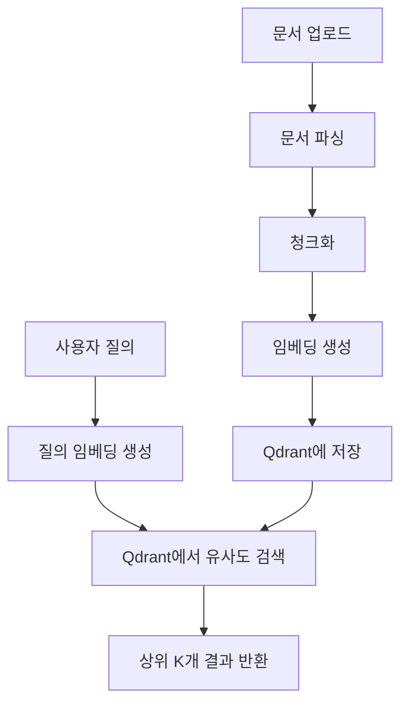
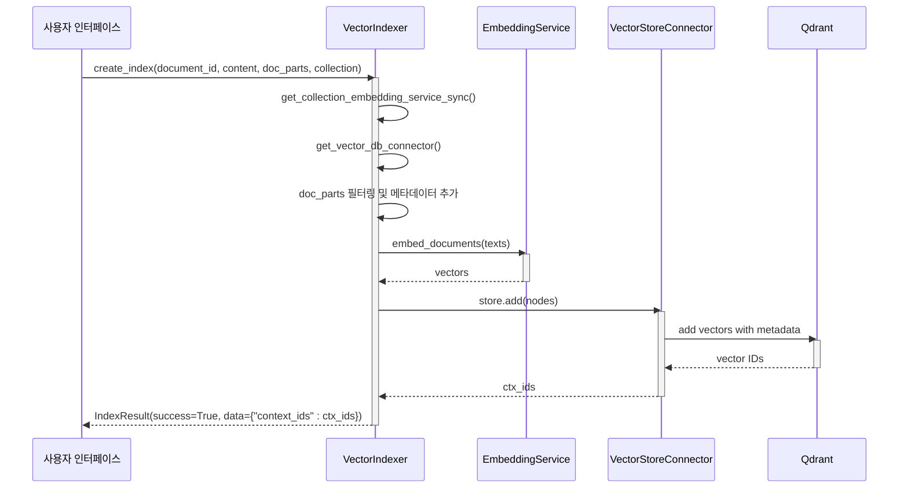
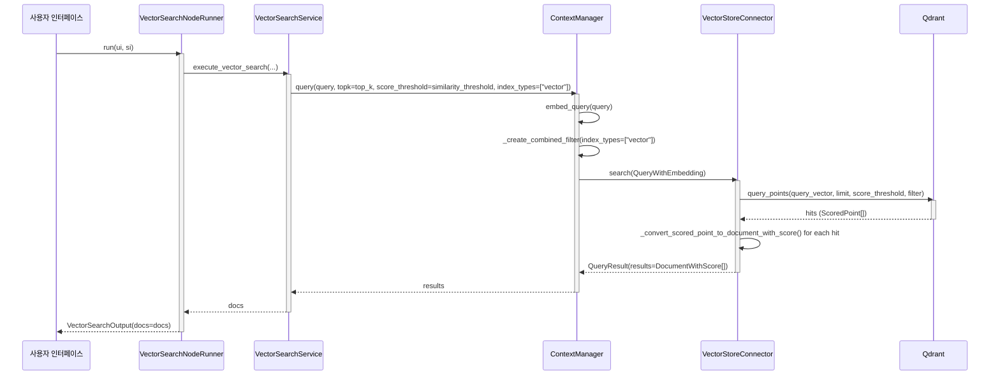
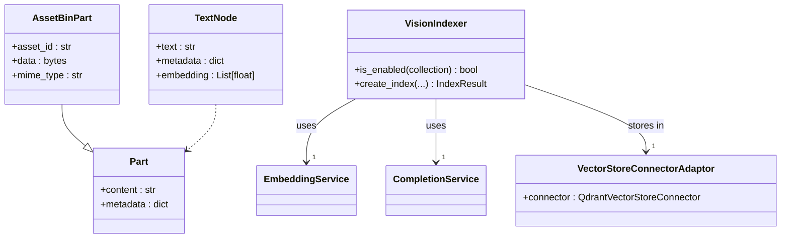

# 벡터 검색

<cite>
**이 문서에서 참조한 파일**
- [vector_index.py](file://aperag/index/vector_index.py)
- [vector_search.py](file://aperag/flow/runners/vector_search.py)
- [qdrant_connector.py](file://aperag/vectorstore/qdrant_connector.py)
- [embedding_service.py](file://aperag/llm/embed/embedding_service.py)
- [context.py](file://aperag/context/context.py)
- [config.py](file://aperag/config.py)
- [vision_index.py](file://aperag/index/vision_index.py)
- [vision_search.py](file://aperag/flow/runners/vision_search.py)
- [chunking.py](file://aperag/docparser/chunking.py)
- [base.py](file://aperag/docparser/base.py)
- [models.py](file://aperag/db/models.py)
</cite>

## 목차
1. [소개](#소개)
2. [벡터 검색 전체 흐름](#벡터-검색-전체-흐름)
3. [임베딩 생성 및 저장 과정](#임베딩-생성-및-저장-과정)
4. [Qdrant 기반 검색 메커니즘](#qdrant-기반-검색-메커니즘)
5. [검색 파라미터와 최적화 전략](#검색-파라미터와-최적화-전략)
6. [멀티모달 콘텐츠 처리 및 비전 인덱스 통합](#멀티모달-콘텐츠-처리-및-비전-인덱스-통합)
7. [HNSW 인덱스 파라미터 조정과 성능 트레이드오프](#hnsw-인덱스-파라미터-조정과-성능-트레이드오프)
8. [API 호출 예제 및 정확도 향상 팁](#api-호출-예제-및-정확도-향상-팁)
9. [결론](#결론)

## 소개
이 문서는 ApeRAG 시스템 내 Qdrant 기반 벡터 검색의 작동 원리를 단계별로 설명합니다. 문서 청크의 임베딩 생성부터 Qdrant에 저장되고, 코사인 유사도 기반으로 검색되는 전체 프로세스를 다룹니다. `vector_index.py`와 `vector_search.py` 코드를 분석하여 검색 파라미터(cosine similarity, top_k 등)의 영향과 최적화 전략을 설명하고, 멀티모달 콘텐츠(이미지 포함) 처리 시 비전 인덱스와의 통합 방식도 포함합니다. 설정 파일에서 HNSW 인덱스 파라미터 조정 방법과 성능 트레이드오프를 안내하며, 실제 API 호출 예제와 함께 정확도 향상을 위한 프롬프트 엔지니어링 팁을 제공합니다.

## 벡터 검색 전체 흐름
ApeRAG의 벡터 검색은 다음과 같은 주요 단계로 구성됩니다:

1.  **문서 파싱**: 사용자가 업로드한 문서(PDF, Word 등)는 `docparser` 모듈을 통해 다양한 형식으로 파싱되어 `Part` 객체의 리스트로 변환됩니다.
2.  **청크화(rechunking)**: 파싱된 `Part`들은 `rechunk()` 함수를 통해 일정 크기(`chunk_size`)와 중첩(`chunk_overlap_size`)을 가지는 더 작은 텍스트 청크들로 나뉩니다. 이 과정에서 제목 계층 구조나 사용자 레이블 정보가 메타데이터로 보존됩니다.
3.  **임베딩 생성**: 각 텍스트 청크는 지정된 임베딩 모델을 사용하여 고차원 벡터(임베딩)로 변환됩니다.
4.  **벡터 저장**: 생성된 임베딩과 함께 메타데이터는 Qdrant 벡터 데이터베이스에 저장됩니다. 이때 `indexer` 필드에 "vector"라는 태그가 추가되어 추후 검색 시 필터링할 수 있습니다.
5.  **유사도 검색**: 사용자의 질의(query)도 동일한 임베딩 모델을 통해 벡터로 변환됩니다. 이 쿼리 벡터는 Qdrant에 저장된 모든 문서 벡터들과 비교되어 코사인 유사도를 계산합니다.
6.  **결과 반환**: 유사도 점수가 가장 높은 상위 `top_k`개의 결과가 반환되며, 이 결과들은 이후 RAG 파이프라인에서 LLM에게 컨텍스트로 제공됩니다.



**다이어그램 출처**
- [vector_index.py](file://aperag/index/vector_index.py#L0-L241)
- [vector_search.py](file://aperag/flow/runners/vector_search.py#L0-L149)
- [embedding_service.py](file://aperag/llm/embed/embedding_service.py#L0-L206)
- [chunking.py](file://aperag/docparser/chunking.py#L0-L387)

## 임베딩 생성 및 저장 과정
문서의 벡터 인덱스 생성은 `vector_index.py`의 `VectorIndexer.create_index()` 메서드에서 시작됩니다.

1.  **임베딩 서비스 획득**: `get_collection_embedding_service_sync(collection)` 함수를 호출하여 해당 컬렉션에 설정된 임베딩 제공자(embedding_provider), 모델(embedding_model), API 키 등을 기반으로 `EmbeddingService` 인스턴스를 가져옵니다.
2.  **벡터 스토어 어댑터 생성**: `get_vector_db_connector()` 함수를 사용해 Qdrant 연결을 위한 `VectorStoreConnectorAdaptor`를 생성합니다. 이때 컬렉션 ID를 기반으로 고유한 벡터 DB 컬렉션 이름이 생성됩니다.
3.  **청크 전처리**: 파싱된 `doc_parts` 중 텍스트가 있는 부분만 필터링하고, 각 청크의 메타데이터에 `"indexer": "vector"` 필드를 추가합니다.
4.  **임베딩 생성 및 저장**: `create_embeddings_and_store()` 유틸리티 함수가 호출됩니다. 이 함수는 다음 작업을 수행합니다:
    *   `rechunk()` 함수를 사용해 입력된 `parts`를 설정된 `chunk_size`와 `chunk_overlap`에 따라 재청크화합니다.
    *   각 청크의 메타데이터(제목, 레이블)를 활용해 임베딩 생성 전에 텍스트에 접두사를 추가하여 의미적 맥락을 강화합니다.
    *   `TextNode` 객체 리스트를 생성하고, `EmbeddingService.embed_documents()`를 호출해 일괄적으로 임베딩을 생성합니다.
    *   생성된 임베딩을 `TextNode` 객체에 할당한 후, `vector_store_adaptor.connector.store.add(nodes)`를 통해 Qdrant에 저장합니다. 저장된 각 노드는 고유한 ID를 가지며, 이 ID들이 `IndexResult`에 반환됩니다.



**다이어그램 출처**
- [vector_index.py](file://aperag/index/vector_index.py#L0-L241)
- [embedding_utils.py](file://aperag/llm/embed/embedding_utils.py#L0-L118)
- [embedding_service.py](file://aperag/llm/embed/embedding_service.py#L0-L206)
- [qdrant_connector.py](file://aperag/vectorstore/qdrant_connector.py#L0-L115)

**섹션 출처**
- [vector_index.py](file://aperag/index/vector_index.py#L0-L241)
- [embedding_utils.py](file://aperag/llm/embed/embedding_utils.py#L0-L118)
- [chunking.py](file://aperag/docparser/chunking.py#L0-L387)

## Qdrant 기반 검색 메커니즘
벡터 검색은 `vector_search.py`의 `VectorSearchNodeRunner` 클래스를 통해 실행됩니다.

1.  **쿼리 준비**: 사용자의 질의 문자열 `query`가 `ContextManager.query()` 메서드에 전달됩니다.
2.  **쿼리 벡터 생성**: `ContextManager`는 내부에 저장된 `embedding_model`을 사용해 `embed_query(query)`를 호출하여 질의를 벡터로 변환합니다.
3.  **필터 생성**: 검색 대상을 벡터 인덱스로 한정하기 위해 `index_types=["vector"]` 필터를 생성합니다. Qdrant에서는 이 필터가 `payload.indexer` 필드가 "vector" 값을 가지거나, 또는 `indexer` 필드가 존재하지 않는 기존 벡터들을 포함하는 `should` 조건으로 표현됩니다.
4.  **Qdrant 쿼리 실행**: `ContextManager`는 `VectorStoreConnectorAdaptor`를 통해 Qdrant 클라이언트의 `query_points()` 메서드를 호출합니다. 이때 다음 매개변수가 전달됩니다:
    *   `query`: 생성된 쿼리 벡터
    *   `limit`: `top_k` 값
    *   `score_threshold`: `similarity_threshold` 값 (점수 임계값)
    *   `query_filter`: 위에서 생성된 필터
    *   `search_params`: HNSW 알고리즘 파라미터 (`hnsw_ef`)
5.  **결과 처리**: Qdrant로부터 반환된 `ScoredPoint` 객체들은 `_convert_scored_point_to_document_with_score()` 메서드를 통해 `DocumentWithScore` 객체로 변환됩니다. 이 과정에서 페이로드(payload)에 저장된 텍스트, 메타데이터, 스코어(score)가 추출됩니다. 마지막으로 모든 결과에 `"recall_type": "vector_search"` 메타데이터가 추가되어 추적 가능하게 합니다.



**다이어그램 출처**
- [vector_search.py](file://aperag/flow/runners/vector_search.py#L0-L149)
- [context.py](file://aperag/context/context.py#L0-L150)
- [qdrant_connector.py](file://aperag/vectorstore/qdrant_connector.py#L0-L115)

**섹션 출처**
- [vector_search.py](file://aperag/flow/runners/vector_search.py#L0-L149)
- [context.py](file://aperag/context/context.py#L0-L150)

## 검색 파라미터와 최적화 전략
벡터 검색의 정확도와 성능은 다음과 같은 핵심 파라미터에 의해 크게 영향을 받습니다.

| 파라미터 | 설명 | 영향 | 최적화 전략 |
| :--- | :--- | :--- | :--- |
| **`top_k`** | 반환할 상위 결과의 개수 | 값이 크면 더 많은 관련 문서를 찾을 수 있지만, 불필요한 노이즈가 포함될 수 있고, 후속 LLM 처리 시간이 증가함 | 기본값은 5입니다. 정확도를 우선시하면 10~20 정도로 증가시키고, 속도를 우선시하면 3~5 정도로 줄입니다. Rerank 노드와 결합하면 `top_k` 값을 넉넉히 설정한 후 rerank로 순위를 재조정하는 것이 효과적입니다. |
| **`similarity_threshold`** | 결과를 필터링할 유사도 점수의 최소값 | 값이 높을수록 매우 관련성이 높은 결과만 반환되지만, 관련 문서를 놓칠 수 있음 (낮은 재현율). 값이 낮으면 관련 없는 문서까지 포함될 수 있음 (낮은 정밀도) | 기본값은 0.2입니다. 일반적으로 0.3~0.5 사이의 값을 사용합니다. 너무 높게 설정하면 검색 결과가 없을 수 있으므로, 실패 시 임계값을 낮춰 재시도하는 로직을 고려할 수 있습니다. |
| **`chunk_size`** | 문서를 분할하는 청크의 토큰 수 | 청크가 작으면 세부적인 정보를 잘 포착하지만, 맥락이 부족할 수 있음. 청크가 크면 맥락은 유지되지만, 특정 질문에 대한 정확한 답변을 찾기 어려울 수 있음 | 기본값은 400입니다. 일반적인 문서에는 256~512 사이가 적절합니다. 긴 문단이나 복잡한 개념을 다루는 문서에는 더 큰 크기를, 짧은 FAQ 문서에는 더 작은 크기를 사용합니다. |
| **`chunk_overlap_size`** | 인접한 청크 간 중복되는 토큰 수 | 중복이 없으면 중요한 정보가 청크 경계에서 잘릴 수 있음. 중복이 많으면 저장 공간 낭비와 중복된 검색 결과 발생 | 기본값은 20입니다. 일반적으로 `chunk_size`의 10~15% 정도로 설정합니다. |

**섹션 출처**
- [vector_search.py](file://aperag/flow/runners/vector_search.py#L0-L149)
- [config.py](file://aperag/config.py#L0-L331)
- [vector_index.py](file://aperag/index/vector_index.py#L0-L241)

## 멀티모달 콘텐츠 처리 및 비전 인덱스 통합
이미지를 포함한 멀티모달 콘텐츠는 `vision_index.py`의 `VisionIndexer`를 통해 처리됩니다. 두 가지 주요 경로가 있습니다.

1.  **순수 비전 임베딩 (Pure Vision Embedding)**:
    *   **조건**: 임베딩 모델이 멀티모달(multimodal)을 지원해야 함 (예: CLIP).
    *   **과정**: 이미지 파일은 Base64로 인코딩된 URI 형태로 변환되어 `embed_documents()`에 전달됩니다. 모델이 이미지 자체를 직접 분석하여 벡터를 생성합니다. 생성된 벡터는 Qdrant에 저장되며, 메타데이터에 `"index_method": "multimodal_embedding"`이 추가됩니다.

2.  **비전-투-텍스트 (Vision-to-Text)**:
    *   **조건**: 완성(completion) 모델이 비전(vision) 기능을 지원해야 함 (예: GPT-4o).
    *   **과정**: 이미지는 LLM에 전달되며, 사전 정의된 프롬프트를 기반으로 이미지 내용을 텍스트로 설명하도록 요청합니다. 이 텍스트 설명은 다시 표준 임베딩 모델을 통해 벡터로 변환되어 저장됩니다. 메타데이터에는 `"index_method": "vision_to_text"`가 추가됩니다.

**검색 시 통합**: `vision_search.py`의 `VisionSearchNodeRunner`는 `index_types=["vision"]` 필터를 사용해 비전 인덱스만 검색합니다. 하나의 이미지에 대해 두 가지 방법으로 생성된 벡터가 모두 존재할 수 있으므로, `_deduplicate_vision_results()` 함수를 통해 중복을 제거합니다. 이 함수는 `vision_to_text` 결과가 존재하면 동일한 이미지에 대한 `multimodal_embedding` 결과를 제거하여, 더 풍부한 텍스트 설명을 우선시합니다.



**다이어그램 출처**
- [vision_index.py](file://aperag/index/vision_index.py#L0-L308)
- [vision_search.py](file://aperag/flow/runners/vision_search.py#L0-L197)
- [base.py](file://aperag/docparser/base.py#L0-L82)

**섹션 출처**
- [vision_index.py](file://aperag/index/vision_index.py#L0-L308)
- [vision_search.py](file://aperag/flow/runners/vision_search.py#L0-L197)

## HNSW 인덱스 파라미터 조정과 성능 트레이드오프
Qdrant는 근사 근접 이웃(ANN) 검색을 위해 HNSW(Hierarchical Navigable Small World) 알고리즘을 사용합니다. 이 알고리즘의 성능은 설정 파일에서 조정할 수 있습니다.

*   **설정 위치**: `config.py` 파일의 `vector_db_context` 설정 항목입니다. 기본값은 `{"url":"http://localhost", "port":6333, "distance":"Cosine"}`입니다.
*   **HNSW 파라미터 추가**: HNSW의 성능을 조정하려면 `vector_db_context`에 추가적인 파라미터를 포함시켜야 합니다. 예를 들어, 다음과 같이 설정할 수 있습니다:
    ```json
    {"url":"http://localhost", "port":6333, "distance":"Cosine", "hnsw_config": {"m": 16, "ef_construct": 100, "full_scan_threshold": 10000}}
    ```
    *   `m`: 그래프의 평균 연결 수. 값이 클수록 정확도는 높아지지만, 인덱스 생성 시간과 저장 공간이 증가합니다.
    *   `ef_construct`: 인덱스 생성 시 사용되는 탐색 그래프의 크기. 값이 클수록 정확도는 높아지지만, 인덱스 생성 시간이 증가합니다.
*   **검색 시 파라미터**: 검색 시에도 `ef` 파라미터를 조정할 수 있습니다. 이는 `context.py`의 `ContextManager.query()` 메서드 내에서 하드코딩된 `hnsw_ef=128` 값을 통해 이루어집니다. 이 값을 변경하면 검색의 정확도와 속도 간 트레이드오프를 조정할 수 있습니다.
    *   **`hnsw_ef` 값 증가**: 더 많은 노드를 탐색하므로 정확도가 향상되지만, 검색 속도가 느려집니다.
    *   **`hnsw_ef` 값 감소**: 탐색 범위가 좁아져 검색 속도는 빨라지지만, 정확도가 떨어질 수 있습니다.

**성능 트레이드오프 요약**:
*   **정확도 우선**: `m`, `ef_construct`, `hnsw_ef` 값을 모두 높임 (더 느림, 더 정확).
*   **속도 우선**: `m`, `ef_construct`, `hnsw_ef` 값을 모두 낮춤 (더 빠름, 덜 정확).

**섹션 출처**
- [config.py](file://aperag/config.py#L0-L331)
- [context.py](file://aperag/context/context.py#L0-L150)
- [qdrant_connector.py](file://aperag/vectorstore/qdrant_connector.py#L0-L115)

## API 호출 예제 및 정확도 향상 팁
### API 호출 예제
벡터 검색 노드는 `VectorSearchInput` 모델을 통해 구성됩니다. 다음은 Python에서의 예제입니다.

```python
from aperag.flow.runners.vector_search import VectorSearchInput

# 검색 파라미터 설정
search_params = VectorSearchInput(
    top_k=10,
    similarity_threshold=0.3,
    collection_ids=["col_abc123xyz"]
)

# 이 파라미터는 RAG 플로우 실행 시 시스템에 의해 자동으로 적용됨
```

### 정확도 향상을 위한 프롬프트 엔지니어링 팁
벡터 검색 자체는 프롬프트 엔지니어링의 영향을 직접적으로 받지 않지만, 검색된 결과를 바탕으로 LLM이 응답을 생성하는 최종 단계에서 프롬프트가 결정적인 역할을 합니다. 정확도를 높이기 위한 팁은 다음과 같습니다:

1.  **명확하고 구체적인 질의**: "AI에 대해 알려줘"보다는 "GPT-4o 모델의 주요 특징과 이전 버전과의 차이점은 무엇인가요?"와 같이 구체적인 질문을 하세요. 이렇게 하면 임베딩 생성 시 더 명확한 의미 벡터가 생성되어 관련 문서를 더 잘 찾을 수 있습니다.
2.  **컨텍스트 활용**: LLM에게 제공되는 프롬프트는 검색된 문서 청크를 명확하게 "컨텍스트(Context)"로 구분하여 제시해야 합니다. 예를 들어, `[CONTEXT]\n{검색된_문서_청크}\n[/CONTEXT]\n\n[QUESTION]\n{사용자_질의}\n[/QUESTION]`와 같은 형식을 사용하면 LLM이 컨텍스트를 올바르게 해석하고 활용할 확률이 높아집니다.
3.  **응답 형식 지정**: "간단한 문장으로 답하세요." 또는 "표 형식으로 정리해주세요."와 같이 응답 형식을 지정하면, LLM이 불필요한 정보를 생성하거나 오토홀루신을 하는 것을 줄일 수 있습니다.

**섹션 출처**
- [vector_search.py](file://aperag/flow/runners/vector_search.py#L0-L149)
- [context.py](file://aperag/context/context.py#L0-L150)

## 결론
ApeRAG의 Qdrant 기반 벡터 검색은 문서 파싱, 청크화, 임베딩 생성, 저장, 그리고 유사도 기반 검색이라는 일련의 정교한 단계를 통해 작동합니다. `vector_index.py`와 `vector_search.py`는 이 프로세스의 핵심을 담당하며, `config.py`를 통해 HNSW 인덱스 파라미터를 조정함으로써 정확도와 속도 간의 트레이드오프를 관리할 수 있습니다. 멀티모달 콘텐츠의 경우, `vision_index.py`와 `vision_search.py`를 통해 이미지를 효과적으로 인덱싱하고 검색할 수 있으며, 중복 제거 로직을 통해 최적의 결과를 제공합니다. 검색 파라미터(`top_k`, `similarity_threshold`)를 적절히 조정하고, 명확한 질의와 잘 설계된 최종 프롬프트를 사용함으로써 RAG 시스템의 전반적인 정확도를 크게 향상시킬 수 있습니다.