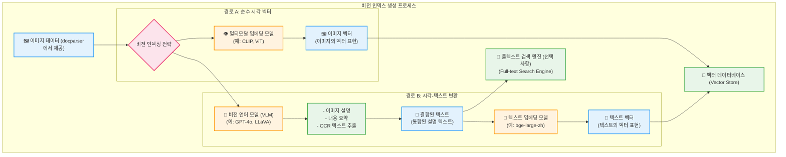
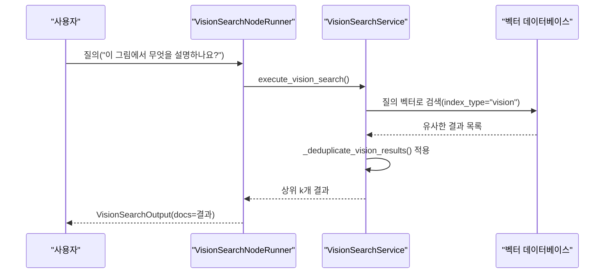

# 비전 인덱스 검색

<cite>
**이 문서에서 참조한 파일**
- [image_parser.py](file://aperag/docparser/image_parser.py)
- [vision_index.py](file://aperag/index/vision_index.py)
- [vision_search.py](file://aperag/flow/runners/vision_search.py)
- [base.py](file://aperag/index/base.py)
- [models.py](file://aperag/db/models.py)
</cite>

## 목차
1. [소개](#소개)
2. [비전 인덱스 생성 프로세스](#비전-인덱스-생성-프로세스)
3. [이미지 파싱 및 OCR](#이미지-파싱-및-ocr)
4. [시각적 설명 생성 및 인덱싱](#시각적-설명-생성-및-인덱싱)
5. [비전 검색 실행](#비전-검색-실행)
6. [VLM 설정 및 해상도 조정](#vlm-설정-및-해상도-조정)

## 소개
이 문서는 ApeRAG 시스템 내에서 이미지 및 기타 시각적 콘텐츠를 처리하기 위한 비전 인덱스 검색 기능을 설명합니다. 이 기능은 `image_parser.py`를 통해 문서에서 이미지를 추출하고, VLM(Vision Language Model)을 사용하여 이미지에 대한 설명(captioning)과 OCR(광학 문자 인식) 결과를 생성하는 과정을 포함합니다. 생성된 시각적 설명은 기존의 텍스트 인덱스와 결합되어 통합된 검색 가능 상태가 됩니다. 이후 사용자는 '이 그림에서 무엇을 설명하나요?'와 같은 질의를 통해 관련 정보를 검색할 수 있습니다. 이 문서는 이러한 전체 흐름을 다루며, 특히 `vision_search.py` 코드를 중심으로 검색 요청에 응답하는 방식과 VLM 선택 및 해상도 조정 방법을 설명합니다.

## 비전 인덱스 생성 프로세스
비전 인덱스는 시스템이 이미지 콘텐츠를 이해하고 검색 가능하게 만드는 핵심 메커니즘입니다. 이 프로세스는 `VisionIndexer` 클래스([vision_index.py](file://aperag/index/vision_index.py))에 의해 구현되며, 두 가지 병렬 경로를 따릅니다: 순수 시각 임베딩(Pure Vision Embedding)과 시각-텍스트 변환(Vision-to-Text). 이는 시스템 아키텍처의 일환으로, `create_index_task` Celery 작업에서 호출됩니다.

**다이어그램 출처**
- [vision_index.py](file://aperag/index/vision_index.py#L40-L303)

**섹션 출처**
- [vision_index.py](file://aperag/index/vision_index.py#L40-L303)
- [base.py](file://aperag/index/base.py#L0-L151)
- [models.py](file://aperag/db/models.py#L0-L799)

## 이미지 파싱 및 OCR
비전 인덱스 프로세스의 첫 번째 단계는 원본 문서에서 이미지를 추출하는 것입니다. 이를 위해 `ImageParser` 클래스([image_parser.py](file://aperag/docparser/image_parser.py))가 사용됩니다. 이 파서는 `.jpg`, `.png`, `.tiff` 등 다양한 이미지 형식을 지원하며, 주로 PDF 또는 DOCX 문서에서 추출된 개별 이미지 파일을 처리합니다.

추출된 이미지는 PaddleOCR 서비스를 통해 OCR 처리를 거칩니다. `read_image_text` 메서드는 이미지를 Base64로 인코딩한 후, `paddleocr_host` 설정에 지정된 외부 OCR 서비스 엔드포인트(`/predict/ocr_system`)에 POST 요청을 보냅니다. 서비스로부터 반환된 JSON 응답에는 이미지 내에서 인식된 모든 텍스트가 포함되며, 이 텍스트들은 하나의 연속된 문자열로 결합되어 `TextPart` 객체의 내용으로 저장됩니다. 이렇게 생성된 텍스트는 이후 비전 인덱스 생성의 입력 중 하나가 됩니다.

**섹션 출처**
- [image_parser.py](file://aperag/docparser/image_parser.py#L36-L74)

## 시각적 설명 생성 및 인덱싱
이미지 파싱 후, `VisionIndexer`는 두 가지 경로를 통해 시각적 설명을 생성하고 인덱싱합니다.

### 경로 A: 순수 시각 임베딩
이 경로는 멀티모달 임베딩 모델(예: CLIP)을 사용하여 이미지 자체를 직접 벡터 공간에 매핑합니다. `embedding_svc.is_multimodal()`이 `True`인지 확인한 후, 이미지 데이터는 Data URI 형식으로 변환되어 `embed_documents` 메서드에 전달됩니다. 이 과정은 이미지의 시각적 특징을 포착한 고차원 벡터를 생성하며, 이 벡터는 벡터 데이터베이스에 저장됩니다. 메타데이터에는 `index_method: "multimodal_embedding"`이 포함되어 이 벡터가 어떤 방식으로 생성되었는지 표시합니다.

### 경로 B: 시각-텍스트 변환
이 경로는 VLM을 활용하여 이미지에 대한 풍부한 텍스트 설명을 생성합니다. `completion_svc.is_vision_model()`이 `True`인지 확인한 후, 각 이미지에 대해 `generate` 메서드가 호출됩니다. 이때 사용되는 프롬프트는 매우 상세하며, 다음과 같은 작업을 수행하도록 VLM에 지시합니다:
1.  **전체 요약**: 이미지의 주제와 활동에 대한 간략한 개요.
2.  **자세한 텍스트 추출**: 원래 언어를 유지하면서 이미지 내 모든 텍스트를 추출하고, 시각적 읽기 순서를 준수하며 헤더와 푸터는 제외합니다.
3.  **차트/그래프 분석**: 차트 유형 식별 및 데이터 요약.
4.  **객체 및 장면 인식**: 이미지 내 주요 객체 나열.

생성된 설명 텍스트는 `TextNode`에 저장되고, 다시 텍스트 임베딩 모델을 통해 벡터화되어 벡터 데이터베이스에 저장됩니다. 메타데이터에는 `index_method: "vision_to_text"`가 포함되어 이 벡터가 텍스트 기반임을 나타냅니다. 이 과정은 최대 3번 재시도되며, 지수 백오프(exponential backoff) 전략을 사용하여 일시적인 오류를 처리합니다.

**섹션 출처**
- [vision_index.py](file://aperag/index/vision_index.py#L40-L303)

## 비전 검색 실행
사용자가 이미지 관련 질의를 할 때, `vision_search.py` 파일에 있는 `VisionSearchNodeRunner`가 검색 프로세스를 담당합니다. 이 노드 러너는 `run` 메서드를 통해 실행되며, 사용자 입력(`ui`)과 시스템 입력(`si`)을 받습니다.

검색 흐름은 다음과 같습니다:
1.  사용자의 질의(query)는 먼저 텍스트 임베딩 모델을 통해 벡터로 변환됩니다.
2.  `ContextManager`는 지정된 컬렉션의 벡터 데이터베이스에서 `index_types=["vision"]` 필터를 사용하여 해당 벡터와 유사한 항목을 검색합니다.
3.  검색 결과는 `_deduplicate_vision_results` 함수를 통해 중복 제거됩니다. 이 함수는 동일한 소스 이미지에 대해 `vision_to_text` 결과가 존재하면 `multimodal_embedding` 결과를 제거하여 중복을 방지합니다.
4.  최종적으로, 상위 `top_k`개의 결과가 `VisionSearchOutput` 객체에 담겨 반환됩니다.

이러한 방식으로, 시스템은 사용자의 자연어 질문에 대해 가장 관련성 높은 이미지 설명이나 시각적 콘텐츠를 효과적으로 찾아낼 수 있습니다.

**다이어그램 출처**
- [vision_search.py](file://aperag/flow/runners/vision_search.py#L173-L196)

**섹션 출처**
- [vision_search.py](file://aperag/flow/runners/vision_search.py#L173-L196)

## VLM 설정 및 해상도 조정
VLM의 선택과 구성은 컬렉션 수준에서 관리됩니다. 사용자는 UI를 통해 특정 컬렉션에 대해 비전 인덱스를 활성화할 수 있으며, 이때 다음을 선택할 수 있습니다:
-   **멀티모달 임베딩 모델**: 순수 시각 벡터 생성에 사용될 모델.
-   **VLM 모델**: 이미지 설명 및 OCR에 사용될 모델.

이러한 선택은 컬렉션의 `config` 필드에 저장되며, `parseCollectionConfig` 함수를 통해 파싱됩니다. `get_collection_completion_service_sync` 함수는 이 설정을 조회하여 올바른 VLM 서비스 인스턴스를 생성합니다. VLM 모델은 일반적으로 `tags` 필드에 `"vision"` 태그가 있는지 여부로 식별됩니다.

해상도 조정과 같은 하위 수준의 이미지 처리 매개변수는 현재 코드베이스에서 명시적으로 다뤄지지 않으며, 대부분 VLM 서비스 자체의 기본값이나 내부 로직에 의해 처리됩니다. 그러나 시스템은 `images` 매개변수를 통해 Base64로 인코딩된 이미지 데이터(Data URI)를 VLM에 직접 전달하므로, 필요에 따라 클라이언트 측에서 이미지 크기를 사전에 조정할 수 있는 유연성을 제공합니다.

**섹션 출처**
- [vision_index.py](file://aperag/index/vision_index.py#L40-L303)
- [base.py](file://aperag/index/base.py#L0-L151)
- [models.py](file://aperag/db/models.py#L0-L799)