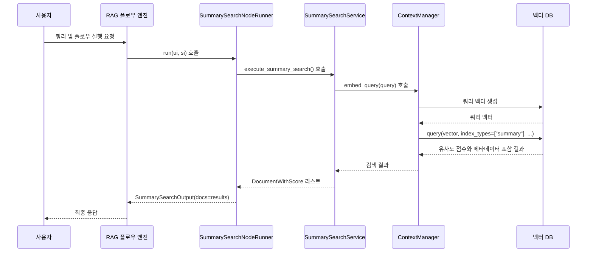

# 요약 인덱스 검색

<cite>
**이 문서에서 참조한 파일**
- [summary_index.py](file://aperag/index/summary_index.py)
- [summary_search.py](file://aperag/flow/runners/summary_search.py)
- [base.py](file://aperag/index/base.py)
- [models.py](file://aperag/db/models.py)
</cite>

## 목차
1. [소개](#소개)
2. [핵심 구성 요소](#핵심-구성-요소)
3. [아키텍처 개요](#아키텍처-개요)
4. [상세 구성 요소 분석](#상세-구성-요소-분석)
5. [의존성 분석](#의존성-분석)

## 소개
이 문서는 ApeRAG 시스템 내에서 요약 인덱스 기반 검색 메커니즘을 설명합니다. 이 메커니즘은 LLM을 활용하여 문서의 핵심 내용을 사전에 요약하고, 그 요약 정보를 기반으로 빠르게 관련성을 판단함으로써 장문의 문서에서도 신속하게 답변을 도출할 수 있도록 합니다. `summary_index.py`와 `summary_search.py` 모듈을 중심으로 요약 생성 프롬프트, 저장 구조, 정확성과 속도 간의 균형 설정 옵션, 그리고 다른 검색 모드와의 조합 활용 사례를 다룹니다.

## 핵심 구성 요소

요약 인덱스 검색 기능은 두 가지 핵심 구성 요소로 이루어져 있습니다. 첫째, `SummaryIndexer` 클래스는 문서의 요약을 생성하고 벡터 데이터베이스에 저장하는 역할을 담당합니다. 둘째, `SummarySearchNodeRunner` 클래스는 사용자 쿼리에 대해 요약 인덱스를 검색하여 관련 결과를 반환하는 실행 로직을 제공합니다. 이 두 구성 요소는 문서 처리 파이프라인과 검색 흐름(RAG flow)에서 각각 인덱싱 단계와 검색 단계를 담당하며, 전체 시스템의 효율성과 성능을 결정짓는 핵심 요소입니다.

**주요 기능 및 특징:**
- **Map-Reduce 전략**: 대용량 문서의 경우, 먼저 각 청크(Chunk)를 요약한 후(`_summarize_text`), 그 요약들을 통합하여 최종 문서 요약을 생성(`_reduce_summaries`)합니다.
- **조건부 인덱싱**: 완성 서비스(Completion Service)가 구성되어 있을 때만 요약 인덱싱이 활성화됩니다(`is_enabled` 메서드).
- **벡터화된 저장**: 생성된 요약은 벡터 데이터베이스에도 임베딩되어, 의미 기반의 유사도 검색이 가능해집니다.
- **검색 최적화**: 검색 시에는 원본 문서 전체가 아닌, 짧고 핵심적인 요약 정보만을 대상으로 하여 응답 속도를 획기적으로 향상시킵니다.

**Section sources**
- [summary_index.py](file://aperag/index/summary_index.py#L31-L445)
- [summary_search.py](file://aperag/flow/runners/summary_search.py#L115-L133)

## 아키텍처 개요

요약 인덱스 검색 아키텍처는 인덱싱과 검색이라는 두 가지 주요 단계로 나뉩니다. 인덱싱 단계에서는 원본 문서가 파싱되고, `SummaryIndexer`가 이를 바탕으로 요약을 생성합니다. 생성된 요약은 메타데이터와 함께 JSON 형식으로 저장되며, 동시에 벡터 데이터베이스에 임베딩됩니다. 검색 단계에서는 사용자의 쿼리가 입력되면, `SummarySearchNodeRunner`가 벡터 데이터베이스에서 "summary" 타입의 인덱스만을 대상으로 유사도 검색을 수행합니다. 이렇게 함으로써, 전체 문서를 다시 처리하지 않고도 빠르게 관련 문서를 찾아낼 수 있습니다.

**Diagram sources**
- [summary_index.py](file://aperag/index/summary_index.py#L31-L445)
- [summary_search.py](file://aperag/flow/runners/summary_search.py#L115-L133)

## 상세 구성 요소 분석

### SummaryIndexer 분석

`SummaryIndexer`는 `BaseIndexer`를 상속받는 추상 클래스로, 요약 인덱스의 생성, 업데이트, 삭제 및 활성화 여부 확인이라는 네 가지 핵심 메서드를 구현합니다. 이 클래스는 문서의 핵심 정보를 압축하여 저장함으로써, 이후의 검색 과정에서 계산 리소스를 절약하고 응답 속도를 향상시키는 데 중점을 둡니다.

#### 요약 생성 프롬프트 전략
`SummaryIndexer`는 청크 요약과 최종 문서 요약이라는 두 가지 상황에 따라 서로 다른 프롬프트를 사용합니다. 청크 요약 프롬프트는 1~2문장 내외의 매우 간결한 요약을 요구하며, 원본 언어 유지, 핵심 정보 추출, 객관성 유지 등을 명시합니다. 반면, 최종 문서 요약 프롬프트는 2~3문장 정도의 보다 포괄적인 요약을 요청하며, 기술 문서의 경우 기술적 포인트를 강조하도록 지시합니다. 이러한 차별화된 프롬프트 전략은 Map-Reduce 방식의 요약 생성 과정에서 일관성 있고 고품질의 결과를 보장합니다.

**Diagram sources**
- [summary_index.py](file://aperag/index/summary_index.py#L31-L445)
- [base.py](file://aperag/index/base.py#L60-L80)

**Section sources**
- [summary_index.py](file://aperag/index/summary_index.py#L31-L445)

### SummarySearchNodeRunner 분석

`SummarySearchNodeRunner`는 RAG 플로우 내에서 요약 검색 노드를 실행하는 책임을 가진 클래스입니다. 이 클래스는 `register_node_runner` 데코레이터를 통해 "summary_search"라는 유형으로 등록되며, 시스템은 사용자가 정의한 플로우에서 이 노드를 식별하고 실행할 수 있습니다. `run` 메서드는 사용자 입력(`ui`)과 시스템 입력(`si`)을 받아 검색을 수행하고, 결과를 표준 출력 형식(`SummarySearchOutput`)으로 반환합니다.

#### 검색 로직 및 오류 처리
검색 로직은 `SummarySearchService` 클래스에 위임되며, 여기서는 벡터 데이터베이스 컨텍스트 매니저를 사용하여 쿼리 벡터를 생성하고 검색을 수행합니다. 중요한 점은 `context_manager.query()` 호출 시 `index_types=["summary"]` 파라미터를 명시함으로써, 검색 대상을 요약 인덱스로 한정한다는 것입니다. 이는 다른 인덱스(예: 벡터, 풀텍스트)와의 혼동을 방지하고, 의도한 검색 전략을 보장합니다. 또한, 임베딩 서비스나 공급자(provider)를 찾지 못하는 등의 예외 상황이 발생하더라도, 로그를 기록한 후 빈 결과를 반환함으로써 전체 플로우의 실행을 중단시키지 않는 견고한(graceful degradation) 오류 처리 전략을 취하고 있습니다.

**Diagram sources**
- [summary_search.py](file://aperag/flow/runners/summary_search.py#L58-L133)
- [query.py](file://aperag/query/query.py#L1-L15)

**Section sources**
- [summary_search.py](file://aperag/flow/runners/summary_search.py#L115-L133)

## 의존성 분석

요약 인덱스 검색 기능은 여러 핵심 모듈들과 긴밀하게 연결되어 있습니다. 가장 중요한 의존성은 `llm.completion.base_completion` 모듈이며, 이는 요약 생성을 위한 LLM 완성 서비스를 제공합니다. `llm.embed.base_embedding` 모듈은 요약의 벡터화를 위한 임베딩 서비스를 제공하며, `config.get_vector_db_connector`를 통해 실제 벡터 데이터베이스 어댑터에 접근합니다. 데이터 저장 및 조회를 위해서는 `db.ops`와 `db.models` 모듈이 필요하며, 특히 `DocumentIndex` 모델은 요약 인덱스의 상태와 데이터를 저장하는 데 사용됩니다. 마지막으로, `flow.base.models` 모듈의 `register_node_runner` 메커니즘을 통해 이 기능이 RAG 플로우 시스템에 통합됩니다.

**Diagram sources**
- [summary_index.py](file://aperag/index/summary_index.py#L1-L445)
- [summary_search.py](file://aperag/flow/runners/summary_search.py#L1-L133)
- [base.py](file://aperag/index/base.py#L1-L80)
- [models.py](file://aperag/db/models.py#L754-L783)

**Section sources**
- [summary_index.py](file://aperag/index/summary_index.py#L1-L445)
- [summary_search.py](file://aperag/flow/runners/summary_search.py#L1-L133)