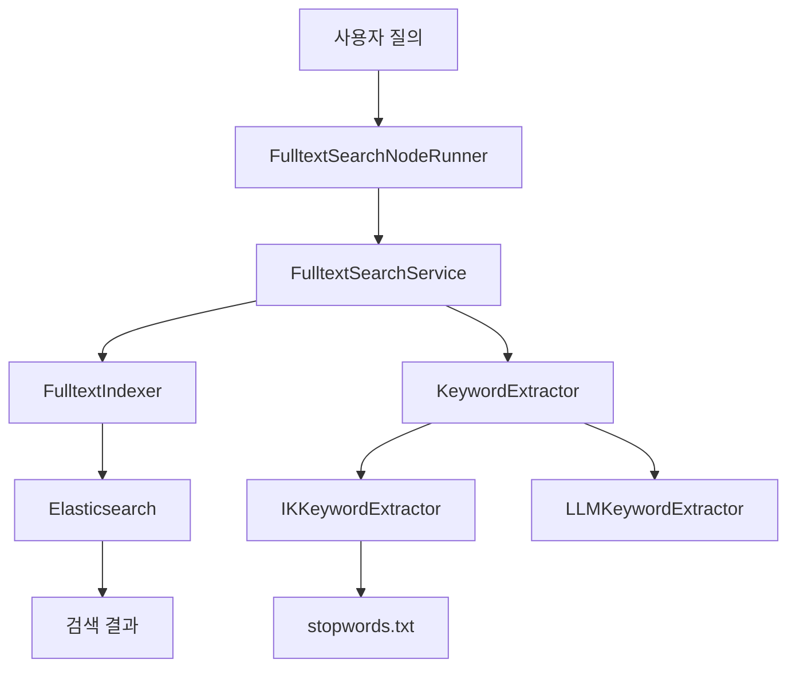
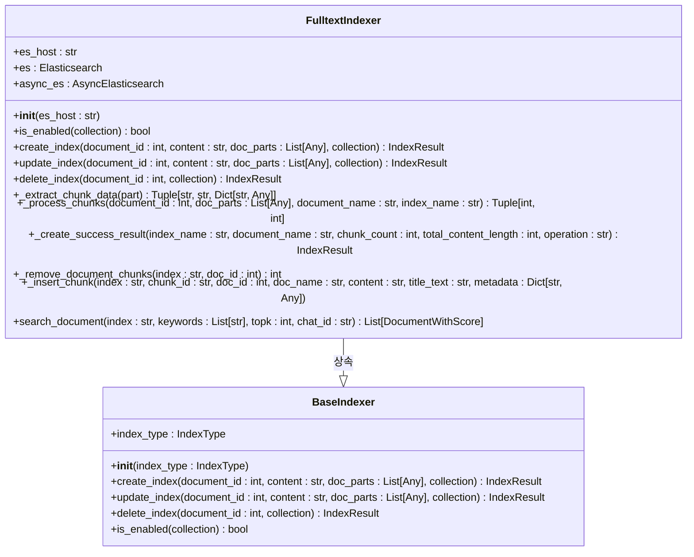
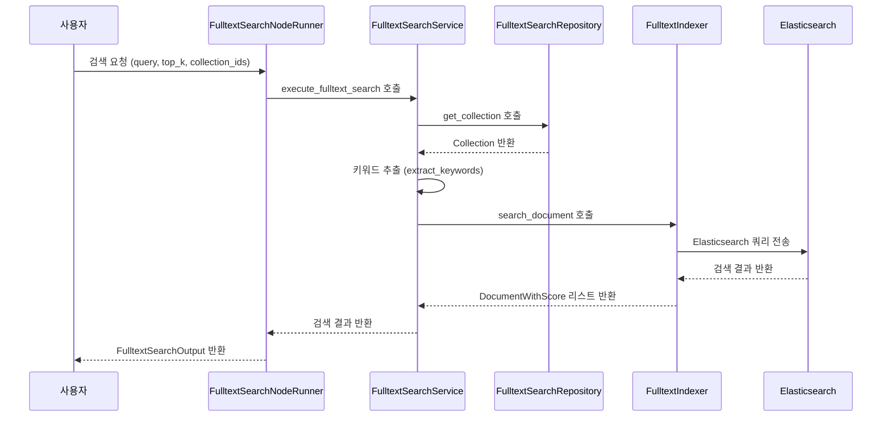
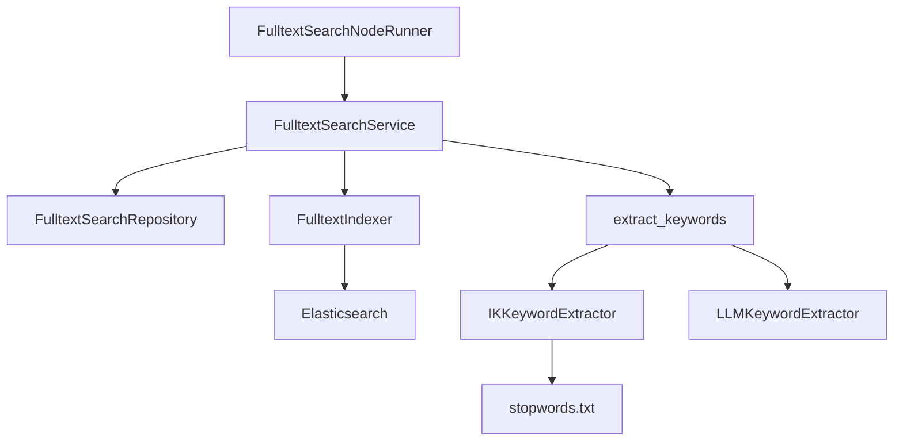

# 풀텍스트 검색

<cite>
**이 문서에서 참조한 파일**
- [fulltext_index.py](file://aperag/index/fulltext_index.py)
- [fulltext_search.py](file://aperag/flow/runners/fulltext_search.py)
- [stopwords.txt](file://aperag/misc/stopwords.txt)
</cite>

## 목차
1. [소개](#소개)
2. [전체 아키텍처 개요](#전체-아키텍처-개요)
3. [핵심 구성 요소 분석](#핵심-구성-요소-분석)
4. [상세 구성 요소 분석](#상세-구성-요소-분석)
5. [의존성 분석](#의존성-분석)
6. [고급 기능 및 전처리 과정](#고급-기능-및-전처리-과정)
7. [결론](#결론)

## 소개
이 문서는 Elasticsearch 기반의 풀텍스트 검색 구현을 설명합니다. 시스템은 문서의 메타데이터와 본문을 색인하고, BM25 알고리즘을 활용하여 정확한 키워드 매칭을 수행합니다. `fulltext_index.py`와 `fulltext_search.py` 모듈을 중심으로 필터링, 정렬, 와일드카드 검색 등의 고급 기능을 다루며, 사용자 질의보다는 구체적인 용어 검색에 적합한 시나리오를 제시합니다. 또한 정규화된 텍스트 처리, 불용어 제거(stopwords.txt), 대소문자 무시 설정 등 전처리 과정도 포함됩니다.

## 전체 아키텍처 개요

**다이어그램 출처**
- [fulltext_search.py](file://aperag/flow/runners/fulltext_search.py#L110-L132)
- [fulltext_index.py](file://aperag/index/fulltext_index.py#L43-L307)
- [stopwords.txt](file://aperag/misc/stopwords.txt#L0-L989)

## 핵심 구성 요소

풀텍스트 검색 시스템은 주로 두 가지 핵심 구성 요소로 이루어져 있습니다: `FulltextIndexer`는 문서를 색인하는 역할을 하며, `FulltextSearchNodeRunner`는 검색 요청을 처리하고 결과를 반환하는 역할을 합니다. 이 두 구성 요소는 Elasticsearch와 상호작용하여 효율적인 검색 기능을 제공합니다.

**섹션 출처**
- [fulltext_index.py](file://aperag/index/fulltext_index.py#L43-L307)
- [fulltext_search.py](file://aperag/flow/runners/fulltext_search.py#L110-L132)

## 상세 구성 요소 분석

### FulltextIndexer 분석
`FulltextIndexer` 클래스는 문서의 각 청크를 Elasticsearch에 저장하는 책임을 지닙니다. 문서는 설정된 청크 크기와 오버랩 크기에 따라 재청크화되며, 각 청크는 문서 ID, 이름, 내용, 제목 및 메타데이터와 함께 인덱싱됩니다. 이 과정은 `_process_chunks` 메서드를 통해 수행되며, `_insert_chunk` 메서드를 사용하여 실제 인덱싱 작업을 수행합니다.

#### 클래스 다이어그램

**다이어그램 출처**
- [fulltext_index.py](file://aperag/index/fulltext_index.py#L43-L307)

**섹션 출처**
- [fulltext_index.py](file://aperag/index/fulltext_index.py#L43-L307)

### FulltextSearchNodeRunner 분석
`FulltextSearchNodeRunner`는 사용자의 검색 요청을 처리하는 노드 러너입니다. 이 클래스는 `FulltextSearchService`를 통해 비즈니스 로직을 실행하며, `FulltextSearchRepository`를 통해 데이터베이스 작업을 수행합니다. 사용자 입력과 시스템 입력을 받아 검색을 실행하고, 결과를 `FulltextSearchOutput` 형식으로 반환합니다.

#### 시퀀스 다이어그램

**다이어그램 출처**
- [fulltext_search.py](file://aperag/flow/runners/fulltext_search.py#L110-L132)
- [fulltext_index.py](file://aperag/index/fulltext_index.py#L253-L307)

**섹션 출처**
- [fulltext_search.py](file://aperag/flow/runners/fulltext_search.py#L110-L132)

## 의존성 분석

**다이어그램 출처**
- [fulltext_search.py](file://aperag/flow/runners/fulltext_search.py#L54-L102)
- [fulltext_index.py](file://aperag/index/fulltext_index.py#L324-L373)
- [stopwords.txt](file://aperag/misc/stopwords.txt#L0-L989)

**섹션 출처**
- [fulltext_search.py](file://aperag/flow/runners/fulltext_search.py#L54-L102)
- [fulltext_index.py](file://aperag/index/fulltext_index.py#L324-L373)

## 고급 기능 및 전처리 과정

### 키워드 추출 전략
시스템은 두 가지 방법으로 키워드를 추출합니다. 우선순위는 LLM 기반 추출기이며, 설정되지 않은 경우 IK 분석기를 사용합니다. IK 분석기는 `stopwords.txt` 파일에서 불용어를 로드하여 검색 품질을 향상시킵니다. 이 파일에는 다양한 언어의 불용어가 포함되어 있으며, 검색 시 의미 없는 단어를 제거하는 데 사용됩니다.

### 검색 쿼리 구조
검색 쿼리는 `bool` 쿼리를 사용하여 `should` 절에 키워드별 `match` 쿼리를 추가합니다. `minimum_should_match` 파라미터는 80%로 설정되어 있어 대부분의 키워드가 일치해야 결과가 반환됩니다. 선택적으로 `chat_id` 필터를 적용하여 특정 채팅 세션의 문서만 검색할 수 있습니다.

**섹션 출처**
- [fulltext_index.py](file://aperag/index/fulltext_index.py#L503-L545)
- [stopwords.txt](file://aperag/misc/stopwords.txt#L0-L989)

## 결론
Elasticsearch 기반의 풀텍스트 검색 시스템은 문서의 메타데이터와 본문을 효과적으로 색인하고, BM25 알고리즘을 통해 정확한 키워드 매칭을 수행합니다. `fulltext_index.py`와 `fulltext_search.py`를 통해 필터링, 정렬, 와일드카드 검색 등의 고급 기능이 구현되었으며, 사용자 질의보다는 구체적인 용어 검색에 적합한 시나리오를 제공합니다. 정규화된 텍스트 처리, 불용어 제거, 대소문자 무시 설정 등 전처리 과정을 통해 검색 품질을 더욱 향상시켰습니다.