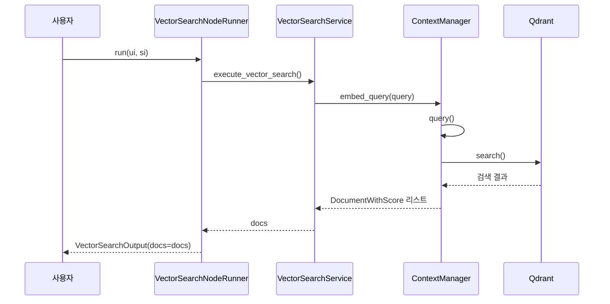
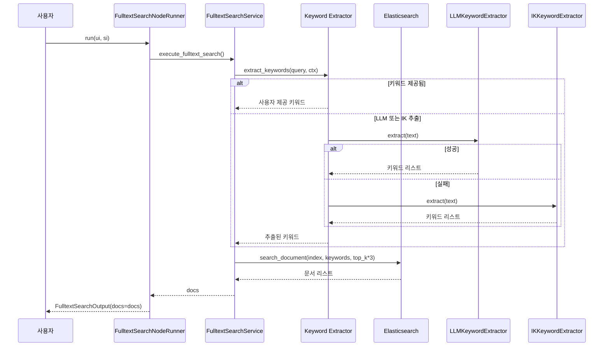
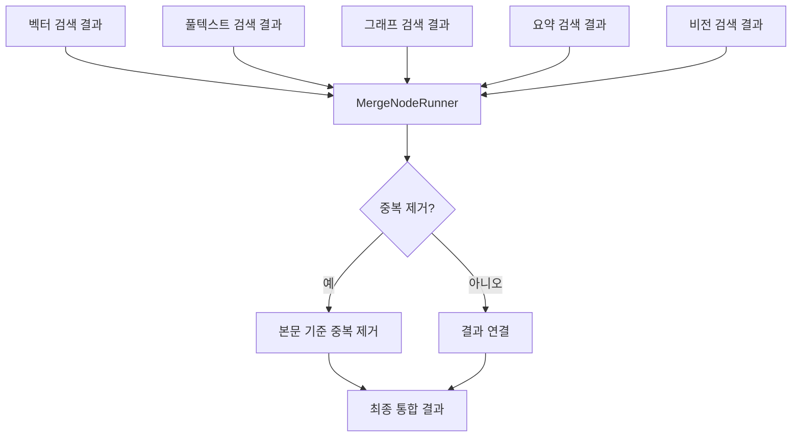
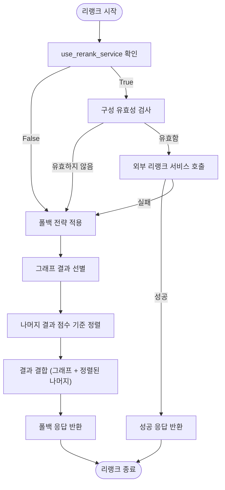

# 하이브리드 검색 엔진

<cite>
**이 문서에서 참조한 파일**
- [config.py](file://aperag/config.py)
- [vector_search.py](file://aperag/flow/runners/vector_search.py)
- [fulltext_search.py](file://aperag/flow/runners/fulltext_search.py)
- [merge.py](file://aperag/flow/runners/merge.py)
- [rerank.py](file://aperag/flow/runners/rerank.py)
- [context.py](file://aperag/context/context.py)
- [fulltext_index.py](file://aperag/index/fulltext_index.py)
- [rerank_service.py](file://aperag/llm/rerank/rerank_service.py)
</cite>

## 목차
1. [소개](#소개)
2. [검색 유형별 원리 및 작동 방식](#검색-유형별-원리-및-작동-방식)
3. [쿼리 유형, 데이터 특성, 정확도 및 성능 비교](#쿼리-유형-데이터-특성-정확도-및-성능-비교)
4. [검색 실행 흐름 분석](#검색-실행-흐름-분석)
5. [결과 병합 및 리랭크 전략](#결과-병합-및-리랭크-전략)
6. [검색 전략 조합 가이드](#검색-전략-조합-가이드)
7. [설정 파일을 통한 모듈 관리](#설정-파일을-통한-모듈-관리)

## 소개
ApeRAG의 핵심 기능인 하이브리드 검색 엔진은 다양한 검색 기술을 결합하여 사용자 쿼리에 대해 보다 정확하고 포괄적인 결과를 제공합니다. 이 문서는 벡터 검색(Qdrant 기반), 풀텍스트 검색(Elasticsearch 기반), 그래프 기반 검색(LightRAG), 요약 인덱스, 비전 인덱스의 각 원리와 작동 방식을 설명하며, 각 검색 유형의 특성과 차이점을 비교 분석합니다. 또한 실제 코드 예제를 통해 검색 실행 흐름을 설명하고, 여러 검색 결과를 병합하고 리랭크하는 전략을 포함하여 사용자가 특정 시나리오에 맞게 검색 전략을 조합하는 방법을 안내합니다.

## 검색 유형별 원리 및 작동 방식

### 벡터 검색 (Qdrant 기반)
벡터 검색은 Qdrant 벡터 데이터베이스를 기반으로 하며, 임베딩 모델을 사용하여 쿼리와 문서를 고차원 벡터 공간에 매핑한 후, 벡터 간의 유사도를 계산하여 관련 문서를 검색합니다. `VectorSearchService` 클래스의 `execute_vector_search` 메서드는 사용자 쿼리를 입력받아 해당 쿼리의 벡터 표현을 생성하고, 설정된 유사도 임계값과 상위 K개 결과 수를 기준으로 Qdrant에서 검색을 수행합니다. 검색 시에는 "vector" 인덱스 타입만 대상으로 하며, 채팅 ID가 지정된 경우 해당 채팅 문서만 필터링합니다.

**다이어그램 출처**
- [vector_search.py](file://aperag/flow/runners/vector_search.py#L65-L118)
- [context.py](file://aperag/context/context.py#L28-L62)

**섹션 출처**
- [vector_search.py](file://aperag/flow/runners/vector_search.py#L65-L118)
- [context.py](file://aperag/context/context.py#L28-L62)

### 풀텍스트 검색 (Elasticsearch 기반)
풀텍스트 검색은 Elasticsearch를 기반으로 하며, 키워드 기반의 정밀한 텍스트 일치를 수행합니다. `FulltextSearchService` 클래스의 `execute_fulltext_search` 메서드는 사용자 쿼리에서 키워드를 추출한 후, 이를 기반으로 Elasticsearch 인덱스에서 문서를 검색합니다. 키워드 추출은 우선 LLM 기반 추출기를 시도하고, 구성되지 않았거나 실패할 경우 IK(Analyzer) 추출기를 폴백 전략으로 사용합니다. 검색 결과는 상위 K개의 3배 수만큼 가져온 후, 이후 리랭크 과정에서 최종적으로 상위 K개로 압축됩니다.

**다이어그램 출처**
- [fulltext_search.py](file://aperag/flow/runners/fulltext_search.py#L60-L102)
- [fulltext_index.py](file://aperag/index/fulltext_index.py#L503-L545)

**섹션 출처**
- [fulltext_search.py](file://aperag/flow/runners/fulltext_search.py#L60-L102)
- [fulltext_index.py](file://aperag/index/fulltext_index.py#L503-L545)

### 그래프 기반 검색 (LightRAG)
그래프 기반 검색은 LightRAG를 활용하여 문서 내의 개체(Entity)와 관계(Relationship)를 추출하고, 이를 기반으로 지식 그래프를 구축하여 의미적 연결을 탐색합니다. 이 문서에서는 직접적인 코드 분석이 포함되어 있지 않으나, 시스템 아키텍처상 `graph_search.py` 러너가 존재하며, 검색 결과는 `recall_type` 메타데이터에 "graph_search"로 표시됩니다. 리랭크 단계에서 그래프 검색 결과는 점수가 아닌 순서 우선순위를 가지며, 가장 먼저 배치됩니다.

### 요약 인덱스 및 비전 인덱스
요약 인덱스는 문서의 핵심 내용을 요약한 정보를 저장하여 긴 문서의 주요 내용을 빠르게 검색할 수 있도록 합니다. 비전 인덱스는 이미지 등 비정형 데이터의 시각적 특징을 벡터화하여 검색 가능하게 합니다. 두 인덱스 모두 `ContextManager.query` 메서드에서 `index_types` 파라미터를 통해 필터링될 수 있으며, 벡터 검색에서는 명시적으로 `["vector"]`만 지정하여 제외됩니다.

## 쿼리 유형, 데이터 특성, 정확도 및 성능 비교

| 검색 유형 | 처리하는 쿼리 유형 | 데이터 특성 | 정확도 | 성능 |
| :--- | :--- | :--- | :--- | :--- |
| **벡터 검색** | 의미 기반 쿼리, 유사도 기반 질문 | 텍스트, 문서 전체 | 높음 (문맥 이해 가능) | 중간 (임베딩 계산 오버헤드 있음) |
| **풀텍스트 검색** | 키워드 기반 쿼리, 정밀 일치 필요 쿼리 | 텍스트, 구조화된 데이터 | 매우 높음 (정확한 키워드 매칭) | 높음 (Elasticsearch 최적화) |
| **그래프 기반 검색** | 관계 탐색, 연결 중심 질문 | 개체, 관계, 지식 그래프 | 매우 높음 (정확한 연결 제공) | 낮음 (그래프 탐색 복잡도 높음) |
| **요약 인덱스** | 문서 개요 요청, 핵심 정보 요청 | 요약된 텍스트 | 중간 (세부 정보 누락 가능성) | 매우 높음 (작은 데이터 크기) |
| **비전 인덱스** | 이미지 기반 쿼리, 시각적 유사도 요청 | 이미지, 비디오 프레임 | 중간~높음 (모델 품질 의존) | 중간 (이미지 처리 오버헤드) |

## 검색 실행 흐름 분석

### 벡터 검색 실행 흐름
벡터 검색은 `VectorSearchNodeRunner` 클래스의 `run` 메서드를 시작점으로 합니다. 시스템 입력(`si`)에서 쿼리와 사용자 정보를 추출하고, 사용자 입력(`ui`)에서 `top_k` 및 `similarity_threshold` 값을 가져옵니다. `VectorSearchService`는 `VectorSearchRepository`를 통해 컬렉션 정보를 조회한 후, `get_collection_embedding_service_sync` 함수로 임베딩 모델을 가져옵니다. `ContextManager`는 설정된 Qdrant 컨텍스트와 함께 초기화되며, 쿼리 문장은 임베딩 모델을 통해 벡터로 변환됩니다. 마지막으로 `ContextManager.query` 메서드가 호출되어 Qdrant에 검색 요청을 보내고, 결과에 `recall_type` 메타데이터를 추가하여 반환합니다.

**섹션 출처**
- [vector_search.py](file://aperag/flow/runners/vector_search.py#L126-L148)

### 풀텍스트 검색 실행 흐름
풀텍스트 검색은 `FulltextSearchNodeRunner` 클래스의 `run` 메서드에서 시작됩니다. 사용자 입력에서 키워드가 제공되지 않은 경우, `extract_keywords` 함수가 호출됩니다. 이 함수는 설정된 LLM 키워드 추출기(providers/models)를 우선적으로 시도하며, 실패하거나 구성되지 않은 경우 `IKKeywordExtractor`를 폴백으로 사용합니다. 추출된 키워드는 중복 제거된 후, `fulltext_indexer.search_document` 메서드를 통해 Elasticsearch에서 검색이 수행됩니다. 검색 결과 역시 `recall_type` 메타데이터를 추가하여 반환됩니다.

**섹션 출처**
- [fulltext_search.py](file://aperag/flow/runners/fulltext_search.py#L110-L132)

## 결과 병합 및 리랭크 전략

### 결과 병합 전략 (`merge.py`)
여러 검색 노드의 결과는 `MergeNodeRunner`를 통해 하나로 통합됩니다. 현재 지원되는 병합 전략은 `"union"`(합집합)이며, 다른 전략이 지정되면 `ValidationError`가 발생합니다. 모든 검색 결과 리스트(`vector_search_docs`, `fulltext_search_docs` 등)는 단순히 연결(concatenate)됩니다. `deduplicate` 옵션이 활성화된 경우, 문서 본문(`doc.text`)을 기준으로 중복 제거가 수행됩니다. 이는 동일한 문서가 여러 검색 경로를 통해 검색되었을 때 중복을 방지합니다.

**다이어그램 출처**
- [merge.py](file://aperag/flow/runners/merge.py#L50-L76)

**섹션 출처**
- [merge.py](file://aperag/flow/runners/merge.py#L50-L76)

### 리랭크 전략 (`rerank.py`)
리랭크는 `RerankNodeRunner`에서 수행되며, 스마트한 폴백 전략을 갖추고 있습니다. 기본적으로 외부 리랭크 서비스(예: Cohere, Jina AI)를 사용하도록 설계되어 있지만, 구성 오류 또는 서비스 장애 시 내장된 폴백 전략으로 전환됩니다.
- **외부 리랭크 서비스 사용**: `use_rerank_service=True`이고, `model`, `model_service_provider`, `custom_llm_provider`가 모두 유효한 경우, `RerankService.async_rerank` 메서드를 호출하여 쿼리와 문서 리스트를 전달합니다. 이 서비스는 문서들의 관련성을 재평가하여 새로운 점수와 순서를 부여합니다.
- **폴백 전략**: 외부 서비스를 사용하지 않거나 실패한 경우, `_apply_fallback_strategy` 메서드가 실행됩니다. 이 전략은 그래프 검색 결과를 무조건 최우선 순위로 배치하고, 나머지 결과는 원래의 점수(`score`)를 기준으로 내림차순 정렬합니다. 이는 그래프 검색의 높은 정확도를 활용하면서도, 다른 검색 결과의 상대적 중요도를 유지합니다.

**다이어그램 출처**
- [rerank.py](file://aperag/flow/runners/rerank.py#L51-L195)

**섹션 출처**
- [rerank.py](file://aperag/flow/runners/rerank.py#L51-L195)
- [rerank_service.py](file://aperag/llm/rerank/rerank_service.py#L50-L96)

## 검색 전략 조합 가이드
사용자는 특정 시나리오에 맞춰 검색 전략을 조합할 수 있습니다.
- **정밀한 기술 문서 검색**: 풀텍스트 검색을 주력으로 하고, 벡터 검색을 보조로 사용합니다. 키워드 추출기가 잘 작동해야 하므로, `llm_keyword_extraction_provider` 설정을 권장합니다.
- **창의적인 아이디어 도출**: 벡터 검색을 주력으로 하여 의미적 유사도를 탐색하고, 그래프 검색을 통해 관련 개념 간의 연결을 발견합니다.
- **빠른 답변 제공**: 요약 인덱스 검색을 우선시하여 문서의 핵심만 신속하게 제공합니다.
- **이미지 기반 정보 탐색**: 비전 인덱스 검색을 활성화하고, 관련 텍스트 정보를 보완하기 위해 벡터 검색과 결합합니다.

## 설정 파일을 통한 모듈 관리
각 검색 모듈은 `config.py` 파일에서 전역적으로 활성화하거나 가중치를 조정할 수 있습니다.
- **벡터 DB 선택**: `vector_db_type` 설정을 통해 Qdrant 외에도 다른 벡터 DB를 사용할 수 있습니다.
- **임베딩 모델 설정**: `model_configs.json` 파일을 통해 컬렉션별로 사용할 임베딩 모델을 지정합니다.
- **키워드 추출기 구성**: `llm_keyword_extraction_provider` 및 `llm_keyword_extraction_model` 설정을 통해 풀텍스트 검색의 키워드 추출에 사용할 LLM을 지정합니다.
- **리랭크 서비스 구성**: `RerankInput` 모델의 `model`, `model_service_provider`, `custom_llm_provider`를 통해 외부 리랭크 서비스를 활성화하고, API 키는 데이터베이스에서 관리됩니다.
- **성능 튜닝**: `es_timeout`, `es_max_retries`, `embedding_max_chunks_in_batch` 등의 설정을 통해 각 검색 엔진의 성능과 안정성을 조절할 수 있습니다.

**섹션 출처**
- [config.py](file://aperag/config.py)