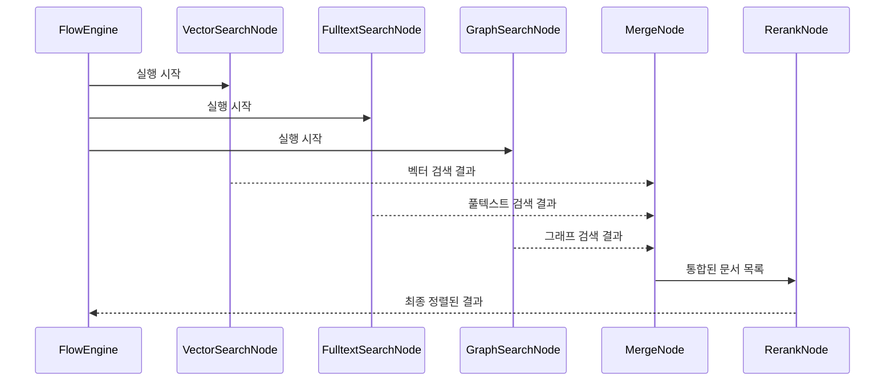
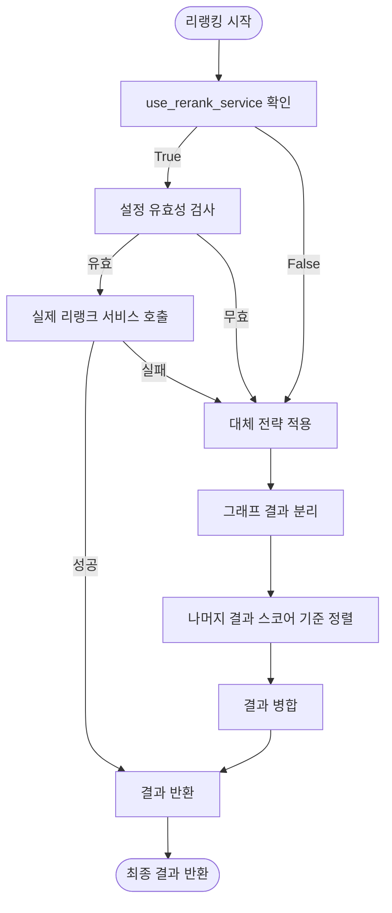

# 하이브리드 검색 전략

<cite>
**이 문서에서 참조한 파일**
- [engine.py](file://aperag/flow/engine.py)
- [merge.py](file://aperag/flow/runners/merge.py)
- [rerank.py](file://aperag/flow/runners/rerank.py)
- [config.py](file://aperag/config.py)
</cite>

## 목차
1. [소개](#소개)
2. [플로우 실행 흐름](#플로우-실행-흐름)
3. [검색 결과 통합 전략](#검색-결과-통합-전략)
4. [리랭킹 처리 방식](#리랭킹-처리-방식)
5. [설정 관리 및 모듈 가중치 조정](#설정-관리-및-모듈-가중치-조정)
6. [사용 사례 기반 구성 예시](#사용-사례-기반-구성-예시)

## 소개
ApeRAG 시스템은 벡터, 풀텍스트, 그래프 등 다양한 검색 노드의 출력을 통합하여 최종 검색 결과를 생성하는 하이브리드 검색 전략을 제공합니다. 이 문서는 `engine.py`의 플로우 실행 흐름을 중심으로, 각 검색 결과가 `merge.py`를 통해 수집되고, `rerank.py`에 의해 리랭킹되는 전체 과정을 설명합니다. 또한 `config.py`를 통한 설정 방법과 다양한 사용 사례에 맞춘 전략 구성 방안을 제시합니다.

## 플로우 실행 흐름

**다이어그램 출처**
- [engine.py](file://aperag/flow/engine.py#L100-L166)
- [merge.py](file://aperag/flow/runners/merge.py#L51-L76)
- [rerank.py](file://aperag/flow/runners/rerank.py#L52-L96)

**섹션 출처**
- [engine.py](file://aperag/flow/engine.py#L100-L166)

## 검색 결과 통합 전략

하이브리드 검색에서는 여러 검색 노드의 출력을 하나로 합치는 과정이 필요합니다. `merge.py`는 벡터, 풀텍스트, 그래프, 요약, 비전 검색 결과를 수집하여 단일 문서 목록으로 통합합니다. 현재 지원되는 전략은 `union`(합집합)이며, 중복 제거 여부는 `deduplicate` 옵션으로 제어할 수 있습니다.

통합 과정에서 각 검색 노드의 결과는 `DocumentWithScore` 객체 리스트 형태로 전달되며, 모든 결과는 단순히 연결(concatenation)됩니다. 중복 제거가 활성화된 경우, 문서 본문(`text`) 기준으로 중복 항목이 제거됩니다.

**섹션 출처**
- [merge.py](file://aperag/flow/runners/merge.py#L51-L76)

## 리랭킹 처리 방식

통합된 검색 결과는 `rerank.py`에서 최종 순위 조정을 거칩니다. 리랭킹은 두 가지 전략을 사용하며, `use_rerank_service` 설정 값에 따라 동작 방식이 결정됩니다.

### 고급 리랭킹 서비스
`use_rerank_service=True`일 경우, 외부 리랭크 서비스(예: 교차-인코더 모델)를 활용합니다. 이때 다음 설정이 필요합니다:
- `model`: 사용할 리랭크 모델 이름
- `model_service_provider`: 모델 제공자 (예: Jina AI)
- `custom_llm_provider`: 커스텀 LLM 제공자
- API 키 및 기본 URL 정보

서비스 호출에 실패하거나 설정이 불완전한 경우, 대체 전략(fallback strategy)으로 전환됩니다.

### 대체 전략(Fallback Strategy)
대체 전략은 다음과 같은 규칙을 따릅니다:
1. **그래프 검색 결과 우선**: `recall_type`이 `graph_search`인 문서를 먼저 배치
2. **나머지 결과 점수 기준 정렬**: 나머지 문서는 스코어(score)를 기준으로 내림차순 정렬

이 전략은 신뢰도 높은 그래프 기반 결과를 우선 배치하면서도, 다른 검색 결과의 다양성을 유지합니다.

**다이어그램 출처**
- [rerank.py](file://aperag/flow/runners/rerank.py#L52-L96)

**섹션 출처**
- [rerank.py](file://aperag/flow/runners/rerank.py#L52-L96)

## 설정 관리 및 모듈 가중치 조정

현재 시스템은 직접적인 가중치(weight) 조정 기능은 제공하지 않지만, 특정 검색 모듈을 비활성화하거나 리랭킹 전략을 변경함으로써 효과적으로 검색 결과의 구성과 순서를 제어할 수 있습니다.

### 주요 설정 항목
- `use_rerank_service`: 리랭크 서비스 사용 여부 (`True`/`False`)
- `merge_strategy`: 결과 통합 전략 (현재는 `union`만 지원)
- `deduplicate`: 중복 문서 제거 여부
- `model`, `model_service_provider`, `custom_llm_provider`: 리랭크 서비스 관련 설정

이러한 설정은 `config.py` 파일 또는 환경 변수를 통해 관리되며, `SystemInput` 객체를 통해 실행 컨텍스트에 전달됩니다.

**섹션 출처**
- [config.py](file://aperag/config.py#L1-L332)
- [rerank.py](file://aperag/flow/runners/rerank.py#L52-L96)
- [merge.py](file://aperag/flow/runners/merge.py#L51-L76)

## 사용 사례 기반 구성 예시

### 정확도 중심 전략
높은 정밀도를 요구하는 시나리오에서는 그래프 검색과 강력한 리랭킹을 조합하는 것이 효과적입니다.
- `use_rerank_service=True`
- 고성능 교차-인코더 모델 지정
- `deduplicate=True`로 중복 제거 활성화

이 구성은 의미론적 일치도가 높은 소수의 정확한 결과를 제공합니다.

### 포괄성 중심 전략
넓은 범위의 관련 문서를 탐색해야 하는 경우, 모든 검색 경로를 활성화하고 리랭크 서비스를 보조적으로 사용하는 것이 적합합니다.
- `use_rerank_service=False`로 설정하여 대체 전략 사용
- 모든 검색 노드(벡터, 풀텍스트, 그래프 등) 활성화
- `deduplicate=False`로 중복 허용

이 구성은 다양한 유형의 관련 문서를 폭넓게 포함하며, 그래프 결과가 자동으로 상위에 배치되는 장점이 있습니다.

**섹션 출처**
- [rerank.py](file://aperag/flow/runners/rerank.py#L52-L96)
- [merge.py](file://aperag/flow/runners/merge.py#L51-L76)
- [config.py](file://aperag/config.py#L1-L332)