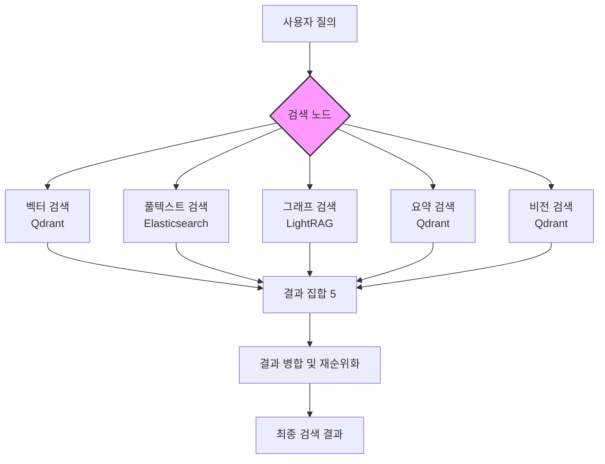
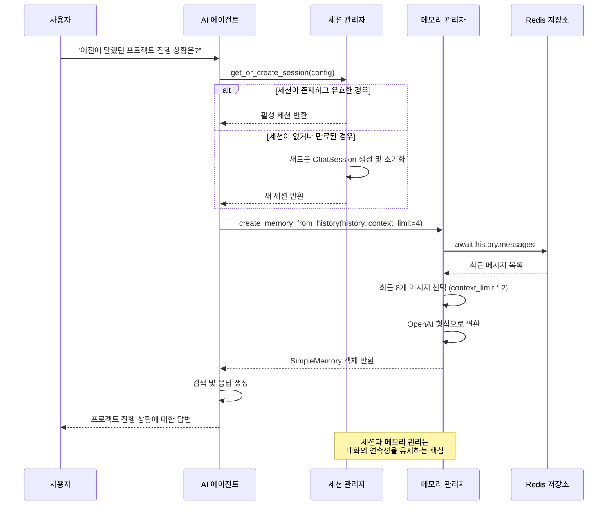

# 핵심 기능

<cite>
**이 문서에서 참조한 파일**
- [vector_search.py](file://aperag/flow/runners/vector_search.py)
- [fulltext_search.py](file://aperag/flow/runners/fulltext_search.py)
- [graph_search.py](file://aperag/flow/runners/graph_search.py)
- [summary_search.py](file://aperag/flow/runners/summary_search.py)
- [vision_search.py](file://aperag/flow/runners/vision_search.py)
- [engine.py](file://aperag/flow/engine.py)
- [agent_session_manager.py](file://aperag/agent/agent_session_manager.py)
- [agent_config.py](file://aperag/agent/agent_config.py)
- [agent_memory_manager.py](file://aperag/agent/agent_memory_manager.py)
- [lightrag_manager.py](file://aperag/graph/lightrag_manager.py)
- [README-zh.md](file://README-zh.md)
</cite>

## 목차
1. [하이브리드 검색 엔진](#하이브리드-검색-엔진)
2. [지능형 AI 에이전트](#지능형-ai-에이전트)
3. [실제 적용 사례 및 성능 이점](#실제-적용-사례-및-성능-이점)
4. [사용 팁](#사용-팁)

## 하이브리드 검색 엔진

ApeRAG의 핵심은 벡터 검색, 풀텍스트 검색, 그래프 기반 검색(RAG), 요약 검색, 비전 검색을 통합하는 하이브리드 검색 엔진입니다. 각 검색 유형은 서로 다른 기술 스택을 사용하여 다양한 데이터 유형과 쿼리에 최적화되어 있으며, ApeRAG는 이를 조합하여 보다 정확하고 포괄적인 검색 결과를 제공합니다.

### 벡터 검색
벡터 검색은 의미 기반 검색을 수행합니다. 사용자의 질의(query)와 문서 청크(chunk)를 모두 고차원 벡터 공간에 임베딩한 후, 벡터 간의 유사도(코사인 유사도 등)를 계산하여 관련성이 높은 문서를 검색합니다. 이 방식은 정확한 단어 일치 없이도 의미적으로 유사한 내용을 찾을 수 있어, 동의어나 유사 표현에 강력합니다.
- **기술 스택**: Qdrant가 벡터 저장소로 사용됩니다. `vector_search.py` 파일에서 `VectorSearchNodeRunner` 클래스가 실행 로직을 관리하며, `ContextManager`를 통해 Qdrant에 연결하고 쿼리를 전송합니다.
- **통합 방식**: `similarity_threshold` 매개변수를 사용하여 관련성 임계값을 설정하고, `top_k`로 반환할 결과 수를 제어합니다. 검색 결과에는 `"recall_type": "vector_search"`라는 메타데이터가 추가되어 추후 분석에 활용됩니다.

### 풀텍스트 검색
풀텍스트 검색은 전통적인 키워드 기반 검색입니다. Elasticsearch를 사용하여 문서 내의 정확한 단어 또는 구문 일치를 찾습니다. 특히 숫자, 코드 스니펫, 고유 명사 등을 찾는 데 효과적이며, 의미보다는 정밀한 일치를 요구하는 쿼리에 적합합니다.
- **기술 스택**: Elasticsearch가 인덱스 저장소로 사용됩니다. `fulltext_search.py` 파일에서 `FulltextSearchNodeRunner` 클래스가 검색을 담당하며, `extract_keywords` 함수를 사용해 사용자 질의에서 키워드를 추출하거나, 사용자가 직접 키워드를 지정할 수 있습니다.
- **통합 방식**: `keywords` 입력을 통해 검색할 키워드를 명시합니다. 키워드가 제공되지 않으면 시스템이 자동으로 추출합니다. 결과는 `"recall_type": "fulltext_search"` 메타데이터와 함께 반환됩니다.

### 그래프 기반 검색 (RAG)
그래프 기반 검색은 문서 내의 개체(entity)와 관계를 추출하여 지식 그래프를 구성한 후, 이 그래프를 탐색함으로써 정보를 검색합니다. 이 방식은 복잡한 질문이나 여러 개념 간의 관계를 이해하는 데 매우 효과적입니다.
- **기술 스택**: LightRAG가 핵심 기술로 사용됩니다. `graph_search.py` 파일의 `GraphSearchNodeRunner`는 `lightrag_manager`를 통해 LightRAG 인스턴스를 생성하고, `hybrid` 모드로 쿼리를 실행합니다. ApeRAG은 원본 LightRAG을 심층적으로 개조하여 동시성 처리와 프로덕션 환경 안정성을 크게 향상시켰습니다.
- **통합 방식**: `mode="hybrid"` 파라미터를 통해 벡터 검색과 그래프 탐색을 결합한 하이브리드 검색을 수행합니다. 결과는 컨텍스트 문자열로 반환되며, `"recall_type": "graph_search"` 메타데이터가 포함됩니다.

### 요약 검색
요약 검색은 전체 문서나 섹션의 핵심 내용을 요약한 벡터를 사용하여 검색합니다. 긴 문서의 주요 아이디어를 빠르게 찾거나, 특정 세부 정보가 아닌 개요를 찾는 데 유용합니다.
- **기술 스택**: 요약된 텍스트도 벡터로 변환되어 Qdrant에 저장됩니다. `summary_search.py` 파일의 `SummarySearchNodeRunner`는 `index_types=["summary"]` 필터를 사용하여 요약 인덱스만 대상으로 검색을 수행합니다.
- **통합 방식**: `similarity_threshold`와 `top_k`를 통해 검색을 제어하며, 결과는 `"recall_type": "summary_search"` 메타데이터와 함께 반환됩니다.

### 비전 검색
비전 검색은 이미지, 차트, 다이어그램 등의 시각적 콘텐츠를 분석하고 검색합니다. 이미지를 텍스트로 설명하는(vision-to-text) 방법과 이미지 자체를 벡터로 임베딩(multimodal embedding)하는 두 가지 방법을 지원합니다.
- **기술 스택**: `vision_search.py` 파일의 `VisionSearchNodeRunner`는 `index_types=["vision"]` 필터를 사용하여 비전 인덱스를 대상으로 검색합니다. `embedding_model`을 통해 질의와 이미지 벡터를 비교합니다.
- **통합 방식**: `_deduplicate_vision_results` 함수를 통해 동일한 이미지에 대한 중복 결과를 제거합니다. `vision_to_text` 결과가 우선적으로 유지되며, `"recall_type": "vision_search"` 메타데이터가 추가됩니다.

**다이어그램 출처**
- [vector_search.py](file://aperag/flow/runners/vector_search.py)
- [fulltext_search.py](file://aperag/flow/runners/fulltext_search.py)
- [graph_search.py](file://aperag/flow/runners/graph_search.py)
- [summary_search.py](file://aperag/flow/runners/summary_search.py)
- [vision_search.py](file://aperag/flow/runners/vision_search.py)

**섹션 출처**
- [vector_search.py](file://aperag/flow/runners/vector_search.py)
- [fulltext_search.py](file://aperag/flow/runners/fulltext_search.py)
- [graph_search.py](file://aperag/flow/runners/graph_search.py)
- [summary_search.py](file://aperag/flow/runners/summary_search.py)
- [vision_search.py](file://aperag/flow/runners/vision_search.py)
- [README-zh.md](file://README-zh.md)

## 지능형 AI 에이전트

ApeRAG의 AI 에이전트는 단순한 응답 생성기가 아니라, 사용자의 요청을 독립적으로 해결하기 위해 여러 도구를 활용하는 지능형 에이전트입니다. MCP(Model Context Protocol)를 통해 외부 도구와 상호작용하며, 세션과 메모리를 관리하여 자연스러운 대화 경험을 제공합니다.

### 작동 방식
AI 에이전트는 사용자의 메시지를 받으면, 내장된 워크플로우를 따라 작업을 수행합니다. 먼저, 사용자의 의도를 파악하고, 필요한 경우 지식 컬렉션에서 정보를 검색하거나 웹 검색을 수행합니다. 그 다음, 수집한 정보를 바탕으로 답변을 생성하거나, 다음 단계를 결정합니다. 이 과정은 반복될 수 있으며, 에이전트는 최종 목표를 달성할 때까지 자율적으로 행동합니다.

### MCP(Model Context Protocol) 도구 사용
MCP는 LLM이 외부 도구와 상호작용할 수 있도록 하는 표준 프로토콜입니다. ApeRAG의 AI 에이전트는 MCP 서버를 통해 다음과 같은 도구를 사용할 수 있습니다:
- **컬렉션 탐색**: 사용자가 지정한 지식 컬렉션을 나열하고 탐색합니다.
- **하이브리드 검색**: 위에서 설명한 벡터, 풀텍스트, 그래프 검색을 통합하여 실행합니다.
- **웹 검색**: 실시간 정보를 보충하기 위해 웹을 검색합니다.
- **LLM.txt 발견**: AI 문서를 위한 특화된 검색 기능을 사용합니다.

### 세션 및 메모리 관리 메커니즘
AI 에이전트는 상태를 유지해야 하므로, 세션과 메모리 관리는 매우 중요합니다.

- **세션 관리**: `agent_session_manager.py` 파일의 `ChatSession` 클래스는 사용자, 채팅 ID, LLM 제공자별로 고유한 세션을 생성하고 관리합니다. `get_or_create_session` 함수는 세션이 존재하면 재사용하고, 만료되었거나 없는 경우 새로 생성합니다. 백그라운드에서 `cleanup_expired_sessions` 함수가 주기적으로 오래된 세션을 정리합니다.
- **메모리 관리**: `agent_memory_manager.py` 파일의 `AgentMemoryManager` 클래스는 대화 기록을 `RedisChatMessageHistory`에서 가져와 `SimpleMemory` 객체로 변환합니다. `context_limit` 매개변수를 통해 최근 N번의 대화 턴(turn)만 메모리에 포함시켜 컨텍스트 창을 효율적으로 관리합니다. 또한, 최근 대화 요약을 생성하여 프롬프트에 포함시키는 기능도 제공합니다.

**다이어그램 출처**
- [agent_session_manager.py](file://aperag/agent/agent_session_manager.py)
- [agent_memory_manager.py](file://aperag/agent/agent_memory_manager.py)

**섹션 출처**
- [agent_session_manager.py](file://aperag/agent/agent_session_manager.py)
- [agent_config.py](file://aperag/agent/agent_config.py)
- [agent_memory_manager.py](file://aperag/agent/agent_memory_manager.py)

## 실제 적용 사례 및 성능 이점

### 적용 사례
1. **기술 문서 검색**: 개발자는 "PostgreSQL에서 트랜잭션 격리 수준을 변경하는 방법"이라는 의미 기반 질문을 할 수 있습니다. 벡터 검색이 관련 문서를 찾아내고, 그래프 검색이 "격리 수준", "트랜잭션", "SET TRANSACTION" 등의 개념 간 관계를 탐색하여 더 깊이 있는 답변을 제공합니다.
2. **재무 보고서 분석**: "지난 분기 매출 증가의 주요 원인은?"이라는 질문에 대해, 요약 검색이 각 보고서의 요약을 빠르게 스캔하고, 풀텍스트 검색이 "매출", "증가", "원인" 등의 키워드를 정확히 찾아냅니다.
3. **연구 논문 리뷰**: 논문 내의 복잡한 다이어그램을 비전 검색을 통해 분석하고, 해당 다이어그램이 설명하는 개념을 그래프 검색을 통해 관련 연구와 연결할 수 있습니다.

### 성능 이점
- **정확도 향상**: 단일 검색 방식의 한계를 극복하고, 다중 접근법을 통해 더 정확한 결과를 제공합니다.
- **포괄성 확보**: 다양한 유형의 콘텐츠(텍스트, 이미지, 구조화된 데이터)를 종합적으로 검색할 수 있습니다.
- **신뢰성 증대**: 검색 결과에 `"recall_type"` 메타데이터를 포함시켜, 어떤 방식으로 정보가 검색되었는지 추적 가능하게 합니다.

**섹션 출처**
- [README-zh.md](file://README-zh.md)

## 사용 팁

- **하이브리드 검색 활용**: 하나의 검색 방식에 의존하지 말고, 여러 검색 노드를 조합한 워크플로우를 설계하세요. 예를 들어, 먼저 풀텍스트 검색으로 관련 문서를 좁힌 후, 그래프 검색으로 깊이 있는 분석을 수행할 수 있습니다.
- **임계값 조정**: `similarity_threshold` 값을 너무 낮게 설정하면 관련 없는 결과가 포함되고, 너무 높게 설정하면 좋은 결과를 놓칠 수 있습니다. 사용 사례에 맞게 적절한 값을 실험적으로 찾아보세요.
- **컨텍스트 관리**: `context_limit`을 너무 크게 설정하면 LLM의 컨텍스트 창을 초과할 수 있으므로, 중요한 최근 대화만 포함하도록 조절하세요.
- **MCP 통합**: 외부 AI 도구와 통합할 때는 ApeRAG의 MCP 서버를 활용하여 지식 컬렉션에 직접 접근하게 하면, 더욱 강력한 에이전트를 만들 수 있습니다.

**섹션 출처**
- [README-zh.md](file://README-zh.md)