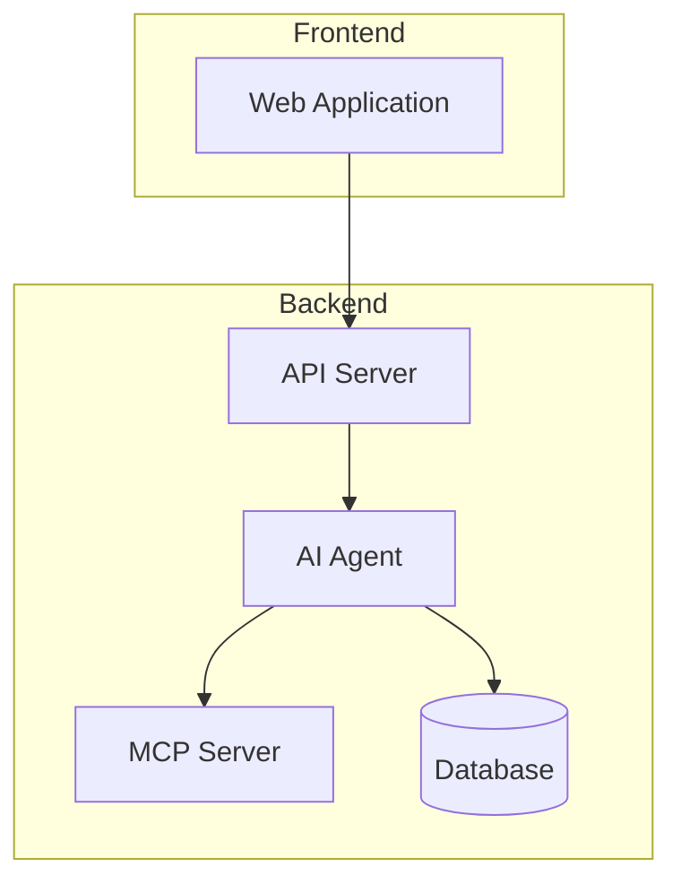
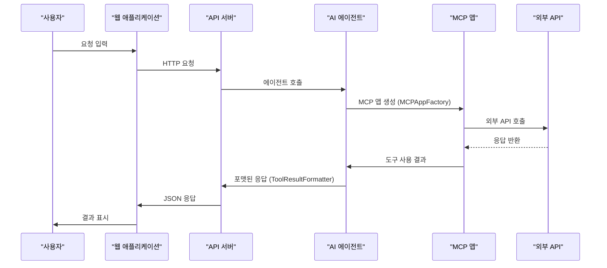
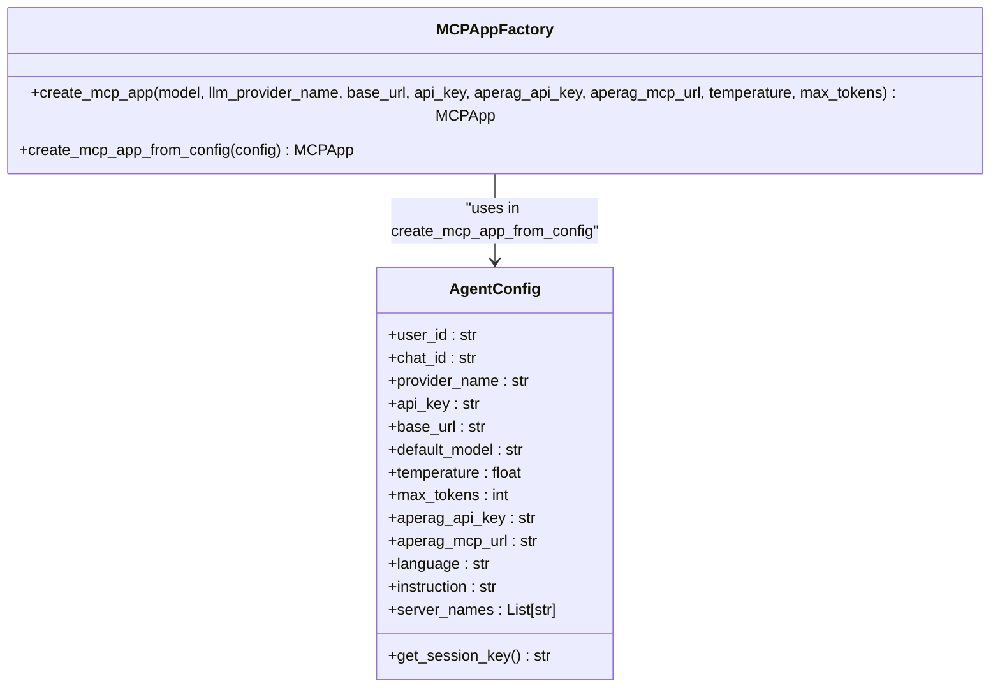
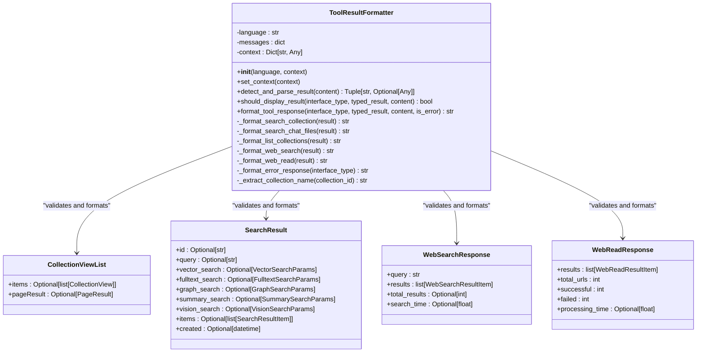
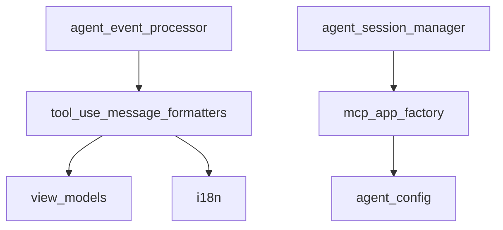

# MCP 도구 확장

<cite>
**이 문서에서 참조한 파일**
- [mcp_app_factory.py](file://aperag/agent/mcp_app_factory.py)
- [tool_use_message_formatters.py](file://aperag/agent/tool_use_message_formatters.py)
- [agent_config.py](file://aperag/agent/agent_config.py)
- [i18n.py](file://aperag/agent/i18n.py)
- [view_models.py](file://aperag/schema/view_models.py)
</cite>

## 목차
1. [소개](#소개)
2. [프로젝트 구조](#프로젝트-구조)
3. [핵심 구성 요소](#핵심-구성-요소)
4. [아키텍처 개요](#아키텍처-개요)
5. [상세 구성 요소 분석](#상세-구성-요소-분석)
6. [의존성 분석](#의존성-분석)
7. [성능 고려 사항](#성능-고려-사항)
8. [문제 해결 가이드](#문제-해결-가이드)
9. [결론](#결론)

## 소개
이 문서는 ApeRAG 프로젝트 내에서 AI 에이전트의 기능을 강화하기 위해 Model Context Protocol(MCP) 도구를 확장하는 방법을 설명합니다. 주로 `tool_use_message_formatters.py` 파일을 수정하거나 `mcp_app_factory.py`를 통해 새로운 MCP 앱을 등록함으로써, AI가 외부 API를 호출하거나 시스템 작업을 수행할 수 있도록 하는 절차를 다룹니다. OpenAPI 스펙 기반 도구 정의, 요청/응답 매핑, 오류 처리, 보안 인증(예: API 키) 등의 개념을 포함하며, 날씨 조회 또는 캘린더 예약 기능을 MCP 도구로 구현하는 실제 예제를 제공합니다.

## 프로젝트 구조
ApeRAG 프로젝트는 다양한 모듈과 구성 요소로 구성되어 있으며, 각각의 역할은 다음과 같습니다:

- **aperag**: 핵심 애플리케이션 로직 및 에이전트 관련 기능을 포함합니다.
  - **agent**: AI 에이전트의 설정, 이벤트 처리, 세션 관리 등을 담당합니다.
  - **api**: OpenAPI 스펙에 기반한 API 경로와 스키마를 정의합니다.
  - **auth**: 인증 관련 기능을 제공합니다.
  - **db**: 데이터베이스 연산 및 저장소를 관리합니다.
  - **mcp**: MCP 서버와 관련된 기능을 포함합니다.
- **config**: 설정 파일과 Celery 관련 구성 정보를 포함합니다.
- **deploy**: Kubernetes 배포를 위한 YAML 파일들을 포함합니다.
- **models**: LLM 모델 구성 정보를 JSON 형식으로 저장합니다.
- **scripts**: 다양한 스크립트를 제공하여 빌드, 배포, 테스트 등을 지원합니다.
- **tests**: 단위 테스트 및 E2E 테스트 코드를 포함합니다.
- **web**: 프론트엔드 웹 애플리케이션 소스 코드를 포함합니다.

이러한 구조는 모듈 간의 관심사 분리를 통해 유지보수성과 확장성을 극대화합니다.

**다이어그램 출처**
- [mcp_app_factory.py](file://aperag/agent/mcp_app_factory.py#L25-L103)
- [tool_use_message_formatters.py](file://aperag/agent/tool_use_message_formatters.py#L29-L416)

**섹션 출처**
- [mcp_app_factory.py](file://aperag/agent/mcp_app_factory.py#L1-L104)
- [tool_use_message_formatters.py](file://aperag/agent/tool_use_message_formatters.py#L1-L485)

## 핵심 구성 요소
MCP 도구 확장을 위한 핵심 구성 요소는 `mcp_app_factory.py`와 `tool_use_message_formatters.py`입니다. 전자는 MCP 애플리케이션을 생성하고 초기화하는 팩토리 클래스를 제공하며, 후자는 도구 사용 결과를 포맷팅하여 사용자에게 이해하기 쉬운 형태로 표시합니다. 또한, `AgentConfig` 클래스는 에이전트 설정을 중앙에서 관리하여 일관성 있는 동작을 보장합니다.

**섹션 출처**
- [mcp_app_factory.py](file://aperag/agent/mcp_app_factory.py#L25-L103)
- [tool_use_message_formatters.py](file://aperag/agent/tool_use_message_formatters.py#L29-L416)
- [agent_config.py](file://aperag/agent/agent_config.py#L21-L52)

## 아키텍처 개요
ApeRAG의 아키텍처는 클라이언트-서버 모델을 기반으로 하며, 프론트엔드 웹 애플리케이션이 백엔드 API 서버와 통신합니다. API 서버는 AI 에이전트를 통해 MCP 서버와 상호작용하며, 필요한 경우 데이터베이스나 외부 서비스에 접근합니다. MCP 앱 팩토리는 설정 정보를 바탕으로 MCP 앱 인스턴스를 생성하고, 도구 사용 메시지 포맷터는 도구 실행 결과를 적절히 포맷하여 응답으로 반환합니다.

**다이어그램 출처**
- [mcp_app_factory.py](file://aperag/agent/mcp_app_factory.py#L25-L103)
- [tool_use_message_formatters.py](file://aperag/agent/tool_use_message_formatters.py#L29-L416)

## 상세 구성 요소 분석
### MCPAppFactory 분석
`MCPAppFactory` 클래스는 정적 메서드를 통해 MCP 앱 인스턴스를 생성합니다. `create_mcp_app` 메서드는 모델, LLM 공급자 이름, 기본 URL, API 키 등의 필수 매개변수를 검증한 후, `Settings` 객체를 구성하여 `MCPApp` 인스턴스를 생성합니다. 이 과정에서 인증 헤더에 API 키가 포함되며, 타임아웃 설정도 함께 적용됩니다.

#### 클래스 다이어그램

**다이어그램 출처**
- [mcp_app_factory.py](file://aperag/agent/mcp_app_factory.py#L25-L103)
- [agent_config.py](file://aperag/agent/agent_config.py#L21-L52)

**섹션 출처**
- [mcp_app_factory.py](file://aperag/agent/mcp_app_factory.py#L25-L103)

### ToolResultFormatter 분석
`ToolResultFormatter` 클래스는 다양한 도구의 실행 결과를 사용자에게 알기 쉽게 포맷팅합니다. 언어 설정에 따라 다국어 지원이 가능하며, 컨텍스트 정보를 활용하여 더 정확한 결과를 제공합니다. `_format_search_collection`, `_format_web_search` 등의 메서드는 각 도구 유형에 맞게 출력 형식을 결정합니다.

#### 클래스 다이어그램

**다이어그램 출처**
- [tool_use_message_formatters.py](file://aperag/agent/tool_use_message_formatters.py#L29-L416)
- [view_models.py](file://aperag/schema/view_models.py#L710-L716)
- [view_models.py](file://aperag/schema/view_models.py#L870-L881)
- [view_models.py](file://aperag/schema/view_models.py#L2250-L2262)
- [view_models.py](file://aperag/schema/view_models.py#L2306-L2317)

**섹션 출처**
- [tool_use_message_formatters.py](file://aperag/agent/tool_use_message_formatters.py#L29-L416)

## 의존성 분석
MCP 도구 확장 기능은 여러 모듈 간의 긴밀한 협업을 필요로 합니다. `mcp_app_factory.py`는 `agent_config.py`의 `AgentConfig` 클래스를 통해 설정 정보를 받으며, `tool_use_message_formatters.py`는 `view_models.py`의 Pydantic 모델을 사용하여 도구 결과를 검증하고 포맷팅합니다. 이러한 의존성은 시스템의 결합도를 낮추고 재사용성을 높이는 데 기여합니다.

**다이어그램 출처**
- [mcp_app_factory.py](file://aperag/agent/mcp_app_factory.py#L25-L103)
- [agent_config.py](file://aperag/agent/agent_config.py#L21-L52)
- [tool_use_message_formatters.py](file://aperag/agent/tool_use_message_formatters.py#L29-L416)
- [view_models.py](file://aperag/schema/view_models.py#L710-L716)
- [i18n.py](file://aperag/agent/i18n.py#L1-L157)

**섹션 출처**
- [mcp_app_factory.py](file://aperag/agent/mcp_app_factory.py#L1-L104)
- [tool_use_message_formatters.py](file://aperag/agent/tool_use_message_formatters.py#L1-L485)
- [agent_config.py](file://aperag/agent/agent_config.py#L1-L53)
- [i18n.py](file://aperag/agent/i18n.py#L1-L157)
- [view_models.py](file://aperag/schema/view_models.py#L1-L799)

## 성능 고려 사항
MCP 도구 확장 시 성능을 최적화하기 위해 다음과 같은 점을 고려해야 합니다:
- **비동기 처리**: 모든 네트워크 I/O는 비동기적으로 처리되어야 하며, 이는 `execution_engine="asyncio"` 설정을 통해 보장됩니다.
- **캐싱**: 자주 사용되는 도구 결과는 캐싱하여 반복적인 외부 호출을 방지해야 합니다.
- **타임아웃 설정**: `http_timeout_seconds`와 `read_timeout_seconds`를 적절히 설정하여 장시간 응답을 기다리는 것을 방지해야 합니다.
- **오류 재시도**: 일시적인 네트워크 문제에 대비하여 재시도 로직을 구현하는 것이 좋습니다.

## 문제 해결 가이드
MCP 도구 확장 과정에서 발생할 수 있는 일반적인 문제와 그 해결 방법은 다음과 같습니다:

- **MCP 앱 생성 실패**: `mcp_init_failed` 예외가 발생하면, 전달된 설정 값들이 모두 유효한지 확인하세요. 특히 `api_key`, `base_url`, `aperag_mcp_url`이 올바르게 설정되었는지 검토해야 합니다.
- **도구 결과 미표시**: `should_display_result` 메서드가 `False`를 반환하면 결과가 표시되지 않습니다. 쿼리 문자열이 비어 있거나 유효하지 않은 경우 이 문제가 발생할 수 있습니다.
- **국제화 문제**: 언어 설정이 올바르지 않으면 메시지가 영어로만 표시될 수 있습니다. `TOOL_USE_EVENT_MESSAGES`에 해당 언어 코드가 존재하는지 확인하세요.

**섹션 출처**
- [mcp_app_factory.py](file://aperag/agent/mcp_app_factory.py#L69-L103)
- [tool_use_message_formatters.py](file://aperag/agent/tool_use_message_formatters.py#L150-L180)
- [i18n.py](file://aperag/agent/i18n.py#L1-L157)

## 결론
ApeRAG에서 MCP 도구를 확장하는 것은 AI 에이전트의 기능을 크게 향상시키는 중요한 작업입니다. `mcp_app_factory.py`를 통해 안정적인 MCP 앱 생성을 보장하고, `tool_use_message_formatters.py`를 통해 사용자 친화적인 결과 출력을 제공함으로써, 복잡한 외부 API 통신을 추상화할 수 있습니다. 이 문서에서 설명한 절차를 따르면, 날씨 조회나 캘린더 예약과 같은 실용적인 기능을 손쉽게 MCP 도구로 구현할 수 있습니다.