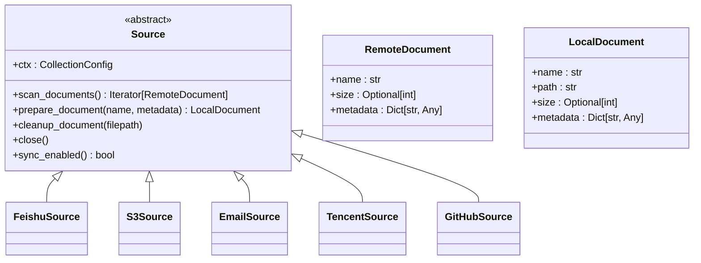
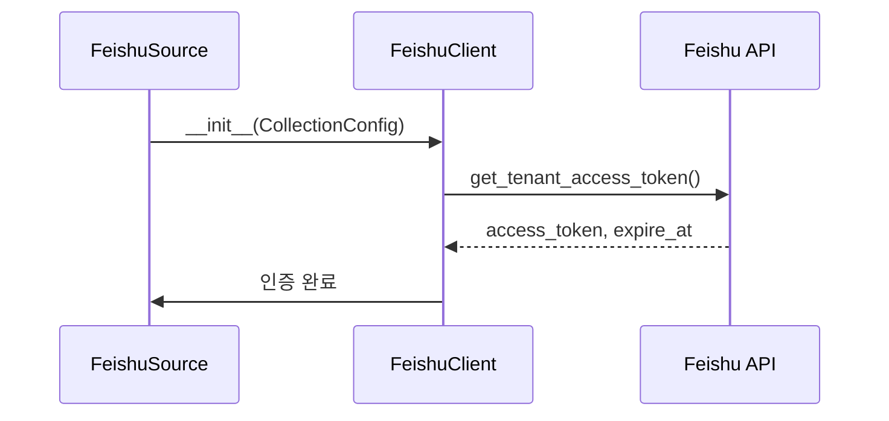

# 외부 데이터 소스 통합

<cite>
**이 문서에서 참조한 파일**
- [base.py](file://aperag/source/base.py)
- [feishu.py](file://aperag/source/feishu/feishu.py)
- [client.py](file://aperag/source/feishu/client.py)
- [s3.py](file://aperag/source/s3.py)
- [Email.py](file://aperag/source/Email.py)
- [tencent.py](file://aperag/source/tencent/tencent.py)
- [github.py](file://aperag/source/github.py)
- [utils.py](file://aperag/source/utils.py)
</cite>

## 목차
1. [소개](#소개)
2. [SourceBase 추상 클래스 개요](#sourcebase-추상-클래스-개요)
3. [주요 메서드 구현 가이드](#주요-메서드-구현-가이드)
4. [Feishu 커스텀 소스 구현 예제](#feishu-커스텀-소스-구현-예제)
5. [고급 기능 통합](#고급-기능-통합)
6. [오류 처리 및 최적화 전략](#오류-처리-및-최적화-전략)
7. [결론](#결론)

## 소개
ApeRAG은 다양한 외부 데이터 소스(Feishu, Tencent, GitHub, S3, 이메일 등)를 통합하여 문서를 수집하고 인덱싱할 수 있는 유연한 아키텍처를 제공합니다. 이 문서는 `SourceBase` 추상 클래스를 기반으로 새로운 데이터 소스를 추가하는 절차를 단계별로 안내하며, OAuth 인증, 페이징, 웹훅 연동, 실시간 동기화 등의 고급 기능을 포함합니다. 또한 Feishu 문서 자동 수집 예제와 오류 재시도, 변경 감지, 대량 데이터 처리 최적화 전략을 설명합니다.

## SourceBase 추상 클래스 개요

ApeRAG의 모든 데이터 소스는 `Source` 추상 클래스를 상속받아 구현됩니다. 이 클래스는 데이터 소스 간의 일관된 인터페이스를 보장하며, 핵심 메서드를 통해 문서 스캔, 다운로드, 정리 등을 수행합니다.



**다이어그램 출처**
- [base.py](file://aperag/source/base.py#L1-L124)

**섹션 출처**
- [base.py](file://aperag/source/base.py#L1-L124)

## 주요 메서드 구현 가이드

### scan_documents()
이 메서드는 원격 위치에서 사용 가능한 문서를 탐색하고 `RemoteDocument` 객체의 반복자를 반환합니다. 각 문서는 이름, 크기, 메타데이터를 포함합니다.

```python
def scan_documents(self) -> Iterator[RemoteDocument]:
    # 문서 목록 조회 로직 구현
    pass
```

### prepare_document()
지정된 문서를 로컬로 다운로드하거나 준비하고, `LocalDocument` 객체를 반환합니다. 임시 파일 생성 및 콘텐츠 저장을 처리합니다.

```python
def prepare_document(self, name: str, metadata: Dict[str, Any]) -> LocalDocument:
    # 문서 다운로드 및 로컬 준비 로직 구현
    pass
```

### sync_enabled()
해당 소스가 실시간 동기화를 지원하는지 여부를 반환합니다. Feishu, S3, 이메일 등 대부분의 소스는 True를 반환합니다.

```python
def sync_enabled(self):
    return True
```

### cleanup_document()
임시 파일을 정리합니다. 기본 구현은 `os.remove()`를 사용합니다.

```python
def cleanup_document(self, filepath: str):
    os.remove(filepath)
```

**섹션 출처**
- [base.py](file://aperag/source/base.py#L1-L124)

## Feishu 커스텀 소스 구현 예제

Feishu 문서를 자동으로 수집하고 인덱싱하기 위해 `FeishuSource` 클래스를 구현합니다. 이 클래스는 `Source`를 상속하고 Feishu API 클라이언트를 활용합니다.

### 초기화 및 인증
`FeishuClient`는 앱 ID와 시크릿을 사용하여 테넌트 액세스 토큰을 관리하며, 요청 시 자동 갱신합니다.



**다이어그램 출처**
- [feishu.py](file://aperag/source/feishu/feishu.py#L30-L151)
- [client.py](file://aperag/source/feishu/client.py#L48-L285)

### 문서 스캔
BFS(너비 우선 탐색) 방식으로 지정된 스페이스 내 모든 문서 노드를 순회하며 `.md` 형식의 `RemoteDocument`를 생성합니다.

```python
def scan_documents(self) -> Iterator[RemoteDocument]:
    return self.get_node_documents(self.space_id, self.root_node_id)
```

### 문서 준비
문서 유형(`docx`, `doc`)에 따라 블록 API 또는 내보내기 API를 사용하여 콘텐츠를 가져옵니다. 블록 API는 마크다운 변환을 지원합니다.

```python
def prepare_document(self, name: str, metadata: Dict[str, Any]) -> LocalDocument:
    node_id = metadata["obj_token"]
    content = self.get_docx_content(node_id) if metadata["obj_type"] == "docx" else self.get_doc_content(node_id)
    temp_file = gen_temporary_file(name)
    temp_file.write(content)
    temp_file.close()
    return LocalDocument(name=name, path=temp_file.name, metadata=metadata)
```

**섹션 출처**
- [feishu.py](file://aperag/source/feishu/feishu.py#L30-L151)
- [client.py](file://aperag/source/feishu/client.py#L48-L285)

## 고급 기능 통합

### OAuth 인증 처리
Tencent 및 이메일 소스는 OAuth 2.0을 사용하여 사용자 인증을 처리합니다. 액세스 토큰은 Redis에 캐싱되어 재사용됩니다.

```python
def get_access_token(self):
    # OAuth 코드 교환 및 토큰 저장
    pass
```

### 페이징 처리
S3 및 Feishu는 대규모 문서 목록을 처리하기 위해 페이징을 지원합니다. `page_token`을 사용하여 다음 페이지를 순차적으로 조회합니다.

```python
while True:
    params["page_token"] = page_token
    resp = self.get(f"wiki/v2/spaces/{space_id}/nodes", params=params)
    if not resp["data"]["has_more"]:
        break
    page_token = resp["data"]["page_token"]
```

### 웹훅 및 실시간 동기화
`sync_enabled()`이 True인 소스는 웹훅을 통해 실시간 변경 사항을 감지하고 즉시 동기화할 수 있습니다.

```python
def sync_enabled(self):
    return True
```

**섹션 출처**
- [s3.py](file://aperag/source/s3.py#L1-L110)
- [Email.py](file://aperag/source/Email.py#L1-L237)
- [tencent.py](file://aperag/source/tencent/tencent.py#L1-L34)
- [tencent/client.py](file://aperag/source/tencent/client.py#L1-L206)

## 오류 처리 및 최적화 전략

### 오류 재시도
API 요청 실패 시 지수 백오프를 적용하여 재시도합니다. 네트워크 불안정성에 강건하게 대응합니다.

```python
while True:
    result = self.client.query_export_task(ticket, node_id)
    match result["job_status"]:
        case 0:  # 성공
            break
        case 1 | 2:  # 초기화 중, 실행 중
            time.sleep(1)
            pass
        case _:
            raise Exception("내보내기 작업 실패")
```

### 변경 감지
문서의 `modified_time` 메타데이터를 비교하여 변경 여부를 판단하고, 불필요한 재처리를 방지합니다.

```python
"modified_time": datetime.datetime.utcfromtimestamp(int(node["obj_edit_time"]))
```

### 대량 데이터 처리 최적화
임시 파일 경로 중복을 방지하고, 대용량 파일 처리 시 메모리 사용을 최소화합니다. `find_duplicate_paths()` 유틸리티를 사용하여 경로 충돌을 사전에 검출합니다.

```python
duplicates = find_duplicate_paths(bucket_dirs)
if len(duplicates) != 0:
    raise CustomSourceInitializationError("버킷 디렉터리에 중복된 경로가 존재함")
```

**섹션 출처**
- [utils.py](file://aperag/source/utils.py#L1-L53)
- [s3.py](file://aperag/source/s3.py#L1-L110)
- [Email.py](file://aperag/source/Email.py#L1-L237)

## 결론
ApeRAG은 `SourceBase` 추상 클래스를 통해 다양한 외부 데이터 소스를 체계적으로 통합할 수 있는 확장 가능한 아키텍처를 제공합니다. Feishu, S3, 이메일, Tencent, GitHub 등 각 소스는 일관된 인터페이스를 따르며, OAuth 인증, 페이징, 실시간 동기화, 오류 재시도 등의 고급 기능을 지원합니다. 이를 통해 사용자는 새로운 데이터 소스를 쉽게 추가하고, 대규모 문서 수집 및 인덱싱 파이프라인을 효율적으로 구성할 수 있습니다.