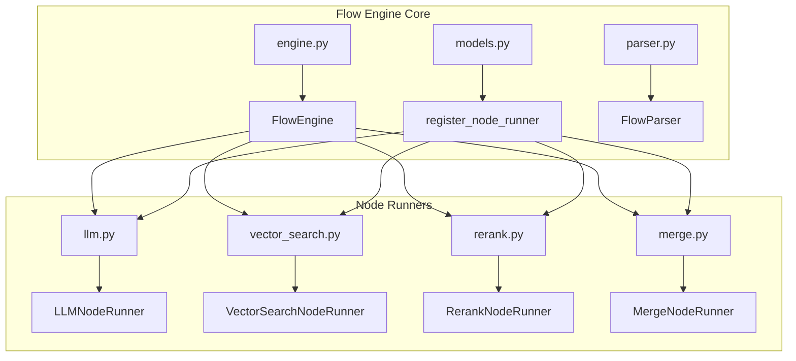
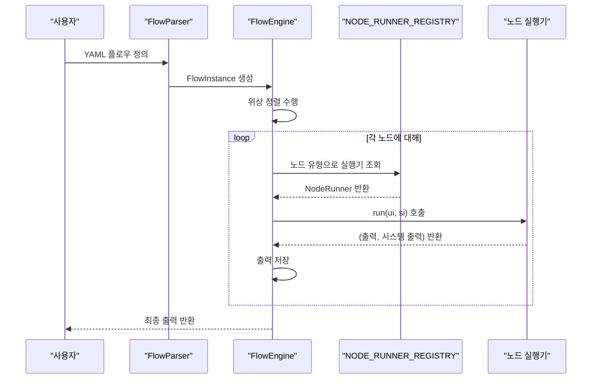
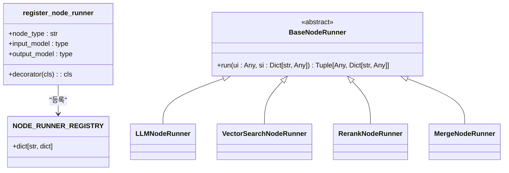
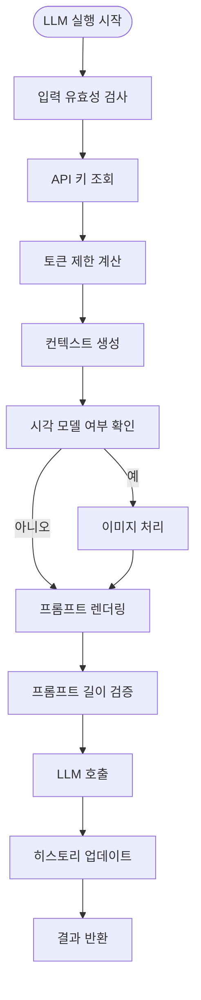
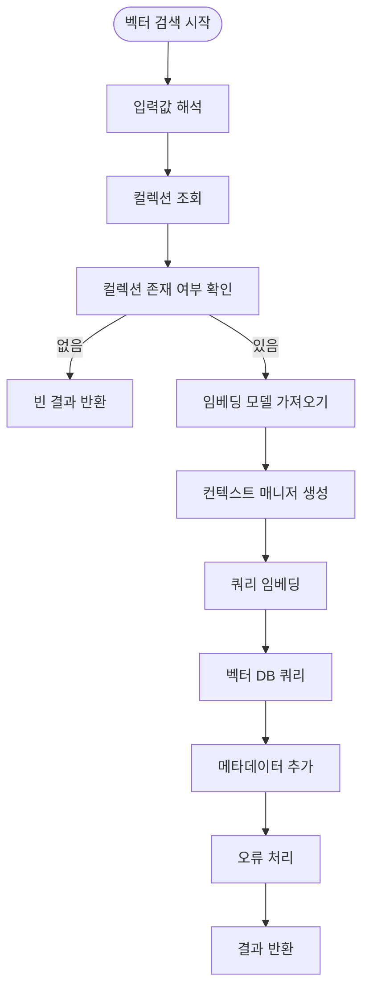
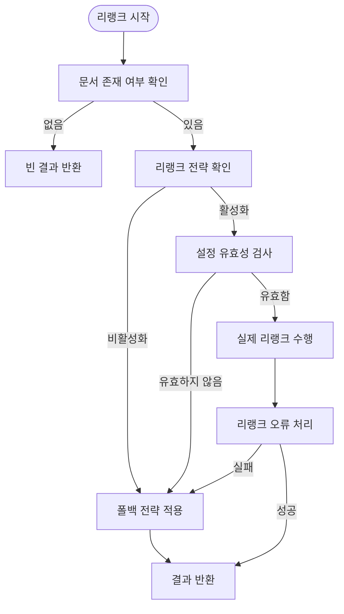
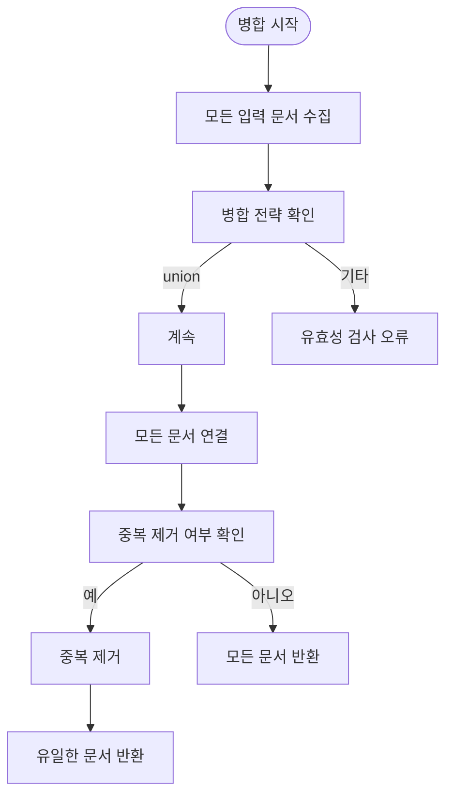
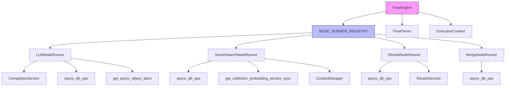

# 커스텀 노드 실행기

<cite>
**이 문서에서 참조한 파일**
- [engine.py](file://aperag/flow/engine.py)
- [models.py](file://aperag/flow/base/models.py)
- [llm.py](file://aperag/flow/runners/llm.py)
- [vector_search.py](file://aperag/flow/runners/vector_search.py)
- [rerank.py](file://aperag/flow/runners/rerank.py)
- [merge.py](file://aperag/flow/runners/merge.py)
- [parser.py](file://aperag/flow/parser.py)
- [rag_flow.yaml](file://aperag/flow/examples/rag_flow.yaml)
</cite>

## 목차
1. [소개](#소개)
2. [프로젝트 구조](#프로젝트-구조)
3. [핵심 구성 요소](#핵심-구성-요소)
4. [아키텍처 개요](#아키텍처-개요)
5. [상세 구성 요소 분석](#상세-구성-요소-분석)
6. [의존성 분석](#의존성-분석)
7. [성능 고려사항](#성능-고려사항)
8. [문제 해결 가이드](#문제-해결-가이드)
9. [결론](#결론)

## 소개
ApeRAG의 플로우 엔진은 다양한 RAG(Retrieval-Augmented Generation) 워크플로우를 정의하고 실행하기 위한 유연한 아키텍처를 제공합니다. 이 문서는 `@register_node_runner` 데코레이터를 사용하여 새로운 노드 유형(LLM, 검색, 병합 등)을 정의하고 등록하는 절차를 단계별로 설명합니다. 각 노드 실행기의 입력/출력 스키마, 상태 관리, 오류 처리 전략을 다루며, 실제 코드 예제를 통해 벡터 검색 또는 리랭크 기능을 확장하는 구현 사례를 제공합니다. 또한 노드 간 의존성 처리, 비동기 실행, 타임아웃 설정 등의 고급 기능도 포함됩니다.

## 프로젝트 구조
ApeRAG의 핵심적인 플로우 엔진 관련 모듈은 `aperag/flow` 디렉터리에 위치하며, 다음과 같은 주요 구성 요소로 이루어져 있습니다:

- **runners**: 다양한 노드 실행기(LLM, 벡터 검색, 리랭크 등)가 위치한 디렉터리
- **base/models.py**: 노드 실행기 등록 및 기본 모델 정의
- **engine.py**: 플로우 실행 엔진의 핵심 로직
- **parser.py**: YAML 형식의 플로우 정의 파싱
- **examples**: 실제 플로우 예제(YAML)

**Diagram sources**
- [engine.py](file://aperag/flow/engine.py#L1-L50)
- [models.py](file://aperag/flow/base/models.py#L1-L20)
- [llm.py](file://aperag/flow/runners/llm.py#L1-L20)
- [vector_search.py](file://aperag/flow/runners/vector_search.py#L1-L20)
- [rerank.py](file://aperag/flow/runners/rerank.py#L1-L20)
- [merge.py](file://aperag/flow/runners/merge.py#L1-L20)

**Section sources**
- [engine.py](file://aperag/flow/engine.py#L1-L50)
- [models.py](file://aperag/flow/base/models.py#L1-L20)
- [parser.py](file://aperag/flow/parser.py#L1-L20)

## 핵심 구성 요소

ApeRAG의 플로우 엔진은 다음의 핵심 구성 요소들로 이루어져 있습니다:

- **FlowEngine**: 플로우 인스턴스를 실행하는 핵심 엔진
- **NODE_RUNNER_REGISTRY**: 등록된 모든 노드 실행기를 저장하는 글로벌 레지스트리
- **@register_node_runner**: 새로운 노드 실행기를 등록하는 데코레이터
- **BaseNodeRunner**: 모든 노드 실행기가 상속해야 하는 추상 기본 클래스
- **FlowParser**: YAML 형식의 플로우 정의를 파싱하는 파서

각 노드 실행기는 `run` 메서드를 구현하여 비동기적으로 실행되며, 사용자 입력(ui)과 시스템 입력(si)을 받아 출력 결과와 시스템 출력을 반환합니다.

**Section sources**
- [engine.py](file://aperag/flow/engine.py#L1-L50)
- [models.py](file://aperag/flow/base/models.py#L1-L167)
- [parser.py](file://aperag/flow/parser.py#L1-L97)

## 아키텍처 개요

ApeRAG의 플로우 엔진 아키텍처는 모듈화되고 확장 가능한 설계를 따르며, 다음과 같은 흐름으로 작동합니다:

1. 사용자는 YAML 형식으로 플로우를 정의
2. FlowParser가 YAML을 파싱하여 FlowInstance 생성
3. FlowEngine이 FlowInstance를 실행
4. FlowEngine은 노드 간 의존성을 분석하고 위상 정렬 수행
5. NODE_RUNNER_REGISTRY에서 각 노드 유형에 해당하는 실행기 찾기
6. 노드 실행기의 run 메서드 호출하여 결과 생성

**Diagram sources**
- [engine.py](file://aperag/flow/engine.py#L1-L455)
- [models.py](file://aperag/flow/base/models.py#L1-L167)
- [parser.py](file://aperag/flow/parser.py#L1-L97)

## 상세 구성 요소 분석

### 노드 실행기 등록 메커니즘 분석

ApeRAG의 커스텀 노드 실행기 등록은 `@register_node_runner` 데코레이터를 통해 이루어집니다. 이 데코레이터는 노드 유형, 입력 모델, 출력 모델을 인수로 받아 노드 실행기를 글로벌 레지스트리에 등록합니다.

**Diagram sources**
- [models.py](file://aperag/flow/base/models.py#L120-L142)

**Section sources**
- [models.py](file://aperag/flow/base/models.py#L120-L142)

### LLM 노드 실행기 분석

LLM 노드 실행기는 사용자의 쿼리와 관련 문서를 바탕으로 언어 모델을 통해 응답을 생성하는 역할을 합니다. 이 실행기는 외부 LLM 서비스와 통신하며, 이미지 입력도 지원합니다.

**Diagram sources**
- [llm.py](file://aperag/flow/runners/llm.py#L1-L353)

**Section sources**
- [llm.py](file://aperag/flow/runners/llm.py#L1-L353)

### 벡터 검색 노드 실행기 분석

벡터 검색 노드 실행기는 사용자의 쿼리를 벡터화하고, 벡터 데이터베이스에서 유사한 문서를 검색하는 역할을 합니다. 이 실행기는 임베딩 모델과 벡터 데이터베이스 연결을 관리합니다.

**Diagram sources**
- [vector_search.py](file://aperag/flow/runners/vector_search.py#L1-L149)

**Section sources**
- [vector_search.py](file://aperag/flow/runners/vector_search.py#L1-L149)

### 리랭크 노드 실행기 분석

리랭크 노드 실행기는 검색된 문서들의 순서를 재정렬하여 더 관련성 있는 문서가 우선순위를 가지도록 합니다. 이 실행기는 전용 리랭크 서비스를 사용하거나, 실패 시 폴백 전략을 적용합니다.

**Diagram sources**
- [rerank.py](file://aperag/flow/runners/rerank.py#L1-L196)

**Section sources**
- [rerank.py](file://aperag/flow/runners/rerank.py#L1-L196)

### 병합 노드 실행기 분석

병합 노드 실행기는 여러 검색 노드(벡터, 풀텍스트, 그래프 등)로부터 반환된 결과를 하나로 통합하는 역할을 합니다. 현재는 유니온 전략만 지원하며, 중복 제거 기능을 제공합니다.

**Diagram sources**
- [merge.py](file://aperag/flow/runners/merge.py#L1-L77)

**Section sources**
- [merge.py](file://aperag/flow/runners/merge.py#L1-L77)

## 의존성 분석

ApeRAG의 플로우 엔진은 다음과 같은 주요 의존성 구조를 가지고 있습니다:

**Diagram sources**
- [engine.py](file://aperag/flow/engine.py#L1-L455)
- [models.py](file://aperag/flow/base/models.py#L1-L167)
- [llm.py](file://aperag/flow/runners/llm.py#L1-L353)
- [vector_search.py](file://aperag/flow/runners/vector_search.py#L1-L149)
- [rerank.py](file://aperag/flow/runners/rerank.py#L1-L196)
- [merge.py](file://aperag/flow/runners/merge.py#L1-L77)

**Section sources**
- [engine.py](file://aperag/flow/engine.py#L1-L455)
- [models.py](file://aperag/flow/base/models.py#L1-L167)

## 성능 고려사항

ApeRAG의 플로우 엔진은 다음과 같은 성능 최적화 기법들을 적용하고 있습니다:

- **병렬 실행**: 의존성이 없는 노드들은 동시에 실행되어 처리 시간 단축
- **토큰 제한 계산**: 모델의 컨텍스트 창 크기를 고려한 입력 길이 제한
- **캐싱 메커니즘**: 임베딩 모델과 객체 저장소 경로에 대한 캐싱
- **비동기 처리**: I/O 작업(데이터베이스 조회, 외부 API 호출)을 비동기로 처리
- **오류 복구**: 리랭크 서비스 실패 시 폴백 전략 적용으로 서비스 지속성 보장

특히, `calculate_model_token_limits` 함수는 모델의 context_window, max_input_tokens, max_output_tokens 등을 종합적으로 고려하여 안전한 토큰 제한을 계산합니다.

## 문제 해결 가이드

ApeRAG의 플로우 엔진에서 발생할 수 있는 주요 문제들과 그 해결 방법은 다음과 같습니다:

**Section sources**
- [engine.py](file://aperag/flow/engine.py#L1-L455)
- [models.py](file://aperag/flow/base/models.py#L1-L167)
- [llm.py](file://aperag/flow/runners/llm.py#L1-L353)
- [vector_search.py](file://aperag/flow/runners/vector_search.py#L1-L149)
- [rerank.py](file://aperag/flow/runners/rerank.py#L1-L196)

### 사이클 오류(CycleError)
- **원인**: 플로우 정의에서 노드 간 순환 의존성 존재
- **해결**: FlowEngine의 `_topological_sort` 메서드가 사이클 감지 후 예외 발생
- **대응**: 플로우 다이어그램에서 순환 연결 제거

### 입력 유효성 오류(ValidationError)
- **원인**: 노드 입력 값이 정의된 스키마와 일치하지 않음
- **해결**: Pydantic 모델의 `model_validate` 메서드에서 검증 실패
- **대응**: 입력 값의 타입과 구조 확인 후 수정

### 구성 오류(InvalidConfigurationError)
- **원인**: LLM 또는 리랭크 서비스에 필요한 API 키, base_url 등 누락
- **해결**: `query_provider_api_key`, `query_llm_provider_by_name` 등의 함수에서 검증
- **대응**: 설정 데이터베이스에서 올바른 구성 정보 확인

### 임베딩 오류(EmbeddingError)
- **원인**: 임베딩 모델 제공자 없음 또는 인증 실패
- **해결**: `get_collection_embedding_service_sync` 함수에서 예외 처리
- **대응**: 임베딩 서비스 제공자 설정 확인

### 리랭크 오류(RerankError)
- **원인**: 리랭크 서비스 호출 실패
- **해결**: `_perform_actual_rerank` 메서드에서 예외 발생 시 `_apply_fallback_strategy`로 전환
- **대응**: 폴백 전략(그래프 검색 결과 우선, 나머지 스코어 기준 정렬) 자동 적용

## 결론

ApeRAG의 플로우 엔진은 `@register_node_runner` 데코레이터를 통해 확장 가능한 아키텍처를 제공하며, 새로운 노드 유형을 쉽게 추가할 수 있습니다. 각 노드 실행기는 명확한 입력/출력 스키마를 가지며, Pydantic 모델을 통해 강력한 타입 검사를 수행합니다. 플로우 엔진은 위상 정렬을 통해 노드 간 의존성을 올바르게 처리하고, 비동기 실행을 통해 효율적인 워크플로우 처리를 가능하게 합니다.

LLM, 벡터 검색, 리랭크, 병합 등의 노드 실행기들은 실제 RAG 시스템의 핵심 기능을 구현하며, 오류 처리와 폴백 전략을 통해 시스템의 신뢰성을 높였습니다. 개발자는 이러한 패턴을 따라 새로운 노드 실행기를 구현함으로써 ApeRAG의 기능을 쉽게 확장할 수 있습니다.