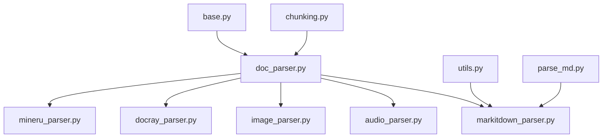
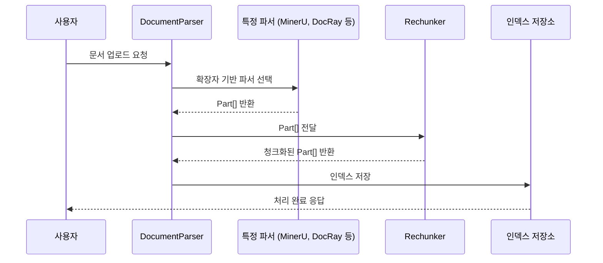
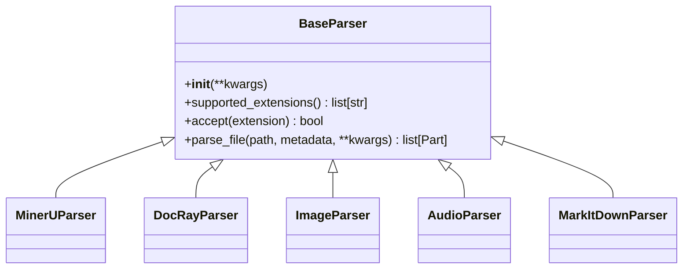
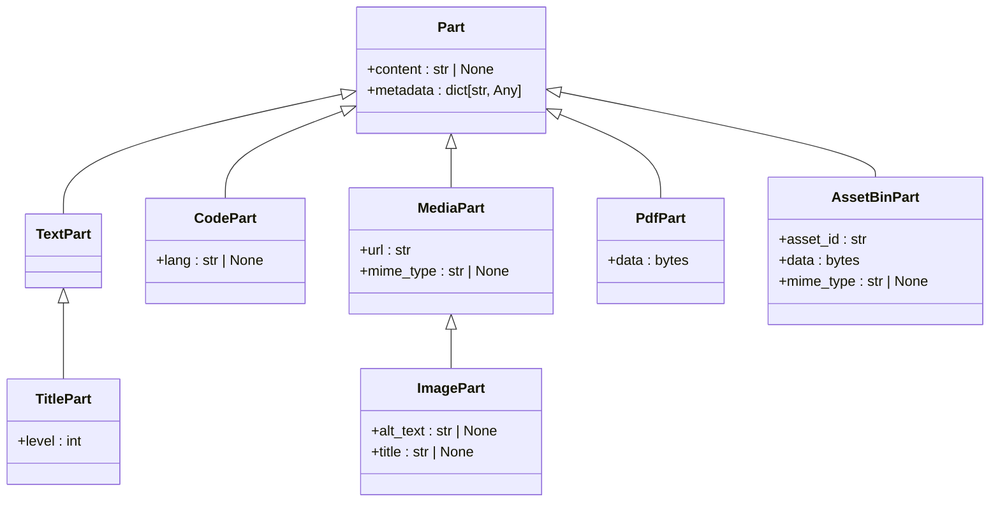
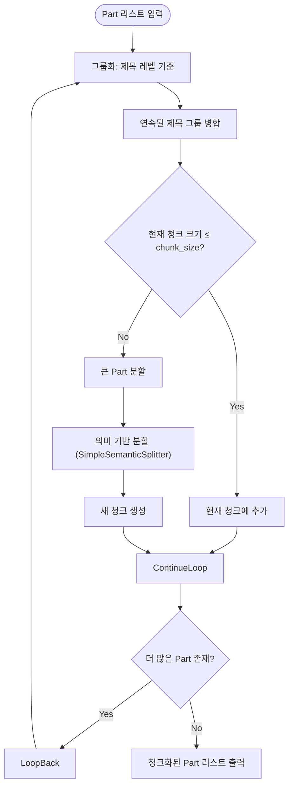
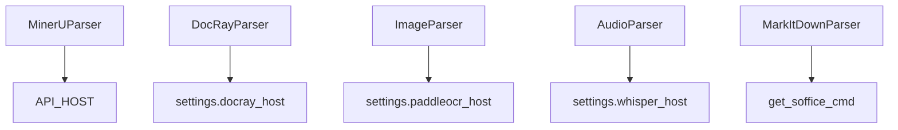

# 커스텀 문서 파서

<cite>
**이 문서에서 참조한 파일**  
- [base.py](file://aperag/docparser/base.py)
- [mineru_parser.py](file://aperag/docparser/mineru_parser.py)
- [docray_parser.py](file://aperag/docparser/docray_parser.py)
- [chunking.py](file://aperag/docparser/chunking.py)
- [utils.py](file://aperag/docparser/utils.py)
- [image_parser.py](file://aperag/docparser/image_parser.py)
- [audio_parser.py](file://aperag/docparser/audio_parser.py)
- [parse_md.py](file://aperag/docparser/parse_md.py)
- [doc_parser.py](file://aperag/docparser/doc_parser.py)
- [markitdown_parser.py](file://aperag/docparser/markitdown_parser.py)
- [document_parser.py](file://aperag/index/document_parser.py)
</cite>

## 목차
1. [소개](#소개)
2. [프로젝트 구조](#프로젝트-구조)
3. [핵심 구성 요소](#핵심-구성-요소)
4. [아키텍처 개요](#아키텍처-개요)
5. [상세 구성 요소 분석](#상세-구성-요소-분석)
6. [의존성 분석](#의존성-분석)
7. [성능 고려사항](#성능-고려사항)
8. [문제 해결 가이드](#문제-해결-가이드)
9. [결론](#결론)

## 소개
ApeRAG는 다양한 문서 형식(PDF, DOCX, 이미지 등)을 지원하기 위해 유연하고 확장 가능한 문서 파싱 아키텍처를 제공합니다. 이 문서는 새로운 파일 형식을 처리할 수 있는 커스텀 문서 파서를 개발하는 방법에 대해 설명하며, 기존의 MinerU 및 DocRay 파서와의 호환성을 유지하면서도 텍스트 추출, 청크화(chunking), 메타데이터 생성 등의 핵심 로직을 통합하는 절차를 안내합니다.

## 프로젝트 구조
ApeRAG의 문서 파서 관련 코드는 `aperag/docparser` 디렉터리에 위치하며, 각각의 파서는 독립적인 모듈로 구현되어 있습니다. 주요 구성은 다음과 같습니다:

```
aperag/
└── docparser/
    ├── base.py              # BaseParser 및 Part 클래스 정의
    ├── mineru_parser.py     # MinerU 기반 파서
    ├── docray_parser.py     # DocRay 기반 파서
    ├── chunking.py          # 청크화 로직
    ├── utils.py             # 유틸리티 함수
    ├── image_parser.py      # 이미지 OCR 파서
    ├── audio_parser.py      # 오디오 음성 인식 파서
    ├── parse_md.py          # 마크다운 파싱
    ├── doc_parser.py        # 파서 관리자
    └── markitdown_parser.py # MarkItDown 기반 범용 파서
```



**도표 출처**
- [base.py](file://aperag/docparser/base.py)
- [doc_parser.py](file://aperag/docparser/doc_parser.py)
- [chunking.py](file://aperag/docparser/chunking.py)
- [utils.py](file://aperag/docparser/utils.py)
- [parse_md.py](file://aperag/docparser/parse_md.py)

**섹션 출처**
- [base.py](file://aperag/docparser/base.py)
- [doc_parser.py](file://aperag/docparser/doc_parser.py)

## 핵심 구성 요소

ApeRAG의 문서 파싱 시스템은 추상화된 `BaseParser` 클래스를 중심으로 설계되어 있으며, 모든 파서는 이 클래스를 상속받아 `parse_file()` 메서드를 구현해야 합니다. 또한, 다양한 데이터 타입을 표현하기 위한 `Part` 계층 구조와, 텍스트를 적절한 크기로 나누는 `Rechunker`가 핵심 역할을 수행합니다.

**섹션 출처**
- [base.py](file://aperag/docparser/base.py#L70-L81)
- [chunking.py](file://aperag/docparser/chunking.py#L3-L10)

## 아키텍처 개요

전체 문서 파싱 프로세스는 다음과 같은 흐름을 따릅니다:

1. 사용자가 문서를 업로드하면 `DocumentParser`가 해당 파일의 확장자를 기반으로 적절한 파서를 선택합니다.
2. 선택된 파서는 원본 파일을 분석하여 논리적 단위(예: 제목, 문단, 표, 이미지 등)로 나눈 후 `Part` 객체 리스트로 반환합니다.
3. 반환된 `Part`들은 `Rechunker`에 의해 지정된 청크 크기에 맞게 재구성됩니다.
4. 최종적으로 처리된 내용은 벡터 저장소, 전체 텍스트 인덱스 등에 저장되어 검색 가능하게 됩니다.



**도표 출처**
- [document_parser.py](file://aperag/index/document_parser.py#L50-L100)
- [doc_parser.py](file://aperag/docparser/doc_parser.py#L100-L140)

## 상세 구성 요소 분석

### BaseParser 추상 클래스 분석

모든 파서는 `BaseParser`를 상속받아 다음 두 가지 추상 메서드를 구현해야 합니다:
- `supported_extensions()`: 이 파서가 지원하는 파일 확장자 목록을 반환합니다.
- `parse_file(path, metadata, **kwargs)`: 지정된 경로의 파일을 파싱하여 `Part` 객체 리스트를 반환합니다.

또한, `accept(extension)` 메서드를 통해 주어진 확장자를 처리할 수 있는지 여부를 확인할 수 있습니다.



**도표 출처**
- [base.py](file://aperag/docparser/base.py#L70-L81)

**섹션 출처**
- [base.py](file://aperag/docparser/base.py#L70-L81)

### Part 데이터 구조 분석

파서는 다양한 유형의 콘텐츠를 표현하기 위해 계층화된 `Part` 클래스를 사용합니다. 기본 `Part` 클래스는 `content`와 `metadata` 필드를 포함하며, 이를 상속받아 구체적인 타입들이 정의됩니다.



**도표 출처**
- [base.py](file://aperag/docparser/base.py#L15-L65)

**섹션 출처**
- [base.py](file://aperag/docparser/base.py#L15-L65)

### 청크화(Chunking) 로직 분석

`Rechunker`는 파싱된 `Part` 객체들을 지정된 크기(`chunk_size`)와 중복량(`chunk_overlap`)에 따라 다시 조합합니다. 이 과정에서는 제목의 계층 구조를 보존하면서 의미적 일관성을 유지하도록 설계되어 있습니다.



**도표 출처**
- [chunking.py](file://aperag/docparser/chunking.py#L30-L100)

**섹션 출처**
- [chunking.py](file://aperag/docparser/chunking.py#L30-L100)

### PDF 내 표와 수식 인식을 위한 커스텀 파서 예제

PDF 내 표와 수식을 정확히 인식하려면, MinerU 또는 DocRay처럼 외부 서비스를 활용하거나, PyMuPDF, pdfplumber 등의 라이브러리를 사용하여 직접 구현할 수 있습니다. 아래는 MinerU 파서를 참고하여 `parse_file()` 메서드를 구현하는 예시입니다:

1. `supported_extensions()`에서 `.pdf`를 반환합니다.
2. `parse_file()` 내에서 MinerU API를 호출하여 JSON 형식의 중간 결과를 얻습니다.
3. `middle_json_to_parts()` 함수를 사용하여 표, 수식, 이미지 등을 각각의 `Part`로 변환합니다.
4. 필요 시 `to_md_part()`를 통해 전체 마크다운 표현도 생성합니다.

이러한 방식은 기존 파서들과 동일한 인터페이스를 따르므로, ApeRAG 시스템에 원활하게 통합될 수 있습니다.

**섹션 출처**
- [mineru_parser.py](file://aperag/docparser/mineru_parser.py#L50-L100)
- [docray_parser.py](file://aperag/docparser/docray_parser.py#L30-L80)

## 의존성 분석

문서 파서 시스템은 여러 외부 도구 및 서비스에 의존합니다:
- **MinerU**: 고급 PDF/Office 문서 파싱을 위한 클라우드 서비스
- **DocRay**: 자체 배포 가능한 문서 파싱 백엔드
- **PaddleOCR**: 이미지 내 텍스트 인식
- **Whisper**: 오디오 음성 인식
- **LibreOffice (soffice)**: Office 문서를 PDF로 변환
- **MarkItDown**: HTML, IPython Notebook 등 다양한 형식을 마크다운으로 변환

이러한 의존성은 설정 파일이나 환경 변수를 통해 활성화/비활성화할 수 있으며, `FallbackError`를 발생시켜 대체 파서로 전환할 수 있도록 설계되어 있습니다.



**도표 출처**
- [mineru_parser.py](file://aperag/docparser/mineru_parser.py#L20-L30)
- [docray_parser.py](file://aperag/docparser/docray_parser.py#L20-L30)
- [image_parser.py](file://aperag/docparser/image_parser.py#L20-L30)
- [audio_parser.py](file://aperag/docparser/audio_parser.py#L20-L30)
- [markitdown_parser.py](file://aperag/docparser/markitdown_parser.py#L20-L30)

**섹션 출처**
- [mineru_parser.py](file://aperag/docparser/mineru_parser.py#L20-L30)
- [docray_parser.py](file://aperag/docparser/docray_parser.py#L20-L30)
- [image_parser.py](file://aperag/docparser/image_parser.py#L20-L30)
- [audio_parser.py](file://aperag/docparser/audio_parser.py#L20-L30)
- [markitdown_parser.py](file://aperag/docparser/markitdown_parser.py#L20-L30)

## 성능 고려사항

- **메모리 사용량**: 큰 PDF 파일을 처리할 때는 임시 디렉터리와 스트리밍을 적절히 활용하여 메모리 사용량을 줄여야 합니다.
- **청크 크기**: 너무 작은 청크는 의미적 맥락을 잃게 되며, 너무 큰 청크는 검색 효율을 저하시킵니다. 일반적으로 512~1024 토큰이 적절합니다.
- **병렬 처리**: 여러 문서를 동시에 처리할 경우, I/O 바인딩 작업(파일 읽기, 네트워크 요청)을 비동기로 처리하면 성능이 크게 향상됩니다.
- **캐싱**: 동일한 문서를 반복해서 파싱하지 않도록 캐싱 메커니즘을 도입하는 것이 좋습니다.

## 문제 해결 가이드

- **"No parser can handle file with extension" 오류**: `DocParser`가 해당 확장자를 지원하는 파서를 찾지 못한 경우입니다. `ALL_PARSERS` 목록과 `supported_extensions()` 메서드를 확인하세요.
- **API 키 오류**: MinerU 또는 외부 서비스 사용 시 API 토큰이 누락되었을 수 있습니다. 환경 변수나 설정 파일을 확인하세요.
- **soffice 명령어를 찾을 수 없음**: LibreOffice가 설치되어 있지 않거나 PATH에 등록되지 않았을 수 있습니다. `which soffice` 명령어로 확인하세요.
- **청크화 후 정보 손실**: `Rechunker`가 제목 계층을 올바르게 처리하지 못했을 수 있습니다. `Group` 생성 로직과 `_merge_consecutive_title_groups()` 메서드를 디버깅하세요.

**섹션 출처**
- [doc_parser.py](file://aperag/docparser/doc_parser.py#L130-L140)
- [mineru_parser.py](file://aperag/docparser/mineru_parser.py#L30-L40)
- [utils.py](file://aperag/docparser/utils.py#L5-L15)

## 결론

ApeRAG의 문서 파서 아키텍처는 `BaseParser` 추상 클래스를 통해 높은 확장성을 제공하며, 새로운 파일 형식을 지원하기 위해 커스텀 파서를 개발하는 것은 비교적 직관적입니다. 핵심은 `parse_file()` 메서드를 올바르게 구현하고, `Part` 객체를 적절히 생성하여 텍스트, 메타데이터, 청크화 등의 후속 처리 단계에 원활히 전달하는 것입니다. 기존의 MinerU, DocRay 파서와의 호환성을 유지하면서도, PDF 내 표와 수식과 같은 복잡한 요소를 정확히 인식할 수 있도록 설계된 이 시스템은 다양한 문서 기반 애플리케이션에 효과적으로 활용될 수 있습니다.