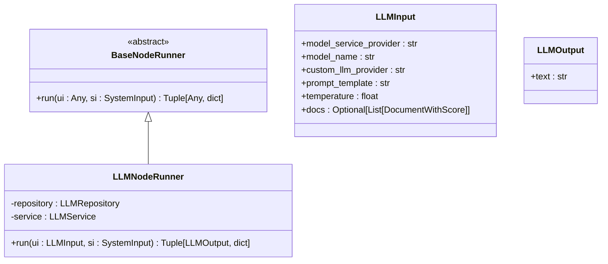
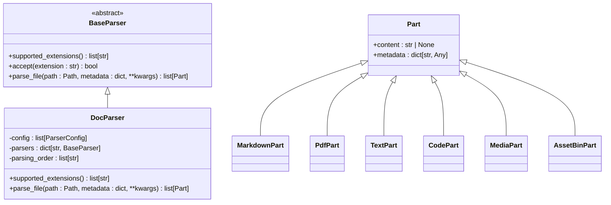
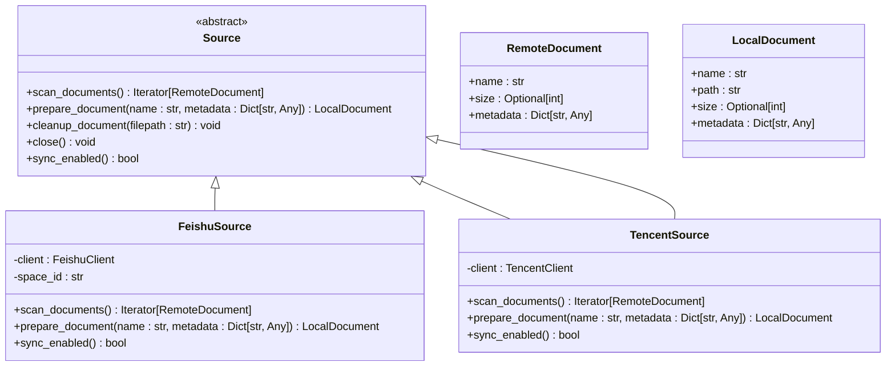
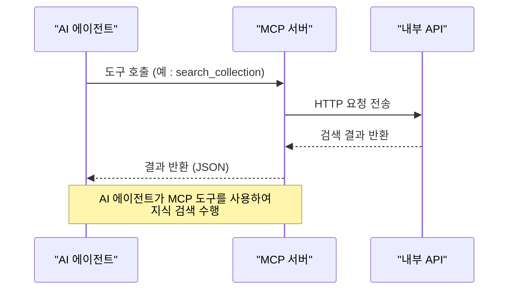
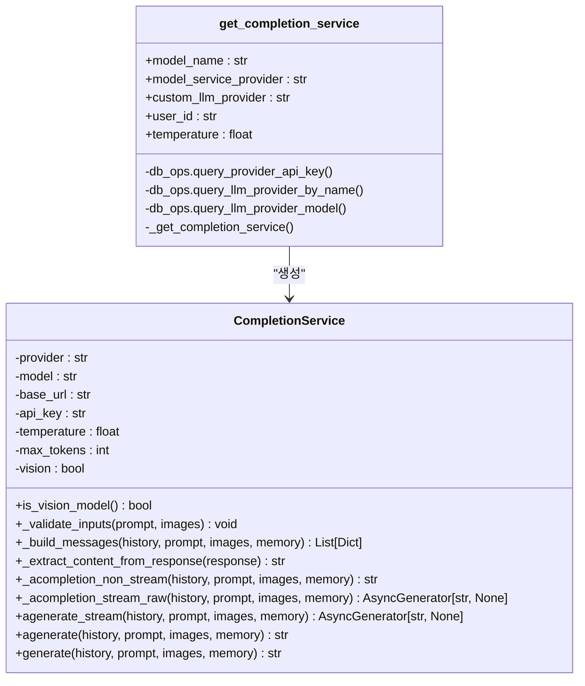

# 확장 및 커스터마이징

<cite>
**이 문서에서 참조한 파일**
- [register_node_runner.py](file://aperag/flow/base/models.py)
- [base.py](file://aperag/docparser/base.py)
- [doc_parser.py](file://aperag/docparser/doc_parser.py)
- [feishu.py](file://aperag/source/feishu/feishu.py)
- [tencent.py](file://aperag/source/tencent/tencent.py)
- [base_completion.py](file://aperag/llm/completion/base_completion.py)
- [completion_service.py](file://aperag/llm/completion/completion_service.py)
- [server.py](file://aperag/mcp/server.py)
</cite>

## 목차
1. [소개](#소개)
2. [노드 실행기 추가하기](#노드-실행기-추가하기)
3. [커스텀 문서 파서 개발](#커스텀-문서-파서-개발)
4. [외부 데이터 소스 통합](#외부-데이터-소스-통합)
5. [MCP 도구 확장](#mcp-도구-확장)
6. [LLM 제공자 어댑터 작성](#llm-제공자-어댑터-작성)
7. [결론](#결론)

## 소개
ApeRAG은 다양한 방식으로 확장 및 커스터마이징이 가능하도록 설계되었습니다. 이 문서는 ApeRAG의 핵심 확장 포인트들을 설명하며, 새로운 기능을 추가하는 방법을 단계별로 안내합니다. 주요 확장 영역으로는 노드 실행기 추가, 커스텀 문서 파서 개발, 외부 데이터 소스 통합, MCP 도구 확장, LLM 제공자 어댑터 작성 등이 있습니다.

## 노드 실행기 추가하기

ApeRAG의 워크플로우 엔진에서는 `@register_node_runner` 데코레이터를 사용하여 새로운 노드 실행기를 등록할 수 있습니다. 이 메커니즘을 통해 사용자는 고유한 비즈니스 로직을 가진 커스텀 노드를 쉽게 추가할 수 있습니다.

핵심 인터페이스는 `BaseNodeRunner` 클래스이며, `run` 메서드를 구현해야 합니다. `@register_node_runner` 데코레이터는 노드 유형과 입력/출력 모델을 지정하여 런타임에 노드를 찾고 초기화할 수 있도록 합니다.

**다이어그램 출처**
- [models.py](file://aperag/flow/base/models.py#L129-L142)
- [llm.py](file://aperag/flow/runners/llm.py#L329-L352)

**섹션 출처**
- [models.py](file://aperag/flow/base/models.py#L129-L142)
- [llm.py](file://aperag/flow/runners/llm.py#L329-L352)

## 커스텀 문서 파서 개발

ApeRAG은 다양한 파일 형식을 지원하기 위해 문서 파서 시스템을 제공합니다. 새로운 파일 형식을 지원하려면 `BaseParser` 추상 클래스를 상속받아 커스텀 파서를 개발해야 합니다.

주요 메서드는 다음과 같습니다:
- `supported_extensions()`: 지원하는 파일 확장자를 반환
- `parse_file(path, metadata, **kwargs)`: 파일을 파싱하여 `Part` 객체 리스트를 반환

`DocParser` 클래스는 여러 파서를 조합하여 확장성을 제공하며, 설정에 따라 활성화된 파서들만 사용합니다.

**다이어그램 출처**
- [base.py](file://aperag/docparser/base.py#L12-L82)
- [doc_parser.py](file://aperag/docparser/doc_parser.py#L69-L142)

**섹션 출처**
- [base.py](file://aperag/docparser/base.py#L12-L82)
- [doc_parser.py](file://aperag/docparser/doc_parser.py#L69-L142)

## 외부 데이터 소스 통합

ApeRAG은 Feishu, Tencent 등의 외부 데이터 소스를 통합할 수 있는 확장 가능한 아키텍처를 제공합니다. 모든 외부 소스는 `Source` 추상 클래스를 상속받아 구현되어야 하며, `scan_documents()`와 `prepare_document()` 메서드를 오버라이드해야 합니다.

`get_source()` 함수는 컬렉션 구성에 따라 적절한 소스 구현체를 동적으로 생성합니다.

**다이어그램 출처**
- [base.py](file://aperag/source/base.py#L12-L124)
- [feishu.py](file://aperag/source/feishu/feishu.py#L30-L151)
- [tencent.py](file://aperag/source/tencent/tencent.py#L21-L33)

**섹션 출처**
- [base.py](file://aperag/source/base.py#L12-L124)
- [feishu.py](file://aperag/source/feishu/feishu.py#L30-L151)
- [tencent.py](file://aperag/source/tencent/tencent.py#L21-L33)

## MCP 도구 확장

ApeRAG은 FastMCP를 사용하여 AI 에이전트의 기능을 확장할 수 있습니다. `@mcp_server.tool` 데코레이터를 사용하여 새로운 도구를 등록할 수 있으며, 이 도구들은 AI 에이전트가 호출할 수 있습니다.

기존 도구들은 컬렉션 검색, 웹 검색, 웹 콘텐츠 읽기 등의 기능을 제공합니다. 새로운 도구를 추가하면 AI 에이전트의 기능이 강화됩니다.

**다이어그램 출처**
- [server.py](file://aperag/mcp/server.py#L1-L709)

**섹션 출처**
- [server.py](file://aperag/mcp/server.py#L1-L709)

## LLM 제공자 어댑터 작성

ApeRAG은 `CompletionService` 클래스를 통해 다양한 LLM 제공자와 모델을 지원합니다. 새로운 LLM 제공자를 추가하려면 `litellm` 라이브러리가 지원하는 제공자 이름을 사용하거나, `litellm` 확장을 통해 커스텀 제공자를 정의해야 합니다.

`get_completion_service()` 함수는 데이터베이스에서 제공자 정보를 조회하고, `CompletionService` 인스턴스를 생성합니다.

**다이어그램 출처**
- [completion_service.py](file://aperag/llm/completion/completion_service.py#L27-L210)
- [base_completion.py](file://aperag/llm/completion/base_completion.py#L1-L222)

**섹션 출처**
- [completion_service.py](file://aperag/llm/completion/completion_service.py#L27-L210)
- [base_completion.py](file://aperag/llm/completion/base_completion.py#L1-L222)

## 결론
ApeRAG은 노드 실행기, 문서 파서, 외부 데이터 소스, MCP 도구, LLM 제공자 등 다양한 지점에서 확장이 가능합니다. 각 확장 포인트는 명확한 인터페이스와 추상 클래스를 제공하여 일관된 방식으로 커스터마이징할 수 있도록 설계되었습니다. 실제 구현 시에는 관련 파일들을 참고하여 핵심 메서드를 올바르게 오버라이드하고, 필요한 의존성을 적절히 주입해야 합니다.